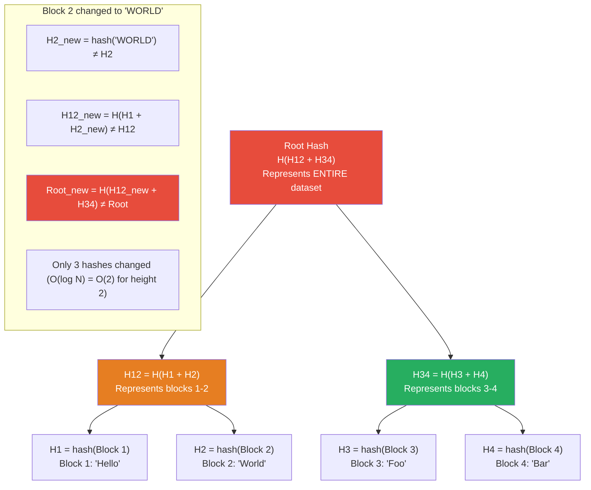

# Merkle Tree

**Level**: 🔴 Advanced
**Reading Time**: 12 minutes

> Every Git commit is a Merkle tree. Every Bitcoin block contains one. Cassandra uses them to detect which keys have diverged between replicas. The same algorithm solves all three problems.

---

## The Core Idea

A Merkle tree is a **tree of cryptographic hashes**. Leaf nodes contain the hash of a data block. Each internal node contains the hash of its children's hashes combined. The root node's hash represents the entire dataset.

The key property: **if any data block changes, every hash on the path from that leaf to the root changes**. To check whether two large datasets are identical, compare only their root hashes — O(1). To find exactly which parts differ, walk down the tree comparing hashes at each level — O(log N) comparisons to pinpoint the diverging block.

Think of it like a recursive checksum: the root is a checksum of checksums of checksums. A single wrong byte somewhere in your 1TB dataset changes the root hash, and you can locate the corrupted block by bisecting the tree rather than scanning every byte.

---

## How It Works

### Build Tree Pseudocode

```
function buildMerkleTree(dataBlocks):
  -- Step 1: hash each data block (leaf nodes)
  leafHashes = []
  for block in dataBlocks:
    leafHashes.append(hash(block))

  -- if odd number of leaves, duplicate the last one
  if len(leafHashes) is odd:
    leafHashes.append(leafHashes[-1])

  -- Step 2: build tree bottom-up
  currentLevel = leafHashes

  while len(currentLevel) > 1:
    nextLevel = []
    for i from 0 to len(currentLevel)-1 step 2:
      combinedHash = hash(currentLevel[i] + currentLevel[i+1])
      nextLevel.append(combinedHash)

    if len(nextLevel) is odd and len(nextLevel) > 1:
      nextLevel.append(nextLevel[-1])

    currentLevel = nextLevel

  rootHash = currentLevel[0]
  return rootHash
```

### Generate Inclusion Proof Pseudocode

```
-- Prove that a specific leaf is part of the tree, without revealing other data
function getProof(tree, leafIndex):
  proof = []
  currentIndex = leafIndex

  for level from 0 to tree.height - 1:
    sibling = getSibling(currentIndex)
    proof.append({
      hash: tree.getNode(level, sibling),
      position: "left" if sibling < currentIndex else "right"
    })
    currentIndex = getParentIndex(currentIndex)

  return proof
  -- proof has O(log N) hashes — sufficient to verify the leaf without all data
```

### Verify Inclusion Proof Pseudocode

```
function verifyProof(leafData, proof, rootHash):
  currentHash = hash(leafData)

  for step in proof:
    if step.position == "left":
      currentHash = hash(step.hash + currentHash)
    else:
      currentHash = hash(currentHash + step.hash)

  return currentHash == rootHash
  -- true → leaf is definitely in the tree with this root
  -- false → leaf is not in this tree, or data has been tampered with
```

### Find Differing Blocks (Anti-Entropy)

```
function findDifferences(tree1, tree2):
  differences = []
  compareNodes(tree1.root, tree2.root, differences)
  return differences

function compareNodes(node1, node2, differences):
  if node1.hash == node2.hash:
    return                            -- subtrees are identical, no need to recurse

  if node1 is leaf:
    differences.append(node1.leafIndex)   -- found a differing leaf
    return

  -- recurse into children where hashes differ
  compareNodes(node1.leftChild, node2.leftChild, differences)
  compareNodes(node1.rightChild, node2.rightChild, differences)
```

---

## Visual Walkthrough

A Merkle tree for 4 data blocks:



**Anti-entropy between two replicas that have diverged on Block 2**:
1. Compare root hashes → different (diverged)
2. Compare left child (H12) hashes → different
3. Compare right child (H34) hashes → identical → skip this entire subtree
4. Compare H1 hashes → identical
5. Compare H2 hashes → different → Block 2 has diverged
6. Total comparisons: 5 (instead of 4 full block comparisons in the naive approach)

For N blocks, finding all divergent blocks takes O(K log N) comparisons where K is the number of divergent blocks.

---

## Where This Appears in Real Systems

### Git — Every Commit Is a Merkle Tree

Git's object model is a Merkle tree. A commit points to a tree object; tree objects point to blob objects (file contents) or other tree objects (subdirectories). Each object's identity is its SHA-1 or SHA-256 hash.

When you run `git diff commit1 commit2`:
1. Compare root tree hashes — if different, dive in
2. Compare directory tree hashes — if different, compare subtree
3. Compare file blob hashes — if different, the file changed

This is why `git diff` is fast even on large repositories: identical subtrees are skipped entirely by hash comparison. `git log --since` is efficient for the same reason.

**Content-addressable storage**: in Git, two files with identical content have the same hash and are stored as a single blob. Deduplication is free.

### Cassandra — Anti-Entropy (Repair)

Cassandra uses Merkle trees in its `nodetool repair` process to detect data inconsistencies between replicas. When a repair runs:
1. Each replica builds a Merkle tree of the partition key hashes for its assigned token range
2. Cassandra compares Merkle trees across replicas
3. Where trees diverge, only the differing token sub-ranges need to be synchronized
4. Dramatically reduces the data transferred during repair vs full data comparison

Without Merkle trees, repair would require transferring the entire dataset to compare. With Merkle trees, only the divergent segments transfer.

### BitTorrent — Chunk Verification

When downloading a file via BitTorrent, you receive chunks from multiple peers. Each chunk has a Merkle proof that lets you verify the chunk is part of the legitimate file without downloading the entire file first. The torrent file contains the Merkle root hash. Each chunk comes with an O(log N) proof path to verify against the root.

This prevents peers from serving you corrupted data — any tampered chunk will fail the Merkle proof.

### Blockchain — Transaction Merkle Root

Every Bitcoin and Ethereum block header contains a Merkle root of all transactions in that block. To prove a specific transaction is in a block, you provide an O(log N) Merkle proof — just the sibling hashes along the path to the root. A light client (mobile wallet) can verify transaction inclusion without downloading the full block.

Bitcoin block headers are only 80 bytes; a full block can be 1–4 MB. Light clients verify billions of dollars of transactions using only the 80-byte header and a short Merkle proof.

### Amazon DynamoDB — Replica Synchronization

DynamoDB uses a Merkle tree-based approach (similar to Cassandra repair) to detect key-value divergence between replicas. Each replica maintains a Merkle tree over its key space. The anti-entropy process periodically compares trees across replicas and syncs only the divergent ranges.

### Certificate Transparency (CT Logs)

Certificate Transparency — the system that lets browsers audit TLS certificates — uses Merkle trees. Certificate authorities must submit all issued certificates to CT logs. The log maintains a Merkle tree of all certificates. Anyone can verify a certificate is in the log with an O(log N) proof, and anyone can verify the log has not been tampered with by checking the root hash.

---

## Complexity Analysis

| Operation | Time | Space |
|-----------|------|-------|
| Build tree from N blocks | O(N) | O(N) for all hashes |
| Generate inclusion proof | O(log N) | O(log N) — proof size |
| Verify inclusion proof | O(log N) | O(log N) — proof is O(log N) hashes |
| Find all K divergent blocks (anti-entropy) | O(K log N) | O(log N) for tree traversal |
| Check if two trees are identical | O(1) | — — just compare root hashes |

**Anti-entropy efficiency**: comparing two Cassandra replicas with 1 billion keys where 1,000 keys have diverged: O(1000 × log(1B)) ≈ O(30,000) hash comparisons instead of O(1B) key comparisons. 33,000x speedup.

---

## Trade-offs

| Approach | Verify Full Dataset | Find Divergent Blocks | Proof Size | Notes |
|----------|--------------------|-----------------------|------------|-------|
| Merkle Tree | O(1) root compare | O(K log N) | O(log N) | Standard choice |
| Full comparison | O(N) | O(N) | O(N) | Correct but slow |
| Checksum per block | O(N) all checksums | O(K) with checksums | O(N) | Better for small N |
| Hash of hashes (flat) | O(1) | O(N) to re-check all | O(N) | No tree structure |

---

## Interview Connection

**"How does Cassandra ensure replicas stay in sync after network partitions?"**

Answer: Cassandra uses Merkle trees for anti-entropy repair. Each node builds a Merkle tree of the hashes of its key-value data for each token range. During repair, nodes exchange Merkle trees and compare hashes from the root down. Where hashes diverge, the system identifies the differing partition ranges and synchronizes only those. This makes repair efficient — you only transfer data that actually diverged, rather than doing a full data comparison.

**Common follow-ups**:
- "How does Git use Merkle trees?" → Every Git object (blob, tree, commit) is identified by its hash. Commits form a chain where each commit hash depends on its tree hash (which depends on all file hashes) and the parent commit hashes. Changing any file changes its blob hash, which changes the tree hash, which changes the commit hash — all the way to the latest commit.
- "What is a Merkle proof and how is it used in blockchains?" → A Merkle proof is the O(log N) set of sibling hashes on the path from a leaf to the root. To prove transaction T is in a block with root hash R, you provide T's Merkle proof. Anyone can recompute the root hash from T + proof hashes and verify it matches R. This lets mobile wallets verify transactions without downloading full blocks.
- "Why is O(log N) proof size significant?" → A Bitcoin block might contain thousands of transactions. Proving one transaction is in the block requires only ~13 hashes (log₂(1000) ≈ 10) instead of all transactions. This makes light clients feasible on mobile devices.

---

## Key Takeaways

- Merkle trees build a tree of hashes bottom-up: leaf hashes are hash(data), internal hashes are hash(left_child + right_child)
- Changing any data block changes all ancestor hashes up to the root
- Two datasets with the same root hash are identical — O(1) dataset comparison
- Finding all K diverging blocks takes O(K log N) comparisons — skip identical subtrees
- Git: every commit is a Merkle tree of file hashes; `git diff` traverses the tree by comparing hashes
- Cassandra repair: compare Merkle trees across replicas to find divergent token ranges — much faster than full data comparison
- BitTorrent: verify downloaded chunks with O(log N) proof path instead of downloading the full file
- Blockchain: block headers contain a transaction Merkle root; light clients verify individual transactions with O(log N) proof
- Certificate Transparency uses Merkle trees so anyone can audit TLS certificate issuance
