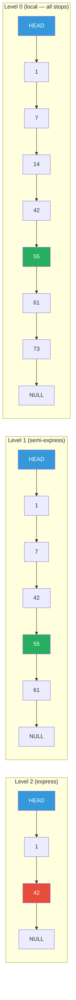

# Skip List

**Level**: 🟡 Intermediate
**Reading Time**: 10 minutes

> Redis sorted sets are one of the most-used data structures in production caching. They run on a skip list — a probabilistic structure that is simpler to implement than a balanced BST and friendlier to concurrent access.

---

## The Core Idea

A regular linked list lets you find elements in O(N) — you must scan from the front. A sorted array supports O(log N) binary search but inserting an element takes O(N) to shift everything right.

A skip list gets you the best of both worlds by building **multiple layers of linked lists** over the same data. The bottom layer has every element. Each layer above has roughly half as many elements, chosen at random. To search, you start at the top layer and "skip" large chunks of the list, dropping down to a lower layer when you overshoot.

Think of an express train system: local trains stop at every station, but express trains skip most stops. You ride the express as far as possible, then switch to a local train near your destination.

---

## How It Works

### Structure

```
Level 3 (fewest elements): 1 ----→ 42 -------------------------→ NULL
Level 2 (some elements):   1 → 7 → 42 → 61 -----------------→ NULL
Level 1 (more elements):   1 → 7 → 14 → 42 → 55 → 61 → 73 → NULL
Level 0 (all elements):    1 → 7 → 14 → 21 → 42 → 55 → 61 → 73 → NULL
```

Each element has forward pointers at each level it participates in. The number of levels an element participates in is chosen randomly at insert time.

### Search Pseudocode

```
function search(skipList, target):
  current = skipList.header          -- sentinel node at the front

  -- start at the highest level, work down
  for level from skipList.maxLevel down to 0:
    while current.forward[level] != NULL
      and current.forward[level].value < target:
      current = current.forward[level]   -- advance at this level

  -- drop to level 0, check exact match
  current = current.forward[0]

  if current != NULL and current.value == target:
    return current
  else:
    return NOT_FOUND
```

### Insert Pseudocode

```
function insert(skipList, value):
  -- track predecessors at each level (needed to splice in new node)
  update = array of size maxLevel, filled with header

  current = skipList.header

  -- find insertion point at each level
  for level from skipList.maxLevel down to 0:
    while current.forward[level] != NULL
      and current.forward[level].value < value:
      current = current.forward[level]
    update[level] = current

  -- randomly decide how many levels the new node participates in
  newLevel = randomLevel()

  newNode = createNode(value, newLevel)

  -- splice new node into the list at each level
  for level from 0 to newLevel:
    newNode.forward[level] = update[level].forward[level]
    update[level].forward[level] = newNode

function randomLevel():
  level = 0
  while random() < 0.5 and level < MAX_LEVEL:
    level = level + 1
  return level
```

The `random() < 0.5` gives each element a 50% chance of being promoted to the next level — this probabilistic promotion is the defining characteristic of skip lists.

---

## Visual Walkthrough

A search for value 55 in a skip list:



Search path for 55:
1. Level 2: HEAD → 1. Next is 42 (< 55) → advance. Next is NULL (would go past 55) → drop to level 1
2. Level 1: at 42. Next is 55 (== 55) — but we do not stop yet, we drop to level 0 first
3. Level 0: confirm 55 is found

Total nodes visited: 1, 42, 55 — three nodes to search eight elements. O(log N) expected.

---

## Where This Appears in Real Systems

### Redis — Sorted Sets (ZSET)

Redis sorted sets use a skip list as their primary data structure. Every `ZADD`, `ZRANGE`, `ZRANGEBYSCORE`, `ZRANK`, and `ZSCORE` operation touches the skip list.

**Why Redis chose skip list over a balanced BST (like AVL or Red-Black tree)**:

1. **Simpler range operations**: After finding the start of a range in the skip list, scan forward at level 0. In a BST, range scans require an in-order traversal with a stack, which is more complex to implement.
2. **Easier concurrent access**: Skip list insertions only modify local pointers at each level. With fine-grained locking, you can lock individual nodes rather than locking whole subtrees (as BSTs require during rotation).
3. **Cache efficiency for forward scans**: Level 0 of the skip list is a plain linked list. Scanning forward touches consecutive nodes — reasonably cache-friendly.
4. **Simpler implementation**: The Redis author (Salvatore Sanfilippo) has noted that skip list code is significantly shorter and less error-prone than a balanced BST.

```
Redis sorted set operations (all use skip list internally):
  ZADD leaderboard 1500 "user:123"    -- O(log N)
  ZRANK leaderboard "user:123"        -- O(log N)
  ZRANGEBYSCORE leaderboard 1000 2000 -- O(log N + K) where K is result count
  ZRANGE leaderboard 0 9              -- O(log N + K)
```

### LevelDB — MemTable

LevelDB (and its successor RocksDB) uses a skip list for the in-memory write buffer (MemTable). All new writes go to the MemTable first. The skip list keeps them sorted by key. When the MemTable fills up, it is flushed to disk as a sorted SSTable.

**Why skip list for MemTable**: The MemTable is read and written concurrently. Skip list insertions are easier to make lock-free than BST rotations, which require complex atomic multi-pointer updates.

### In-Memory Databases

VoltDB, MemSQL (now SingleStore), and other in-memory databases use skip lists for sorted indexes because they perform better than B+trees when data fits entirely in memory (no disk page size constraints) and concurrent writes are frequent.

---

## Complexity Analysis

| Operation | Expected Time | Worst Case Time | Space |
|-----------|--------------|-----------------|-------|
| Search | O(log N) | O(N) | — |
| Insert | O(log N) | O(N) | O(log N) extra for levels |
| Delete | O(log N) | O(N) | — |
| Range scan (K results) | O(log N + K) | O(N) | — |

The worst case is O(N) because level assignment is random — in theory, every element could end up at level 0 only. In practice, with a good random source, the expected performance is O(log N) and the probability of worst-case behavior is negligibly small.

**Space**: O(N) total. Each element uses O(log N) forward pointers on average (geometric series: 1 + 0.5 + 0.25 + ... = 2 extra pointers per element on average). Redis accepts this overhead for the operational simplicity it buys.

---

## Trade-offs

| Structure | Lookup | Insert | Delete | Range Scan | Concurrent Insert | Implementation Complexity |
|-----------|--------|--------|--------|------------|-------------------|--------------------------|
| Skip List | O(log N) expected | O(log N) expected | O(log N) expected | O(log N + K) | Easier (local updates) | Low |
| AVL Tree | O(log N) | O(log N) | O(log N) | O(log N + K) | Hard (rotations) | High |
| Red-Black Tree | O(log N) | O(log N) amortized | O(log N) amortized | O(log N + K) | Hard (rotations) | Very High |
| Sorted Array | O(log N) | O(N) | O(N) | O(log N + K) | N/A | Very Low |
| Hash Table | O(1) avg | O(1) avg | O(1) avg | Not supported | Medium | Low |

**Skip list vs Red-Black tree**: Red-Black trees have deterministic O(log N) worst case while skip lists have probabilistic O(log N) expected. For most production use cases, the probabilistic guarantee is acceptable. The simplified implementation and concurrent-access advantage of skip lists usually win.

---

## Interview Connection

**"Why does Redis use a skip list for sorted sets instead of a balanced BST?"**

Answer: Redis chose skip lists for three reasons: (1) range queries are simpler — after finding the range start, scan level-0 nodes linearly rather than doing an in-order BST traversal; (2) concurrent access is easier — skip list insertions only update local forward pointers, while BST rotations require updating multiple nodes atomically; (3) implementation simplicity — skip list code is shorter and less error-prone than AVL or Red-Black tree code.

**Common follow-ups**:
- "What is the time complexity of ZRANGEBYSCORE?" → O(log N + K) where N is the total set size and K is the number of results returned.
- "What is the worst-case complexity for skip lists?" → O(N), but this requires pathological random numbers. In practice, the expected O(log N) is essentially guaranteed.
- "How does randomLevel() affect performance?" → Higher probability promotes more elements, creating a taller, sparser structure — faster searches but more memory. Lower probability gives a flatter, denser structure — more memory-efficient but slower. The 50% probability at each level is the standard balanced choice.

---

## Key Takeaways

- Skip lists achieve O(log N) search, insert, and delete through probabilistic level promotion — each element has a 50% chance of being promoted to the next level
- Redis sorted sets (ZSET) use skip lists — every ZADD, ZRANK, ZRANGE, ZRANGEBYSCORE operation touches the skip list
- Redis chose skip list over BST for: simpler range scans, easier concurrent access, and simpler implementation
- LevelDB and RocksDB use skip lists for the in-memory MemTable — concurrent writes need simpler locking than BST rotations require
- Skip lists have the same O(log N) expected complexity as balanced BSTs but with simpler concurrent access patterns
- Worst case is O(N) — probabilistic, not deterministic — but vanishingly unlikely with a proper random source
