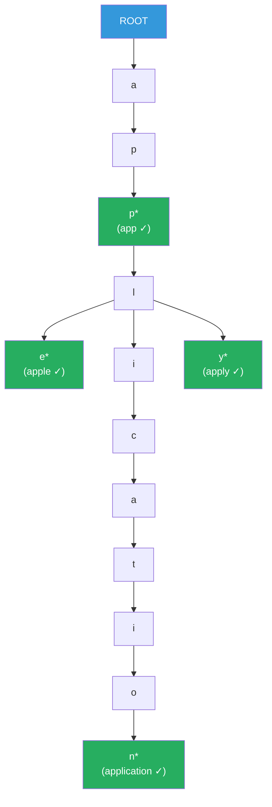

# Trie / Prefix Tree

**Level**: 🟡 Intermediate
**Reading Time**: 10 minutes

> Every time you type a search query and see suggestions appear instantly, or a router forwards your packet in microseconds, a trie is doing the work.

---

## The Core Idea

A trie (pronounced "try", from "retrieval") is a tree where **each path from root to a node spells out a string**. Instead of storing complete strings in each node, you store one character per node, and the structure of the tree encodes all the stored strings simultaneously.

The key insight: all strings that share a prefix share the same nodes in the tree. Storing "apple", "app", and "application" in a trie shares the path `a → p → p` among all three. This makes prefix lookups trivially fast — finding all strings starting with "app" means finding the node at the "app" path and then collecting all descendants.

Think of a trie as a phone book organized by letter, not by name. Instead of searching through sorted names, you navigate: all names starting with 'A', then all starting with 'Al', then 'Ali', until you reach your target.

---

## How It Works

### Structure

```
TrieNode:
  children: map from character to TrieNode
  isEndOfWord: boolean      -- marks whether this node completes a stored string
  value: any (optional)     -- metadata associated with this word, if needed
```

### Insert Pseudocode

```
function insert(trie, word):
  current = trie.root

  for char in word:
    if char not in current.children:
      current.children[char] = new TrieNode()
    current = current.children[char]

  current.isEndOfWord = true
```

### Exact Search Pseudocode

```
function search(trie, word):
  current = trie.root

  for char in word:
    if char not in current.children:
      return NOT_FOUND
    current = current.children[char]

  return current.isEndOfWord     -- true if this exact word was inserted
```

### Prefix Search (Autocomplete) Pseudocode

```
function startsWith(trie, prefix):
  current = trie.root

  for char in prefix:
    if char not in current.children:
      return []                  -- no words with this prefix
    current = current.children[char]

  -- collect all words in the subtree rooted at current
  return collectAllWords(current, prefix)

function collectAllWords(node, prefix):
  results = []

  if node.isEndOfWord:
    results.append(prefix)

  for char, childNode in node.children:
    childResults = collectAllWords(childNode, prefix + char)
    results.extend(childResults)

  return results
```

---

## Visual Walkthrough

A trie built from the words: "apple", "app", "application", "apply"



Prefix query "appl":
- Navigate: root → a → p → p → l (4 steps)
- From the "l" node, collect all descendants: apple, application, apply
- Result: ["apple", "application", "apply"] in O(P + K) where P=4 (prefix length), K=3 (results)

---

## Where This Appears in Real Systems

### Search Autocomplete (Google, Elasticsearch)

Elasticsearch stores an autocomplete trie (called a "completion suggester") to handle prefix queries for type-ahead search. When you type "syst", Elasticsearch traverses the trie to the "syst" node and returns the most popular words in that subtree.

Google's search suggestions use a similar structure, augmented with query frequency data so the most common completions appear first.

**Compressed trie (Radix tree)**: For efficiency, nodes with only one child are merged. "application" and "apply" share "appl" — these are merged into single nodes. This reduces the number of nodes significantly for real dictionaries.

### IP Routing Tables — Longest Prefix Match

This is the most performance-critical use of tries in existence. When a router receives a packet, it must look up the destination IP address in a routing table and find the **longest matching prefix** — the most specific route.

```
Routing table (simplified):
  10.0.0.0/8      → Interface A
  10.1.0.0/16     → Interface B
  10.1.2.0/24     → Interface C

Packet to 10.1.2.5:
  Matches 10.0.0.0/8   (8-bit prefix)
  Matches 10.1.0.0/16  (16-bit prefix)
  Matches 10.1.2.0/24  (24-bit prefix — longest match)
  Route: Interface C
```

Routers store IP prefixes in a **Patricia trie** (Practical Algorithm To Retrieve Information Coded in Alphanumeric) — a compressed binary trie where each node stores the position of the distinguishing bit. This allows O(32) or O(128) lookups for IPv4 or IPv6 — constant time regardless of the routing table size.

Hardware routers use a specialized structure called a **TCAM (Ternary Content-Addressable Memory)** that implements trie lookups in a single clock cycle.

### DNS Resolution

DNS names are looked up from right to left (most specific is on the left). A trie built from reversed domain parts indexes the DNS namespace:

```
Trie of reversed domains: com.google, com.google.www, com.twitter, org.wikipedia
  com → google → www
      →          api
  com → twitter → www
  org → wikipedia
```

When resolving `www.google.com`, DNS traverses: `com` → `google` → `www`. Each node is a DNS zone authority, with zone cuts at delegation points.

### Spell Checkers and Edit Distance

Spell checkers use tries augmented with BK-trees or Levenshtein automata to find words within a given edit distance. The trie structure allows pruning entire subtrees of words that cannot possibly be within the edit distance budget, dramatically reducing the search space.

### IDE Symbol Completion

When an IDE completes a method name as you type, it is querying a trie (or compressed trie) of all symbols in the project. Typing `myObj.get` navigates to the "get" prefix and returns all methods starting with "get".

---

## Complexity Analysis

| Operation | Time | Space |
|-----------|------|-------|
| Insert a word | O(L) — L is word length | O(L × alphabet_size) worst |
| Exact search | O(L) | — |
| Prefix search (K results) | O(P + K) — P is prefix length | — |
| Space (standard trie) | — | O(N × L × alphabet_size) |
| Space (compressed/radix trie) | — | O(N × L) |

**For ASCII (26 chars)**: each node stores up to 26 child pointers. For a dictionary of 100,000 words with average length 8: up to 800,000 nodes. A compressed (radix) trie stores the same data with far fewer nodes.

**Vs hash map for prefix search**: A hash map can answer "does this exact word exist?" in O(L) (hashing the word). But it cannot answer "what words start with this prefix?" in less than O(total_words × L). A trie answers prefix queries in O(P + K) — this is the core advantage.

---

## Trade-offs

| Structure | Exact Lookup | Prefix Query | Space | Insert | Notes |
|-----------|-------------|-------------|-------|--------|-------|
| Trie | O(L) | O(P + K) | O(N×L×A) | O(L) | A = alphabet size |
| Radix/Patricia Trie | O(L) | O(P + K) | O(N×L) | O(L) | Compressed — real-world choice |
| Hash Map | O(L) | O(N×L) | O(N×L) | O(L) | Prefix queries are expensive |
| Sorted Array + Binary Search | O(L log N) | O(L log N + K) | O(N×L) | O(N) | Simple but slow inserts |
| Ternary Search Tree | O(L) | O(P + K) | O(N×L) | O(L) | Cache-friendlier than trie |

**Radix tree is preferred in practice**: it eliminates chains of single-child nodes by merging them into edge labels. A node might have an edge labeled "ication" instead of six separate nodes. This reduces memory and improves cache performance.

---

## Interview Connection

**"Design an autocomplete system for a search box."**

Core data structure: trie. Implementation details that show depth:
1. Store words with their search frequency in the trie
2. Use a compressed/radix trie to save memory
3. Limit results to top-K by frequency — maintain a min-heap of size K at each node (expensive in space) or sort results after collection
4. For large-scale systems, pre-compute suggestions offline and serve from a distributed cache; use the trie as the offline computation engine

**Common follow-ups**:
- "What is a radix tree and how does it differ from a regular trie?" → A radix tree merges nodes that have only one child into edge labels. "apple" and "application" share the path "appl", and the diverging suffixes "e" and "ication" are edge labels rather than individual node chains. This reduces nodes from O(total_characters) to O(N_words) in the best case.
- "How does IP routing use tries?" → IP addresses are binary strings. Routers store IP prefixes in a binary trie (Patricia trie). Lookup = traverse the trie bit by bit; result = the last matched prefix (longest prefix match). Hardware uses TCAM for constant-time lookup.
- "What is the space complexity of a trie?" → O(N × L × A) worst case, where N = number of words, L = average word length, A = alphabet size. For 26 ASCII letters, each node needs 26 child pointers. Radix trees reduce this significantly by merging single-child chains.

---

## Key Takeaways

- Tries store strings so that all words sharing a prefix share tree nodes — prefix queries take O(P + K) instead of O(N × L) for hash maps
- Insert and exact search are both O(L) where L is the string length
- Compressed/radix tries merge single-child nodes into edge labels — used in all production systems
- IP routing: routers use Patricia tries (binary radix trees) for longest prefix match — critical for packet forwarding in O(32) bit comparisons
- Search autocomplete: Elasticsearch completion suggester uses a trie; typing triggers a prefix query returning top-K results by popularity
- DNS: namespace is a tree; resolution traverses from right (TLD) to left (subdomain)
- Standard tries can be memory-heavy for large alphabets (Unicode) — radix trees or ternary search trees are preferred for production
