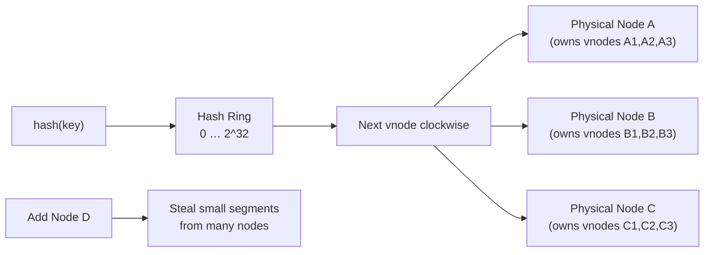
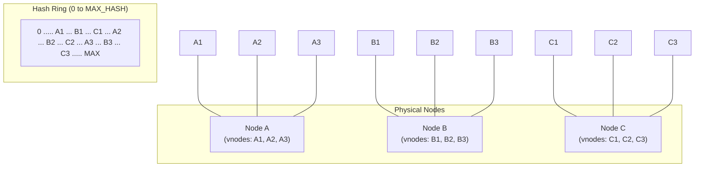

# Consistent Hashing with Virtual Nodes

**Level**: 🟡 Intermediate

## 🗺️ Quick Overview



*Virtual nodes place each physical server at V positions on the ring; more vnodes means smoother key distribution, easier rebalancing, and proportional capacity allocation.*

> Virtual nodes solve the biggest weakness of consistent hashing: uneven key distribution and expensive rebalancing when servers have different capacities.

## Problem This Solves

Basic consistent hashing maps each server to one position on a hash ring. This causes two problems:

1. **Uneven distribution**: With random placement, one server might own 30% of the ring while another owns 10%
2. **Heterogeneous servers**: A 32-core server and a 4-core server each own one position — the powerful server is underutilized
3. **Rebalancing cost**: Adding a new server means only its one neighbor transfers keys to it

Virtual nodes (vnodes) solve all three.

## How It Works

Instead of placing each physical server at *one* position on the ring, place it at *V* positions — its virtual nodes. Each vnode independently owns a segment of the ring.



A key hashes to a point on the ring and is assigned to the next vnode clockwise. That vnode is owned by a physical node.

**Why this helps:**
- With 300 vnodes across 3 servers, keys distribute more evenly by law of large numbers
- A powerful server gets more vnodes; a weaker one gets fewer
- Adding a new server means stealing small segments from many existing nodes — the transfer is spread across the cluster

## Pseudocode

```
// Ring structure
type ConsistentHashRing:
  ring: sorted_map(hash_value → node_id)   // position → which physical node owns it
  nodes: map(node_id → PhysicalNode)
  vnodes_per_node: int   // default 256 in Cassandra

function add_node(ring, node_id, vnodes_count=256):
  for i in range(vnodes_count):
    // Create a unique, deterministic hash position for each vnode
    vnode_key = hash(node_id + ":" + str(i))
    ring.ring[vnode_key] = node_id
  ring.nodes[node_id] = PhysicalNode{id: node_id, vnodes: vnodes_count}

function remove_node(ring, node_id):
  for i in range(ring.nodes[node_id].vnodes):
    vnode_key = hash(node_id + ":" + str(i))
    del ring.ring[vnode_key]
  del ring.nodes[node_id]

// Route a key to its primary owner
function get_node_for_key(ring, key):
  key_hash = hash(key)
  // Find the next position clockwise in the ring
  position = ring.ring.ceiling(key_hash)   // first key >= key_hash
  if position is null:
    position = ring.ring.first()   // wrap around to the beginning
  return ring.ring[position]

// Get N responsible nodes for replication
function get_nodes_for_key(ring, key, replication_factor):
  key_hash = hash(key)
  nodes = []
  seen_physical_nodes = set()

  // Walk clockwise from key's position
  position = ring.ring.ceiling(key_hash)
  if position is null:
    position = ring.ring.first()

  ring_positions = ring.ring.sorted_keys_starting_from(position)

  for pos in ring_positions:
    physical_node = ring.ring[pos]
    if physical_node not in seen_physical_nodes:
      nodes.append(physical_node)
      seen_physical_nodes.add(physical_node)
    if len(nodes) == replication_factor:
      break

  return nodes

// Handle node addition — find which keys need to move
function keys_to_migrate_on_add(ring, new_node_id, all_keys):
  // After adding new node, check which existing keys now map to it
  add_node(ring, new_node_id)
  migrated = []
  for key in all_keys:
    owner = get_node_for_key(ring, key)
    if owner == new_node_id:
      migrated.append(key)
  return migrated
  // Each migrated key comes from a different existing vnode owner
  // → migration is spread across many nodes, not just one neighbor

// Weight-based vnode allocation
function add_node_weighted(ring, node_id, capacity_units, base_vnodes=256):
  // A node with 2x capacity gets 2x vnodes
  vnodes = base_vnodes * capacity_units
  add_node(ring, node_id, vnodes)
```

## Used In Real Systems

**Cassandra** — The original commercial adopter of vnodes (introduced in Cassandra 1.2). Default: 256 vnodes per node. The token ring is gossiped to all nodes via the gossip protocol. Replication factor (RF=3 typically) means 3 consecutive distinct physical nodes own each key.

**DynamoDB** — Uses consistent hashing internally with virtual nodes. The paper describes each key being replicated to N physical nodes, with the ring managed by a central coordinator.

**Amazon S3** — Internally uses consistent hashing for distributing object metadata across metadata nodes.

**Riak** — Divides the ring into 64 or 128 partitions (fixed, not random), assigns them to vnodes across physical nodes. Similar concept but fixed ring size.

**Memcached (with twemproxy)** — Client-side consistent hashing with ketama algorithm, which is essentially consistent hashing with many hash positions per server (simulating vnodes).

## Complexity

| Property | Value |
|----------|-------|
| Ring lookup (get_node_for_key) | O(log V) where V = total virtual nodes |
| Add node | O(V_new log V_total) |
| Remove node | O(V_removed log V_total) |
| Fraction of keys migrated on add | ~1/(N+1) where N = existing nodes |
| Memory for ring | O(V_total) — at 100 nodes × 256 vnodes = 25,600 entries |

## Trade-offs

**Pros:**
- Even distribution across heterogeneous nodes
- Adding/removing nodes redistributes load from all existing nodes
- Capacity-weighted allocation is trivial to implement
- Well-suited for elastic clusters that scale up and down

**Cons:**
- Ring state must be gossiped to all nodes — O(V) state per node
- More vnodes = more memory for the ring index
- Hot key problem: even with uniform key distribution, some keys get much more traffic than others — vnodes don't help with that (need application-level sharding or caching)
- Choosing V is a trade-off: more vnodes = better distribution but more ring state

## Key Takeaways

- Virtual nodes place each physical server at V positions on the hash ring, not just 1
- Result: more even key distribution and better utilization of heterogeneous hardware
- Adding a node redistributes load from all existing nodes, not just one neighbor
- Cassandra uses 256 vnodes per node by default — a production-proven choice
- Replication with vnodes: walk clockwise, skip already-assigned physical nodes to get RF replicas
