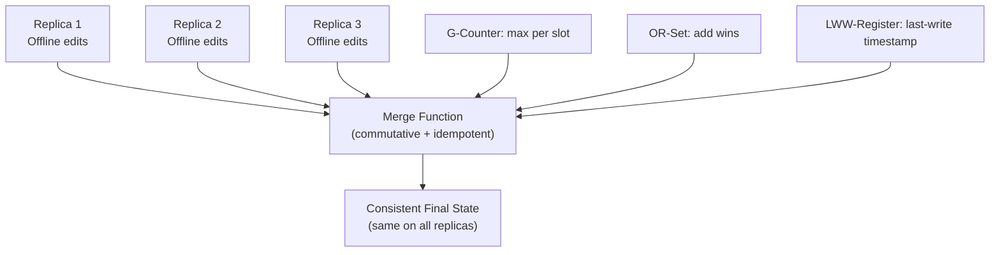
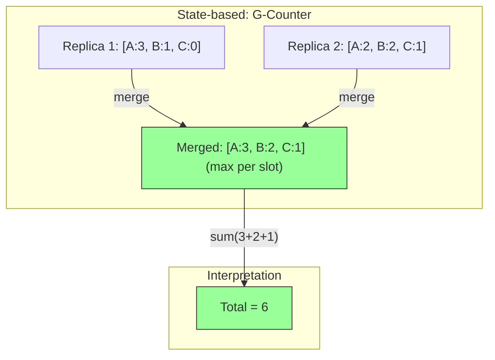

# CRDTs — Conflict-Free Replicated Data Types

**Level**: 🔴 Advanced

## 🗺️ Quick Overview



*CRDTs guarantee conflict-free merges by ensuring all operations are commutative, associative, and idempotent — replicas converge to the same state regardless of merge order.*

> CRDTs are data structures engineered so concurrent updates across replicas can *always* be merged — no conflicts, no coordination, no last-write-wins losses.

## Problem This Solves

Two users edit a shared document simultaneously while offline. When they reconnect, you need to merge their changes. With standard data types, you have to pick one version (losing data) or ask the user to resolve conflicts manually.

CRDTs solve this by designing the data type so that:
1. All operations are **commutative** (A then B = B then A)
2. All operations are **associative** (grouping doesn't matter)
3. All operations are **idempotent** (applying twice = applying once)

If these properties hold, replicas can merge in any order and always arrive at the same result.

## How It Works

Two families of CRDTs:

**State-based CRDTs (CvRDTs)**: Nodes send their full state to each other. The merge function must produce the same result regardless of order.

**Operation-based CRDTs (CmRDTs)**: Nodes send operations. The network must guarantee each operation is delivered exactly once (no duplicates), but can deliver in any order.



## CRDT Examples

### G-Counter (Grow-only Counter)

Each node has its own slot. To increment: add to your slot. Total = sum of all slots. Merge = max per slot.

Why max? Because if Replica A reports `[A:5, B:3]` and Replica B reports `[A:4, B:6]`, the correct state is `[A:5, B:6]` — take the highest known count for each node.

### OR-Set (Observed-Remove Set)

Allows add and remove operations. The trick: each add is tagged with a unique ID. Remove deletes that specific tag.

**"Add-wins" semantics**: if a concurrent add and remove happen, the add wins — because the remove can only delete tags it has observed, and it hasn't seen the new tag yet.

### LWW-Register (Last-Write-Wins Register)

A simple register where each write carries a timestamp. On merge, the higher timestamp wins. Simple but has subtle failure modes (what if clocks skew?).

## Pseudocode

```
// G-Counter: Grow-only Counter
type GCounter:
  counts: map(node_id → int)   // each node tracks its own increment

function gcounter_increment(counter, my_node_id, amount=1):
  counter.counts[my_node_id] = counter.counts.get(my_node_id, 0) + amount

function gcounter_value(counter):
  return sum(counter.counts.values())

// Merge: take max of each node's counter
function gcounter_merge(counter_a, counter_b):
  merged = {}
  all_nodes = union(counter_a.counts.keys(), counter_b.counts.keys())
  for node in all_nodes:
    a_val = counter_a.counts.get(node, 0)
    b_val = counter_b.counts.get(node, 0)
    merged[node] = max(a_val, b_val)
  return GCounter{ counts: merged }

// OR-Set: Observed-Remove Set
type ORSet:
  adds: set of (element, unique_tag)   // each add gets a unique tag
  removes: set of unique_tag           // removed tags

function orset_add(orset, element):
  tag = generate_unique_id()   // UUID or (node_id, timestamp, sequence)
  orset.adds.add((element, tag))

function orset_remove(orset, element):
  // Remove all tags we've observed for this element
  for (elem, tag) in orset.adds:
    if elem == element:
      orset.removes.add(tag)

function orset_contains(orset, element):
  // Element is present if any of its tags haven't been removed
  for (elem, tag) in orset.adds:
    if elem == element and tag not in orset.removes:
      return true
  return false

function orset_elements(orset):
  return {elem for (elem, tag) in orset.adds if tag not in orset.removes}

// Merge two OR-Sets (commutativity: merge(A,B) = merge(B,A))
function orset_merge(set_a, set_b):
  return ORSet{
    adds: union(set_a.adds, set_b.adds),
    removes: union(set_a.removes, set_b.removes)
  }
  // Note: merged.removes may reference tags not in merged.adds — that's fine
  // Those are "orphan removes" for elements never seen locally, harmless
```

## Used In Real Systems

**Figma** (collaborative design): The canvas object properties (position, size, color) use LWW-Register CRDTs. If two users move the same shape simultaneously while offline, the later-timestamped move wins — a reasonable UX choice.

**Redis CRDT (Redis Enterprise Active-Active)**: Supports CRDT data types for multi-region active-active replication. Counters, sets, sorted sets, and strings have CRDT semantics. Two data centers can both accept writes and merge without conflicts.

**Riak**: Offers native CRDT types: G-Counter, PN-Counter (increment and decrement), G-Set, OR-Set, LWW-Register, MV-Register, Map. Applications choose the appropriate CRDT for their use case.

**Apple Notes / Google Docs offline sync**: Both use CRDT-like structures for offline edits. Text editing uses specific sequence CRDTs (like RGA or LSEQ) that maintain character position consistently even when insertions happen concurrently.

**SoundCloud**: Used CRDTs for their social graph (follower counts, like counts) to allow multi-region active-active writes.

## Complexity

| CRDT | Space per replica | Merge cost |
|------|------------------|-----------|
| G-Counter | O(N nodes) | O(N) |
| OR-Set | O(elements × adds) | O(E) |
| LWW-Register | O(1) | O(1) |

**Practical concern**: OR-Sets grow unboundedly — every add operation creates a new tag. Real systems implement "garbage collection" by periodically compacting the add/remove sets when all replicas are synchronized.

## Trade-offs

**Pros:**
- Zero coordination needed — replicas operate independently
- Merges are always deterministic — no conflicts by design
- Works perfectly under network partitions (AP in CAP)
- Offline-first applications become trivially correct

**Cons:**
- Not all data structures can be CRDTs — arbitrary mutations are hard to make conflict-free
- Space overhead grows with concurrent operations (OR-Set especially)
- Semantic limitations: G-Counter can't decrement; deletes require PN-Counter patterns
- LWW loses data silently when clocks aren't well-synchronized
- Understanding which CRDT fits your use case requires careful analysis

## Key Takeaways

- CRDTs guarantee convergence across replicas with zero coordination
- The key insight: design operations to be commutative, associative, and idempotent
- G-Counter (merge = max), OR-Set (add-wins via unique tags), LWW-Register (timestamp wins)
- Figma, Redis Enterprise, Riak, and Apple all rely on CRDT principles
- CRDTs trade expressiveness for availability — not every operation can be made conflict-free
