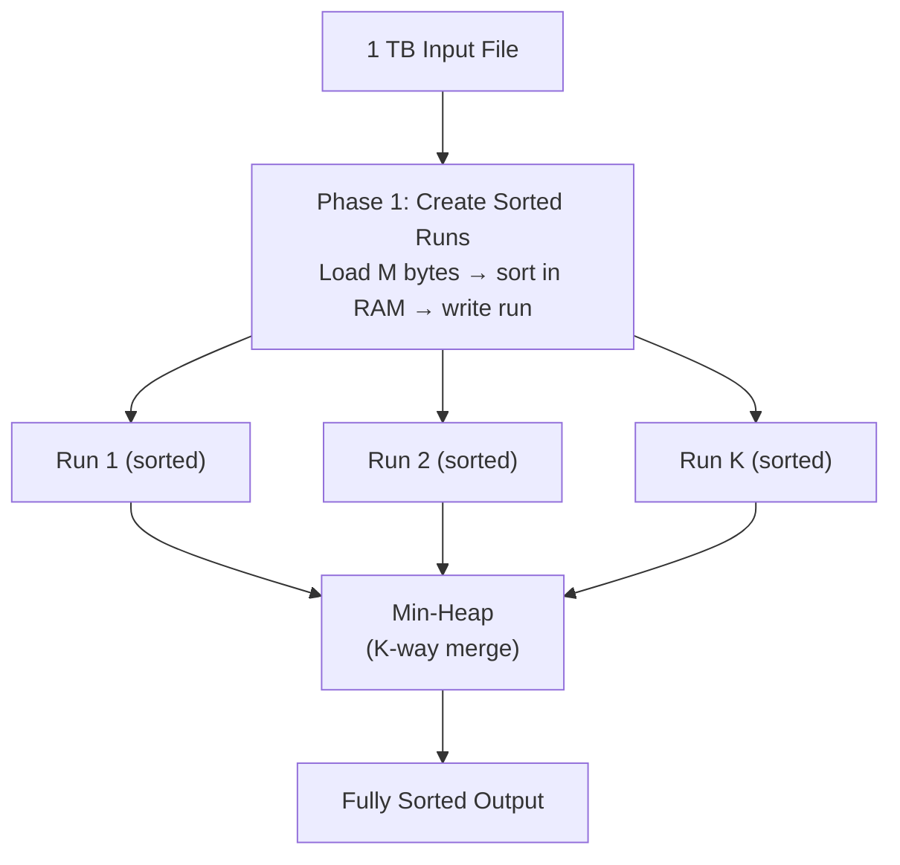
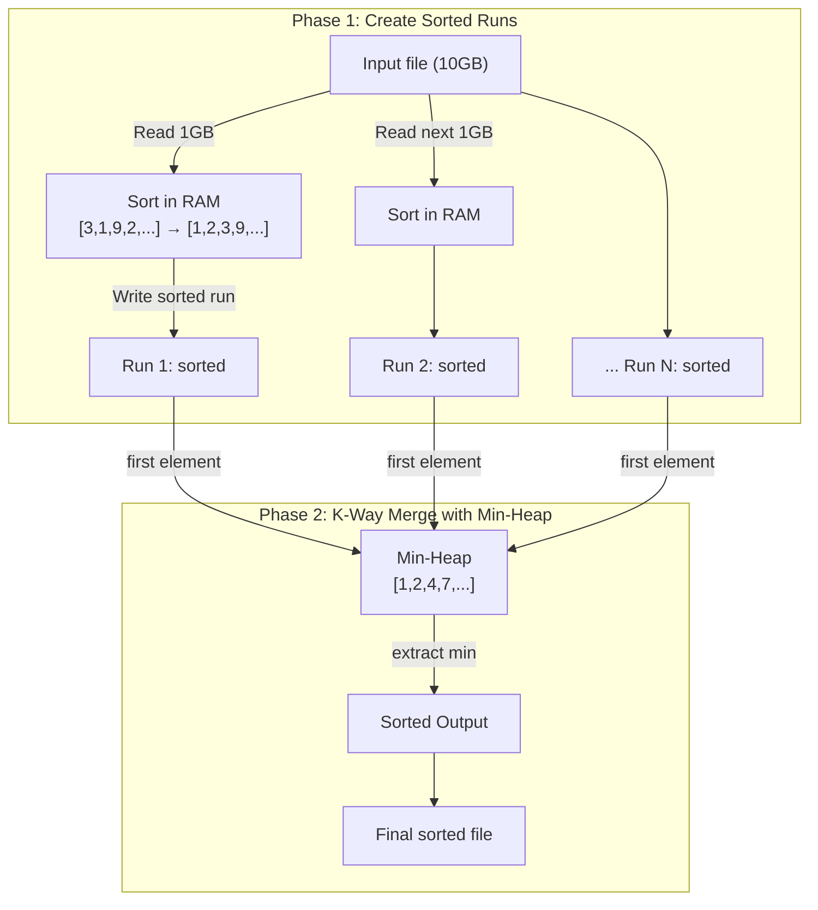

# External Sorting

**Level**: 🔴 Advanced

## 🗺️ Quick Overview



*External sort divides data into RAM-sized sorted runs (Phase 1), then merges them all simultaneously with a min-heap (Phase 2); disk I/O is always sequential, which is ~100× faster than random access.*

> When your data is bigger than memory, you can't sort it in-place. External sorting is how databases, MapReduce, and analytics engines sort terabytes of data using limited RAM.

## Problem This Solves

You have 1TB of log data to sort by timestamp. Your machine has 8GB of RAM. In-memory quicksort is impossible — you can't load the entire dataset. You need an algorithm that:
1. Uses only M bytes of RAM at a time (M << total data size)
2. Minimizes disk I/O (sequential reads/writes are ~100× faster than random I/O)
3. Produces a fully sorted output

## How It Works

External sort has two phases:

**Phase 1 — Create Sorted Runs**: Read M bytes at a time into memory, sort them, write a sorted "run" to disk. After processing all data, you have K = ceil(N/M) sorted runs.

**Phase 2 — K-Way Merge**: Use a min-heap to merge all K sorted runs simultaneously. The heap has one element from each run; repeatedly extract the minimum and write it to the output, then read the next element from that run's source file.



## Pseudocode

```
// Phase 1: Create sorted runs
function create_sorted_runs(input_file, memory_limit_bytes):
  runs = []
  run_index = 0

  while not input_file.eof():
    // Read a chunk that fits in memory
    chunk = input_file.read(memory_limit_bytes)
    if chunk is empty: break

    // Sort in memory (quicksort, timsort, etc.)
    chunk.sort(key=lambda record: record.sort_key)

    // Write sorted run to a temp file
    run_file = temp_file("run_" + str(run_index))
    run_file.write_all(chunk)
    run_file.seek(0)
    runs.append(run_file)
    run_index += 1

  return runs

// Phase 2: K-way merge using min-heap
function k_way_merge(runs, output_file):
  // Heap entry: (key, record, run_index)
  heap = MinHeap()

  // Initialize heap with first record from each run
  for i, run in enumerate(runs):
    record = run.read_one()
    if record is not null:
      heap.push((record.sort_key, record, i))

  // Merge
  while not heap.empty():
    key, record, run_idx = heap.pop_min()
    output_file.write(record)

    // Read next record from the same run
    next_record = runs[run_idx].read_one()
    if next_record is not null:
      heap.push((next_record.sort_key, next_record, run_idx))

  // Cleanup temp files
  for run in runs:
    run.delete()

// Full external sort
function external_sort(input_file, output_file, memory_limit):
  runs = create_sorted_runs(input_file, memory_limit)
  k_way_merge(runs, output_file)

// Optimization: if too many runs for heap to handle efficiently,
// do multi-pass merge (merge groups of K runs into intermediate sorted files)
function multi_pass_merge(runs, merge_factor, output_file):
  while len(runs) > 1:
    next_level_runs = []
    for i in range(0, len(runs), merge_factor):
      group = runs[i : i + merge_factor]
      intermediate = temp_file("merge_pass_" + str(i))
      k_way_merge(group, intermediate)
      intermediate.seek(0)
      next_level_runs.append(intermediate)
    runs = next_level_runs
  // Final run is the sorted output
  copy(runs[0], output_file)
```

## Used In Real Systems

**PostgreSQL** — Uses external sort for queries where the sort result doesn't fit in `work_mem` (default 4MB, often configured to 64MB-1GB). The `EXPLAIN ANALYZE` output shows `Sort Method: external merge` when this happens. Multi-pass merge is used when K (number of runs) is very large.

**Hadoop MapReduce** — Each mapper sorts its output key-value pairs. The shuffle phase sends all values for a key to the same reducer. Each reducer receives sorted input (the MapReduce framework handles this external sort implicitly via the shuffle merge).

**MySQL filesort** — When an `ORDER BY` result doesn't fit in `sort_buffer_size`, MySQL writes sorted rows to temporary disk files and merges them. You'll see "Using filesort" in `EXPLAIN`.

**Apache Spark** — Sort-based shuffle: each worker task sorts its output partition. The spark driver merges sorted partitions during the reduce phase. `repartitionAndSortWithinPartitions` uses external sorting internally.

**External merge sort** is also the basis for many database join algorithms: **sort-merge join** externally sorts both tables by the join key, then merges them in a single linear pass.

## Complexity

| Phase | I/O | Time |
|-------|-----|------|
| Create K runs | 2N (read + write) | N log M (sort each chunk) |
| K-way merge | 2N (read + write) | N log K (heap operations) |
| **Total** | **4N I/Os** | **N log N** |

Where N = total records, M = records fitting in memory, K = N/M runs.

**Optimization**: With M=1GB RAM and N=1TB data, K=1000 runs. A 1000-way heap is manageable. For extreme K, multi-pass merge reduces heap size at the cost of more I/O passes.

## Trade-offs

**Pros:**
- Works for arbitrarily large data using only O(M) memory
- Sequential I/O pattern — efficient on both spinning disks and SSDs
- K-way heap merge is cache-friendly for moderate K

**Cons:**
- 4N I/Os total — dominated by disk speed
- For very large K, heap has poor cache performance (K entries × log K operations)
- Temporary disk space needed: 2× the input size (runs + output)
- Not well-suited for streaming data (must read all input before producing sorted output)

## Key Takeaways

- External sort handles data that doesn't fit in memory using sorted runs + K-way merge
- Phase 1: sort M-byte chunks and write K sorted runs to disk
- Phase 2: use a min-heap to merge K runs in a single pass — heap has K elements at all times
- PostgreSQL, MySQL, Hadoop, and Spark all implement external sort under the hood
- Total cost: 4N disk I/Os and O(N log N) comparisons — same asymptotic complexity as in-memory sort
