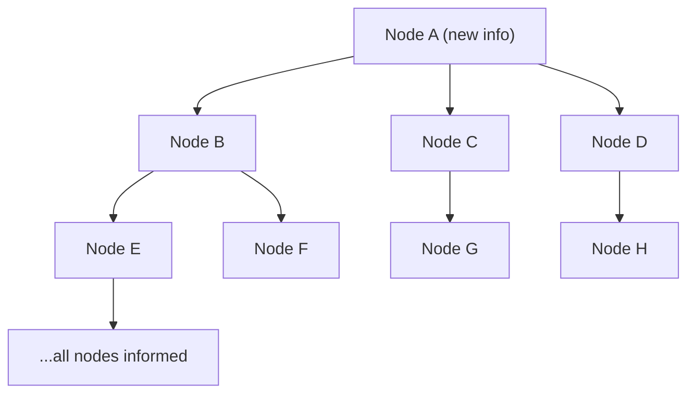
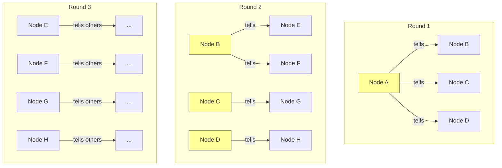

# Gossip Protocol

**Level**: 🟡 Intermediate

## 🗺️ Quick Overview



*Each round a node fans out to K random peers; after O(log N) rounds every node in the cluster has received the information.*

> Gossip protocols spread information through a cluster the same way a rumor spreads through a social network — each node tells a few random neighbors, and those neighbors tell more neighbors, until everyone knows.

## Problem This Solves

You have 1,000 nodes in a cluster. One node gets new information (a node joined, a key moved, a failure occurred). How do you propagate this to all other nodes?

**Naive solutions fail at scale:**
- **Broadcast to all nodes**: O(N) messages from one node. At 1,000 nodes, one event = 1,000 messages. 10 events/second = 10,000 messages/second.
- **Central coordinator**: Single point of failure. Bottleneck as cluster grows.
- **Flooding**: Every node forwards to every other node. O(N²) messages.

Gossip protocols achieve **O(log N) rounds** to reach all nodes with **O(N log N) total messages** — dramatically better than broadcast.

## How It Works

Each round of gossip:
1. A node picks K random peers (fanout, typically 3)
2. Sends them its current state (or just the delta)
3. Recipients merge the incoming state with their own
4. Those peers will gossip to their K random peers in the next round



After 3 rounds with fanout=3 and 100 nodes: information has reached ~27 nodes. After ~7 rounds: all 100 nodes know (log₃(100) ≈ 4.2 rounds theoretically, but accounting for overlap it's closer to 7).

## Variants

| Variant | How | Trade-off |
|---------|-----|-----------|
| **Push** | Informed node sends state to random peers | Fast spread, may push redundant data |
| **Pull** | Node asks random peers "what do you know?" | Better for detecting dead info |
| **Push-Pull** | Exchange states bidirectionally | Fastest convergence, 2× messages per round |

Cassandra uses **push** for new information and **push-pull** for anti-entropy (repair).

## Pseudocode

```
// Each node runs this every gossip_interval (e.g., 1 second)
function gossip_round(self, fanout=3):
  peers = self.get_all_known_peers()
  targets = random_sample(peers, min(fanout, len(peers)))

  for target in targets:
    send_gossip(target, self.local_state)

// Called when a gossip message arrives from another node
function receive_gossip(self, incoming_state):
  for key, value in incoming_state:
    if key not in self.local_state:
      self.local_state[key] = value
    else:
      // Merge: keep whichever has the higher version/timestamp
      if incoming_state[key].version > self.local_state[key].version:
        self.local_state[key] = incoming_state[key]

  // Optionally: forward to more peers (amplify spread)
  // if state_changed: gossip_round(self, fanout=1)

// State entry structure
type StateEntry:
  value: any
  version: int          // monotonically increasing
  node_id: string       // who originated this
  timestamp: epoch_ms   // wall clock (for TTL/expiry only, not ordering)

function merge_state(local, remote):
  result = {}
  all_keys = union(local.keys(), remote.keys())
  for key in all_keys:
    if key in local and key in remote:
      // Higher version wins
      result[key] = local[key] if local[key].version >= remote[key].version else remote[key]
    else:
      result[key] = local.get(key) or remote.get(key)
  return result
```

## Used In Real Systems

**Cassandra** — Every second, each node gossips with 1-3 random peers. State includes: node token ranges, schema version, load stats, aliveness. Failure is detected when a node's heartbeat version stops advancing.

**Consul** — Uses the SWIM (Scalable Weakly-consistent Infection-style Membership) protocol, a refined gossip variant. Nodes periodically probe random peers. If no response, they ask K other nodes to probe indirectly. Only if all fail → mark as failed.

**Redis Cluster** — Gossip protocol propagates slot assignments (which node owns which key range) and node health (PING/PONG messages carry cluster state). Every second each node sends PING to a few random nodes.

**Bitcoin** — New transactions and blocks propagate through the peer-to-peer network via gossip. Each node that receives a new transaction forwards it to 8 random peers it's connected to.

## Complexity

| Property | Value |
|----------|-------|
| Rounds to reach all N nodes | O(log N) |
| Total messages per round | O(N × fanout) |
| Total messages to convergence | O(N log N) |
| State per node | O(N) for full cluster state |

## Trade-offs

**Pros:**
- Highly resilient — no single point of failure
- Scales to thousands of nodes with bounded message rate
- Eventually consistent even during network partitions
- Simple to implement

**Cons:**
- Eventual consistency only — there's always a propagation delay
- Redundant messages — nodes tell each other things they already know
- State size grows with cluster size (O(N) state per node)
- Hard to bound propagation time precisely under heavy network load

## Key Takeaways

- Gossip achieves O(log N) convergence by leveraging exponential information spread
- Push-pull converges fastest; push-only is simpler and still efficient
- Cassandra, Consul, and Redis Cluster all rely on gossip for cluster membership
- Gossip is AP (Available + Partition tolerant) — great for metadata, not for transactional data
- Real implementations add version vectors or timestamps to handle merging conflicts
