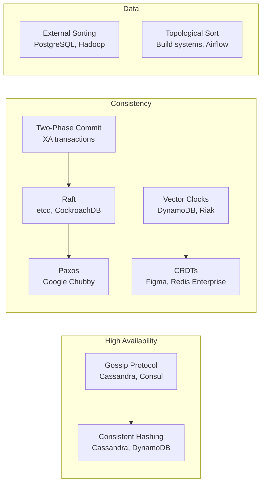

# Distributed Algorithms

**Level**: 🟡 Intermediate to ⚫ Expert

> The algorithms that make distributed systems possible — from gossip protocols that spread information across clusters to consensus algorithms that ensure agreement despite failures.



## Why Distributed Algorithms Matter

A single-machine algorithm optimizes for time and space. A distributed algorithm must also handle:

- **Partial failures** — some nodes crash while others keep running
- **Network partitions** — nodes can't communicate even though they're alive
- **No shared clock** — you can't rely on timestamps to determine ordering
- **No shared memory** — nodes communicate only by passing messages

These constraints force entirely different algorithmic thinking. The algorithms in this section are the building blocks of systems like Cassandra, etcd, DynamoDB, Kafka, and Kubernetes.

## What's In This Section

| Algorithm | Difficulty | Used In |
|-----------|-----------|---------|
| [Gossip Protocol](./gossip-protocol) | 🟡 | Cassandra, Consul, Redis Cluster |
| [Phi Accrual Failure Detector](./phi-accrual-failure-detector) | 🔴 | Cassandra, Akka |
| [Vector Clocks](./vector-clocks) | 🔴 | DynamoDB, Riak |
| [CRDTs](./crdt-conflict-free-data-types) | 🔴 | Figma, Redis Enterprise, Riak |
| [Two-Phase Commit](./two-phase-commit) | 🟡 | XA transactions, distributed DBs |
| [Paxos](./paxos-made-simple) | ⚫ | Google Chubby, ZooKeeper |
| [Raft](./raft-consensus) | 🔴 | etcd, CockroachDB, Consul |
| [Consistent Hashing + Vnodes](./consistent-hashing-with-virtual-nodes) | 🟡 | Cassandra, DynamoDB |
| [External Sorting](./external-sorting) | 🔴 | PostgreSQL, Hadoop, Spark |
| [Topological Sort](./topological-sort) | 🟡 | Build systems, package managers, Airflow |

## Learning Path

Start with the foundational concepts before tackling the harder ones:

```
Gossip Protocol          → easy, intuitive start
Consistent Hashing       → builds on gossip (Cassandra uses both)
Two-Phase Commit         → distributed transactions baseline
Vector Clocks            → ordering without synchronized clocks
CRDTs                    → conflict-free merging (builds on vector clocks)
Topological Sort         → DAG ordering (surprisingly universal)
External Sorting         → disk-aware sorting (needed for large systems)
Raft                     → consensus simplified
Paxos                    → consensus formalized (read after Raft)
Phi Accrual              → advanced failure detection
```

## Key Insight: The CAP Trade-off in Practice

Every algorithm here makes a trade-off between **Consistency**, **Availability**, and **Partition Tolerance**:

- **Gossip** → High availability, eventual consistency
- **2PC** → Strong consistency, low availability (blocks on failure)
- **Raft/Paxos** → Strong consistency with partition tolerance (majority quorum)
- **CRDTs** → High availability with merge-based consistency
- **Vector Clocks** → Detect conflicts without choosing a winner

Understanding *why* each algorithm makes its trade-off is more important than memorizing the algorithm itself.
