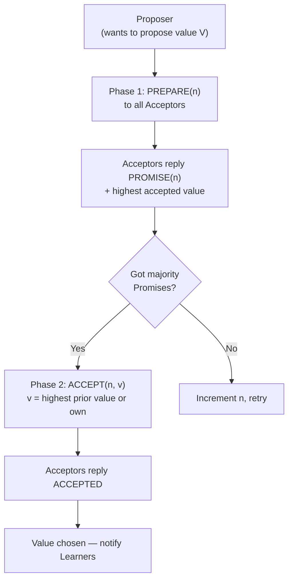
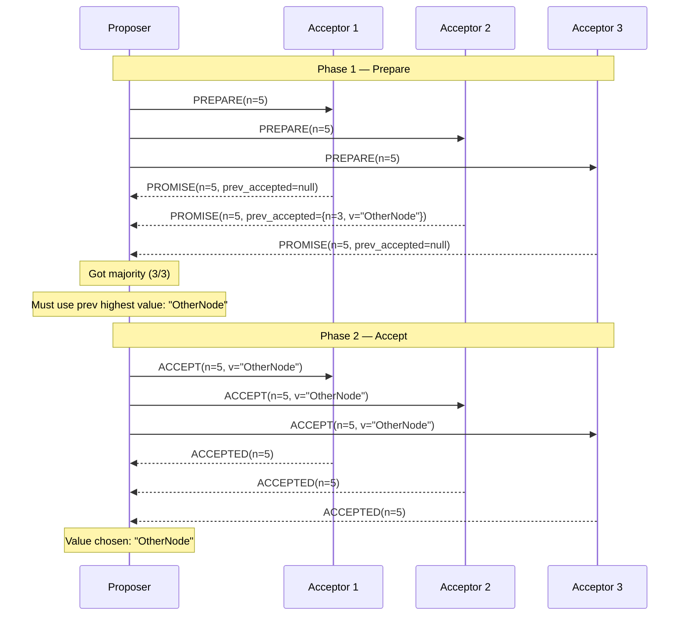

# Paxos Made Simple

**Level**: ⚫ Expert

## 🗺️ Quick Overview



*Paxos requires two network round trips and a majority quorum; safety comes from higher-numbered proposals always inheriting the previously accepted value.*

> The algorithm that solved distributed consensus — and inspired every production consensus system used today, even if they don't call it Paxos.

## Problem This Solves

You have 5 database replicas. One of them must be elected leader. All 5 must agree on *the same leader*. The catch: messages can be dropped, nodes can crash mid-protocol, and there's no shared clock.

This is the **consensus problem**: get a set of nodes to agree on a single value, even if some nodes fail or messages are lost.

Paxos (Lamport, 1989) was the first provably correct solution to consensus under crash failures. Its key insight: you don't need all nodes to agree — just a **majority** (quorum).

## Roles

- **Proposers**: Want to propose a value (e.g., "I should be the leader")
- **Acceptors**: Vote on proposals (each node is typically both proposer and acceptor)
- **Learners**: Learn the chosen value and act on it

## How It Works



## Pseudocode

```
// Proposer side
function propose(my_node_id, my_value, acceptors):
  proposal_number = generate_unique_increasing_number(my_node_id)
  // Proposal numbers must be globally unique and increasing
  // Common: (timestamp, node_id) lexicographic ordering

  // Phase 1: Prepare
  quorum = majority(len(acceptors))   // e.g., 3 of 5
  promises = []

  for acceptor in acceptors:
    response = send_prepare(acceptor, proposal_number)
    if response.type == PROMISE:
      promises.append(response)
    if len(promises) >= quorum:
      break   // got majority, proceed

  if len(promises) < quorum:
    return FAILED   // couldn't get majority

  // If any acceptor already accepted a value, we MUST use the highest one
  // This is the critical safety constraint in Paxos
  highest_accepted = null
  for promise in promises:
    if promise.prev_accepted is not null:
      if highest_accepted is null or promise.prev_accepted.n > highest_accepted.n:
        highest_accepted = promise.prev_accepted

  value_to_propose = highest_accepted.value if highest_accepted else my_value

  // Phase 2: Accept
  accepted_count = 0
  for acceptor in acceptors:
    response = send_accept(acceptor, proposal_number, value_to_propose)
    if response.type == ACCEPTED:
      accepted_count += 1

  if accepted_count >= quorum:
    // Value is chosen! Notify learners.
    notify_learners(value_to_propose)
    return CHOSEN(value_to_propose)
  else:
    return FAILED   // another proposer interfered

// Acceptor side (persistent state survives crashes)
type AcceptorState:
  promised_n: int       // highest proposal number promised
  accepted_n: int       // proposal number of accepted value
  accepted_v: any       // accepted value

function handle_prepare(state, n):
  if n > state.promised_n:
    state.promised_n = n
    persist(state)
    return PROMISE{
      n: n,
      prev_accepted: {n: state.accepted_n, v: state.accepted_v} if state.accepted_v else null
    }
  else:
    return NACK{highest_seen: state.promised_n}

function handle_accept(state, n, v):
  if n >= state.promised_n:
    state.promised_n = n
    state.accepted_n = n
    state.accepted_v = v
    persist(state)   // MUST persist before responding
    return ACCEPTED{n: n}
  else:
    return NACK{highest_seen: state.promised_n}
```

## The Key Safety Invariant

Why does Paxos work? The safety constraint is subtle but crucial:

**If a value V was chosen in round N, then any value chosen in round N+1 must also be V.**

This is enforced by: when a proposer gets promises, it *must* adopt the previously accepted value with the highest proposal number. This prevents two different values from ever being chosen.

## Multi-Paxos

Basic Paxos agrees on a *single value*. Real systems need to agree on a *sequence of values* (log entries). Multi-Paxos optimizes this:
- Elect a stable leader (Phase 1 once)
- Leader proposes all subsequent values using Phase 2 only
- Reduces 2 round-trips to 1 for every log entry after leader election
- If leader fails, run Phase 1 again to elect a new leader

## Used In Real Systems

**Google Chubby** — Distributed lock service used by Bigtable, GFS, and MapReduce. Implements Multi-Paxos for replicated state machine. Every lock acquisition goes through Paxos consensus.

**Apache ZooKeeper (ZAB protocol)** — Zookeeper Atomic Broadcast is a Paxos-like protocol optimized for primary-backup replication. Powers Kafka (historically), Hadoop coordination, and many distributed systems.

**Apache Cassandra (Lightweight Transactions)** — Cassandra's `IF NOT EXISTS` / `IF condition` uses Paxos for linearizable transactions on individual rows. Each row can have an independent Paxos instance.

**Raft** is a re-specification of Multi-Paxos with clearer leader election rules and a prescriptive log replication model. Easier to understand and implement correctly.

## Complexity

| Property | Value |
|----------|-------|
| Messages per consensus round | 2 × (N acceptors) minimum |
| Latency | 2 round-trips (4 one-way trips) |
| Fault tolerance | Tolerates (N-1)/2 failures for N acceptors |
| Liveness | Not guaranteed if two proposers keep outbidding each other (use randomized backoff) |

## Trade-offs

**Pros:**
- Provably correct under asynchronous network with crash failures
- Majority quorum means tolerating minority failures (e.g., 2 of 5 can fail)
- Well-studied with formal proofs

**Cons:**
- Complex to implement correctly (many subtle edge cases)
- Two round-trips per consensus round
- Liveness not guaranteed (competing proposers can livelock — use leader election to prevent)
- Multi-Paxos spec is informal — most implementations are interpretations

## Key Takeaways

- Paxos solves distributed consensus: get N nodes to agree on one value despite failures
- Safety via quorum: a chosen value requires majority agreement — can't be contradicted
- Phase 1 (Prepare/Promise): proposer learns about prior accepted values
- Phase 2 (Accept): proposer commits value — must use highest prior accepted value if any
- Multi-Paxos amortizes Phase 1 by electing a stable leader
- Raft is "Paxos made understandable" — same guarantees, cleaner specification
