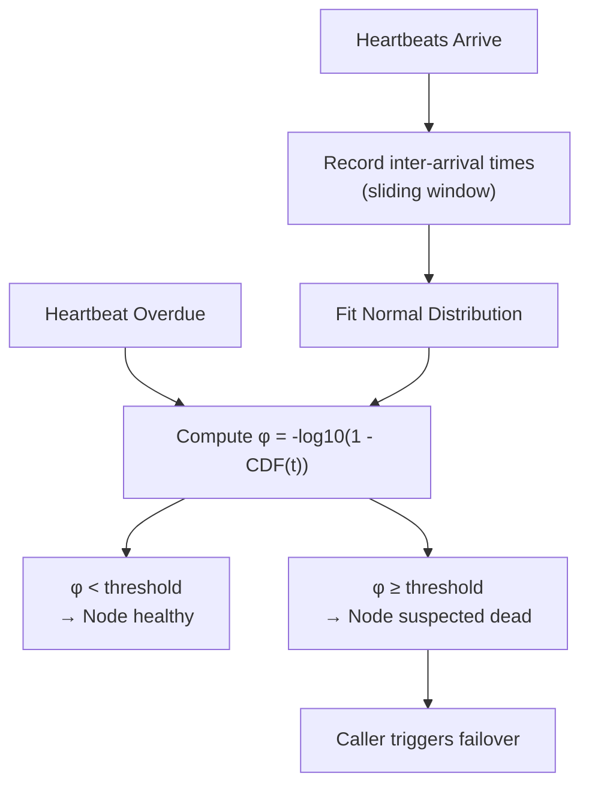
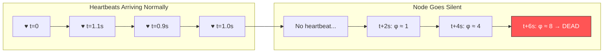

# Phi Accrual Failure Detector

**Level**: 🔴 Advanced

## 🗺️ Quick Overview



*Instead of a binary alive/dead signal, the detector outputs a continuous suspicion level φ that the caller compares against a configurable threshold (Cassandra default: φ = 8).*

> Instead of asking "is this node dead?", ask "how likely is this node dead?" — then let the caller decide the threshold.

## Problem This Solves

The naive heartbeat approach works like this: if we haven't heard from a node in 5 seconds, mark it dead. Simple, but deeply flawed in practice.

**The problem with fixed timeouts:**
- Network jitter is common — a 4.9 second gap due to garbage collection is normal
- Under load, heartbeat intervals stretch unpredictably
- Too low a threshold → false positives (healthy nodes marked dead → unnecessary failovers)
- Too high a threshold → slow failure detection (real failures take too long to notice)

The Phi Accrual Failure Detector, introduced by Hayashibara et al. (2004) and adopted by Cassandra and Akka, solves this by outputting a **continuous suspicion level φ (phi)** instead of a binary up/down signal. The caller decides when φ is high enough to act.

## How It Works

The detector models the distribution of heartbeat inter-arrival times. As heartbeats arrive, it learns the statistical profile of that node's timing. When a heartbeat is overdue, it calculates:

```
φ = -log₁₀(1 - Φ(t))
```

Where:
- `t` = time elapsed since the last heartbeat
- `Φ(t)` = the CDF of a normal distribution fitted to recent inter-arrival times
- `φ` = the resulting suspicion level

**Interpreting φ:**
- `φ = 1` → 10% probability node has failed
- `φ = 2` → 99% probability
- `φ = 3` → 99.9% probability
- `φ = 8` → Cassandra's default threshold for marking a node down

The key insight: **φ accumulates over time**. If heartbeats stop, φ climbs steadily. The system operator configures the threshold based on their tolerance for false positives vs. detection latency.



## Pseudocode

```
// State maintained per remote node
type HeartbeatHistory:
  intervals: sliding_window(size=1000)   // last 1000 inter-arrival times
  last_received_at: timestamp
  mean: float
  std_dev: float

// Called when a heartbeat arrives from a remote node
function heartbeat_received(history, now):
  if history.last_received_at is not null:
    interval = now - history.last_received_at
    history.intervals.add(interval)
    history.mean = mean(history.intervals)
    history.std_dev = std_dev(history.intervals)
  history.last_received_at = now

// Called to check suspicion level for a remote node
function compute_phi(history, now):
  if history.last_received_at is null:
    return 0.0   // no data yet, assume alive

  elapsed = now - history.last_received_at

  // How many standard deviations past the mean are we?
  // Add a small buffer (mean + 1 std) to account for normal delays
  mean_with_buffer = history.mean + history.std_dev
  normalized = (elapsed - mean_with_buffer) / history.std_dev

  // Φ(x) = CDF of standard normal distribution
  // Use numerical approximation for Φ
  cdf = normal_cdf(normalized)

  // Clamp to avoid log(0)
  cdf = clamp(cdf, 0.0, 0.9999999)

  phi = -log10(1.0 - cdf)
  return phi

// Caller decides the threshold based on their requirements
function is_node_down(history, now, phi_threshold=8.0):
  return compute_phi(history, now) >= phi_threshold

// Normal CDF approximation (Abramowitz & Stegun)
function normal_cdf(x):
  if x < -6.0: return 0.0
  if x > 6.0: return 1.0
  k = 1.0 / (1.0 + 0.2316419 * abs(x))
  poly = k * (0.319381530 +
               k * (-0.356563782 +
               k * (1.781477937 +
               k * (-1.821255978 +
               k * 1.330274429))))
  cdf = 1.0 - (1.0/sqrt(2*PI)) * exp(-x*x/2) * poly
  return cdf if x >= 0 else 1.0 - cdf
```

## Used In Real Systems

**Cassandra** — Each node runs the Phi Accrual Failure Detector for every other node in the cluster. Default `phi_convict_threshold = 8`. Operators can tune this: lower values for faster failure detection (more false positives), higher values for more conservative detection.

**Akka Cluster** — Uses Phi Accrual for cluster membership. Default threshold is 8. The cluster heartbeat interval is 5 seconds, and the detector adapts to the measured distribution. A node is considered unreachable when φ exceeds the threshold.

**Kubernetes influence** — While Kubernetes uses simpler liveness probes, the philosophy is similar: probe period and failure threshold together control the equivalent of a phi threshold. More recent work in service meshes uses similar probabilistic approaches.

## Complexity

| Property | Value |
|----------|-------|
| Memory per monitored node | O(W) where W = window size (default 1000 samples) |
| Compute per check | O(1) — mean/std are maintained incrementally |
| Detection latency | Depends on φ threshold and heartbeat interval |

## Trade-offs

**Pros:**
- Adapts to actual network behavior — no need to tune a fixed timeout
- Continuous output lets different callers use different thresholds
- Self-calibrating — if GC pauses are common, the detector learns to tolerate them
- Graceful degradation under load rather than binary flapping

**Cons:**
- Requires calibration period — needs at least 100-200 heartbeats to stabilize
- More complex than a simple timeout — harder to reason about
- If a node's behavior changes suddenly (e.g., hardware replaced), the window may give stale distribution
- The normal distribution assumption may not hold for all network patterns

## Key Takeaways

- Phi Accrual replaces binary up/down with a continuous suspicion score
- Higher φ = more confident the node is dead; caller sets their own threshold
- Cassandra uses φ=8 as its default conviction threshold
- The algorithm learns from recent heartbeat history — it adapts to network jitter automatically
- Trade-off: needs warm-up time and assumes normal inter-arrival distribution
