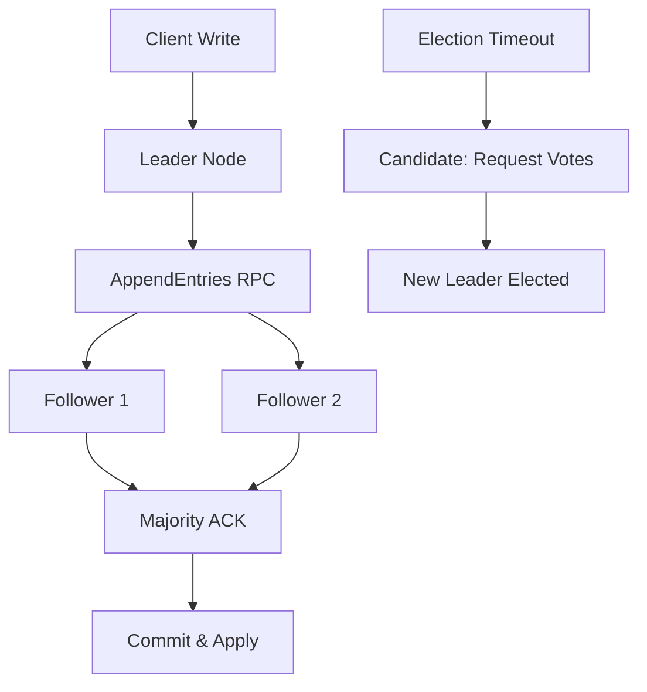
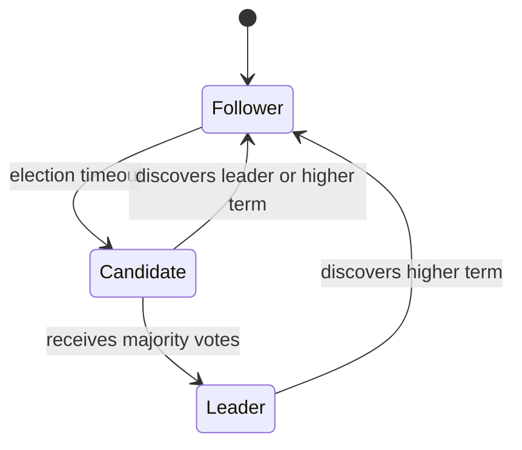
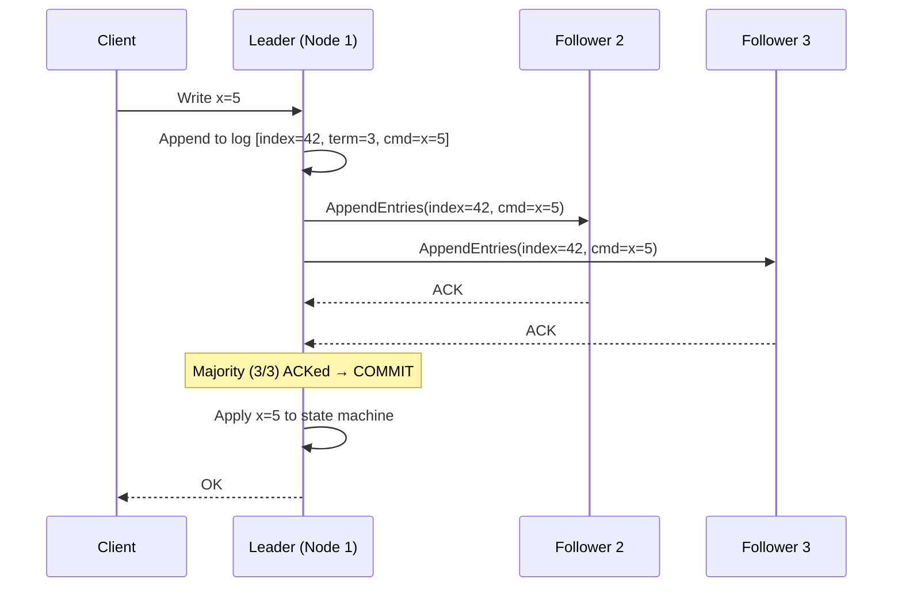

# Raft Consensus Algorithm

**Level**: 🔴 Advanced

## 🗺️ Quick Overview



*Raft elects one leader per term; all writes flow through the leader, which replicates to followers and commits once a majority acknowledges.*

> Raft was designed to be understandable. Unlike Paxos, Raft has a clear specification: elect one leader, replicate a log through that leader, and ensure safety at every step.

## Problem This Solves

You have 5 replicas of a key-value store. All writes must go to all replicas in the same order. Replicas may crash and rejoin. You need to guarantee that:
1. All committed entries appear on all live replicas
2. Entries are committed in the same order on every replica
3. The system makes progress as long as a majority is alive

This is distributed consensus applied to a replicated log — the foundation of etcd, CockroachDB, TiKV, Consul, and dozens of other systems.

## How It Works

Raft decomposes consensus into three sub-problems:
1. **Leader Election** — who is the current leader?
2. **Log Replication** — how does the leader send entries to followers?
3. **Safety** — what ensures only the right node can become leader?

### Leader Election

Each node starts as a **Follower**. If it doesn't hear from a leader within an election timeout (randomized 150-300ms), it becomes a **Candidate** and requests votes.

A Candidate wins if it gets votes from a majority. A node grants a vote only if the candidate's log is *at least as up-to-date* as its own.



### Log Replication

The leader accepts client writes, appends them to its log, and sends them to followers via `AppendEntries` RPCs. Once a majority ACKs an entry, the leader commits it and applies it to the state machine.



## Pseudocode

```
// Node state
type RaftNode:
  state: FOLLOWER | CANDIDATE | LEADER
  current_term: int           // monotonically increasing
  voted_for: node_id | null   // who we voted for this term
  log: list of LogEntry       // (term, index, command)
  commit_index: int           // highest committed entry
  last_applied: int           // highest applied to state machine
  // Leader only:
  next_index: map(peer → int)   // next log index to send to peer
  match_index: map(peer → int)  // highest log index known replicated to peer

// Follower behavior
function follower_loop(node):
  reset_election_timer()   // randomized 150-300ms
  while not timer_expired():
    msg = receive_message()
    if msg.type == APPEND_ENTRIES:
      handle_append_entries(node, msg)
      reset_election_timer()
    elif msg.type == REQUEST_VOTE:
      handle_request_vote(node, msg)
  // Timer expired → become candidate
  start_election(node)

// Election
function start_election(node):
  node.current_term += 1
  node.state = CANDIDATE
  node.voted_for = myself
  votes = 1   // vote for self

  for peer in peers:
    response = send_request_vote(peer, {
      term: node.current_term,
      candidate_id: myself,
      last_log_index: len(node.log) - 1,
      last_log_term: node.log[-1].term if node.log else 0
    })
    if response.vote_granted:
      votes += 1
    if response.term > node.current_term:
      // Higher term seen → revert to follower
      node.current_term = response.term
      node.state = FOLLOWER
      return

  if votes >= majority(len(peers) + 1):
    node.state = LEADER
    initialize_leader_state(node)
    send_heartbeats(node)   // assert leadership immediately

// Vote granting
function handle_request_vote(node, msg):
  if msg.term < node.current_term:
    return {vote_granted: false, term: node.current_term}

  if msg.term > node.current_term:
    node.current_term = msg.term
    node.state = FOLLOWER
    node.voted_for = null

  // Grant vote if: haven't voted yet AND candidate log is at least as up-to-date
  already_voted = node.voted_for is not null and node.voted_for != msg.candidate_id
  candidate_log_ok = is_at_least_as_up_to_date(msg.last_log_index, msg.last_log_term, node)

  if not already_voted and candidate_log_ok:
    node.voted_for = msg.candidate_id
    return {vote_granted: true, term: node.current_term}
  return {vote_granted: false, term: node.current_term}

// Leader replication
function leader_send_entry(node, command):
  entry = LogEntry{term: node.current_term, index: len(node.log), command: command}
  node.log.append(entry)

  // Replicate to followers in parallel
  acks = 1   // leader itself
  for peer in peers:
    response = send_append_entries(peer, node, entry)
    if response.success:
      acks += 1
      node.match_index[peer] = entry.index
      node.next_index[peer] = entry.index + 1
    elif response.term > node.current_term:
      node.state = FOLLOWER
      return FAILED

  if acks >= majority(len(peers) + 1):
    node.commit_index = entry.index
    apply_to_state_machine(node, entry)
    return SUCCESS
```

## Used In Real Systems

**etcd** — The distributed key-value store that powers Kubernetes control plane. All Kubernetes objects (pods, deployments, services) are stored in etcd, which uses Raft for consensus. A typical etcd cluster has 3 or 5 nodes.

**CockroachDB** — Each "range" (64MB shard of data) has its own Raft group. A CockroachDB cluster with 1TB of data has ~16,000 independent Raft groups running concurrently.

**TiKV** — The storage engine behind TiDB. Uses multi-Raft: one Raft group per region (96MB). Leader for each region handles reads and writes.

**Consul** — Uses Raft for its key-value store and service catalog. The Consul leader replicates all writes to followers before responding.

**HashiCorp Vault** — Uses Raft for its integrated storage backend (Vault Integrated Storage), replacing the need for an external Consul cluster.

## Raft vs Paxos

| Property | Raft | Paxos |
|----------|------|-------|
| Leader | Always exactly one | Multiple proposers possible |
| Specification | Prescriptive and complete | Abstract and underspecified |
| Implementation difficulty | Moderate | Very hard |
| Log ordering | Strictly sequential | Must be inferred |
| Leader election | Clear rules with log-up-to-date check | Less clearly defined |

## Complexity

| Property | Value |
|----------|-------|
| Messages per log entry | 2N (N = followers) for AppendEntries + ACK |
| Latency | 1 round-trip from leader to majority |
| Fault tolerance | Tolerates (N-1)/2 failures for N nodes |
| Leader election time | 150-300ms (randomized timeout) |

## Trade-offs

**Pros:**
- Clear specification — much easier to implement correctly than Paxos
- Single leader eliminates split-brain
- Strong consistency — committed entries guaranteed on all live nodes

**Cons:**
- All writes go through leader — leader becomes bottleneck at high write volume
- Network partition stalls writes if majority is unavailable
- Log can grow unboundedly — requires periodic snapshotting
- Cross-shard transactions (multiple Raft groups) still need 2PC

## Key Takeaways

- Raft decomposes consensus into leader election, log replication, and safety
- A node wins election only if its log is at least as up-to-date as the majority's
- An entry is committed once a majority ACKs it — it can then be applied to the state machine
- etcd, CockroachDB, Consul, TiKV, and Vault all use Raft
- Raft is essentially Multi-Paxos with a clearer, more implementable specification
