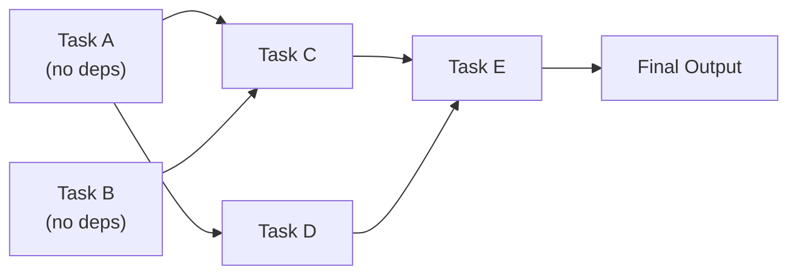
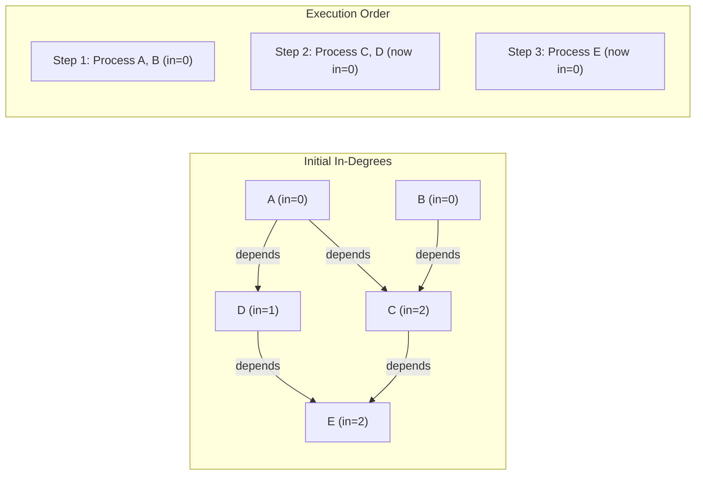

# Topological Sort

**Level**: 🟡 Intermediate

## 🗺️ Quick Overview



*Topological sort finds a linear ordering of a DAG so every task runs only after all its dependencies; Kahn's algorithm processes nodes with zero in-degree first, detecting cycles if any remain.*

> Given a dependency graph, find an order to execute tasks such that every task runs only after all its dependencies. The algorithm behind build systems, package managers, and workflow schedulers.

## Problem This Solves

You have 10 database migration scripts. Some depend on others:
- Migration 3 requires Migration 1 and Migration 2 to be applied first
- Migration 7 requires Migration 4
- What order should you run them?

This is topological sort: find a linear ordering of nodes in a DAG (Directed Acyclic Graph) such that for every edge A→B, A appears before B.

**Constraint**: Only works on DAGs. If the graph has cycles, there is no valid topological ordering — the build/deploy/install fails with a "circular dependency" error.

## How It Works

### Kahn's Algorithm (BFS-based)

Repeatedly remove nodes with no incoming edges (no dependencies). Each removed node is added to the sorted output.



### DFS-based Algorithm

Run DFS. When a node's DFS call finishes (all descendants visited), prepend it to the result. The result is a valid topological order.

## Pseudocode

```
// Kahn's Algorithm — BFS based
function kahn_topological_sort(nodes, edges):
  // Build adjacency list and in-degree count
  adjacency = {node: [] for node in nodes}
  in_degree = {node: 0 for node in nodes}

  for (from_node, to_node) in edges:
    adjacency[from_node].append(to_node)
    in_degree[to_node] += 1

  // Start with all nodes that have no dependencies
  queue = Queue()
  for node in nodes:
    if in_degree[node] == 0:
      queue.enqueue(node)

  result = []
  while not queue.empty():
    node = queue.dequeue()
    result.append(node)

    // For each node that depends on this one
    for dependent in adjacency[node]:
      in_degree[dependent] -= 1
      if in_degree[dependent] == 0:
        queue.enqueue(dependent)   // now ready to process

  // Cycle detection
  if len(result) != len(nodes):
    return Error("Cycle detected — no valid topological order exists")

  return result

// DFS-based Algorithm
function dfs_topological_sort(nodes, adjacency):
  visited = set()
  in_stack = set()   // for cycle detection
  result = []

  function dfs(node):
    if node in in_stack:
      raise Error("Cycle detected at: " + node)
    if node in visited:
      return   // already processed

    in_stack.add(node)
    for neighbor in adjacency[node]:
      dfs(neighbor)
    in_stack.remove(node)
    visited.add(node)

    result.prepend(node)   // post-order → prepend gives topological order

  for node in nodes:
    if node not in visited:
      dfs(node)

  return result

// Real-world usage: build system
function build_in_order(targets, dependency_graph):
  order = kahn_topological_sort(targets, dependency_graph.edges())
  for target in order:
    build(target)

// Real-world usage: detect circular dependency in package manager
function validate_dependencies(packages):
  result = kahn_topological_sort(packages.keys(), packages.dependency_edges())
  if result is Error:
    // Find the cycle for a helpful error message
    cycle = find_cycle(packages.dependency_edges())
    raise Error("Circular dependency: " + format_cycle(cycle))
  return result   // valid install order
```

## Used In Real Systems

**Build systems (Make, Gradle, Bazel, Buck)** — The dependency graph of build targets is a DAG. `make all` computes topological sort to determine which targets to build first. Parallel builds exploit the DAG: nodes with no shared dependencies build simultaneously.

**Package managers (npm, pip, cargo, apt)** — Installing a package requires topological sort of its transitive dependencies. If a circular dependency is detected, the install fails. `npm install` computes the full dependency graph and installs in valid topological order.

**Kubernetes manifest application** — `kubectl apply` with multiple resources uses dependency annotations to determine apply order. Namespace before services before deployments, etc.

**Apache Airflow** — DAG (Directed Acyclic Graph) is literally in the product name. Task execution order is computed via topological sort. Airflow validates on submission that the DAG has no cycles.

**Database migration tools (Flyway, Liquibase, Alembic)** — When migrations have explicit dependencies, topological sort determines application order.

**Compiler dependency analysis** — Compilers sort module/file dependencies so dependent modules are compiled before their dependents.

## Complexity

| Property | Kahn's | DFS |
|----------|--------|-----|
| Time | O(V + E) | O(V + E) |
| Space | O(V) for queue + in-degrees | O(V) for call stack + visited |
| Cycle detection | Yes — if result length < V | Yes — via in-stack tracking |
| Determinism | Depends on queue order | Depends on node iteration order |

## Trade-offs

**Pros:**
- Linear time O(V + E) — extremely efficient
- Detects circular dependencies as a free byproduct
- Kahn's variant allows parallelism: all nodes at in-degree=0 at the same time can run concurrently

**Cons:**
- Only works on DAGs — cyclic graphs have no topological order
- Multiple valid orderings exist; which one you get depends on implementation details
- Kahn's needs explicit in-degree tracking; DFS needs recursion stack (risk of stack overflow for deep graphs)

## Key Takeaways

- Topological sort orders a DAG so every node appears after its dependencies
- Kahn's algorithm: repeatedly remove and output in-degree-0 nodes
- DFS approach: post-order traversal gives reverse topological order
- Cycle detection is free: if Kahn's outputs fewer nodes than exist, there's a cycle
- Used in Make, Gradle, npm, pip, Airflow, Kubernetes — anywhere dependency ordering matters
