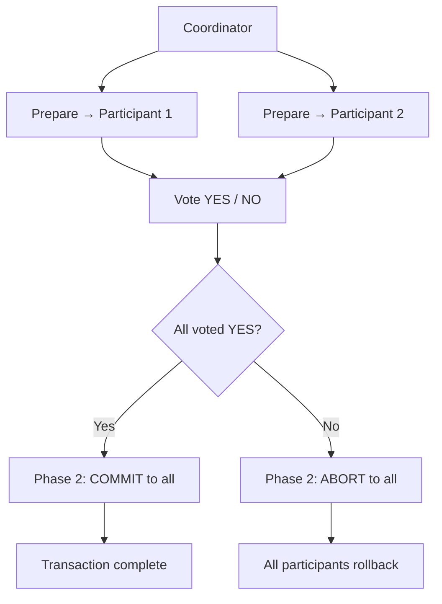
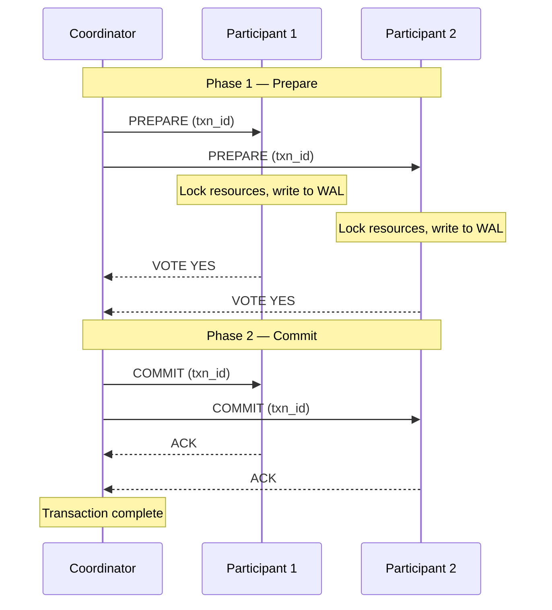

# Two-Phase Commit (2PC)

**Level**: 🟡 Intermediate

## 🗺️ Quick Overview



*2PC has two phases — prepare (lock resources, vote) and commit/abort (execute decision); safe but blocking: if the coordinator crashes after prepare, participants hold locks indefinitely.*

> The simplest way to get N nodes to either all commit or all abort a transaction — and the reason most distributed systems avoid distributed transactions altogether.

## Problem This Solves

You need to debit $100 from Account A (on database node 1) and credit $100 to Account B (on database node 2) atomically. Either both succeed, or neither does.

On a single database, this is trivial: wrap it in a transaction. Across two separate databases with no shared storage, it requires a coordination protocol.

## How It Works

Two-Phase Commit uses a **coordinator** to orchestrate N **participants**:



**If any participant votes NO (or times out):**

```
Phase 2 — Abort
Coordinator → ABORT to all participants
Participants release locks and roll back
```

## Pseudocode

```
// Coordinator side
function coordinate_transaction(txn_id, participants, operations):
  // Phase 1: Prepare
  votes = []
  for participant in participants:
    try:
      response = send_prepare(participant, txn_id, operations[participant])
      votes.append(response)
    catch timeout:
      votes.append(VOTE_NO)   // timeout = implicit NO

  // Decision
  if all(vote == VOTE_YES for vote in votes):
    decision = COMMIT
  else:
    decision = ABORT

  // Phase 2: Commit or Abort
  // CRITICAL: must write decision to coordinator's own WAL before sending
  coordinator_log.write(txn_id, decision)

  for participant in participants:
    send_decision(participant, txn_id, decision)
    // Keep retrying until ACK — participant may have crashed and recovered

  coordinator_log.mark_complete(txn_id)

// Participant side
function handle_prepare(txn_id, operations):
  try:
    // Execute operations but don't commit yet
    apply_to_local_store(operations, tentative=true)
    // Lock all affected resources
    acquire_locks(operations)
    // Write prepared state to WAL (survives crash)
    participant_log.write(txn_id, PREPARED, operations)
    return VOTE_YES
  catch error:
    participant_log.write(txn_id, ABORTED)
    release_locks(operations)
    return VOTE_NO

function handle_commit(txn_id):
  participant_log.write(txn_id, COMMITTED)
  apply_committed_changes(txn_id)
  release_locks(txn_id)
  return ACK

function handle_abort(txn_id):
  rollback_tentative_changes(txn_id)
  participant_log.write(txn_id, ABORTED)
  release_locks(txn_id)
  return ACK

// Recovery: called when participant restarts
function recover_on_startup(participant_log):
  for txn in participant_log.get_in_progress_transactions():
    if txn.state == PREPARED:
      // Don't know the outcome — must ask coordinator
      outcome = ask_coordinator_for_decision(txn.txn_id)
      if outcome == COMMIT: handle_commit(txn.txn_id)
      if outcome == ABORT: handle_abort(txn.txn_id)
      if coordinator_unreachable: BLOCK until coordinator recovers
```

## The Blocking Problem

The fatal flaw of 2PC: **if the coordinator crashes after Phase 1 but before Phase 2, participants are stuck forever.**

Participants have voted YES, locked their resources, and are waiting for the commit/abort decision. They cannot proceed without it. Resources remain locked. Other transactions cannot touch those rows.

This is why 2PC is called a **blocking protocol**.

**Three-Phase Commit (3PC)** adds a "pre-commit" phase to allow participants to infer the decision even if the coordinator crashes, but it's complex and still fails under network partitions.

## Used In Real Systems

**XA Transactions** (Java JTA, JDBC, MSDTC): The standard implementation of 2PC across heterogeneous databases. Used when you need a transaction that spans MySQL + PostgreSQL + a message queue. Works but is slow and notoriously hard to operate.

**Google Spanner**: Uses a variant of 2PC (called "Paxos-based 2PC") where each participant is a Paxos group rather than a single node, eliminating the single-point-of-failure. Combined with TrueTime for external consistency.

**Some distributed databases**: CockroachDB, YugabyteDB, and Spanner all implement 2PC internally for cross-shard transactions, but use consensus (Raft/Paxos) per shard to avoid coordinator single-point-of-failure.

**Why most new systems choose Saga instead:**
- Sagas break a distributed transaction into local transactions with compensating actions
- Non-blocking: each step commits immediately, undo via compensation
- Better availability: partial failures are handled via compensation, not global rollback
- Trade-off: no atomicity guarantee (intermediate states are visible)

## Complexity

| Property | Value |
|----------|-------|
| Messages per transaction | 2 × (N participants) minimum (4N with ACKs) |
| Latency | 2 round-trips minimum (one per phase) |
| Lock hold time | Duration of both phases — can be seconds |
| Failure modes | Coordinator crash → indefinite block |

## Trade-offs

**Pros:**
- Simple and well-understood
- Guarantees atomicity across participants
- Widely supported (XA is a standard)

**Cons:**
- Blocking: coordinator failure stalls all participants
- Slow: 2 synchronous round-trips, locks held throughout
- Poor availability: any participant failure can prevent commit
- Hard to operate: XA transactions are notoriously difficult to recover from

## Key Takeaways

- 2PC coordinates all-or-nothing across N nodes using a prepare + commit sequence
- A YES vote in Phase 1 means "I can commit" and locks all resources
- The coordinator crash problem makes 2PC a blocking protocol — avoid at large scale
- Sagas are the modern alternative: local transactions with compensating actions
- Google Spanner uses Paxos-based 2PC to solve the coordinator single-point-of-failure
