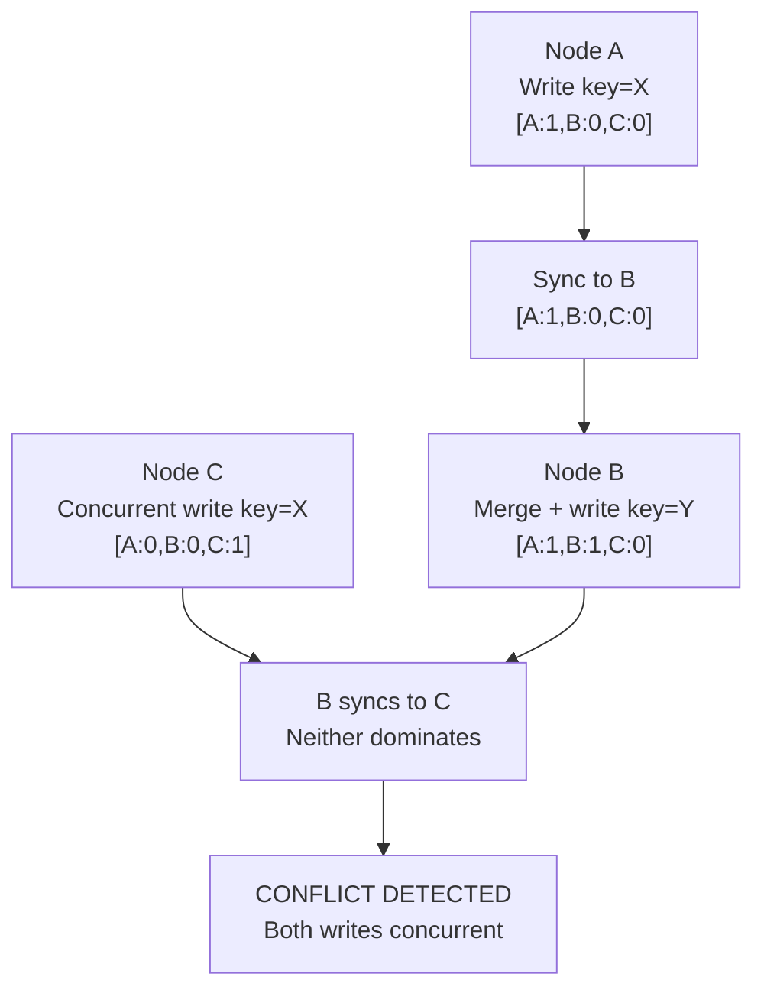
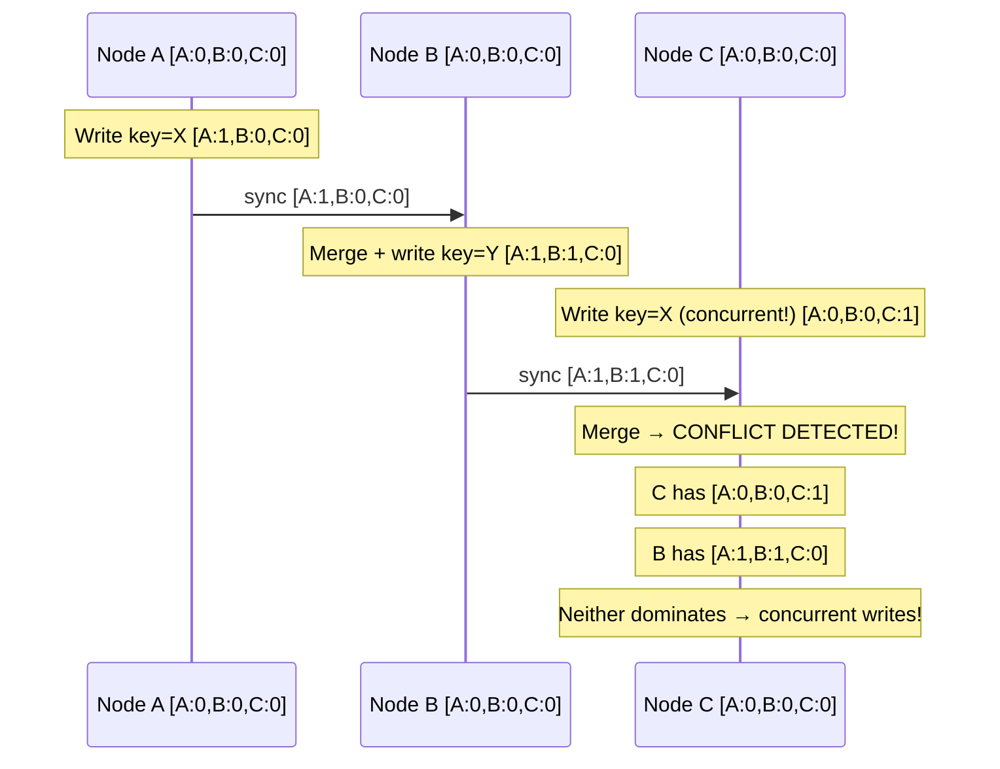

# Vector Clocks

**Level**: 🔴 Advanced

## 🗺️ Quick Overview



*Each node keeps a counter per peer; a vector clock where every component of A ≤ B means A happened-before B; otherwise the writes are concurrent and a conflict must be resolved.*

> Physical clocks lie in distributed systems. Vector clocks track what happened before what — without trusting any clock.

## Problem This Solves

In a distributed system, two nodes update the same key at "the same time." Which update wins?

You can't trust wall-clock timestamps:
- Clock skew between servers can be 100ms or more
- Network Time Protocol (NTP) syncs to within ~1-10ms, not nanoseconds
- If both updates happen within the skew window, timestamps are useless for ordering

**What we actually need**: a way to determine whether event A *caused* event B (happened-before), or whether they're *concurrent* (independent, potentially conflicting).

Vector clocks solve exactly this.

## How It Works

Each node maintains a vector of counters — one per node in the system. The vector `[A:2, B:1, C:0]` means: "I know about 2 events from A, 1 from B, and 0 from C."

**Rules:**
1. When a node does a local event: increment its own counter
2. When a node sends a message: attach its current vector
3. When a node receives a message: merge by taking the max of each component, then increment own counter

**Comparing two vector clocks:**
- `A → B` (A happened before B): every component of A ≤ corresponding component of B, and at least one is strictly less
- `A || B` (concurrent): neither A → B nor B → A — this is a **conflict**



## Pseudocode

```
// Node state
type VectorClock:
  counters: map(node_id → int)   // default 0 for unknown nodes

// Create a new vector clock
function new_clock(node_id):
  return VectorClock{ counters: {node_id: 0} }

// Called before any local write event
function increment_clock(clock, my_node_id):
  clock.counters[my_node_id] = clock.counters.get(my_node_id, 0) + 1
  return clock

// Called when receiving a message with another node's clock
function merge_clocks(local_clock, remote_clock):
  merged = copy(local_clock)
  for node_id, remote_val in remote_clock.counters:
    local_val = local_clock.counters.get(node_id, 0)
    merged.counters[node_id] = max(local_val, remote_val)
  return merged

// Compare two vector clocks
// Returns: "before", "after", "equal", or "concurrent"
function compare_clocks(clock_a, clock_b):
  a_dominates = false
  b_dominates = false

  all_nodes = union(clock_a.counters.keys(), clock_b.counters.keys())

  for node in all_nodes:
    a_val = clock_a.counters.get(node, 0)
    b_val = clock_b.counters.get(node, 0)

    if a_val > b_val:
      a_dominates = true
    elif b_val > a_val:
      b_dominates = true

  if a_dominates and not b_dominates: return "before"  // A happened before B
  if b_dominates and not a_dominates: return "after"   // B happened after A
  if not a_dominates and not b_dominates: return "equal"
  return "concurrent"   // CONFLICT — neither dominates

// On a write: attach the current vector clock to the value
type VersionedValue:
  value: any
  clock: VectorClock
  node_id: string

// On a read: if multiple versions exist, compare them
function resolve_versions(versions):
  // Keep only versions that aren't dominated by any other
  non_dominated = []
  for v in versions:
    dominated = false
    for other in versions:
      if compare_clocks(v.clock, other.clock) == "after":
        dominated = true   // v is dominated by other
        break
    if not dominated:
      non_dominated.append(v)

  if len(non_dominated) == 1:
    return non_dominated[0]    // no conflict
  else:
    return conflict(non_dominated)   // concurrent writes — needs resolution
```

## Used In Real Systems

**DynamoDB** — Originally used vector clocks (called "context") to detect concurrent writes to the same key. When a conflict is detected, both versions are returned to the application, which must provide a reconciliation function. (Amazon later switched to a variation using fewer metadata to reduce object size.)

**Riak** — Uses vector clocks (called "causal context") for every object. Supports configurable conflict resolution: last-write-wins, application-defined merge, or CRDT data types that merge automatically.

**CRDTs** — Many CRDT implementations use vector clocks internally to track which operations have been seen by each replica, ensuring idempotent application of operations.

## Complexity

| Property | Value |
|----------|-------|
| Clock size | O(N) where N = number of nodes |
| Merge cost | O(N) |
| Compare cost | O(N) |
| Storage overhead | Every value carries an O(N) clock |

**Practical concern**: At 1,000 nodes, every value carries 1,000 entries. DynamoDB addressed this by using bounded vector clocks (truncate oldest entries after a threshold), which trades precision for bounded storage.

## Trade-offs

**Pros:**
- Correctly identifies causal relationships without synchronized clocks
- Concurrent writes are explicitly detected, not silently overwritten
- Works under network partitions — each node can operate independently

**Cons:**
- Storage overhead: O(N) per object for N nodes
- Application must handle conflict resolution — no automatic winner
- Complex to reason about in large clusters
- "Sibling explosion" in Riak: too many concurrent writes → too many versions to reconcile

## Key Takeaways

- Vector clocks track causality — "who knew what, when" — not wall-clock time
- Concurrent events (neither before nor after) represent genuine conflicts
- DynamoDB and Riak use vector clocks to surface conflicts rather than silently losing writes
- Size grows linearly with cluster size — real systems bound this with pruning or use CRDTs instead
- The question vector clocks answer: "did A cause B, or did they happen independently?"
