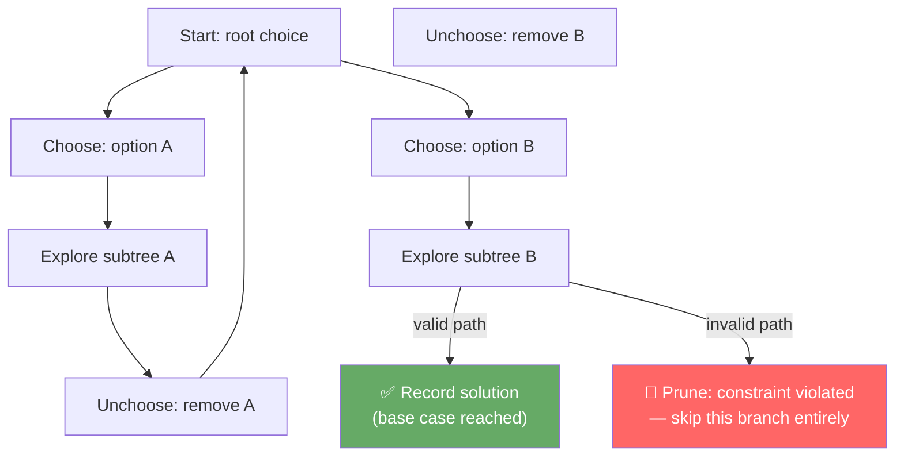

# POC: Backtracking

**Level**: 🔴 Advanced

## What You'll Build

Three classic backtracking problems using the same **choose → explore → unchoose** template:

1. **Word Search** — find a word in a 2D grid by walking adjacent cells
2. **N-Queens** — place N queens on an N×N board so none attack each other; count all solutions
3. **Combination Sum** — find all combinations of candidates that sum to a target

You'll see how the same mental model — with targeted pruning — reduces exponential brute-force into practical algorithms.

## 🗺️ Quick Overview



The key insight: **backtracking is DFS on a decision tree**. Pruning cuts entire subtrees when a partial solution already violates constraints — this is where the real speedup comes from.

## Problem 1: Word Search

Given a 2D grid of characters and a word, return true if the word exists in the grid following adjacent (up/down/left/right) cells. Each cell may be used only once per path.

### Naive complexity

Without pruning: O(N × M × 4^L) — for each starting cell, try all 4-directional paths of length L.

### With backtracking + pruning

**Pruning**: if the current character doesn't match the word at the current index, stop immediately. Mark visited cells to avoid reuse. In practice this is vastly faster for most inputs.

```
// Direction vectors for 4-directional movement
DIRS = [(0,1), (0,-1), (1,0), (-1,0)]

function word_search(grid, word):
  rows = len(grid)
  cols = len(grid[0])

  function dfs(row, col, index):
    // Base case: matched all characters
    if index == len(word):
      return true

    // Pruning: out of bounds or character mismatch
    if row < 0 or row >= rows or col < 0 or col >= cols:
      return false
    if grid[row][col] != word[index]:
      return false

    // ── CHOOSE: mark cell as visited (can't reuse in this path)
    original = grid[row][col]
    grid[row][col] = '#'   // temporary marker

    // ── EXPLORE: recurse in all 4 directions
    found = false
    for (dr, dc) in DIRS:
      if dfs(row + dr, col + dc, index + 1):
        found = true
        break   // early exit: first solution is enough

    // ── UNCHOOSE: restore the cell for other paths
    grid[row][col] = original

    return found

  // Try every cell as a starting point
  for r in 0..rows:
    for c in 0..cols:
      if dfs(r, c, 0):
        return true

  return false
```

### Walkthrough example

```
Grid:
  A B C E
  S F C S
  A D E E

Word: "ABCCED"

Start at (0,0)='A' → index 0 ✓
  Move right (0,1)='B' → index 1 ✓
    Move right (0,2)='C' → index 2 ✓
      Move down (1,2)='C' → index 3 ✓
        Move down (2,2)='E' → index 4 ✓
          Move left (2,1)='D' → index 5 ✓
            index == 6 → return true ✅
```

### Complexity

| | Without pruning | With pruning |
|-|-----------------|--------------|
| Time | O(N·M·4^L) | O(N·M·3^L) — can't go backward; practical: much less |
| Space | O(L) call stack | O(L) call stack |

## Problem 2: N-Queens

Place N queens on an N×N chessboard so no two queens share the same row, column, or diagonal. Return the count of all valid arrangements.

### Key insight

Place exactly one queen per row. For each row, try each column. Before placing, check column and both diagonals using O(1) sets.

```
function n_queens(n):
  // Track which columns and diagonals are occupied
  cols_used = set()
  diag1_used = set()   // (row - col) identifies a ↘ diagonal
  diag2_used = set()   // (row + col) identifies a ↗ diagonal
  solutions = 0

  function backtrack(row):
    nonlocal solutions

    // Base case: placed queens in all rows
    if row == n:
      solutions += 1
      return

    for col in 0..n:
      // ── PRUNING: check all three attack vectors
      if col in cols_used:
        continue
      if (row - col) in diag1_used:
        continue
      if (row + col) in diag2_used:
        continue

      // ── CHOOSE: place queen
      cols_used.add(col)
      diag1_used.add(row - col)
      diag2_used.add(row + col)

      // ── EXPLORE: fill next row
      backtrack(row + 1)

      // ── UNCHOOSE: remove queen
      cols_used.remove(col)
      diag1_used.remove(row - col)
      diag2_used.remove(row + col)

  backtrack(0)
  return solutions
```

### Walkthrough for N=4

```
Row 0: try col 0
  Row 1: col 0 blocked (same col), col 1 blocked (diag), try col 2
    Row 2: col 0 blocked, col 2 blocked, col 3 blocked → dead end, backtrack
  Row 1: try col 3
    Row 2: try col 1 ✓
      Row 3: try col 3 → blocked, try col 0 → blocked... no valid col → backtrack
Row 0: try col 1
  Row 1: try col 3
    Row 2: try col 0 ✓
      Row 3: try col 2 ✓ → solution #1: [1, 3, 0, 2]
...
Total solutions for N=4: 2
Total solutions for N=8: 92
```

### Complexity

| N | Brute force (N^N) | With backtracking |
|---|-------------------|-------------------|
| 8 | 16,777,216 nodes | ~15,720 nodes |
| 12 | 8.9 × 10^12 | ~856,188 nodes |
| 15 | 4.4 × 10^17 | ~2.1 × 10^8 nodes |

Pruning cuts explored nodes by **~99.9%** for large N.

## Problem 3: Combination Sum

Given a list of distinct positive integers `candidates` and a target, return all unique combinations that sum to target. Each candidate may be reused any number of times.

### Key pruning strategies

1. **Sort candidates first** — allows early termination when current candidate exceeds remaining target
2. **Pass start index** — prevents generating duplicate combinations (e.g., [2,3] and [3,2] are the same)

```
function combination_sum(candidates, target):
  sort(candidates)   // enables early termination
  results = []

  function backtrack(start, current, remaining):
    // Base case: found valid combination
    if remaining == 0:
      results.append(copy(current))
      return

    for i in start..len(candidates):
      candidate = candidates[i]

      // ── PRUNING: candidates are sorted, so all remaining are also too large
      if candidate > remaining:
        break

      // ── CHOOSE: add candidate to current combination
      current.append(candidate)

      // ── EXPLORE: recurse with same index (allows reuse) and reduced target
      backtrack(i, current, remaining - candidate)

      // ── UNCHOOSE: remove candidate
      current.pop()

  backtrack(0, [], target)
  return results
```

### Walkthrough example

```
candidates = [2, 3, 6, 7], target = 7

backtrack(start=0, current=[], remaining=7)
  Choose 2 → backtrack(0, [2], 5)
    Choose 2 → backtrack(0, [2,2], 3)
      Choose 2 → backtrack(0, [2,2,2], 1)
        Choose 2 → remaining=-1, skip
        Choose 3 → remaining=-2, break (sorted: rest also too big)
        ← backtrack
      Choose 3 → backtrack(1, [2,2,3], 0) → ✅ SOLUTION [2,2,3]
      Choose 6 → 6 > 3, break
    Choose 3 → backtrack(1, [2,3], 2)
      Choose 3 → 3 > 2, break ← early termination from sorting!
    Choose 6 → 6 > 5, break
  Choose 3 → backtrack(1, [3], 4)
    Choose 3 → backtrack(1, [3,3], 1)
      Choose 3 → 3 > 1, break
    Choose 6 → 6 > 4, break
  Choose 6 → backtrack(2, [6], 1)
    Choose 6 → 6 > 1, break
  Choose 7 → backtrack(3, [7], 0) → ✅ SOLUTION [7]

Final: [[2,2,3], [7]]
```

## The Universal Template

```
function backtrack(state, choices):
  if is_solution(state):
    record(state)
    return

  for choice in choices:
    if not is_valid(state, choice):
      continue           // ← pruning: skip invalid branches

    // CHOOSE
    apply(state, choice)

    // EXPLORE
    backtrack(new_state, remaining_choices)

    // UNCHOOSE
    undo(state, choice)
```

Every backtracking problem maps onto this template. The differentiation is:
- **What is "state"?** (current path, placed queens, partial sum)
- **What is "valid"?** (matches grid char, doesn't attack, doesn't exceed target)
- **What is the base case?** (word length matched, all rows filled, sum equals target)

## Key Learnings

**Backtracking vs brute force**
- Both explore all possibilities, but backtracking **abandons a path the moment a constraint is violated**, never exploring its subtree
- For word search: if position (i,j) doesn't match `word[k]`, skip all 3^(L-k) continuations from there

**Why sorting helps in combination sum**
- Sorting candidates means the loop can `break` (not just `continue`) when `candidate > remaining`
- `break` exits the entire for-loop, skipping all larger candidates too
- Without sorting: you'd need to check every candidate even if it's clearly too big

**Visited state management**
- Word search uses in-place grid modification (set `#`, restore after) — avoids a separate visited array
- N-queens uses sets for O(1) conflict checks — avoids re-scanning the board
- The pattern: **temporarily modify state, recurse, restore state**

**Real-world uses**
- **Constraint Satisfaction Problems (CSPs)**: Sudoku solvers, scheduling, register allocation in compilers
- **Game AI**: Chess/Go move generation uses backtracking with alpha-beta pruning
- **SAT solvers**: DPLL algorithm is backtracking with unit propagation and pure literal elimination
