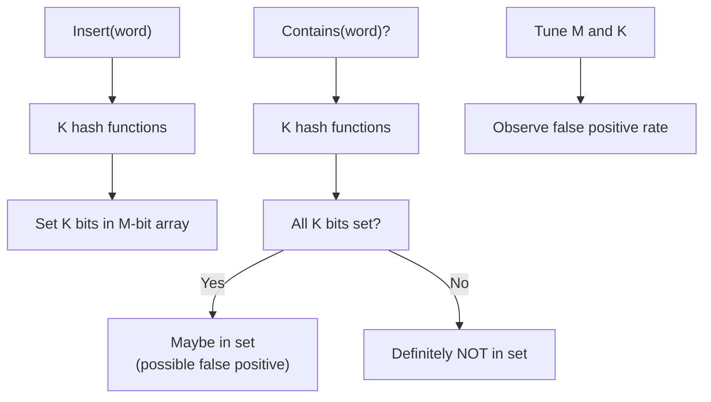
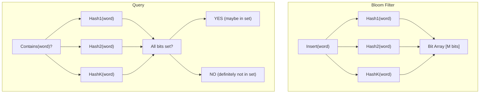

# POC: Bloom Filter

**Level**: 🟡 Intermediate

## 🗺️ Quick Overview



*A bloom filter uses K independent hash functions and a shared bit array; it never has false negatives but may have false positives whose rate decreases as M grows or K is tuned.*

## What You'll Build

A bloom filter that tests set membership probabilistically — it may report false positives (says "maybe yes" when the answer is no) but never false negatives (if it says "no," it's definitely not in the set).

You'll:
- Implement K hash functions and a bit array
- Insert 1,000 words and query 500 in-set + 500 not-in-set
- Measure the false positive rate (FPR)
- Observe how changing M (bit array size) and K (hash count) affects FPR

## Architecture



## Implementation

### Core Data Structure

```
type BloomFilter:
  bit_array: array of M bits, all initialized to 0
  m: int   // size of bit array
  k: int   // number of hash functions
  n: int   // number of inserted elements (for FPR calculation)

function create_bloom_filter(m, k):
  return BloomFilter{
    bit_array: [0] * m,
    m: m,
    k: k,
    n: 0
  }
```

### Hash Functions

Instead of K independent hash functions, use double hashing: two hash functions h1 and h2, then derive K positions as `(h1(x) + i * h2(x)) % m` for i = 0 to K-1. This gives K independent positions cheaply.

```
function get_positions(bloom, item):
  // Two independent hashes (use any good hash function, e.g., MurmurHash, FNV)
  h1 = hash_function_1(item) % bloom.m
  h2 = hash_function_2(item) % bloom.m

  positions = []
  for i in range(bloom.k):
    pos = (h1 + i * h2) % bloom.m
    positions.append(pos)

  return positions
```

### Insert and Query

```
function bloom_insert(bloom, item):
  positions = get_positions(bloom, item)
  for pos in positions:
    bloom.bit_array[pos] = 1
  bloom.n += 1

function bloom_contains(bloom, item):
  positions = get_positions(bloom, item)
  for pos in positions:
    if bloom.bit_array[pos] == 0:
      return false    // DEFINITELY not in set (no false negatives)
  return true         // POSSIBLY in set (may be false positive)
```

### Test: Measure False Positive Rate

```
function measure_false_positive_rate(m, k, num_insertions=1000, num_queries=500):
  bloom = create_bloom_filter(m, k)

  // Insert words[0..999]
  inserted_set = set()
  for i in range(num_insertions):
    word = "word_" + str(i)
    bloom_insert(bloom, word)
    inserted_set.add(word)

  // Query words NOT in the set (should get some false positives)
  false_positives = 0
  for i in range(num_queries):
    word = "not_in_set_" + str(i)   // none of these were inserted
    if bloom_contains(bloom, word):
      false_positives += 1           // false positive!

  actual_fpr = false_positives / num_queries

  // Expected FPR (theoretical):
  // FPR ≈ (1 - e^(-k*n/m))^k
  expected_fpr = compute_expected_fpr(m, k, num_insertions)

  print("M=" + m + " K=" + k + " → FPR=" + actual_fpr + " (expected=" + expected_fpr + ")")
  return actual_fpr

function compute_expected_fpr(m, k, n):
  // Based on the formula: probability that a given bit is still 0 after n insertions
  // P(bit=0) = (1 - 1/m)^(k*n) ≈ e^(-k*n/m)
  // FPR = P(all k bits set for a non-member) = P(bit=1)^k = (1 - P(bit=0))^k
  prob_bit_is_0 = exp(-k * n / m)
  fpr = (1 - prob_bit_is_0) ^ k
  return fpr
```

### Experiment: Varying M and K

```
function run_experiments():
  n = 1000   // always insert 1000 elements

  // Vary M (bit array size): more bits → lower FPR
  print("Effect of M (K fixed at 3):")
  for m in [5000, 10000, 20000, 50000]:
    measure_false_positive_rate(m, k=3, num_insertions=n)

  // Optimal K for a given M and N:
  // k_optimal = (m/n) * ln(2)
  // This minimizes FPR
  print("\nOptimal K for M=10000, N=1000:")
  k_optimal = (10000 / 1000) * ln(2)   // ≈ 6.93 → use 7
  print("Optimal K ≈ " + k_optimal)
  measure_false_positive_rate(m=10000, k=7, num_insertions=n)
```

**Expected results:**
- M=5,000, K=3, N=1,000 → FPR ≈ 5%
- M=10,000, K=3, N=1,000 → FPR ≈ 0.8%
- M=10,000, K=7, N=1,000 → FPR ≈ 0.4% (optimal K)
- M=50,000, K=3, N=1,000 → FPR ≈ 0.0002%

## Key Learnings

**Why bloom filters exist:**
- A set of 1,000 URLs stored as strings takes ~50KB. A bloom filter can represent the same membership with ~10KB and answer "is X in the set?" in O(K) time — and K is typically 5-10.

**No deletions:**
- Bits can't be unset — clearing a bit might clear other elements' bits too. Counting bloom filters (use counts instead of bits) support deletion but use more memory.

**Real system usage:**
- **Cassandra**: bloom filter per SSTable (immutable sorted file). Before disk read: "is this key in this file?" The filter eliminates most disk reads for non-existent keys.
- **Redis**: `BF.ADD` / `BF.EXISTS` commands — RedisBloom module. Used for deduplication in analytics pipelines (don't process the same event twice).
- **CDN edge caches**: Akamai uses bloom filters to check whether an object might be cached in a nearby edge before querying. Reduces cross-datacenter lookups.
- **Browser safe-browsing**: Chrome's safe browsing checks if a URL is in the malware list using a locally-stored bloom filter — avoids sending every URL to Google's servers.

**Space sizing rule of thumb:**
- Use 10 bits per inserted element → FPR ≈ 1%
- Use 7 bits per element → FPR ≈ 2%
- The formula `m = -n * ln(FPR) / (ln(2))^2` gives the optimal M for a target FPR
