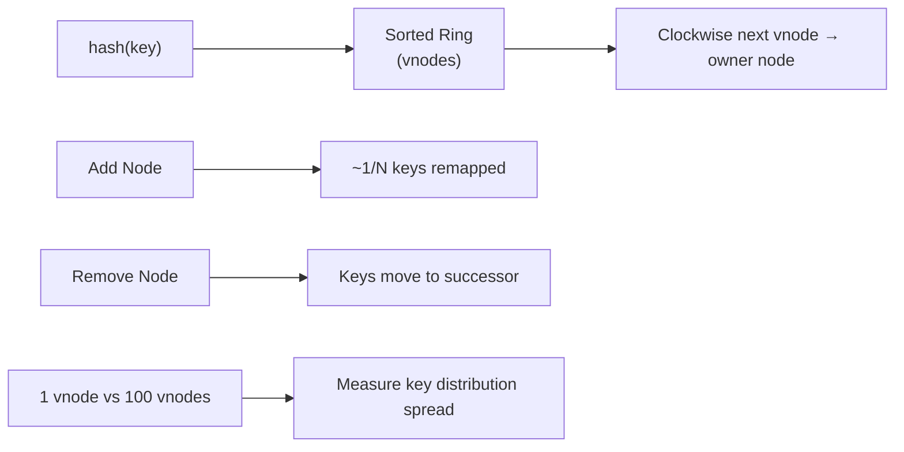
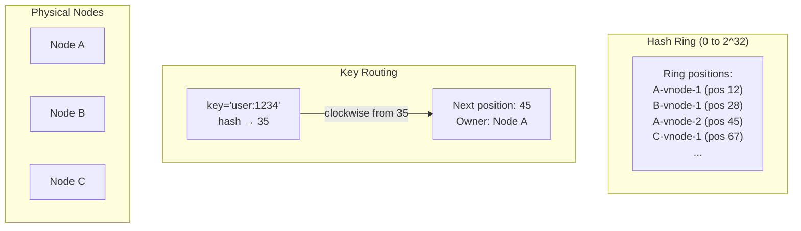

# POC: Consistent Hashing Ring

**Level**: 🟡 Intermediate

## 🗺️ Quick Overview



*This POC builds a hash ring with configurable vnodes per node, routes keys to their owner, measures distribution uniformity, and counts remapped keys during node addition/removal.*

## What You'll Build

A consistent hash ring with virtual nodes. You'll:
- Add and remove nodes from the ring
- Route keys to their responsible node
- Measure key distribution with 1 vs 100 vnodes per node
- Count how many keys are remapped when a node is added (should be ~1/N fraction)

## Architecture



## Implementation

### Ring Structure

```
type ConsistentHashRing:
  ring: sorted_map(position → node_id)   // sorted by hash position
  node_vnodes: map(node_id → list of positions)
  vnodes_per_node: int

function create_ring(vnodes_per_node=100):
  return ConsistentHashRing{
    ring: SortedMap(),
    node_vnodes: {},
    vnodes_per_node: vnodes_per_node
  }

function add_node(ring, node_id):
  positions = []
  for i in range(ring.vnodes_per_node):
    vnode_key = node_id + ":" + str(i)
    position = hash_to_ring_position(vnode_key)   // 0 to 2^32
    ring.ring[position] = node_id
    positions.append(position)
  ring.node_vnodes[node_id] = positions

function remove_node(ring, node_id):
  for position in ring.node_vnodes[node_id]:
    del ring.ring[position]
  del ring.node_vnodes[node_id]

function get_node(ring, key):
  key_position = hash_to_ring_position(key)
  // Find the first ring position >= key_position (clockwise)
  next_position = ring.ring.ceiling_key(key_position)
  if next_position is null:
    next_position = ring.ring.first_key()   // wrap around
  return ring.ring[next_position]
```

### Experiment 1: Distribution With 1 vs 100 Vnodes

```
function measure_distribution(vnodes_per_node, num_keys=10000):
  ring = create_ring(vnodes_per_node)
  nodes = ["node_A", "node_B", "node_C"]

  for node in nodes:
    add_node(ring, node)

  // Count how many of the 10,000 keys go to each node
  key_counts = {node: 0 for node in nodes}
  for i in range(num_keys):
    key = "key_" + str(i)
    owner = get_node(ring, key)
    key_counts[owner] += 1

  // Ideal distribution: num_keys / 3 ≈ 3333 per node
  ideal = num_keys / len(nodes)
  print("Vnodes per node: " + vnodes_per_node)
  for node, count in key_counts.items():
    deviation = abs(count - ideal) / ideal * 100
    print("  " + node + ": " + count + " keys (" + deviation + "% from ideal)")
```

**Expected output:**
```
Vnodes per node: 1
  node_A: 2100 keys (37% from ideal)   // high variance with 1 vnode
  node_B: 5400 keys (62% from ideal)
  node_C: 2500 keys (25% from ideal)

Vnodes per node: 100
  node_A: 3290 keys (1.2% from ideal)   // near-ideal with 100 vnodes
  node_B: 3380 keys (1.4% from ideal)
  node_C: 3330 keys (0.3% from ideal)
```

### Experiment 2: Keys Remapped on Node Addition

```
function measure_remapping(num_keys=10000):
  // Initial ring with 3 nodes
  ring_before = create_ring(vnodes_per_node=100)
  for node in ["node_A", "node_B", "node_C"]:
    add_node(ring_before, node)

  // Record who owns each key before
  ownership_before = {}
  for i in range(num_keys):
    key = "key_" + str(i)
    ownership_before[key] = get_node(ring_before, key)

  // Add a new node
  ring_after = copy(ring_before)
  add_node(ring_after, "node_D")

  // Count remapped keys
  remapped = 0
  for i in range(num_keys):
    key = "key_" + str(i)
    owner_after = get_node(ring_after, key)
    if owner_after != ownership_before[key]:
      remapped += 1

  remapped_pct = remapped / num_keys * 100
  print("Remapped: " + remapped + " keys (" + remapped_pct + "%)")
  print("Expected: ~25% (1 new node out of 4 total)")
```

**Expected output:**
```
Remapped: 2490 keys (24.9%)
Expected: ~25% (1 new node out of 4 total)
```

Only 1/N of keys remapped when adding a node — vs 100% remapped in naive `key % N` hashing.

### Experiment 3: Replication Factor

```
function get_replica_nodes(ring, key, replication_factor):
  key_position = hash_to_ring_position(key)
  nodes = []
  seen_physical_nodes = set()

  // Walk clockwise from key's position
  positions = ring.ring.keys_from(key_position, wrap_around=true)

  for position in positions:
    node = ring.ring[position]
    if node not in seen_physical_nodes:
      nodes.append(node)
      seen_physical_nodes.add(node)
    if len(nodes) == replication_factor:
      break

  return nodes

// Test
ring = create_ring(vnodes_per_node=100)
for node in ["node_A", "node_B", "node_C", "node_D", "node_E"]:
  add_node(ring, node)

replicas = get_replica_nodes(ring, "user:1234", replication_factor=3)
print("Replicas for user:1234: " + replicas)
// → ["node_C", "node_A", "node_E"] (3 different physical nodes)
```

## Key Learnings

**Why 100 vnodes vs 1:**
- With 1 vnode per node, the ring placement is random — one node might get 60% of the ring
- With 100 vnodes, the law of large numbers kicks in — positions average out to roughly equal
- More vnodes = better distribution, but more memory for the ring (100 nodes × 256 vnodes = 25,600 entries)

**Why not `key % N` (modulo hashing):**
- Add 1 node to a cluster of N → need to remap (N/(N+1)) × 100% of keys
- With 100 nodes, adding 1 node remaps 99% of keys → massive data migration
- Consistent hashing remaps only ~1/(N+1) ≈ 1% of keys

**Cassandra specifics:**
- Default: 256 vnodes per node
- Token ring state gossiped to all nodes — stored in local memory
- With 100 nodes × 256 vnodes = 25,600 ring entries — trivial memory footprint
- RF=3 by default: 3 consecutive distinct physical nodes own each key
