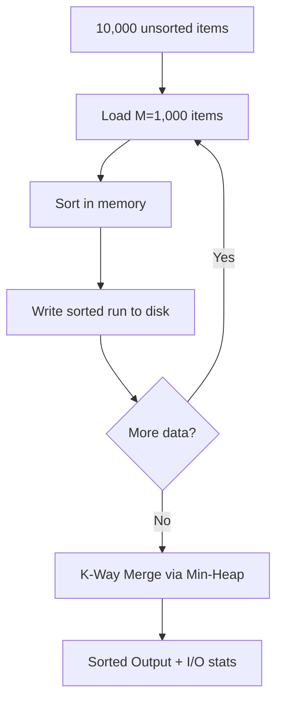
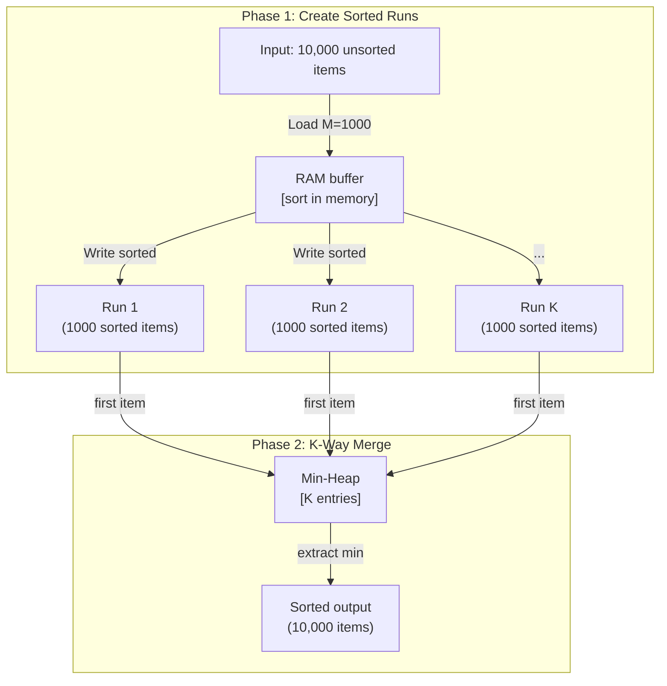

# POC: External Sort

**Level**: 🔴 Advanced

## 🗺️ Quick Overview



*This POC simulates disk-constrained external sort with artificial memory limits, creating K sorted runs then merging them with a min-heap while tracking simulated I/O operations.*

## What You'll Build

Simulate external sorting on a dataset that doesn't fit in "memory." You'll:
- Impose an artificial memory limit of M=1,000 items (simulate constrained memory)
- Sort a 10,000-item list using only M items in memory at a time
- Create sorted runs, merge with a min-heap
- Track I/O operations and verify the output is sorted

## Architecture



## Implementation

### Simulated Storage

We'll simulate disk I/O with counters to measure how many reads and writes occur.

```
type SimulatedStorage:
  files: map(filename → list)   // each "file" is a list of records
  read_ops: int
  write_ops: int

function storage_write(storage, filename, data):
  storage.files[filename] = data
  storage.write_ops += len(data)   // count each record written as 1 I/O op

function storage_read_next(storage, filename, position):
  storage.read_ops += 1
  file = storage.files[filename]
  if position >= len(file):
    return null   // end of file
  return file[position]
```

### Phase 1: Create Sorted Runs

```
function create_sorted_runs(storage, input_data, memory_limit):
  runs = []
  run_index = 0
  i = 0

  while i < len(input_data):
    // Load M items into "memory"
    chunk = input_data[i : i + memory_limit]
    i += memory_limit

    // Sort in memory (in real system: quicksort/timsort)
    chunk.sort()

    // Write sorted run to "disk"
    run_name = "run_" + str(run_index)
    storage_write(storage, run_name, chunk)
    runs.append({name: run_name, position: 0, size: len(chunk)})
    run_index += 1

  return runs
```

### Phase 2: K-Way Merge with Min-Heap

```
function k_way_merge(storage, runs):
  output = []
  heap = MinHeap(key=lambda x: x.value)

  // Initialize: load first item from each run
  for run in runs:
    record = storage_read_next(storage, run.name, run.position)
    if record is not null:
      heap.push({value: record, run: run})
      run.position += 1

  // Merge loop
  while not heap.empty():
    entry = heap.pop_min()
    output.append(entry.value)

    // Read next item from the same run
    next_record = storage_read_next(storage, entry.run.name, entry.run.position)
    if next_record is not null:
      heap.push({value: next_record, run: entry.run})
      entry.run.position += 1

  return output

function external_sort(input_data, memory_limit):
  storage = SimulatedStorage{files: {}, read_ops: 0, write_ops: 0}
  n = len(input_data)
  k = ceil(n / memory_limit)   // number of runs

  print("Input size: " + n + " items")
  print("Memory limit: " + memory_limit + " items")
  print("Number of runs: " + k)

  // Phase 1
  runs = create_sorted_runs(storage, input_data, memory_limit)
  print("Phase 1 write ops: " + storage.write_ops)

  // Phase 2
  result = k_way_merge(storage, runs)
  total_io = storage.read_ops + storage.write_ops
  print("Phase 2 read ops: " + storage.read_ops)
  print("Total I/O ops: " + total_io + " (expected: ~4N = " + (4 * n) + ")")

  return result
```

### Verify and Compare

```
function run_experiments():
  import random
  data = list(range(10000))
  random.shuffle(data)

  // Run external sort
  result = external_sort(data, memory_limit=1000)

  // Verify sorted
  is_sorted = all(result[i] <= result[i+1] for i in range(len(result)-1))
  print("Sorted correctly: " + is_sorted)

  // Compare I/O with naive approach
  // Naive: load all data, sort, write back = 2N I/Os
  // External: phase1 writes (N) + phase2 reads (N) + phase2 writes (N) + phase1 reads (N) = 4N
  print("\nI/O comparison:")
  print("  Naive (in-memory): 2N = " + (2 * 10000) + " ops (only possible if N fits in memory)")
  print("  External sort: 4N = " + (4 * 10000) + " ops (works for any N)")

function run_multipass_experiment():
  // Test with extremely large K: need to merge in multiple passes
  data = list(range(100000))
  random.shuffle(data)

  // Memory limit = 100, so K = 1000 runs
  // If heap can only hold 100 runs at once, need 10 passes
  result = external_sort_multipass(data, memory_limit=100, merge_factor=10)
  print("Multi-pass sort complete: " + (len(result) == 100000))
```

### Multi-Pass Merge (for very large K)

```
function external_sort_multipass(input_data, memory_limit, merge_factor):
  storage = SimulatedStorage{files: {}, read_ops: 0, write_ops: 0}

  // Phase 1: create runs
  runs = create_sorted_runs(storage, input_data, memory_limit)

  // Phase 2+: merge in groups until one run remains
  pass_num = 0
  while len(runs) > 1:
    next_runs = []
    for i in range(0, len(runs), merge_factor):
      group = runs[i : i + merge_factor]
      // Merge this group into a single sorted run
      merged_data = k_way_merge(storage, group)
      out_name = "pass" + str(pass_num) + "_run_" + str(i // merge_factor)
      storage_write(storage, out_name, merged_data)
      next_runs.append({name: out_name, position: 0, size: len(merged_data)})
    runs = next_runs
    pass_num += 1

  // Final run is the fully sorted output
  return storage.files[runs[0].name]
```

## Key Learnings

**The 4N I/O cost:**
- Phase 1: read all N items from input + write all N items to run files = 2N
- Phase 2: read all N items from run files + write all N items to output = 2N
- Total: 4N I/O operations — this is the fundamental cost floor for external sort

**Why K-way heap merge?**
- With K=10 runs, the heap has 10 elements — trivial
- With K=1000 runs, the heap has 1000 elements — still manageable
- Heap operations: O(log K) per extracted element, O(N log K) total
- Alternative: 2-way merge tree = O(N log K) passes but each pass is sequential — same asymptotic but worse constants

**Multi-pass vs single-pass:**
- Single-pass: merge all K runs at once — need a heap of size K
- Multi-pass: merge in groups of F, reduce K → K/F each pass — fewer heap entries per pass
- Trade-off: multi-pass needs more total I/Os (2N per extra pass)

**Real database behavior:**
- PostgreSQL sets `work_mem` for each sort operation (default 4MB)
- At 4MB with 100-byte rows: M = 40,000 rows per run
- For a 1GB table = 10M rows: K = 250 runs — single-pass merge is fine
- For a 100GB table = 1B rows: K = 25,000 runs — may need multi-pass
