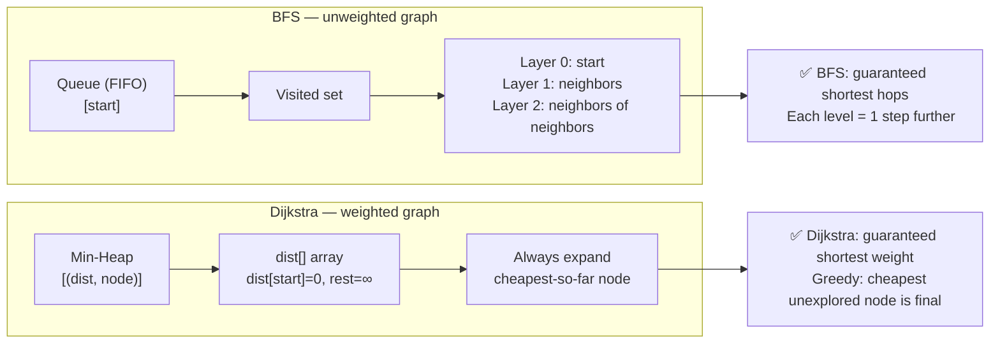

# POC: Graph Shortest Path

**Level**: 🟡 Intermediate

## What You'll Build

Three implementations spanning the two canonical shortest-path algorithms:

1. **BFS shortest path** — unweighted graph; finds minimum hop count
2. **Dijkstra's algorithm** — weighted graph using a min-heap priority queue
3. **Cheapest Flights Within K Stops** — a modified BFS/Dijkstra hybrid with an extra constraint

Real-world connection: Dijkstra is the algorithm behind **OSPF** (Open Shortest Path First), the routing protocol that ISPs and enterprise networks use to find shortest paths between routers. **Google Maps** uses a variant (A\* with road-distance heuristics) for navigation.

## 🗺️ Quick Overview



**When to use which:**

| Condition | Algorithm |
|-----------|-----------|
| Unweighted graph | BFS — simpler, O(V+E) |
| Weighted, non-negative edges | Dijkstra — O((V+E) log V) |
| Negative edges | Bellman-Ford — O(V·E) |
| Dense graph, all pairs | Floyd-Warshall — O(V³) |

## Problem 1: BFS Shortest Path (Unweighted)

Find the shortest path (fewest edges) between two nodes in an unweighted graph. BFS processes nodes level-by-level, so the first time we reach the destination, we've used the minimum number of edges.

```
function bfs_shortest_path(graph, start, end):
  if start == end:
    return 0

  visited = set([start])
  queue = deque([(start, 0)])   // (node, distance)

  while queue is not empty:
    node, dist = queue.popleft()

    for neighbor in graph[node]:
      if neighbor == end:
        return dist + 1   // found: this is the shortest distance

      if neighbor not in visited:
        visited.add(neighbor)
        queue.append((neighbor, dist + 1))

  return -1   // no path exists
```

### BFS applied to Word Ladder

Word Ladder: transform "hit" → "cog" changing one letter at a time, each intermediate word must be in a dictionary. Find the minimum number of transformations.

```
function word_ladder(begin_word, end_word, word_list):
  word_set = set(word_list)
  if end_word not in word_set:
    return 0

  queue = deque([(begin_word, 1)])   // (word, steps)
  visited = set([begin_word])

  while queue is not empty:
    word, steps = queue.popleft()

    // Try changing each character position
    for i in 0..len(word):
      for c in 'a'..'z':
        next_word = word[0..i] + c + word[i+1..]

        if next_word == end_word:
          return steps + 1

        if next_word in word_set and next_word not in visited:
          visited.add(next_word)
          queue.append((next_word, steps + 1))

  return 0   // no transformation sequence exists
```

### Step-by-step trace

```
begin="hit", end="cog", word_list=["hot","dot","dog","lot","log","cog"]

Queue: [("hit", 1)]
  Process "hit" (steps=1):
    Change h→?: hot ✓ (in word_set) → enqueue ("hot", 2)
    Change i→?: none in set
    Change t→?: none in set
  Queue: [("hot", 2)]

  Process "hot" (steps=2):
    Change h→d: dot ✓ → enqueue ("dot", 3)
    Change h→l: lot ✓ → enqueue ("lot", 3)
    Change o→?: none useful
    Change t→?: none useful
  Queue: [("dot", 3), ("lot", 3)]

  Process "dot" (steps=3):
    Change d→l: lot already visited
    Change o→?: none
    Change t→g: dog ✓ → enqueue ("dog", 4)
  Queue: [("lot", 3), ("dog", 4)]

  Process "lot" (steps=3):
    Change l→?: none new
    Change o→?: none
    Change t→g: log ✓ → enqueue ("log", 4)

  Process "dog" (steps=4):
    Change d→c: cog == end_word → return 4 + 1 = 5 ✅

Result: 5 steps: hit → hot → dot → dog → cog
```

## Problem 2: Dijkstra's Algorithm (Weighted)

Find shortest-distance paths from a source node to all other nodes. Uses a min-heap so we always expand the cheapest-known node first — this greedy choice is provably optimal for non-negative weights.

```
function dijkstra(graph, start, n):
  // graph[u] = list of (neighbor, weight)
  dist = array of size n, filled with INFINITY
  dist[start] = 0

  // min-heap: (distance, node)
  heap = [(0, start)]

  while heap is not empty:
    d, u = heap.pop_min()

    // Key optimization: skip if we already found a better path
    if d > dist[u]:
      continue

    for (v, weight) in graph[u]:
      new_dist = dist[u] + weight

      if new_dist < dist[v]:
        dist[v] = new_dist
        heap.push((new_dist, v))   // push updated distance

  return dist
```

### Priority queue state walkthrough

```
Graph (directed, weighted):
  0 → 1 (weight 4)
  0 → 2 (weight 1)
  2 → 1 (weight 2)
  1 → 3 (weight 1)
  2 → 3 (weight 5)

Start = 0, n = 4
Initial dist: [0, ∞, ∞, ∞]
Heap: [(0, node=0)]

Step 1 — pop (d=0, u=0):
  Explore 0→1 (w=4): new_dist=4 < ∞ → dist[1]=4, push (4, 1)
  Explore 0→2 (w=1): new_dist=1 < ∞ → dist[2]=1, push (1, 2)
  dist: [0, 4, 1, ∞]   Heap: [(1,2), (4,1)]

Step 2 — pop (d=1, u=2):
  Explore 2→1 (w=2): new_dist=3 < 4 → dist[1]=3, push (3, 1)
  Explore 2→3 (w=5): new_dist=6 < ∞ → dist[3]=6, push (6, 3)
  dist: [0, 3, 1, 6]   Heap: [(3,1), (4,1), (6,3)]

Step 3 — pop (d=3, u=1):
  Explore 1→3 (w=1): new_dist=4 < 6 → dist[3]=4, push (4, 3)
  dist: [0, 3, 1, 4]   Heap: [(4,1), (4,3), (6,3)]

Step 4 — pop (d=4, u=1):
  d=4 > dist[1]=3 → SKIP (stale entry)

Step 5 — pop (d=4, u=3):
  No outgoing edges. Done.
  dist: [0, 3, 1, 4]   Heap: [(6,3)]

Step 6 — pop (d=6, u=3):
  d=6 > dist[3]=4 → SKIP

Final distances from node 0:
  → node 1: 3  (path: 0→2→1)
  → node 2: 1  (path: 0→2)
  → node 3: 4  (path: 0→2→1→3)
```

The stale-entry skip (`if d > dist[u]: continue`) is the critical optimization. Without it, you'd reprocess nodes with outdated distances.

## Problem 3: Cheapest Flights Within K Stops

Find the cheapest price from `src` to `dst` using at most `k` stops (k+1 edges). This adds a constraint that makes pure Dijkstra incorrect — a cheaper path with more stops must be rejected if it exceeds k.

**Why Dijkstra fails**: Dijkstra might visit a node via a cheap path that uses 4 stops, then skip a more expensive path with 1 stop — but the expensive path would lead to a valid (within-k-stops) solution.

**Solution**: BFS-like relaxation, processing exactly one layer (= one more stop) per round. This is essentially Bellman-Ford restricted to k iterations.

```
function cheapest_flights_k_stops(n, flights, src, dst, k):
  // prices[u][v] = cost of flight u→v
  prices = build_adjacency_map(flights)

  // dist[node] = cheapest price found so far
  dist = array of size n, filled with INFINITY
  dist[src] = 0

  // Process at most k+1 rounds (k stops = k+1 edges)
  for round in 0..k+1:
    // IMPORTANT: use a copy of dist from start of round
    // so we don't mix paths of different lengths in one round
    temp = copy(dist)

    for (u, v, price) in flights:
      if dist[u] != INFINITY and dist[u] + price < temp[v]:
        temp[v] = dist[u] + price

    dist = temp   // commit this round's relaxations

  if dist[dst] == INFINITY:
    return -1
  return dist[dst]
```

### Why `temp` (copy) is essential

```
Without temp (wrong):
  Round 1 processes A→B (dist[A]=0, dist[B]=100)
  Then processes B→C using the just-updated dist[B]=100 → dist[C]=200
  But B→C was supposed to be a 2nd hop — we've collapsed two hops into one round!

With temp:
  Round 1: temp starts as copy of dist (all ∞ except src=0)
  temp[B] = 0 + 100 = 100
  temp[C] stays ∞ (dist[B] was ∞ at round start)
  Round 2: temp[C] = 100 + ... (correctly a 2nd hop)
```

### Walkthrough

```
Flights: 0→1($100), 1→2($100), 0→2($500)
src=0, dst=2, k=0 (at most 0 stops, so max 1 flight)

dist = [0, ∞, ∞]

Round 0 (1st flight):
  temp = [0, ∞, ∞]
  0→1: dist[0]=0 → temp[1]=min(∞, 0+100)=100
  1→2: dist[1]=∞ → skip
  0→2: dist[0]=0 → temp[2]=min(∞, 0+500)=500
  dist = [0, 100, 500]

k=0 means only 1 round (k+1=1). Done.
dist[2] = 500 → only direct flight counts (no stops allowed) ✅

Now with k=1 (1 stop = 2 flights):
Round 0: dist = [0, 100, 500]  (as above)
Round 1:
  temp = [0, 100, 500]
  1→2: dist[1]=100 → temp[2]=min(500, 100+100)=200
  dist = [0, 100, 200]

dist[2] = 200 → 0→1→2 is cheaper ✅
```

## Complexity Summary

| Algorithm | Time | Space | Constraint |
|-----------|------|-------|------------|
| BFS | O(V + E) | O(V) | Unweighted only |
| Dijkstra | O((V + E) log V) | O(V) | Non-negative weights |
| Bellman-Ford | O(V · E) | O(V) | Negative weights (no neg cycles) |
| K-stops BFS | O(k · E) | O(V) | At most k hops |

## Key Learnings

**Why BFS guarantees shortest path on unweighted graphs**
- BFS explores nodes in order of hop count — first all nodes 1 hop away, then 2 hops, etc.
- The first time you reach the destination, you've used the minimum number of hops.
- This breaks for weighted graphs: a 1-hop path with weight 1000 could be worse than a 5-hop path with total weight 10.

**Why Dijkstra is correct for non-negative weights**
- The invariant: when a node is popped from the min-heap with distance d, d is the true shortest distance.
- Proof: if there were a shorter path, it would have gone through some unvisited node — but that node would have a smaller d and been popped first. Non-negative weights prevent "shortcuts" through unvisited nodes.
- With negative weights, this invariant breaks — use Bellman-Ford instead.

**The stale-entry pattern**
- Dijkstra with a lazy heap (push new entries instead of update-in-place) accumulates stale entries.
- The guard `if d > dist[u]: continue` skips them cheaply.
- This is simpler to implement than a decrease-key heap and performs well in practice.

**Real-world routing: OSPF**
- Each router broadcasts its link costs to all other routers (Link State Advertisement)
- Every router runs Dijkstra on the full topology graph to compute its routing table
- The routing table maps: destination → next_hop (the first step on the shortest path)
- Dijkstra runs on thousands of nodes in milliseconds — practical because graph diameter is small (Internet has ~5 hops between major routers)

**Google Maps / navigation**
- Uses A\* (Dijkstra + heuristic): heuristic = straight-line distance to destination
- Heuristic guides the search toward the goal, reducing explored nodes from O(E) to ~O(√E) for grid-like road networks
- Also uses Contraction Hierarchies (CH): precompute shortcuts to reduce graph size at query time
