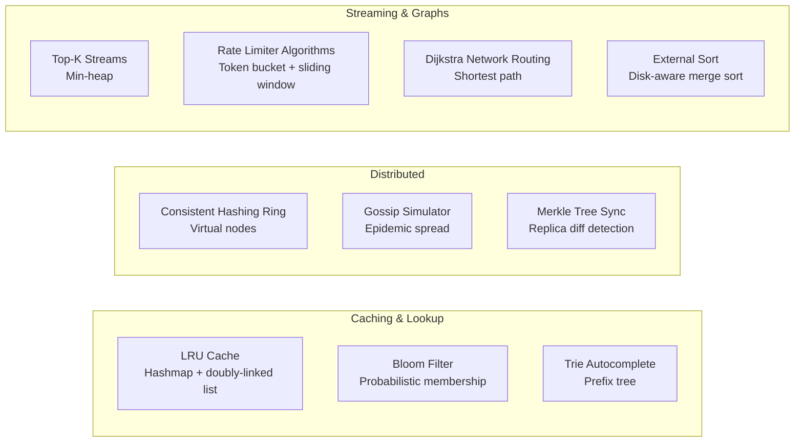

# Hands-On Algorithm POCs

**Level**: 🟡 Intermediate to 🔴 Advanced

> Theory without practice doesn't stick. These proof-of-concepts let you implement — or trace through — the core algorithms yourself. Each POC focuses on one concept, gives you pseudocode to work through, and connects the implementation to real production systems.



## What's In This Section

| POC | Difficulty | Concept | Real System Link |
|-----|-----------|---------|-----------------|
| [Bloom Filter](./bloom-filter-poc) | 🟡 | Probabilistic membership testing | Redis, Cassandra, CDN |
| [LRU Cache](./lru-cache-poc) | 🟡 | O(1) eviction with doubly-linked list + hashmap | Database buffer pool, CPU cache |
| [Consistent Hashing Ring](./consistent-hashing-poc) | 🟡 | Virtual nodes, ring routing | Cassandra, DynamoDB |
| [Trie Autocomplete](./trie-autocomplete-poc) | 🟡 | Prefix tree for fast lookup | Search, IDE autocomplete |
| [External Sort](./external-sort-poc) | 🔴 | Sort data larger than memory | PostgreSQL, Hadoop, Spark |
| [Top-K Streams](./top-k-streams-poc) | 🟡 | Min-heap maintains top K | Trending, monitoring |
| [Gossip Simulator](./gossip-simulator-poc) | 🔴 | Epidemic information spread | Cassandra, Consul |
| [Rate Limiter Algorithms](./rate-limiter-algorithms-poc) | 🟡 | Token bucket, sliding window | API gateways, Redis |
| [Dijkstra Network Routing](./dijkstra-network-routing-poc) | 🟡 | Shortest path with priority queue | CDN, network routing |
| [Merkle Tree Sync](./merkle-tree-sync-poc) | 🔴 | Efficient replica difference detection | Git, DynamoDB, IPFS |

## How to Use These POCs

Each POC is structured as:
1. **What You'll Build** — the concrete goal
2. **Architecture** — diagram showing the components
3. **Implementation** — pseudocode sections to work through
4. **Key Learnings** — what to take away

**Learning approach:**
- Read the pseudocode as if it's running — trace through a small example by hand
- Understand why each data structure was chosen (not just what it does)
- Notice where the real system reference explains why this algorithm exists in production

## Suggested Order

For maximum learning, do them in this order:

```
LRU Cache         → classic interview staple, builds data structure fluency
Bloom Filter      → probabilistic structures, understand false positive rate
Consistent Hash   → builds on simple hashing, prerequisite for distributed understanding
Trie Autocomplete → tree structures and prefix queries
Top-K Streams     → heap mastery, direct interview application
Rate Limiter      → combines sliding window + token bucket knowledge
Dijkstra          → shortest path, graph algorithm in practice
Gossip Simulator  → distributed algorithm made concrete
External Sort     → disk I/O thinking, merge sort at scale
Merkle Tree       → advanced distributed data integrity concept
```
