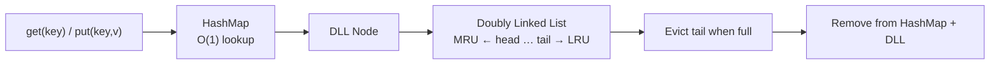
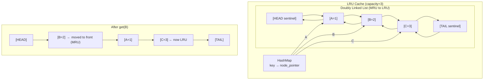

# POC: LRU Cache

**Level**: 🟡 Intermediate

## 🗺️ Quick Overview



*An LRU cache combines a hashmap (O(1) lookup) with a doubly-linked list (O(1) move-to-front and eviction); the tail is always the least recently used entry.*

## What You'll Build

An O(1) LRU (Least Recently Used) cache with `get(key)` and `put(key, value)` operations — both in O(1). The trick: combine a doubly-linked list (for O(1) eviction ordering) with a hashmap (for O(1) key lookup).

You'll:
- Implement the doubly-linked list + hashmap structure
- Test with a realistic access pattern showing eviction in action
- Understand why this matters for database buffer pools

## Architecture



## Implementation

### Node and Cache Structure

```
type DLinkedNode:
  key: any
  value: any
  prev: DLinkedNode | null
  next: DLinkedNode | null

type LRUCache:
  capacity: int
  size: int
  cache: hashmap(key → DLinkedNode)
  head: DLinkedNode   // sentinel: always at MRU end
  tail: DLinkedNode   // sentinel: always at LRU end

function create_lru_cache(capacity):
  head = DLinkedNode{key: null, value: null}
  tail = DLinkedNode{key: null, value: null}
  head.next = tail
  tail.prev = head

  return LRUCache{
    capacity: capacity,
    size: 0,
    cache: {},
    head: head,
    tail: tail
  }
```

### Linked List Helpers

```
// Remove a node from its current position in the list
function remove_node(node):
  node.prev.next = node.next
  node.next.prev = node.prev

// Insert node immediately after head (MRU position)
function add_to_front(cache, node):
  node.prev = cache.head
  node.next = cache.head.next
  cache.head.next.prev = node
  cache.head.next = node
```

### Get and Put Operations

```
function lru_get(cache, key):
  if key not in cache.cache:
    return -1   // cache miss

  node = cache.cache[key]
  // Move to front (mark as most recently used)
  remove_node(node)
  add_to_front(cache, node)

  return node.value

function lru_put(cache, key, value):
  if key in cache.cache:
    // Update existing: move to front and update value
    node = cache.cache[key]
    node.value = value
    remove_node(node)
    add_to_front(cache, node)
  else:
    // New key: create node, add to front
    new_node = DLinkedNode{key: key, value: value}
    cache.cache[key] = new_node
    add_to_front(cache, new_node)
    cache.size += 1

    // Evict LRU if over capacity
    if cache.size > cache.capacity:
      lru_node = cache.tail.prev   // node just before tail is LRU
      remove_node(lru_node)
      del cache.cache[lru_node.key]
      cache.size -= 1
```

### Test: Simulate Access Pattern

```
function simulate_access_pattern():
  cache = create_lru_cache(capacity=3)

  // Insert 3 items
  lru_put(cache, "page_1", "data_A")
  lru_put(cache, "page_2", "data_B")
  lru_put(cache, "page_3", "data_C")
  // List: page_3 ← page_2 ← page_1 (page_1 is LRU)

  result = lru_get(cache, "page_1")
  // page_1 accessed! Now: page_1 ← page_3 ← page_2 (page_2 is LRU)
  print("get page_1: " + result)   // data_A

  lru_put(cache, "page_4", "data_D")
  // Evicts page_2 (LRU). List: page_4 ← page_1 ← page_3
  print("After inserting page_4, page_2 should be evicted")

  result = lru_get(cache, "page_2")
  print("get page_2: " + result)   // -1 (evicted)

  result = lru_get(cache, "page_3")
  print("get page_3: " + result)   // data_C (still in cache)
```

### Measuring Cache Performance

```
function measure_hit_rate(access_pattern, cache_size):
  cache = create_lru_cache(cache_size)
  hits = 0
  misses = 0

  for key in access_pattern:
    if lru_get(cache, key) != -1:
      hits += 1
    else:
      misses += 1
      // In real use, you'd load the data and put it in cache
      lru_put(cache, key, "data_for_" + key)

  hit_rate = hits / (hits + misses)
  print("Cache size: " + cache_size + " → Hit rate: " + (hit_rate * 100) + "%")
  return hit_rate
```

## Key Learnings

**Why the doubly-linked list?**
- A singly-linked list can't do O(1) deletion of an arbitrary node (you need to find the previous node)
- With double links and a pointer directly to the node (via hashmap), removal is O(1): just update prev/next

**Why sentinel nodes (head/tail)?**
- Without sentinels, every operation needs null checks: "is this the first node? last node?"
- With sentinels, the list is never empty (head and tail always exist), eliminating all edge cases

**Real system: Database buffer pool**
- PostgreSQL and MySQL maintain a buffer pool — a fixed-size in-memory cache of disk pages
- When you query a row, the page is loaded into the buffer pool. If pool is full, LRU page is evicted to disk
- PostgreSQL's actual policy is more sophisticated (2Q algorithm, protecting pages used by scans), but LRU is the mental model
- InnoDB (MySQL) uses a variant: new pages enter the "old" sublist first. Only promoted to "new" sublist if accessed again — prevents large table scans from evicting hot pages

**Variants:**
- **LFU (Least Frequently Used)**: evict the least-accessed item. More complex but better for some workloads
- **2Q / ARC**: two-tier caches that better handle scan resistance and frequency vs recency
- **Clock algorithm**: approximation of LRU using a circular buffer + reference bits — used in OS virtual memory management
