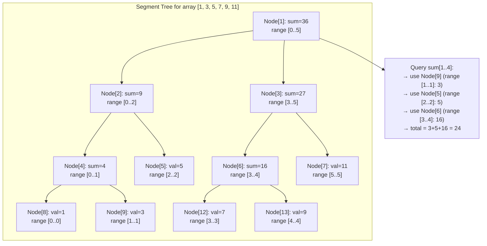

# POC: Segment Tree

**Level**: 🔴 Advanced

## What You'll Build

A complete segment tree implementation and a simpler Fenwick Tree (Binary Indexed Tree) alternative:

1. **Segment tree build** — O(N) bottom-up construction from an array
2. **Point update** — update a single element in O(log N)
3. **Range sum query** — sum of `array[l..r]` in O(log N)
4. **Fenwick Tree (BIT)** — simpler O(log N) alternative for prefix-sum queries

Real-world connection: **Time-series databases** like InfluxDB and TimescaleDB compute range aggregates (sum, min, max over a time window) using segment-tree-like structures. **Gaming leaderboards** use BITs to answer "how many players have a score between X and Y" in O(log N). **Apache Druid** (used by Netflix, Airbnb) uses interval trees (segment tree variant) for time-range queries over event data.

## 🗺️ Quick Overview



**Key property**: Any range query touches at most O(log N) nodes, because the tree has O(log N) levels and each level contributes at most 2 partial nodes.

## Problem 1: Build Segment Tree

Represent the array in a complete binary tree stored in a flat array. Node at index `i` has children at `2i` (left) and `2i+1` (right). Root is at index 1 (1-indexed, simpler math).

```
type SegTree:
  n:    int        // number of elements
  tree: int[]      // tree[1..4n], tree[1] is root

function build(arr):
  n = len(arr)
  tree = array of size 4 * n, filled with 0

  function build_rec(node, start, end):
    if start == end:
      // Leaf node: store array value
      tree[node] = arr[start]
      return

    mid = (start + end) / 2
    build_rec(2 * node,     start, mid)   // build left child
    build_rec(2 * node + 1, mid+1, end)   // build right child
    // Internal node: sum of both children
    tree[node] = tree[2 * node] + tree[2 * node + 1]

  build_rec(1, 0, n - 1)
  return SegTree{n: n, tree: tree}
```

### Tree structure for `arr = [1, 3, 5, 7, 9, 11]`

```
Build trace (bottom-up via recursion):

Leaves (single elements):
  tree[8]=arr[0]=1   range[0..0]
  tree[9]=arr[1]=3   range[1..1]
  tree[5]=arr[2]=5   range[2..2]
  tree[12]=arr[3]=7  range[3..3]
  tree[13]=arr[4]=9  range[4..4]
  tree[7]=arr[5]=11  range[5..5]

Internal nodes (sum of children):
  tree[4]=tree[8]+tree[9] = 1+3 = 4   range[0..1]
  tree[2]=tree[4]+tree[5] = 4+5 = 9   range[0..2]
  tree[6]=tree[12]+tree[13]=7+9=16    range[3..4]
  tree[3]=tree[6]+tree[7]=16+11=27    range[3..5]
  tree[1]=tree[2]+tree[3] = 9+27 = 36 range[0..5]

Array layout: [_, 36, 9, 27, 4, 5, 16, 11, 1, 3, _, _, 7, 9, _, _]
              (index 0 unused; _ = padding for non-power-of-2 sizes)
```

## Problem 2: Point Update

Change `arr[idx]` to a new value. Walk from the root to the leaf, update the leaf, then recompute all ancestor sums on the way back up.

```
function update(st, idx, new_val):
  function update_rec(node, start, end):
    if start == end:
      // Leaf: update to new value
      st.tree[node] = new_val
      return

    mid = (start + end) / 2
    if idx <= mid:
      update_rec(2 * node, start, mid)         // go left
    else:
      update_rec(2 * node + 1, mid + 1, end)   // go right

    // Recompute this node from updated children
    st.tree[node] = st.tree[2 * node] + st.tree[2 * node + 1]

  update_rec(1, 0, st.n - 1)
```

### Update trace: change `arr[1]` from 3 to 10

```
Call update_rec(node=1, start=0, end=5), idx=1
  idx=1 <= mid=2 → go left
  Call update_rec(node=2, start=0, end=2), idx=1
    idx=1 <= mid=1 → go left
    Call update_rec(node=4, start=0, end=1), idx=1
      idx=1 > mid=0 → go right
      Call update_rec(node=9, start=1, end=1), idx=1
        Leaf! tree[9] = 10 ← updated
      tree[4] = tree[8] + tree[9] = 1 + 10 = 11  ← recomputed
    tree[2] = tree[4] + tree[5] = 11 + 5 = 16    ← recomputed
  tree[1] = tree[2] + tree[3] = 16 + 27 = 43     ← recomputed

Only log₂(6) ≈ 3 nodes updated. Array of 10^6 elements: log₂(10^6) ≈ 20 updates.
```

## Problem 3: Range Sum Query

Sum all elements in `arr[l..r]`. At each node, three cases:
1. Node's range is fully inside [l, r] → return node's value
2. Node's range is fully outside [l, r] → return 0
3. Partial overlap → recurse into both children

```
function query(st, l, r):
  function query_rec(node, start, end):
    if r < start or end < l:
      // Case 1: range is completely outside [l, r]
      return 0

    if l <= start and end <= r:
      // Case 2: range is completely inside [l, r]
      return st.tree[node]

    // Case 3: partial overlap — split and recurse
    mid = (start + end) / 2
    left_sum  = query_rec(2 * node,     start, mid)
    right_sum = query_rec(2 * node + 1, mid+1, end)
    return left_sum + right_sum

  return query_rec(1, 0, st.n - 1)
```

### Query trace: sum of `arr[1..4]`

```
query(l=1, r=4) on arr=[1,3,5,7,9,11]

query_rec(node=1, range=[0..5]):
  Partial overlap [1..4] ∩ [0..5]
  Left: query_rec(node=2, range=[0..2]):
    Partial overlap [1..4] ∩ [0..2]
    Left: query_rec(node=4, range=[0..1]):
      Partial overlap [1..4] ∩ [0..1]
      Left: query_rec(node=8, range=[0..0]):
        4 < 0 is false, but 0 < 1=l → OUTSIDE → return 0
      Right: query_rec(node=9, range=[1..1]):
        1<=1 and 1<=4 → FULLY INSIDE → return tree[9]=3
      return 0 + 3 = 3
    Right: query_rec(node=5, range=[2..2]):
      1<=2 and 2<=4 → FULLY INSIDE → return tree[5]=5
    return 3 + 5 = 8
  Right: query_rec(node=3, range=[3..5]):
    Partial overlap [1..4] ∩ [3..5]
    Left: query_rec(node=6, range=[3..4]):
      1<=3 and 4<=4 → FULLY INSIDE → return tree[6]=16
    Right: query_rec(node=7, range=[5..5]):
      5 > 4=r → OUTSIDE → return 0
    return 16 + 0 = 16
  return 8 + 16 = 24 ✅

Cross-check: arr[1]+arr[2]+arr[3]+arr[4] = 3+5+7+9 = 24 ✓
Nodes visited: 8 (not 6=N) — O(log N) confirmed
```

## Problem 4: Fenwick Tree (Binary Indexed Tree)

The Fenwick Tree is a simpler alternative with the same O(log N) complexity. It's less flexible (no arbitrary range queries without modification) but has a much simpler implementation and better cache locality.

**Idea**: `tree[i]` stores the sum of a specific subarray. The subarray's length is determined by the position of the lowest set bit of `i` (written `i & (-i)`, called LSB).

```
type FenwickTree:
  n:    int
  tree: int[]   // 1-indexed

function fenwick_build(arr):
  n = len(arr)
  tree = array of size n + 1, filled with 0

  for i in 1..n+1:
    fenwick_update(tree, n, i, arr[i - 1])

  return FenwickTree{n: n, tree: tree}

// Add delta to index idx (1-indexed)
function fenwick_update(ft, idx, delta):
  while idx <= ft.n:
    ft.tree[idx] += delta
    idx += idx & (-idx)   // move to parent: add lowest set bit

// Prefix sum arr[1..idx] (1-indexed)
function fenwick_prefix_sum(ft, idx):
  total = 0
  while idx > 0:
    total += ft.tree[idx]
    idx -= idx & (-idx)   // move to predecessor: remove lowest set bit
  return total

// Range sum arr[l..r] (1-indexed)
function fenwick_range_sum(ft, l, r):
  return fenwick_prefix_sum(ft, r) - fenwick_prefix_sum(ft, l - 1)
```

### Fenwick Tree structure for `arr = [1, 3, 5, 7, 9, 11]`

```
i:        1  2  3  4  5  6
Binary:   1 10 11 100 101 110
LSB:      1  2  1   4   1   2
tree[i] covers arr[i-LSB+1..i]:
  tree[1] = arr[1]           = 1   (covers 1 element)
  tree[2] = arr[1]+arr[2]    = 4   (covers 2 elements)
  tree[3] = arr[3]           = 5   (covers 1 element)
  tree[4] = arr[1..4]        = 16  (covers 4 elements)
  tree[5] = arr[5]           = 9   (covers 1 element)
  tree[6] = arr[5]+arr[6]    = 20  (covers 2 elements)

Query prefix_sum(5) = sum arr[1..5]:
  idx=5 (binary 101): total += tree[5]=9;  idx -= 1 → idx=4
  idx=4 (binary 100): total += tree[4]=16; idx -= 4 → idx=0
  total = 9 + 16 = 25 ✅ (1+3+5+7+9=25)
  Visited 2 nodes (log₂(5) ≈ 2.3)

Update idx=2, add 7 (value changes from 3 to 10):
  idx=2 (binary 10): tree[2] += 7; idx += 2 → idx=4
  idx=4 (binary 100): tree[4] += 7; idx += 4 → idx=8 > n → stop
  Updated 2 nodes ✅
```

## Segment Tree vs Fenwick Tree

| Feature | Segment Tree | Fenwick Tree |
|---------|-------------|--------------|
| Range sum query | O(log N) | O(log N) |
| Point update | O(log N) | O(log N) |
| Range update | O(log N) with lazy | O(log N) with difference array |
| Min/Max query | O(log N) | Not directly supported |
| Code complexity | ~50 lines | ~15 lines |
| Cache performance | Moderate | Better (array-based) |
| Memory | 4N nodes | N nodes |
| Lazy propagation | Supported | Not native |

**Rule of thumb**: Use Fenwick for prefix-sum problems. Use Segment Tree when you need range min/max, arbitrary range functions, or lazy propagation (range updates).

## Complexity Summary

| Operation | Array (naive) | Segment Tree | Fenwick Tree |
|-----------|---------------|-------------|--------------|
| Build | O(N) | O(N) | O(N log N) |
| Point update | O(1) | O(log N) | O(log N) |
| Range query | O(N) | O(log N) | O(log N) |
| Range update | O(N) | O(log N) w/ lazy | O(log N) w/ diff |
| Space | O(N) | O(4N) | O(N) |

## Key Learnings

**Why 4N for segment tree storage?**
- A segment tree for N elements has at most 2×(next power of 2 ≥ N) - 1 nodes.
- Worst case: N=5, next power of 2 is 8, so up to 15 nodes — but we use up to 4N as a safe upper bound for the flat array (children of node at index k are 2k and 2k+1, so you need indices up to ~4N).
- Alternative: allocate exactly 2×(next power of 2) to be memory-efficient.

**The LSB trick in Fenwick trees**
- `i & (-i)` extracts the lowest set bit of i (e.g., 6=110 → 6&(-6)=2=010).
- **Update** walks upward: `i += LSB(i)` → each step moves to the next responsible parent.
- **Query** walks downward: `i -= LSB(i)` → each step peels off the last covered block.
- This gives a beautifully implicit tree structure with no explicit parent/child pointers.

**Lazy propagation (for range updates)**
- If you need to add a value to all elements in [l, r] and then query sums, point updates become O(N log N) per range — too slow.
- Lazy propagation: mark nodes with a "pending" update, only push it down when the node is accessed.
- Each range update and query stays O(log N) even with lazy marks.
- This is the pattern behind "range add, range sum" problems in competitive programming.

**Real-world: time-series aggregates**
- InfluxDB stores time-series data in time-ordered chunks. Range aggregate queries (sum, min, max over a time window) use segment-tree-like index structures per chunk.
- The challenge: data arrives out of order (late writes). The tree must support efficient insert + query — segment trees handle this better than simple arrays.

**Real-world: leaderboard rank queries**
- "What rank is player X?" and "Who are the players ranked 100th–200th?" are range queries.
- Fenwick trees over a score-indexed array: `tree[score]` = number of players with that score.
- `fenwick_prefix_sum(score)` = how many players have score ≤ score → gives rank in O(log N).
- Update when a player's score changes: `fenwick_update(old_score, -1); fenwick_update(new_score, +1)`.

**Apache Druid's interval indexing**
- Druid partitions data into time segments and uses a segment tree-like structure to answer "which segments overlap with this time range?"
- Each node stores the maximum right endpoint in its subtree — allows early pruning of non-overlapping segments.
- This is the interval tree variant of segment trees, used for overlap queries rather than sum queries.
