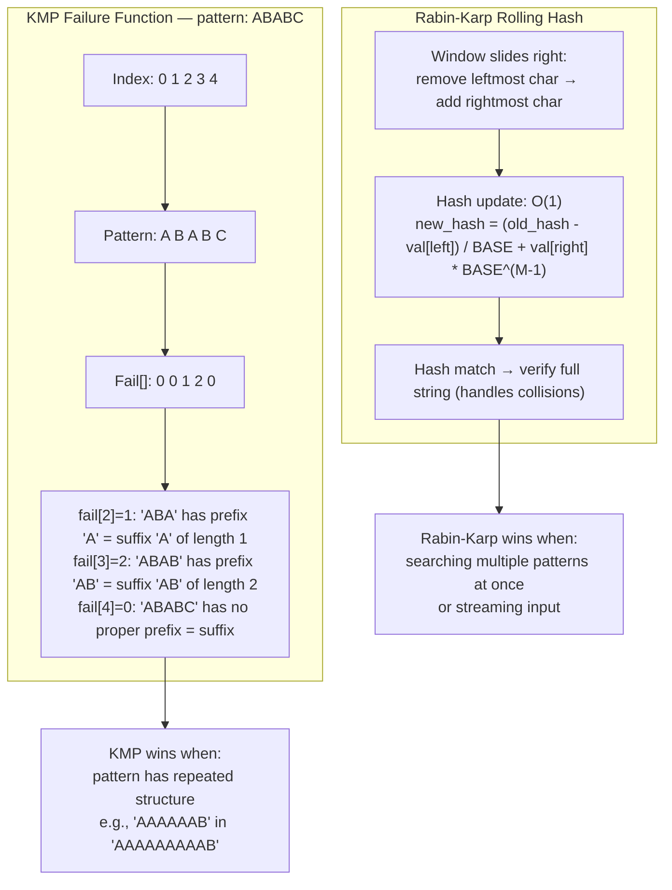

# POC: String Search (KMP & Rabin-Karp)

**Level**: 🔴 Advanced

## What You'll Build

Three implementations that progress from naive to production-grade pattern matching:

1. **Naive search** — O(N×M) baseline to understand the problem
2. **KMP (Knuth-Morris-Pratt)** — O(N+M) using a failure function to skip redundant comparisons
3. **Rabin-Karp rolling hash** — O(N+M) average using hash comparison, with O(1) hash updates
4. **Anagram search** — sliding window with character frequency map

Real-world connection: **`grep`** uses a Boyer-Moore variant (similar idea to KMP: precomputed skip tables). **GitHub code search** uses inverted indexes plus KMP-style matching to search patterns across billions of lines of code. **PostgreSQL** `LIKE '%pattern%'` uses a simplified version of Boyer-Moore for substring search.

## 🗺️ Quick Overview



## The Naive Approach (Baseline)

Before optimizing, understand what we're improving. For each starting position in text, try to match the full pattern.

```
function naive_search(text, pattern):
  n = len(text)
  m = len(pattern)
  matches = []

  for i in 0..n - m + 1:
    match = true
    for j in 0..m:
      if text[i + j] != pattern[j]:
        match = false
        break
    if match:
      matches.append(i)

  return matches

// Complexity: O(N × M)
// Worst case: text="AAAAAAB", pattern="AAAB"
// At every position, we match AAA before failing on the 4th char.
// N=1000, M=4 → up to 4000 comparisons. N=10^6 → 4×10^6 comparisons.
```

### Why naive is slow

```
Text:    A A A A A A A B
Pattern: A A A A B
         i=0: A A A A ≠B → fail at j=4, advance i by 1

         A A A A A A A B
           i=1: A A A A ≠B → fail at j=4

The problem: after failing at j=4, we threw away info.
We already know text[1..3] = "AAA" — we don't need to rematch it!
KMP exploits this: jump i forward more than 1 step.
```

## Problem 1: KMP (Knuth-Morris-Pratt)

KMP precomputes a **failure function** (also called the partial match table or LPS — Longest Proper Prefix that is also a Suffix). This tells us: if the match fails at position j in the pattern, how far back should we reset j (without moving i)?

### Step 1: Build the failure function

```
function build_failure(pattern):
  m = len(pattern)
  fail = array of size m, filled with 0
  // fail[0] is always 0 (no proper prefix for single char)

  len = 0   // length of current longest prefix-suffix
  i = 1

  while i < m:
    if pattern[i] == pattern[len]:
      // Characters match: extend the current prefix-suffix
      len += 1
      fail[i] = len
      i += 1
    else:
      if len != 0:
        // Try a shorter prefix-suffix — use fail[] to skip
        // (don't advance i — retry with smaller len)
        len = fail[len - 1]
      else:
        // No prefix-suffix of any length works
        fail[i] = 0
        i += 1

  return fail
```

### Building failure function step by step

```
Pattern: A B A B C A B
Index:   0 1 2 3 4 5 6

i=1, len=0: pattern[1]='B' != pattern[0]='A' → fail[1]=0, i=2
i=2, len=0: pattern[2]='A' == pattern[0]='A' → len=1, fail[2]=1, i=3
i=3, len=1: pattern[3]='B' == pattern[1]='B' → len=2, fail[3]=2, i=4
i=4, len=2: pattern[4]='C' != pattern[2]='A'
  len = fail[1] = 0
  len=0: pattern[4]='C' != pattern[0]='A' → fail[4]=0, i=5
i=5, len=0: pattern[5]='A' == pattern[0]='A' → len=1, fail[5]=1, i=6
i=6, len=1: pattern[6]='B' == pattern[1]='B' → len=2, fail[6]=2

fail[] = [0, 0, 1, 2, 0, 1, 2]

Meaning:
  fail[3]=2 → "ABAB": the prefix "AB" also appears as a suffix "AB"
  If match fails at pattern[4] (='C'), reset j to 2 (keep the "AB" match)
```

### Step 2: KMP Search

```
function kmp_search(text, pattern):
  n = len(text)
  m = len(pattern)
  fail = build_failure(pattern)
  matches = []

  j = 0   // index into pattern

  for i in 0..n:
    // Advance j while text[i] matches pattern[j]
    while j > 0 and text[i] != pattern[j]:
      // Mismatch: don't start over, use failure function
      j = fail[j - 1]   // jump back to longest valid prefix

    if text[i] == pattern[j]:
      j += 1

    if j == m:
      // Full match found at text[i - m + 1]
      matches.append(i - m + 1)
      // Continue search: reset j to allow overlapping matches
      j = fail[j - 1]

  return matches

// Complexity: O(N + M)
// i never decrements, so text is scanned in one pass.
// j can retreat via fail[], but total j movements ≤ N.
```

### KMP search trace

```
Text:    A A B A A B A A B C
Pattern: A A B A A B C
fail[]:  0 1 0 1 2 3 0

i=0,j=0: text[0]='A'==pattern[0]='A' → j=1
i=1,j=1: text[1]='A'==pattern[1]='A' → j=2
i=2,j=2: text[2]='B'==pattern[2]='B' → j=3
i=3,j=3: text[3]='A'==pattern[3]='A' → j=4
i=4,j=4: text[4]='A'==pattern[4]='A' → j=5
i=5,j=5: text[5]='B'==pattern[5]='B' → j=6
i=6,j=6: text[6]='A' != pattern[6]='C'
  j = fail[5] = 3  ← key: don't restart, keep "AAB" match
  text[6]='A'==pattern[3]='A' → j=4
i=7,j=4: text[7]='A'==pattern[4]='A' → j=5
i=8,j=5: text[8]='B'==pattern[5]='B' → j=6
i=9,j=6: text[9]='C'==pattern[6]='C' → j=7
j==7==m → match at position i-m+1 = 9-7+1 = 3 ✅
```

Without KMP, failing at i=6 would reset to i=1 (restart from scratch). KMP only resets j, keeping i at 6.

## Problem 2: Rabin-Karp Rolling Hash

Instead of comparing characters one by one, Rabin-Karp hashes windows of text and compares hashes. The key: **rolling hash** — updating the hash as the window slides costs O(1), not O(M).

### Hash design

```
For window of length M, starting at position i:
  hash = text[i] * BASE^(M-1)
       + text[i+1] * BASE^(M-2)
       + ...
       + text[i+M-1] * BASE^0
  (all mod MOD to keep numbers small)

Rolling update — slide window from i to i+1:
  Remove text[i]:   subtract text[i] * BASE^(M-1)
  Shift left:       multiply by BASE
  Add text[i+M]:    add text[i+M]

new_hash = (old_hash - char_val(text[i]) * BASE^(M-1)) * BASE + char_val(text[i+M])
new_hash = new_hash mod MOD
```

```
function rabin_karp(text, pattern):
  n = len(text)
  m = len(pattern)
  BASE = 31          // prime, larger than alphabet size
  MOD  = 10^9 + 7   // large prime to reduce collisions

  // Precompute BASE^(M-1) mod MOD
  power = 1
  for _ in 0..m-1:
    power = (power * BASE) mod MOD

  // Compute hash of pattern and first window of text
  pattern_hash = 0
  window_hash  = 0
  for i in 0..m:
    pattern_hash = (pattern_hash * BASE + char_val(pattern[i])) mod MOD
    window_hash  = (window_hash  * BASE + char_val(text[i]))    mod MOD

  matches = []

  for i in 0..n - m + 1:
    // Hash match: verify to rule out false positives (hash collisions)
    if window_hash == pattern_hash:
      if text[i..i+m] == pattern:   // O(M) verification
        matches.append(i)

    // Slide window: O(1) rolling hash update
    if i < n - m:
      window_hash = (window_hash - char_val(text[i]) * power) mod MOD
      window_hash = (window_hash * BASE + char_val(text[i + m])) mod MOD
      window_hash = (window_hash + MOD) mod MOD   // ensure positive

  return matches

function char_val(c):
  return ord(c) - ord('a') + 1   // 'a'=1, 'b'=2, ..., 'z'=26
```

### Rolling hash walkthrough

```
text="abcabc", pattern="abc", BASE=31, (simplified, ignoring MOD)

char_val: a=1, b=2, c=3

pattern_hash = 1*31^2 + 2*31 + 3 = 961 + 62 + 3 = 1026

Window [0..2] = "abc":
  hash = 1*961 + 2*31 + 3 = 1026 → matches pattern_hash!
  Verify "abc"=="abc" → match at 0 ✅

Slide to window [1..3] = "bca":
  Remove 'a' (leftmost): 1026 - 1*961 = 65
  Shift:   65 * 31 = 2015
  Add 'a' (new rightmost, text[3]='a'): 2015 + 1 = 2016
  hash = 2016 ≠ 1026 → skip (no verification needed)

Slide to window [2..4] = "cab":
  Remove 'b': 2016 - 2*961 = 94
  Shift: 94 * 31 = 2914
  Add 'b' (text[4]='b'): 2914 + 2 = 2916
  hash ≠ 1026 → skip

Slide to window [3..5] = "abc":
  Remove 'c': 2916 - 3*961 = 33
  Shift: 33 * 31 = 1023
  Add 'c' (text[5]='c'): 1023 + 3 = 1026
  hash = 1026 → matches pattern_hash!
  Verify "abc"=="abc" → match at 3 ✅
```

### Why Rabin-Karp shines: multiple pattern search

For K patterns, compute all K hashes upfront and store in a set. Each window hash lookup is O(1), making total complexity O(N + K×M). This is how plagiarism detection works — searching for hundreds of known phrases simultaneously.

```
function rabin_karp_multi(text, patterns):
  pattern_hashes = {}
  for p in patterns:
    h = compute_hash(p)
    pattern_hashes[h] = p   // hash → pattern

  m = len(patterns[0])   // assume all patterns same length
  window_hash = compute_hash(text[0..m])

  for i in 0..len(text) - m + 1:
    if window_hash in pattern_hashes:
      if text[i..i+m] == pattern_hashes[window_hash]:
        record_match(i, pattern_hashes[window_hash])

    roll_hash(window_hash, text, i, m)
```

## Problem 3: Anagram Search (Sliding Window)

Find all start indices where an anagram of pattern appears in text. An anagram has the same character frequency — no rolling hash needed, just a sliding frequency window.

```
function find_anagrams(text, pattern):
  n = len(text)
  m = len(pattern)
  matches = []

  // Count character frequencies in pattern
  pattern_count = array of 26 zeros
  window_count  = array of 26 zeros

  for c in pattern:
    pattern_count[ord(c) - ord('a')] += 1

  // Initialize first window
  for i in 0..m:
    window_count[ord(text[i]) - ord('a')] += 1

  if window_count == pattern_count:
    matches.append(0)

  // Slide window
  for i in m..n:
    // Add new right character
    window_count[ord(text[i]) - ord('a')] += 1
    // Remove old left character
    window_count[ord(text[i - m]) - ord('a')] -= 1

    if window_count == pattern_count:
      matches.append(i - m + 1)

  return matches
```

Comparing two 26-element arrays is O(26) = O(1), so overall complexity is O(N).

## Complexity Comparison

| Algorithm | Preprocessing | Search | Space | Best for |
|-----------|--------------|--------|-------|----------|
| Naive | O(1) | O(N×M) | O(1) | Short patterns, one-off searches |
| KMP | O(M) | O(N) | O(M) | Single pattern, text scanned once |
| Rabin-Karp | O(M) | O(N) average, O(N×M) worst | O(1) | Multiple patterns, streaming |
| Anagram | O(M) | O(N) | O(1) | Fixed-length permutation search |
| Boyer-Moore | O(M+∑) | O(N/M) best | O(∑) | Long patterns in large text (e.g., grep) |

## Key Learnings

**Why KMP achieves O(N+M)**
- The text pointer `i` only moves forward, never back. That's O(N) text traversal.
- The pattern pointer `j` can retreat, but total retreats ≤ total advances ≤ N. That's O(N) for j movements.
- Total: O(N) + O(M) for building failure function = O(N+M).

**The failure function is a self-match**
- `build_failure(pattern)` essentially runs KMP on the pattern against itself.
- `fail[i]` = length of the longest prefix of `pattern[0..i]` that is also a suffix of `pattern[0..i]` (not counting the whole string).
- This tells you: if you've matched `j` characters and then fail, you know the last `fail[j-1]` characters are still valid (they match the start of the pattern).

**Rolling hash: why `+ MOD) mod MOD`**
- The subtraction step can produce a negative number in languages without unsigned arithmetic.
- Adding MOD before taking mod ensures the result is always non-negative.
- Choosing a large prime MOD (~10^9) keeps collision probability at ~1/MOD per window — negligible for typical inputs.

**When hash collisions occur in Rabin-Karp**
- Worst case O(N×M): every window has the same hash as pattern but doesn't match.
- In practice, this is astronomically unlikely with a good MOD choice.
- Use double hashing (two independent (BASE, MOD) pairs) to reduce collision probability to ~1/10^18 — good enough for competitive programming or production.

**Real-world: how grep works**
- GNU grep uses Boyer-Moore as its primary algorithm (skip table allows jumping M characters at a time)
- Falls back to KMP for small patterns or patterns with many repeated characters
- For fixed strings without regex, uses Aho-Corasick (multi-pattern KMP) to search many patterns simultaneously in one pass

**Real-world: GitHub code search**
- Inverted index: maps token → list of files/positions
- For exact string search, uses n-gram indexing: break text into overlapping 3-char windows, store in index
- At query time: find candidate files via n-gram index, then verify with KMP/Boyer-Moore
- This two-phase approach handles billions of lines: index lookup is O(1), verification runs only on small candidate set
