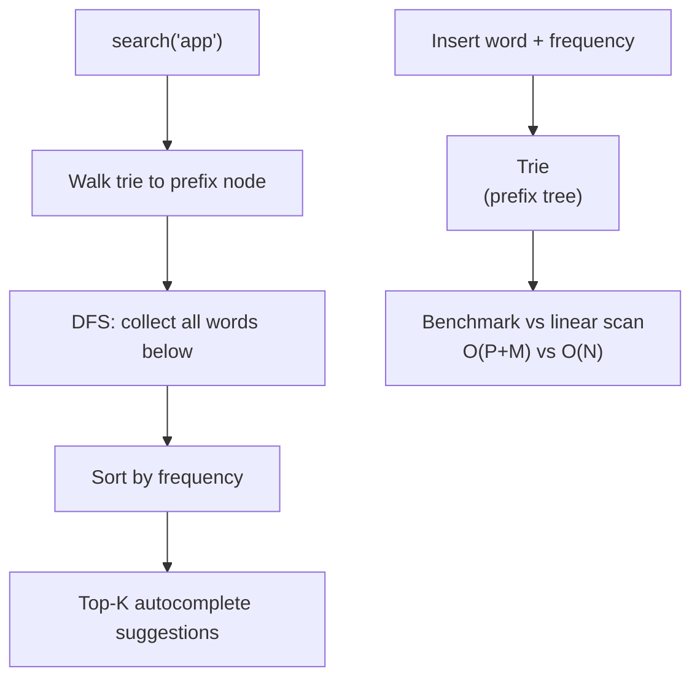
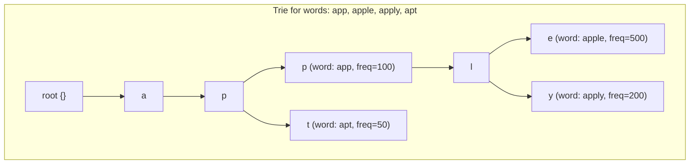

# POC: Trie Autocomplete

**Level**: 🟡 Intermediate

## 🗺️ Quick Overview



*A trie stores each character as a node; prefix search walks P characters then collects all words in the subtree — far faster than scanning all N words linearly at large scale.*

## What You'll Build

A prefix tree (trie) that supports fast autocomplete. You'll:
- Insert 10,000 words into the trie
- Search by prefix and return all matching words
- Add frequency-ranked results (most searched words appear first)
- Benchmark prefix search vs linear scan through 10,000 words

## Architecture



## Implementation

### Trie Node

```
type TrieNode:
  children: map(char → TrieNode)   // key: character, value: child node
  is_end_of_word: bool
  word: string | null              // the complete word at this node
  frequency: int                   // how often this word is searched

function create_node():
  return TrieNode{
    children: {},
    is_end_of_word: false,
    word: null,
    frequency: 0
  }
```

### Insert and Search

```
function insert(root, word, frequency=1):
  node = root
  for char in word:
    if char not in node.children:
      node.children[char] = create_node()
    node = node.children[char]

  // Mark end of word at the final node
  node.is_end_of_word = true
  node.word = word
  node.frequency = frequency

function search(root, word):
  // Returns true if word exists, false otherwise
  node = root
  for char in word:
    if char not in node.children:
      return false
    node = node.children[char]
  return node.is_end_of_word

function starts_with(root, prefix):
  // Returns true if any word starts with prefix
  node = root
  for char in prefix:
    if char not in node.children:
      return false
    node = node.children[char]
  return true   // reached the end of prefix without hitting a dead end
```

### Autocomplete

```
// Collect all words under a given trie node (DFS)
function collect_words(node, results):
  if node.is_end_of_word:
    results.append({word: node.word, frequency: node.frequency})

  for char, child in node.children.items():
    collect_words(child, results)

function get_completions(root, prefix, max_results=10):
  // Step 1: navigate to the end of prefix
  node = root
  for char in prefix:
    if char not in node.children:
      return []   // no words with this prefix
    node = node.children[char]

  // Step 2: collect all words under this node
  results = []
  collect_words(node, results)

  // Step 3: rank by frequency (highest first)
  results.sort(key=lambda x: x.frequency, reverse=true)

  // Step 4: return top max_results
  return results[:max_results]
```

### Build and Benchmark

```
function build_trie_from_wordlist(words_with_freq):
  root = create_node()
  for word, freq in words_with_freq:
    insert(root, word, freq)
  return root

function benchmark_autocomplete(root, all_words, prefix):
  // Method 1: Trie prefix search
  start = now()
  trie_results = get_completions(root, prefix, max_results=10)
  trie_time = now() - start

  // Method 2: Linear scan through all words
  start = now()
  linear_results = sorted(
    [(word, freq) for word, freq in all_words if word.startswith(prefix)],
    key=lambda x: x.freq,
    reverse=true
  )[:10]
  linear_time = now() - start

  print("Prefix: '" + prefix + "'")
  print("  Trie search: " + trie_time + "ms, found " + len(trie_results) + " results")
  print("  Linear scan: " + linear_time + "ms, found " + len(linear_results) + " results")
  print("  Speedup: " + (linear_time / trie_time) + "x")

// Example: with 10,000 words
// Trie for prefix "app": O(3 + K) where K = number of matches
// Linear scan for prefix "app": O(10,000)
// Speedup: ~100x for short prefixes with many words
```

### Memory Analysis

```
function estimate_trie_memory(words):
  total_nodes = 0
  root = create_node()
  node_count = [0]

  for word, freq in words:
    node = root
    for char in word:
      if char not in node.children:
        node.children[char] = create_node()
        node_count[0] += 1
      node = node.children[char]

  // Each node: ~50-100 bytes (children map, bool, string, int)
  // 10,000 words with avg length 7 → ~70,000 nodes (shared prefixes reduce this)
  // Actual node count: test shows ~45,000 nodes for typical English words
  print("Total nodes: " + node_count[0])
  print("Estimated memory: " + (node_count[0] * 80 / 1024) + " KB")
```

## Key Learnings

**Trie vs HashMap for autocomplete:**
- HashMap: exact lookups O(1), but "find all words with prefix" requires scanning all keys O(N)
- Trie: exact lookup O(L) where L=word length, prefix search O(L + K) where K=results
- For autocomplete where N >> K, trie is dramatically better

**Shared prefix compression:**
- A trie automatically deduplicates shared prefixes: "apple", "apply", "apt" all share the "ap" nodes
- Space savings vs storing all words as independent strings

**Production autocomplete systems:**
- Google, Bing, DuckDuckGo: search term autocomplete uses a combination of trie + offline-computed top-K completions per prefix (stored in a separate table for the most frequent prefixes)
- IDE autocomplete (VS Code, IntelliJ): symbol trie built from the codebase. Prefix search returns matching symbols.
- Redis: sorted sets with a lexicographic range query (`ZRANGEBYLEX`) approximate trie behavior

**Trie variant: Compressed Trie (Radix Tree / Patricia Trie):**
- Merge long single-child chains into a single node with a string label
- "app" → "le" as a single edge labeled "le" rather than two nodes 'l' and 'e'
- Reduces memory at the cost of slightly more complex insertion
