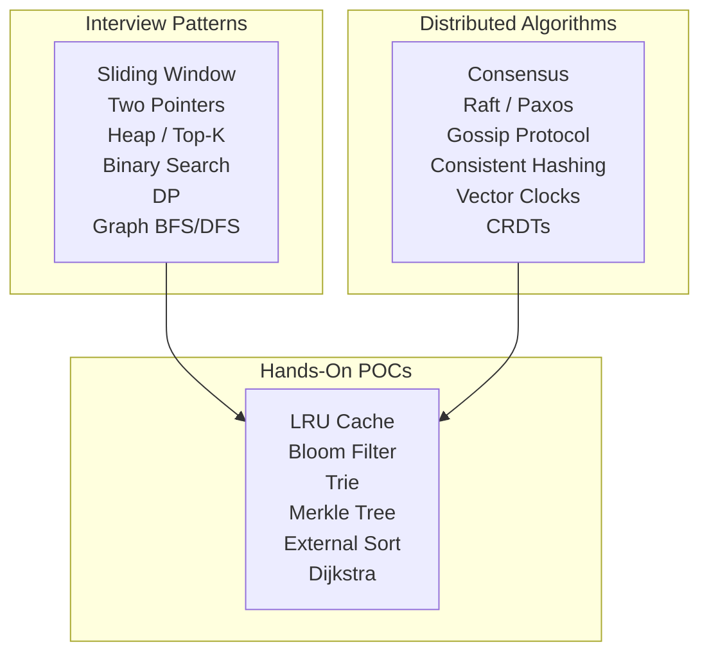

# Algorithms & Data Structures

Algorithm knowledge that matters for system design interviews and real distributed systems — from interview patterns to algorithms that power production infrastructure.

## Sections

### [🎯 Interview Patterns](interview-patterns)
Data structure and algorithm patterns for coding interviews at FAANG companies. Sliding window, two pointers, dynamic programming, graph traversal, and more.

### [⚙️ Distributed Algorithms](distributed)
Algorithms used inside real distributed systems: consensus (Raft, Paxos), consistent hashing, vector clocks, CRDTs, gossip protocols, and more.

### [🔬 Hands-On POCs](hands-on)
Runnable implementations to build intuition: LRU cache, bloom filter, trie, segment tree, and more.

## Navigate by Role

| I am... | Start here | Goal |
|---------|-----------|------|
| 🟢 Junior | [Binary Search](./concepts/binary-search) | Understand core algorithm patterns for interviews |
| 🟡 Mid-level | [interview-patterns section](./interview-patterns) | Master patterns that appear in system design interviews |
| 🔴 Senior / TL | [distributed section](./distributed) | Understand distributed algorithms: Raft, consistent hashing, CRDTs |
| 🏆 Interview prepping | [interview-patterns section](./interview-patterns) | Algorithm patterns asked in FAANG system design rounds |

## Topic Map

| Topic | 📖 Concepts | 🎯 Interview Patterns | ⚙️ Distributed | 🔬 Hands-On |
|-------|------------|----------------------|---------------|------------|
| Binary Search | [Binary Search](./concepts/binary-search) | [Binary Search on Answer](./interview-patterns/binary-search-on-answer) | — | — |
| Heap / Priority Queue | [Heap & Priority Queue](./concepts/heap-priority-queue) | [Heap / Top-K](./interview-patterns/heap-top-k-pattern) | — | — |
| LRU / LFU Cache | [LRU / LFU Cache](./concepts/lru-lfu-cache) | — | — | [POC: LRU Cache](./hands-on/lru-cache-poc) |
| Bloom Filter | [Bloom Filter](./concepts/bloom-filter) | — | — | [POC: Bloom Filter](./hands-on/bloom-filter-poc) |
| Trie | [Trie / Prefix Tree](./concepts/trie-prefix-tree) | — | — | [POC: Trie Autocomplete](./hands-on/trie-autocomplete-poc) |
| Consistent Hashing | [Consistent Hashing](./concepts/consistent-hashing-deep-dive) | — | [Consistent Hashing with Virtual Nodes](./distributed/consistent-hashing-with-virtual-nodes) | [POC: Consistent Hashing Ring](./hands-on/consistent-hashing-poc) |
| Merkle Tree | [Merkle Tree](./concepts/merkle-tree) | — | — | — |
| Graph BFS/DFS | — | [Graph BFS & DFS](./interview-patterns/graph-bfs-dfs-pattern) | — | [POC: Graph Shortest Path](./hands-on/graph-shortest-path-poc) |
| Dynamic Programming | — | [Dynamic Programming](./interview-patterns/dynamic-programming-patterns) | — | — |
| Sliding Window | — | [Sliding Window](./interview-patterns/sliding-window-pattern) | — | — |
| Segment Tree | — | [Segment Tree & Fenwick Tree](./interview-patterns/segment-tree-pattern) | — | [POC: Segment Tree](./hands-on/segment-tree-poc) |
| String Search | — | [String Search Algorithms](./interview-patterns/string-algorithms) | — | [POC: String Search (KMP & Rabin-Karp)](./hands-on/string-search-poc) |
| Backtracking | — | [Backtracking](./interview-patterns/backtracking-pattern) | — | [POC: Backtracking](./hands-on/backtracking-poc) |
| Gossip Protocol | — | — | [Gossip Protocol](./distributed/gossip-protocol) | — |
| Raft Consensus | — | — | [Raft Consensus](./distributed/raft-consensus) | — |
| CRDTs | — | — | [CRDTs — Conflict-Free Data Types](./distributed/crdt-conflict-free-data-types) | — |
| Vector Clocks | — | — | [Vector Clocks](./distributed/vector-clocks) | — |
| External Sorting | — | — | [External Sorting](./distributed/external-sorting) | [POC: External Sort](./hands-on/external-sort-poc) |
