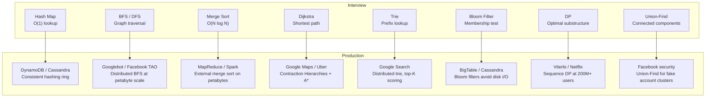

# Algorithms in Production — From Interview to Real Systems

**Level**: 🟡 Intermediate

## 🗺️ Quick Overview



*Every algorithm you memorize for interviews is running right now at a company you use every day — wrapped in distribution, fault tolerance, and approximation.*

> Interview algorithms feel abstract until you realize Dijkstra is answering your Maps query right now, Bloom filters are saving Google BigTable 30% of disk reads, and the DP you coded last night powers Google's speech-to-text. This article closes the gap.

---

## The Interview-Production Gap

Interview problems are clean by design:
- Single machine, plenty of RAM
- Input fits in an array
- Output is a single number or sorted list
- No failures, no retries, no concurrent writers

Production systems are the opposite:
- Data is distributed across hundreds of machines
- RAM is 256 GB per machine but the dataset is 100 TB
- Queries come from millions of concurrent users
- Machines fail mid-computation routinely

The same algorithm that solves the interview problem is at the core of every production system. The production system is just the scaffolding around it — sharding, replication, fault-tolerance, approximation.

Understanding both layers makes you a stronger engineer and a far more compelling interview candidate.

---

## Algorithm → Production System Mappings

### Hash Tables → Distributed Hash Tables

**The interview version**

```python
# O(1) average lookup, insert, delete
cache = {}
cache["user:123"] = {"name": "Alice", "age": 30}
value = cache.get("user:123")   # O(1)
```

**The production version**

Amazon DynamoDB and Apache Cassandra store hundreds of terabytes of data across hundreds of nodes. Every node owns a range of the hash space. When you write `PUT user:123`, the system hashes the key and routes the write to the node(s) responsible for that hash range.

```
// Consistent hashing ring (simplified)
function get_node(key, ring):
  hash_val = md5(key) % 360         // position on ring
  // find first node clockwise from hash_val
  for node in sorted(ring.nodes):
    if node.position >= hash_val:
      return node
  return ring.nodes[0]              // wrap around
```

**The twist**: in a HashMap, a hash collision means two keys land in the same bucket — handled with chaining. In a distributed hash table, a "collision" means two nodes claim the same range, or a node fails and its range must be redistributed. The algorithm is the same; the failure modes are distributed.

**Scale**: DynamoDB handles 89 million requests per second at peak (Amazon Prime Day 2023). The consistent hashing ring enables adding/removing nodes with minimal key redistribution — only K/N keys move when a node joins (K = total keys, N = number of nodes), not K/2 as with naive modulo hashing.

---

### BFS / DFS → Web Crawlers and Social Graph Traversal

**The interview version**

```python
# BFS: find shortest path from src to dst in a graph
from collections import deque

def bfs(graph, src, dst):
    visited = set([src])
    queue = deque([(src, [src])])
    while queue:
        node, path = queue.popleft()
        if node == dst:
            return path
        for neighbor in graph[node]:
            if neighbor not in visited:
                visited.add(neighbor)
                queue.append((neighbor, path + [neighbor]))
    return None
```

**The production version — Googlebot**

Google's web crawler must traverse ~100 billion pages. A single-machine BFS queue would never fit in RAM.

The distributed BFS works as follows:
- URLs are hashed and assigned to one of thousands of crawl servers
- Each server maintains its own local BFS frontier (a deque)
- When a server encounters a URL belonging to a different server's hash range, it sends it to that server's frontier queue
- A global "visited" set is stored in a distributed key-value store (like BigTable) to avoid re-crawling

**The twist**: in a single-machine BFS, `visited` is a hash set with O(1) lookup. At 100 billion URLs, that set requires ~1 TB of memory. Google uses a combination of Bloom filters (probabilistic, 8 bits per URL) and sharded hash tables to make "have we seen this URL?" fit in distributed RAM.

**Facebook TAO**: Facebook's social graph has 3+ trillion edges (friendships, likes, comments). TAO is a distributed graph store that handles BFS traversal queries like "friends of friends" across 800 million active users daily. BFS is parallelized: each hop fans out to multiple shards simultaneously, results are merged, and the next hop is dispatched.

---

### Sorting → External Sort and Distributed MapReduce

**The interview version**

```python
# Merge sort: O(N log N) time, O(N) space
def merge_sort(arr):
    if len(arr) <= 1:
        return arr
    mid = len(arr) // 2
    left = merge_sort(arr[:mid])
    right = merge_sort(arr[mid:])
    return merge(left, right)

def merge(left, right):
    result = []
    i = j = 0
    while i < len(left) and j < len(right):
        if left[i] <= right[j]: result.append(left[i]); i += 1
        else:                    result.append(right[j]); j += 1
    return result + left[i:] + right[j:]
```

**The production version — Google MapReduce**

Google's original MapReduce paper (2004) described sorting petabytes of log data. The data cannot fit in RAM. The solution is a distributed external merge sort:

```
Phase 1 — Map:
  Each mapper reads a chunk of input from GFS (Google File System)
  Sorts its chunk in RAM (fits because each chunk is small)
  Writes sorted intermediate files partitioned by key range
  (keys A-F go to partition 0, G-M to partition 1, etc.)

Phase 2 — Shuffle:
  All intermediate files for partition X are copied to reducer X
  This is the most expensive phase: network I/O across the cluster

Phase 3 — Reduce:
  Each reducer performs an N-way merge of its sorted intermediate files
  (identical to the merge step in merge sort, but across files on disk)
  Writes the final sorted output
```

The core algorithm is the same merge step from merge sort. The distributed machinery handles:
- Parallelizing across thousands of machines
- Fault tolerance (re-running failed map/reduce tasks)
- Moving data across the network efficiently (the "shuffle")

**Scale**: Google's TeraSort benchmark sorted 1 TB in 68 seconds using 1,000 machines (2008). Each machine ran merge sort on its partition; the cluster-level sort was distributed merge. Apache Spark and Hadoop MapReduce are direct descendants.

---

### Dynamic Programming → ML Sequence Models and Recommendations

**The interview version**

```python
# Longest Common Subsequence: classic 2D DP
def lcs(s1, s2):
    m, n = len(s1), len(s2)
    dp = [[0] * (n + 1) for _ in range(m + 1)]
    for i in range(1, m + 1):
        for j in range(1, n + 1):
            if s1[i-1] == s2[j-1]:
                dp[i][j] = dp[i-1][j-1] + 1
            else:
                dp[i][j] = max(dp[i-1][j], dp[i][j-1])
    return dp[m][n]
```

**The production version — Viterbi Algorithm**

The Viterbi algorithm is DP on a sequence of states. It finds the most probable sequence of hidden states given a sequence of observations — the same optimal substructure as LCS, applied to probabilities.

Applications:
- **Google speech-to-text**: each spoken phoneme is an observation; the hidden states are words. Viterbi finds the most probable word sequence. Running at hundreds of millions of voice queries per day.
- **DNA sequencing**: hidden states are base pairs, observations are fluorescence signals. Illumina sequencers process millions of reads per run.
- **Auto-correct / spell check**: hidden states are intended words, observations are typed characters including typos.

```
// Viterbi: DP on HMM (Hidden Markov Model)
// dp[t][s] = probability of the most likely path ending in state s at time t
function viterbi(observations, states, initial_prob, transition_prob, emission_prob):
  T = len(observations)
  dp = [[0] * len(states) for _ in range(T)]
  backtrack = [[0] * len(states) for _ in range(T)]

  // Initialize
  for s in states:
    dp[0][s] = initial_prob[s] * emission_prob[s][observations[0]]

  // Fill — identical structure to standard DP
  for t in range(1, T):
    for s in states:
      best_prev = max(dp[t-1][prev] * transition_prob[prev][s] for prev in states)
      dp[t][s] = best_prev * emission_prob[s][observations[t]]
      backtrack[t][s] = argmax(dp[t-1][prev] * transition_prob[prev][s] for prev in states)

  // Backtrack to find the sequence
  return reconstruct(backtrack, dp)
```

**Netflix Recommendations at 200M+ Users**: collaborative filtering, which powers "because you watched X" recommendations, uses DP-like optimization over a matrix factorization objective. The production system processes billions of watch events daily to update user and content embeddings.

---

### Dijkstra → Google Maps at Planetary Scale

**The interview version**

```python
import heapq

def dijkstra(graph, src):
    dist = {node: float('inf') for node in graph}
    dist[src] = 0
    heap = [(0, src)]   # (distance, node)

    while heap:
        d, u = heapq.heappop(heap)
        if d > dist[u]: continue   # stale entry
        for v, weight in graph[u]:
            if dist[u] + weight < dist[v]:
                dist[v] = dist[u] + weight
                heapq.heappush(heap, (dist[v], v))

    return dist
```

**The production version — Contraction Hierarchies**

Google Maps handles 1 billion+ routing requests per day. A road network has 200 million+ nodes (intersections) and 500 million+ edges (road segments). Plain Dijkstra on this graph takes seconds per query — unacceptable for real-time routing.

The production technique is **Contraction Hierarchies (CH)**:

```
// Preprocessing (done once, offline):
// 1. Rank all nodes by "importance" (traffic, connectivity)
// 2. "Contract" less important nodes: when node v is removed,
//    add shortcut edges between v's neighbors if v was on the shortest path
// 3. Result: a multi-level graph where highways are always "more important"

// Query (bidirectional Dijkstra on the contracted graph):
// 1. Run Dijkstra forward from source, upward in importance hierarchy
// 2. Run Dijkstra backward from destination, upward in importance hierarchy
// 3. Find the meeting point — that is the shortest path

// Key insight: the "upward" constraint prunes most of the search space.
// A query that would explore 200M nodes with plain Dijkstra explores ~1000 nodes with CH.
```

**Uber's H3 Hexagonal Grid + A***: Uber uses a hexagonal grid (H3 library) to decompose the map into cells at multiple resolutions. A* with heuristic distances between hexagon centers finds routes 10-100x faster than plain Dijkstra.

**Real-time traffic updates**: pre-computed shortcuts are invalidated by traffic. Production systems re-weight edges with live traffic data and rerun a limited re-contraction within the affected geographic region — not the full graph.

**Scale**: Google Maps serves 1 billion users/month. Each routing request that felt instant used a fundamentally more powerful variant of the Dijkstra you coded in your interview.

---

### Bloom Filters → Distributed Deduplication

**The interview version**

```python
# Bloom filter: probabilistic set membership
# Space-efficient: false positives possible, false negatives impossible

class BloomFilter:
    def __init__(self, size, num_hashes):
        self.bits = [0] * size
        self.num_hashes = num_hashes
        self.size = size

    def _hashes(self, item):
        # Generate num_hashes different hash positions
        return [hash((item, i)) % self.size for i in range(self.num_hashes)]

    def add(self, item):
        for pos in self._hashes(item):
            self.bits[pos] = 1

    def might_contain(self, item):
        return all(self.bits[pos] for pos in self._hashes(item))
        # Returns True if item MIGHT be in set
        # Returns False only if item is DEFINITELY NOT in set
```

**The production version — Google BigTable**

BigTable stores data in sorted string tables (SSTables) on disk across thousands of machines. When you read a key, the system must check whether the key exists before performing a potentially expensive disk seek.

Without Bloom filters: every read for a non-existent key triggers a disk seek — catastrophic at scale.

With Bloom filters: each SSTable has a Bloom filter in memory (~8 bits per key). A read for a non-existent key returns "definitely not here" in microseconds, skipping the disk seek entirely.

**Google's reported impact**: Bloom filters reduce disk reads by **30-40%** across BigTable. At a system handling billions of rows, this translates to hundreds of terabytes of avoided I/O per day.

**Other production uses**:
- **Cassandra**: Bloom filters per SSTable, same logic as BigTable
- **Chrome browser**: Safe Browsing — your browser maintains a Bloom filter of known malicious URLs. If the URL is not in the filter (negative), no server round-trip. If possibly in the filter (positive), Chrome contacts Google's servers to confirm.
- **Akamai CDN**: Bloom filters detect whether a URL has been requested recently before caching it — avoids "one-hit wonder" items polluting the cache

---

### Trie → Search Autocomplete at 8.5 Billion Queries/Day

**The interview version**

```python
class TrieNode:
    def __init__(self):
        self.children = {}
        self.is_end = False

class Trie:
    def __init__(self):
        self.root = TrieNode()

    def insert(self, word):
        node = self.root
        for char in word:
            if char not in node.children:
                node.children[char] = TrieNode()
            node = node.children[char]
        node.is_end = True

    def search(self, prefix):
        node = self.root
        for char in prefix:
            if char not in node.children:
                return []
            node = node.children[char]
        return self._collect_words(node, prefix)

    def _collect_words(self, node, prefix):
        results = [prefix] if node.is_end else []
        for char, child in node.children.items():
            results += self._collect_words(child, prefix + char)
        return results
```

**The production version — Google Search Autocomplete**

Google processes 8.5 billion searches per day. Autocomplete suggestions appear in under 100ms. A single global trie across all possible search queries would have billions of nodes and be impossible to fit on one machine.

The production system uses a **distributed trie with top-K scoring**:

```
// Each trie node stores: children + top-K most frequent completions
// Structure: TrieNode { children: map, topK: [(score, completion)] }

// Advantage: any prefix lookup returns top-K results in O(L) time
// where L = length of prefix — no need to traverse the entire subtree

// Update flow (asynchronous):
// 1. Search queries are logged and counted in near real-time
// 2. Top-K lists at each node are updated periodically (not on every query)
// 3. Updates propagate from leaf nodes upward

// Distribution:
// - The trie is sharded by prefix: "a*" on shard 0, "b*" on shard 1, etc.
// - Each autocomplete request routes to the appropriate shard(s)
// - Results are merged and re-ranked by a scoring model
```

**Personalization layer**: on top of the distributed trie, Google applies a personalization model that re-ranks suggestions based on your search history, location, and language. The trie gives the candidates; the model picks the order.

**Scale reality check**: Google's autocomplete trie covers hundreds of billions of unique query n-grams across 100+ languages. It is not one trie — it is thousands of sharded tries with a routing layer in front.

---

### Union-Find → Network Topology and Social Clusters

**The interview version**

```python
class UnionFind:
    def __init__(self, n):
        self.parent = list(range(n))
        self.rank = [0] * n

    def find(self, x):
        if self.parent[x] != x:
            self.parent[x] = self.find(self.parent[x])  # path compression
        return self.parent[x]

    def union(self, x, y):
        px, py = self.find(x), self.find(y)
        if px == py: return False
        if self.rank[px] < self.rank[py]: px, py = py, px
        self.parent[py] = px
        if self.rank[px] == self.rank[py]: self.rank[px] += 1
        return True
```

**The production version — Facebook Fake Account Detection**

Facebook's security team uses Union-Find to detect coordinated fake account clusters. Fake accounts often share attributes: same phone number prefix, same IP subnet, same behavioral patterns (posting times, friend request targets).

```
// Simplified: union accounts that share a suspicious attribute
for each suspicious_pair (account_a, account_b):
    union_find.union(account_a, account_b)

// After processing all pairs:
clusters = group_by(accounts, key=lambda a: union_find.find(a))
// Any cluster with size > threshold is flagged for review
```

**Kruskal's MST for Cloud Network Design**: building a minimum spanning tree of data centers (minimize cable cost while keeping all DCs connected) uses Kruskal's algorithm — which itself uses Union-Find to detect cycles. AWS, Google Cloud, and Azure all have network topology optimization problems equivalent to Kruskal's MST.

---

## The Scale Multipliers

What actually changes when a problem scales from 10^3 to 10^9?

### Storage: RAM → Disk → Distributed Memory

| Scale | Data lives in | Access time | Algorithm adaptation |
|-------|--------------|-------------|----------------------|
| 10^3 records | RAM | Nanoseconds | Standard in-memory algorithm |
| 10^7 records | RAM (borderline) | Nanoseconds | May need streaming / two-pass |
| 10^9 records | Disk | Milliseconds | External algorithms (merge sort files, B-trees) |
| 10^12 records | Distributed storage | Milliseconds + network | Partitioned algorithms, MapReduce |

### Execution: Single-threaded → Distributed

| Scale | Model | Algorithm implication |
|-------|-------|----------------------|
| 1 machine, 1 core | Sequential | Standard complexity analysis applies |
| 1 machine, 32 cores | Shared memory parallel | Divide-and-conquer maps directly to threads |
| 100 machines | Distributed, no shared memory | Data movement (shuffle) becomes the bottleneck |
| 10,000 machines | Distributed, failure is common | Algorithm must handle partial failures and retries |

### Exactness: Exact → Approximate

At extreme scale, exact algorithms become impractical. Production systems trade accuracy for speed and memory:

| Exact Algorithm | Approximate Equivalent | Tradeoff |
|----------------|------------------------|----------|
| Hash set (membership) | Bloom filter | 1% false positive rate, 10x less memory |
| Count distinct (unique users) | HyperLogLog | ~2% error, 1.5 KB instead of GB |
| Count frequencies | Count-Min Sketch | Slight overcount, O(1) memory per item |
| Percentile (P99 latency) | t-Digest | ~1% error, streaming-compatible |

HyperLogLog is used by Redis, PostgreSQL, and Google BigQuery. Count-Min Sketch is used in network traffic analysis. Bloom filters are everywhere (as shown above). These are not "worse" — they are the correct tool when exact is impossible.

---

## Production Patterns That Wrap Interview Algorithms

### Precomputation + Fast Query

| Pattern | Algorithm | Example |
|---------|-----------|---------|
| Build once, query many | Segment tree / prefix sum | Bloomberg price history |
| Offline preprocessing | Contraction Hierarchies | Google Maps routing |
| Index building | Inverted index (trie-based) | Full-text search (Elasticsearch) |

### Approximation for Scale

| Situation | Approximation | Accuracy |
|-----------|---------------|---------|
| Count unique visitors | HyperLogLog | ~2% error |
| "Have we seen this URL?" | Bloom filter | 0% false negatives, ~1% false positives |
| Top-K trending items | Count-Min Sketch + heap | Approximate top-K |

### Lazy Computation

| Pattern | How it works | Example |
|---------|-------------|---------|
| Lazy propagation | Defer work until needed | Segment tree range updates |
| Copy-on-write | Share structure, copy only on modification | Git objects, database MVCC |
| Eventual consistency | Accept stale reads, converge over time | Cassandra, DynamoDB |

---

## The Interview Is a Proxy

When a FAANG interviewer asks you to implement Dijkstra, they are not checking whether you memorized Dijkstra. They are checking:

1. **Can you recognize the pattern?** (This is a shortest-path problem)
2. **Can you reason about complexity?** (Dijkstra is O((V + E) log V); at scale that matters)
3. **Do you understand the tradeoffs?** (Dijkstra fails with negative weights → Bellman-Ford; at planet scale → Contraction Hierarchies)
4. **Can you think beyond the textbook?** (What happens when the graph doesn't fit in memory? When edges change in real-time?)

The interview algorithm is a compressed test of your ability to reason about the production system.

The candidate who says "Dijkstra runs in O((V + E) log V) and at Google Maps scale this is solved with Contraction Hierarchies because plain Dijkstra would take seconds" is not showing off. They are demonstrating the exact reasoning that makes a senior engineer effective.

Every algorithm you study exists in production at scale. When you learn BFS, you are learning the foundation of Googlebot. When you learn Union-Find, you are learning how Facebook detects bot clusters. When you learn Bloom filters, you are learning how Google saves 30% of BigTable disk I/O.

The interview is the proxy. The real thing is the system.

---

## Key Takeaways

- Every interview algorithm maps directly to a production system: BFS → web crawlers, Dijkstra → routing, Tries → autocomplete, Union-Find → cluster detection.
- The production version wraps the same core algorithm with distribution, fault tolerance, approximation, and precomputation.
- When a dataset exceeds RAM, exact algorithms become external algorithms (merge sort on files, B-trees on disk). The merge step is unchanged.
- Approximate data structures (Bloom filter, HyperLogLog, Count-Min Sketch) are not hacks — they are the correct choice at 10^9+ scale where exact computation is infeasible.
- Contraction Hierarchies (Google Maps) and Distributed BFS (Googlebot) are not exotic techniques — they are Dijkstra and BFS with a preprocessing pass that prunes the search space.
- Knowing the production context makes you a stronger interviewee: you can discuss tradeoffs, failure modes, and scale assumptions with authority.
