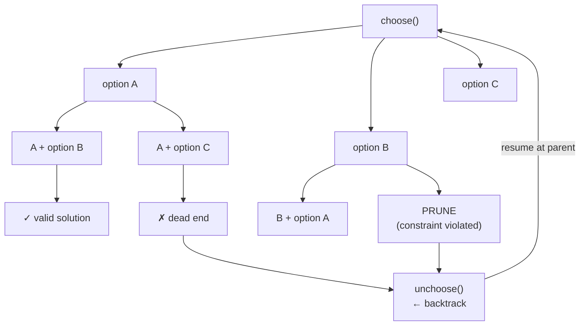

# Backtracking Pattern

**Level**: 🔴 Advanced

## 🗺️ Quick Overview



*The backtracking tree: at each node you make a choice, recurse deeper, then undo the choice. Pruning cuts entire subtrees before exploring them — the difference between O(N!) and practical.*

> Backtracking is systematic trial-and-error: explore all possibilities but abandon a path the moment you know it cannot lead to a valid answer. It is the only pattern that finds **all** solutions or determines **reachability** when no greedy or DP shortcut exists.

## The Pattern

### Recognition Signals

You need backtracking when you see:
- **"Find all solutions / all combinations / all permutations"** — you need to enumerate, not just count
- **"Can we reach X?"** or **"Is it possible to...?"** — existence check with complex constraints
- **Brute-force explodes**: the number of candidates is factorial or exponential, but most branches can be pruned early
- **Constraint satisfaction**: N-Queens, Sudoku, crossword filling, register allocation — each decision constrains future decisions
- The problem asks you to **build** something incrementally where later elements depend on earlier choices

**Key distinction from DFS on a graph**: In graph DFS the graph already exists; in backtracking *you build the graph as you go* based on choices made so far.

### The Universal Template

```
// Universal backtracking template
function backtrack(state, choices):
  // Base case: is the current state a complete solution?
  if is_complete(state):
    record(state)   // save the solution
    return

  for choice in get_valid_choices(choices, state):
    // CHOOSE: make the choice and update state
    apply(state, choice)

    // EXPLORE: recurse with the updated state
    backtrack(state, remaining_choices(choices, choice))

    // UNCHOOSE: undo the choice (backtrack)
    undo(state, choice)
```

The three steps — **choose, explore, unchoose** — form the backtracking contract. Every backtracking problem maps onto this template; the art is in:
1. Defining what "state" holds
2. Defining what "valid choices" are (pruning)
3. Defining the "complete" base case

### Pruning — The Performance Multiplier

Unpruned backtracking is just exhaustive brute force. Pruning is what makes it practical:

```
// Without pruning: generate all permutations, filter invalid → O(N! × validation cost)
// With pruning: abandon a branch at the FIRST constraint violation → often O(N × valid_solutions)

// Example: N-Queens pruning
function is_safe(board, row, col):
  // Check column: was this column used in any previous row?
  for r in range(row):
    if board[r] == col: return false

  // Check diagonals: |row - r| == |col - board[r]| means same diagonal
  for r in range(row):
    if abs(row - r) == abs(col - board[r]): return false

  return true

// We call is_safe BEFORE recursing — prune entire subtree if already invalid
```

**Pruning heuristics by problem type:**
- **Permutations**: skip choices already in the current path (use a `used[]` boolean array)
- **Combination sum**: sort candidates, skip candidates > remaining target, iterate forward only (no duplicates)
- **Word search**: mark cells visited before recursing, unmark after (in-place state)
- **N-Queens**: track column, diagonal, and anti-diagonal sets — O(1) conflict check instead of O(N)

## Core Patterns and Problems

### Problem 1: Permutations

**Thought process**: "Generate all orderings of N elements." Each position in the result can be any unused element — backtrack by marking/unmarking `used`.

```
function permutations(nums):
  result = []
  used = [false] * len(nums)

  function backtrack(current):
    if len(current) == len(nums):
      result.append(current.copy())
      return

    for i in range(len(nums)):
      if used[i]: continue        // PRUNE: already in current path
      used[i] = true              // CHOOSE
      current.append(nums[i])
      backtrack(current)          // EXPLORE
      current.pop()               // UNCHOOSE
      used[i] = false

  backtrack([])
  return result
// Time: O(N × N!), Space: O(N) recursion depth
// N=10 → 3.6M permutations; pruning doesn't help here (all permutations are valid)
```

### Problem 2: Combination Sum

**Thought process**: "Find all combinations that sum to target — candidates can be reused." The critical insight: sort the array, then iterate from index `start` forward only. This prevents `[2,3]` and `[3,2]` both appearing.

```
function combination_sum(candidates, target):
  candidates.sort()   // enables pruning: once candidate > remaining, stop
  result = []

  function backtrack(start, current, remaining):
    if remaining == 0:
      result.append(current.copy())
      return

    for i in range(start, len(candidates)):
      c = candidates[i]
      if c > remaining: break   // PRUNE: sorted → all further candidates also > remaining

      current.append(c)                                 // CHOOSE
      backtrack(i, current, remaining - c)              // EXPLORE (i not i+1: reuse allowed)
      current.pop()                                     // UNCHOOSE

  backtrack(0, [], target)
  return result
// Time: O(N^(T/min_candidate)) where T = target
```

### Problem 3: Subsets / Power Set

**Thought process**: "Generate all subsets of N elements." At each index, make a binary choice: include this element or not.

```
function subsets(nums):
  result = []

  function backtrack(start, current):
    result.append(current.copy())   // every partial state is a valid subset

    for i in range(start, len(nums)):
      current.append(nums[i])       // CHOOSE: include nums[i]
      backtrack(i + 1, current)     // EXPLORE: only elements after i
      current.pop()                 // UNCHOOSE

  backtrack(0, [])
  return result
// Time: O(N × 2^N) — 2^N subsets, each costs O(N) to copy
// N=20 → ~1M subsets: still practical
```

### Problem 4: Word Search in a Grid

**Thought process**: "Can the word be found as a connected path in the grid?" DFS from every cell that matches the first character. Use in-place marking (set cell to `'#'`) to avoid revisiting — no extra visited set needed.

```
function word_search(board, word):
  rows = len(board)
  cols = len(board[0])

  function backtrack(r, c, index):
    if index == len(word): return true   // all characters matched

    if r < 0 or r >= rows or c < 0 or c >= cols: return false
    if board[r][c] != word[index]: return false   // PRUNE: wrong character

    temp = board[r][c]
    board[r][c] = '#'     // CHOOSE: mark as visited (in-place state)

    found = (
      backtrack(r+1, c, index+1) or
      backtrack(r-1, c, index+1) or
      backtrack(r, c+1, index+1) or
      backtrack(r, c-1, index+1)
    )                     // EXPLORE: all 4 neighbors

    board[r][c] = temp    // UNCHOOSE: restore cell

    return found

  for r in range(rows):
    for c in range(cols):
      if backtrack(r, c, 0): return true

  return false
// Time: O(R × C × 4^L) worst case; pruning cuts this dramatically in practice
```

### Problem 5: N-Queens

**Thought process**: "Place N queens on an N×N chessboard so no two attack each other." This is the canonical constraint satisfaction problem. Place one queen per row; prune any column or diagonal already occupied.

```
function n_queens(n):
  result = []
  board = [-1] * n    // board[row] = column of queen in that row

  // Track which columns and diagonals are occupied — O(1) lookup
  cols_used = set()
  diag1_used = set()    // row - col is constant on a "/" diagonal
  diag2_used = set()    // row + col is constant on a "\" diagonal

  function backtrack(row):
    if row == n:
      result.append(board.copy())
      return

    for col in range(n):
      if col in cols_used: continue              // PRUNE: column conflict
      if (row - col) in diag1_used: continue     // PRUNE: diagonal conflict
      if (row + col) in diag2_used: continue     // PRUNE: anti-diagonal conflict

      // CHOOSE
      board[row] = col
      cols_used.add(col)
      diag1_used.add(row - col)
      diag2_used.add(row + col)

      backtrack(row + 1)                         // EXPLORE

      // UNCHOOSE
      board[row] = -1
      cols_used.remove(col)
      diag1_used.remove(row - col)
      diag2_used.remove(row + col)

  backtrack(0)
  return result
// N=8 → 92 solutions (out of 4,426,165,368 naive possibilities — pruning is essential)
// N=15 → 2,279,184 solutions, runtime ~seconds with pruning
```

## Real-World at Scale

### Google Search — Query Auto-Suggestion

Google's query suggestion engine must explore millions of possible completions for a partial query, ranked by predicted relevance. The core algorithm is backtracking over a prefix trie: for each partial completion, it recurses into child nodes but **prunes branches whose maximum possible score falls below a threshold**. This branch-and-bound pruning means the engine explores only ~0.01% of the full completion space to return the top-10 suggestions — making a fundamentally O(N!) problem feasible in under 10ms at search query latency.

### Chess Engines — Minimax with Alpha-Beta Pruning

Stockfish (the world's strongest open-source chess engine) is structured as backtracking: generate all legal moves, recurse for the opponent, recurse again for you, ... to depth D. The search tree has branching factor ~35 and reaches depth 20+ in midgame — that is 35^20 ≈ 3 × 10^30 nodes. Alpha-beta pruning (a backtracking optimization) prunes any subtree where the current best move for one side is already better than what the other side would allow. In practice this reduces the effective tree to ~35^(D/2), cutting 10^30 down to ~35^10 ≈ 2.7 × 10^15 — still enormous, but tractable with move ordering heuristics that further prune to ~10^8 nodes per second.

### npm / pip Dependency Resolution — SAT Solving

When you run `npm install`, the package manager must find a set of package versions where every `peerDependency` and `version range` constraint is satisfied simultaneously. This is equivalent to Boolean satisfiability (SAT). npm v7+ uses a backtracking SAT solver: try version X of package A, if it creates a conflict with package B's required range, backtrack and try version Y. For large dependency graphs (Node projects commonly have 1000+ transitive dependencies), this solver runs with extensive pruning to avoid exponential blowup — and still occasionally times out on pathological inputs (the dreaded "resolving packages..." hang).

### Compiler — Register Allocation via Graph Coloring

Compilers (GCC, LLVM) must assign CPU registers to variables such that no two live variables share a register. This is equivalent to graph coloring: variables are nodes, edges mean "live at the same time," and colors are registers. Graph coloring is NP-complete, and production compilers use backtracking with heuristics (Chaitin's algorithm): try assigning register R to variable V, recurse for remaining variables, backtrack if a conflict arises. The pruning heuristic is "spill the variable with the least connections first" — this typically solves real-world programs in linear time despite the NP-hard worst case.

## Why Backtracking and Not DP?

| Signal | Use DP | Use Backtracking |
|--------|--------|-----------------|
| Count solutions | Yes | Sometimes (slower) |
| Find ONE optimal solution | Yes | No — use DP or greedy |
| Find ALL solutions | No | Yes |
| Constraint satisfaction (Sudoku, N-Queens) | Rarely | Yes |
| Subproblems overlap and can be cached | Yes | No |
| Problem is "can we reach X?" (existence) | Often | Yes when structure is irregular |

The key rule: **if you need all solutions, or if constraint satisfaction makes memoization impractical, use backtracking.** If you only need the optimal value and subproblems repeat, use DP.

## Complexity

| Problem | Time (with pruning) | Space |
|---------|---------------------|-------|
| Permutations (N elements) | O(N × N!) | O(N) stack depth |
| Subsets / Power Set | O(N × 2^N) | O(N) stack depth |
| Combination Sum | O(N^(T/min)) where T = target | O(T/min) stack depth |
| Word Search (R×C grid, length L) | O(R × C × 4^L) | O(L) stack depth |
| N-Queens | O(N!) naive → O(N^N / pruning) practical | O(N) |
| Sudoku | O(9^81) naive → milliseconds with pruning | O(81) |

## Key Takeaways

- Backtracking = brute force + pruning: systematically explore all candidates but abandon branches the moment a constraint is violated
- The universal structure is always: **choose → explore → unchoose** (the undo step is what makes it "backtracking")
- Pruning converts O(N!) to practical: sort inputs to enable early termination, track constraint sets in O(1) data structures
- Use backtracking when you need **all solutions** or when the problem is constraint satisfaction (no DP shortcut exists)
- Key real-world uses: query suggestion engines (trie + pruning), chess AI (minimax + alpha-beta), package dependency resolution (SAT), compiler register allocation (graph coloring)
- N-Queens is the canonical interview problem: practice tracking columns/diagonals in sets for O(1) conflict detection
- If the interviewer asks for **count** of solutions, pivot to DP — it is almost always faster than backtracking-and-counting
