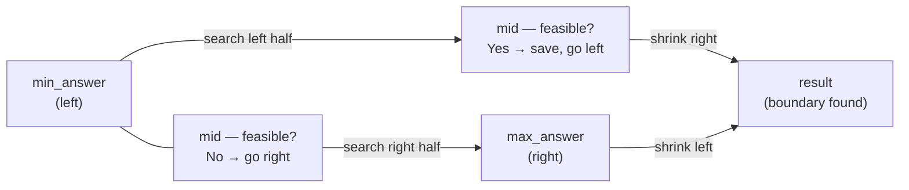

# Binary Search on Answer

**Level**: 🟡 Intermediate

## 🗺️ Quick Overview



*Binary search narrows the answer space by half each iteration — O(log N) probes instead of trying every candidate linearly.*

> When the answer to a problem is monotonic — if X works, then X+1 also works — binary search directly on the answer space to find the optimal value in O(log N) iterations.

## The Pattern

Most engineers know binary search for finding a value in a sorted array. The more powerful insight: **binary search on the answer itself**.

The key property: the feasibility function must be **monotonic**. If capacity C is sufficient to ship packages in D days, then C+1 is also sufficient. If minimum speed S allows eating all bananas before the guard returns, then S+1 also works.

This means: "all valid answers form a contiguous upper or lower portion of the answer space." Binary search finds the exact boundary.

**Recognition signals:**
- "Find the *minimum* capacity/speed/threshold such that..."
- "Find the *maximum* value such that it's still feasible..."
- "If X works, X+1 also works" (or "if X fails, X-1 also fails")
- The brute-force would be: try every possible answer from min to max

## Template Pseudocode

```
// Find minimum X such that feasible(X) is true
// Assumption: feasible(max_answer) = true, feasible(min_answer - 1) = false
function binary_search_on_answer(min_answer, max_answer, feasible_fn):
  left = min_answer
  right = max_answer
  result = max_answer   // valid answer (start with a known good value)

  while left <= right:
    mid = (left + right) // 2

    if feasible_fn(mid):
      result = mid       // mid works — maybe we can do better (smaller)
      right = mid - 1    // search left half for something smaller
    else:
      left = mid + 1     // mid doesn't work — must go larger

  return result

// Find maximum X such that feasible(X) is true
function binary_search_max_feasible(min_answer, max_answer, feasible_fn):
  left = min_answer
  right = max_answer
  result = min_answer

  while left <= right:
    mid = (left + right) // 2

    if feasible_fn(mid):
      result = mid       // mid works — maybe we can do better (larger)
      left = mid + 1     // search right half
    else:
      right = mid - 1    // mid doesn't work

  return result
```

## 3 Example Problems

### Problem 1: Minimum Capacity to Ship Packages in D Days

Given N packages with weights, find the minimum ship capacity to deliver all packages in D days (packages must be shipped in order — no reordering).

```
function min_capacity_to_ship(weights, days):
  // Lower bound: must carry the heaviest single package
  // Upper bound: carry everything in one day
  left = max(weights)
  right = sum(weights)

  function feasible(capacity):
    days_needed = 1
    current_load = 0
    for weight in weights:
      if current_load + weight > capacity:
        days_needed += 1   // start a new day
        current_load = 0
      current_load += weight
    return days_needed <= days

  return binary_search_on_answer(left, right, feasible)
// Time: O(N log(sum(weights))), Space: O(1)
```

### Problem 2: Koko Eating Bananas (Minimum Speed)

K piles of bananas, H hours, guards return in H hours. Find minimum eating speed (bananas/hour) to eat all piles.

```
function min_eating_speed(piles, h):
  function feasible(speed):
    total_hours = sum(ceil(pile / speed) for pile in piles)
    return total_hours <= h

  return binary_search_on_answer(1, max(piles), feasible)
// Time: O(N log(max_pile))
```

### Problem 3: Find Kth Smallest in a Sorted Matrix

N×N matrix where each row and column is sorted. Find the Kth smallest element.

```
function kth_smallest_matrix(matrix, k):
  n = len(matrix)

  function count_less_equal(x):
    // Count elements <= x using two pointers on matrix
    count = 0
    row = n - 1
    col = 0
    while row >= 0 and col < n:
      if matrix[row][col] <= x:
        count += row + 1
        col += 1
      else:
        row -= 1
    return count

  function feasible(x):
    return count_less_equal(x) >= k

  return binary_search_on_answer(matrix[0][0], matrix[n-1][n-1], feasible)
// Time: O(N log(max-min))
```

## In Real Systems

**Autoscaling** — "What is the minimum number of servers needed to handle this request rate?" Binary search on server count with a feasibility check (simulated or measured throughput) finds the optimal allocation.

**Database query cost optimizer** — PostgreSQL and MySQL's query planners binary-search over plan variants (e.g., which index to use, what join strategy) with a cost model as the feasibility function. Not literally binary search on answer, but the monotonic cost property is exploited.

**Network bandwidth allocation** — "Find the maximum bandwidth per stream such that all K streams can run simultaneously." Binary search on bandwidth; feasibility = total bandwidth ≤ link capacity.

**Binary search on time** — "What's the earliest time we can complete the deployment?" Binary search on time; feasibility = simulation of deployment up to that point.

## Complexity

| Property | Value |
|----------|-------|
| Iterations | O(log(answer_range)) |
| Cost per iteration | O(feasibility check cost) |
| Total | O(F × log(answer_range)) where F = feasibility check cost |

The power of this pattern: even if the feasibility check is O(N), the overall algorithm is O(N log(max_answer)) instead of O(N²) for checking every possible answer.

## Key Takeaways

- Binary search on answer works when the feasibility function is monotonic
- Template: binary search between min_answer and max_answer; feasibility check tells you which half to search
- Lower bound = smallest possible answer; upper bound = largest possible answer
- The feasibility check is the core logic — implement it cleanly, then wrap in binary search
- Real systems use this for capacity planning, resource allocation, and optimization problems
