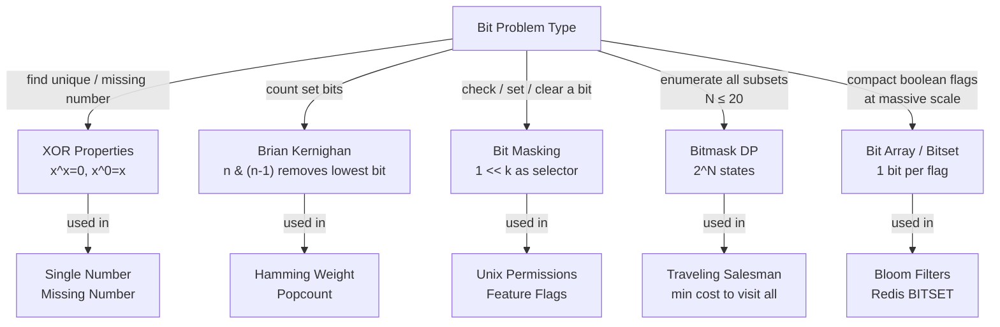

# Bit Manipulation Patterns

**Level**: 🟡 Intermediate

## 🗺️ Quick Overview



*A single bit is the smallest unit of information — bit operations compile to one CPU instruction and unlock algorithms that would be impractical with any other data structure.*

> Bit manipulation is not "interview tricks" — it is the foundation of OS permissions, network routing, database bloom filters, and every system that needs to store billions of boolean flags in a few megabytes.

## The Pattern

### Core Operations Reference

| Operation | Expression | What it does |
|-----------|-----------|--------------|
| Check bit k | `(n >> k) & 1` | Returns 1 if bit k is set, 0 otherwise |
| Set bit k | `n \| (1 << k)` | Forces bit k to 1 |
| Clear bit k | `n & ~(1 << k)` | Forces bit k to 0 |
| Toggle bit k | `n ^ (1 << k)` | Flips bit k |
| Remove lowest set bit | `n & (n - 1)` | Turns off the rightmost 1 bit |
| Isolate lowest set bit | `n & (-n)` | Extracts the rightmost 1 bit as its own power-of-2 |
| Power of 2 check | `n > 0 and (n & (n-1)) == 0` | True iff n has exactly one set bit |
| Count set bits (naive) | loop + `(n >> i) & 1` | O(32) |
| Count set bits (Brian K.) | loop `n = n & (n-1)` | O(set bit count) |
| Swap without temp | `a ^= b; b ^= a; a ^= b` | XOR swap — avoid in production for clarity |

---

### XOR Properties (memorize these)

```
x ^ x = 0      // a number XORed with itself is 0
x ^ 0 = x      // a number XORed with 0 is unchanged
x ^ y = y ^ x  // commutative
(x ^ y) ^ z = x ^ (y ^ z)  // associative
```

**Why this matters**: If you XOR every element in an array where all elements appear twice except one, all pairs cancel to 0. The survivor is the single unpaired element. This finds the "missing" or "unique" number in O(N) time, O(1) space.

---

### Recognition Signals

**Use XOR when:**
- "Find the element that appears an odd number of times"
- "Find the missing number in 1..N"
- "Two numbers appear once; all others appear twice — find both"

**Use `n & (n-1)` when:**
- "Count the number of 1 bits" — Brian Kernighan's algorithm
- "Is N a power of 2?" — check `(n & (n-1)) == 0`
- "Hamming distance" — XOR two numbers, then count bits in result

**Use bitmask for subset enumeration when:**
- N ≤ 20 (2^20 ≈ 1 million subsets — feasible)
- "Find optimal subset" (TSP, min cost to cover all items)
- "Number of ways to partition a small set"

**Use bit array / bitset when:**
- Storing a boolean flag per integer in a large range (0..N)
- N is huge but memory matters — each flag costs 1 bit, not 1 byte
- Bloom filters, presence checks, user-activity tracking

---

### Template: XOR for Missing / Single Number

```
// Single Number: all elements appear twice except one
function single_number(nums):
  result = 0
  for n in nums:
    result ^= n   // pairs cancel: a ^ a = 0
  return result   // survivor is the unpaired element
// Time: O(N),  Space: O(1)

// Missing Number: array contains [0..N] with one missing
function missing_number(nums):
  n = len(nums)
  expected_xor = 0
  for i in range(n + 1):
    expected_xor ^= i    // XOR of 0..N
  for num in nums:
    expected_xor ^= num  // XOR out everything present
  return expected_xor    // only the missing number remains
// Time: O(N),  Space: O(1)
// Alternative: expected_sum = n*(n+1)//2, return expected_sum - sum(nums)
```

---

### Template: Brian Kernighan — Count Set Bits

```
function count_bits(n):
  count = 0
  while n:
    n = n & (n - 1)   // remove lowest set bit
    count += 1
  return count
// Time: O(number of set bits),  Space: O(1)
// In most languages: bin(n).count('1') or __builtin_popcount(n) in C++
// Modern CPUs have a POPCNT instruction — single clock cycle

// Hamming Distance: number of positions where two numbers differ
function hamming_distance(x, y):
  return count_bits(x ^ y)   // XOR gives a 1 wherever bits differ
```

---

### Template: Bit Masking — Check / Set / Clear / Toggle

```
// Common pattern: use an integer as a compact array of booleans
// Useful for small sets (N ≤ 64 with a 64-bit integer)

function bit_ops_demo(state, k):
  is_set  = (state >> k) & 1          // check if bit k is 1
  set_k   = state | (1 << k)          // set bit k to 1
  clear_k = state & ~(1 << k)         // set bit k to 0
  toggle  = state ^ (1 << k)          // flip bit k
  return is_set, set_k, clear_k, toggle

// Unix file permission example: rwxrwxrwx = 9 bits
// permission: 0b111101101 = 0755 (rwxr-xr-x)
OWNER_READ  = 1 << 8   // 0b100000000
OWNER_WRITE = 1 << 7   // 0b010000000
OWNER_EXEC  = 1 << 6   // 0b001000000
GROUP_READ  = 1 << 5
GROUP_EXEC  = 1 << 3
// ... etc.

function has_owner_write(permission):
  return (permission & OWNER_WRITE) != 0
```

---

### Template: Bitmask DP — Subset Enumeration

```
// Traveling Salesman Problem (TSP) — minimum cost to visit all N cities
// State: (current_city, visited_bitmask)
// dp[mask][city] = min cost to reach 'city' having visited exactly the cities in 'mask'

function tsp(dist, n):
  FULL = (1 << n) - 1   // bitmask with all n bits set
  INF = float('inf')
  dp = [[INF] * n for _ in range(1 << n)]
  dp[1][0] = 0   // start at city 0, visited = {0} = bitmask 0b001

  for mask in range(1 << n):
    for u in range(n):
      if dp[mask][u] == INF: continue
      if not (mask >> u) & 1: continue   // u must be in the visited set

      for v in range(n):
        if (mask >> v) & 1: continue     // skip already visited cities
        next_mask = mask | (1 << v)
        dp[next_mask][v] = min(dp[next_mask][v], dp[mask][u] + dist[u][v])

  // Return to start (city 0) after visiting all cities
  return min(dp[FULL][u] + dist[u][0] for u in range(n))
// Time: O(2^N × N²),  Space: O(2^N × N)
// Practical limit: N ≤ 20 (2^20 = 1M states × 20 cities = 20M operations)

// Enumerate all subsets of a given mask (useful for subset-sum DP)
function enumerate_subsets(mask):
  sub = mask
  while sub > 0:
    process(sub)        // do something with this subset
    sub = (sub - 1) & mask  // next smaller subset of mask
  process(0)            // don't forget empty subset
// Time: O(3^N) total across all masks — each element is in/out/not-in-mask
```

**Why 3^N**: Each element can be: (1) not in `mask`, (2) in `mask` but not `sub`, (3) in both. The subset enumeration visits each of the 3^N combinations exactly once.

---

### Template: Bit Array (Bitset)

```
// Store N boolean flags in N/8 bytes instead of N bytes (8× space reduction)
// For N = 4 billion: array = 500 MB vs bitset = 62.5 MB

class BitArray:
  function __init__(size):
    self.bits = bytearray((size + 7) // 8)   // ceil(size/8) bytes

  function set(i):
    self.bits[i // 8] |= (1 << (i % 8))

  function get(i):
    return (self.bits[i // 8] >> (i % 8)) & 1

  function clear(i):
    self.bits[i // 8] &= ~(1 << (i % 8))

// Example: track whether user ID 0..100M has logged in today
// → 100M / 8 = 12.5 MB instead of 100 MB for a boolean array
```

---

### Template: Reverse Bits

```
function reverse_bits(n):
  result = 0
  for _ in range(32):
    result = (result << 1) | (n & 1)   // grab lowest bit of n, append to result
    n >>= 1
  return result
// Time: O(32) = O(1),  Space: O(1)
```

---

## Real-World at Scale

### Chrome Safe Browsing — Bloom Filter over 4 Billion URLs

Chrome's Safe Browsing feature checks every URL you visit against a database of ~4 billion known malicious URLs. Sending every URL to a server for a lookup would be too slow (latency) and too revealing (privacy). Instead, Chrome downloads a compact **Bloom filter** — a bit array with K hash functions.

How it works:
1. For each known malicious URL, compute K hash values and set K bits in the bit array
2. To check a URL: compute the same K hashes, check if ALL K bits are set
3. If any bit is 0 → definitely not malicious. If all K bits are 1 → probably malicious (false positive possible)

- Bit array size: 512 MB → 4 billion bits, K=8 hash functions → false positive rate ~0.1%
- False positives (safe URL flagged) trigger a real server check — rare, acceptable overhead
- False negatives (malicious URL missed) are impossible by design
- Lookup: O(K) = O(8) bit array checks — nearly zero latency, fully local

```
// Bloom filter: check membership without storing all elements
class BloomFilter:
  function __init__(size, hash_count):
    self.bits = BitArray(size)
    self.hash_count = hash_count
    self.size = size

  function add(item):
    for seed in range(self.hash_count):
      index = hash(item, seed) % self.size
      self.bits.set(index)

  function might_contain(item):
    for seed in range(self.hash_count):
      index = hash(item, seed) % self.size
      if not self.bits.get(index):
        return false   // definitely NOT in set
    return true        // PROBABLY in set (may be false positive)
```

Cassandra uses Bloom filters to avoid disk reads for keys that don't exist in an SSTable. Redis implements Bloom filter as a module (RedisBloom). HBase uses them to skip SSTables during reads.

### Redis BITSET — 100 Million User Flags in 12.5 MB

Redis SETBIT / GETBIT commands expose a bit array backed by a Redis string. Each bit position corresponds to a user ID. Tracking daily active users for user IDs 0..100M requires only 12.5 MB.

```
// Redis commands (conceptual)
SETBIT daily_active:2026-03-21 <user_id> 1   // user logged in
GETBIT daily_active:2026-03-21 <user_id>      // did user log in?
BITCOUNT daily_active:2026-03-21              // total active users today
BITOP AND result:both key1 key2              // users active on BOTH days (bitwise AND)
```

- 100 million users → 100M bits = 12.5 MB per day's activity bitmap
- `BITCOUNT` uses the hardware POPCNT instruction — counts set bits in gigabytes per second
- `BITOP AND/OR/XOR` enables cohort analysis (users active both Monday and Tuesday) in O(N/64) using 64-bit SIMD operations

### Unix File Permissions — 9-Bit Mask on Every File System Operation

Every `chmod`, `chown`, and file access check in Linux is a bitwise AND. The kernel stores 9 permission bits per inode (read/write/execute for owner/group/other). Every `open()` syscall checks `(file_mode & required_bits) != 0`.

- Linux kernel: ~10 billion file system operations per day across all servers
- Each permission check: one AND + one compare → 2 CPU instructions
- `chmod 755` = `0b111101101` = `rwxr-xr-x` — mental model: three 3-bit groups

### Network Routing — Subnet Masks

Every IP router performs a bitwise AND to determine which network a packet belongs to:

```
// Routing table lookup: which network does IP 192.168.1.100 belong to?
ip_address  = 0xC0A80164   // 192.168.1.100
subnet_mask = 0xFFFFFF00   // /24 = 255.255.255.0
network     = ip_address & subnet_mask   // = 192.168.1.0

// Longest prefix match: try all subnet masks from /32 down to /0
// Most routers use hardware ternary CAM for O(1) lookup
```

- Core internet routers: 10+ million routing table lookups per second
- Each lookup: bitwise AND with subnet mask → table lookup
- IPv6 uses 128-bit addresses — two 64-bit registers, two AND operations

### Facebook A/B Testing — User Group Bitmasks

Facebook assigns each user to feature flag groups using a bitmask. A single 64-bit integer per user encodes membership in up to 64 simultaneous A/B tests.

```
// User's feature flag bitmask
user_flags = 0b0000...01101011

NEW_FEED_ALGO    = 1 << 0   // bit 0
DARK_MODE_TEST   = 1 << 1   // bit 1
REELS_RANKING_V2 = 1 << 3   // bit 3

function in_experiment(user_flags, experiment_bit):
  return (user_flags & experiment_bit) != 0
```

- 3+ billion Facebook users, 1000+ active experiments at any time
- Compact: 64 experiments per 64-bit integer — 8 bytes per user vs 1000 boolean columns
- Evaluation: O(1) per experiment check — critical at request time serving millions of pages/second

---

## Core Problems

### Problem 1: Single Number — XOR Cancellation

**Thought process**: "All numbers appear twice except one — find it in O(1) space."
XOR all elements. Pairs cancel to 0; the odd one out survives.

```
function single_number(nums):
  result = 0
  for n in nums:
    result ^= n
  return result
// Time: O(N),  Space: O(1)
// Follow-up: what if two numbers appear once? XOR gives x^y.
// Find the rightmost set bit (x^y) & -(x^y) to split nums into two groups.
```

---

### Problem 2: Number of 1 Bits (Hamming Weight) — Brian Kernighan

**Thought process**: "Count set bits in a 32-bit integer."
Each iteration of `n & (n-1)` removes exactly one set bit — loop count equals set bit count.

```
function hamming_weight(n):
  count = 0
  while n:
    n &= (n - 1)   // removes rightmost 1 bit
    count += 1
  return count
// Time: O(number of set bits),  Space: O(1)
// Interview note: mention __builtin_popcount(n) in C++ uses single POPCNT instruction
```

---

### Problem 3: Reverse Bits — Bit-by-Bit Transfer

**Thought process**: "Reverse the 32-bit binary representation."
Shift result left and fill with the rightmost bit of n; shift n right. Repeat 32 times.

```
function reverse_bits(n):
  result = 0
  for _ in range(32):
    result = (result << 1) | (n & 1)
    n >>= 1
  return result
// Time: O(32) = O(1),  Space: O(1)
```

---

### Problem 4: Missing Number — XOR or Math

**Thought process**: "Array has 0..N with one number missing — find it."
Two approaches: XOR expected vs actual, or math (expected sum minus actual sum).

```
function missing_number(nums):
  n = len(nums)
  // XOR approach
  xor = 0
  for i in range(n + 1):
    xor ^= i
  for num in nums:
    xor ^= num
  return xor

  // OR: math approach (simpler, same complexity)
  // return n * (n + 1) // 2 - sum(nums)
// Time: O(N),  Space: O(1)
```

**Interview note**: The XOR approach generalizes to "find missing element in any range" where the mathematical sum overflows. The interviewer may ask which you'd choose — prefer math for clarity unless overflow is a concern.

---

### Problem 5: Subsets — Bitmask Enumeration

**Thought process**: "Generate all 2^N subsets of an array."
For an N-element array, integers 0 to 2^N - 1 each represent a unique subset — bit k = 1 means element k is included.

```
function subsets(nums):
  n = len(nums)
  result = []

  for mask in range(1 << n):   // 0 to 2^n - 1
    subset = []
    for k in range(n):
      if (mask >> k) & 1:      // is element k included in this subset?
        subset.append(nums[k])
    result.append(subset)

  return result
// Time: O(2^N × N),  Space: O(2^N × N) for output

// Follow-up: "subsets with a given target sum" — add a filter
// Follow-up: "minimum subset covering all items" — bitmask DP
```

**Interview insight**: The bitmask approach is O(2^N × N) — fine for N ≤ 20. For N ≤ 64, you'd need a 64-bit integer and a language that handles unsigned 64-bit bit shifts. For N > 20, you'd need a different approach (backtracking, DP).

---

## Complexity

| Pattern | Time | Space | Notes |
|---------|------|-------|-------|
| XOR single/missing number | O(N) | O(1) | No extra data structure needed |
| Brian Kernighan count bits | O(k) | O(1) | k = number of set bits |
| Bit masking (check/set/clear) | O(1) | O(1) | Single CPU instruction |
| Bitmask DP (TSP) | O(2^N × N²) | O(2^N × N) | Practical for N ≤ 20 |
| Subset enumeration (bitmask) | O(2^N × N) | O(2^N × N) output | All 2^N subsets |
| Subset enumeration (over submasks) | O(3^N) total | O(1) per step | Amortized across all masks |
| Bloom filter lookup | O(K) | O(M) bits | K = hash functions, M = bit array size |
| Bit array get/set | O(1) | O(N/8) bytes | N bits = N/8 bytes |

---

## Key Takeaways

- XOR is the "cancellation" operator: pairs of identical values cancel to 0, and any value XORed with 0 is itself. This pattern solves the entire "find the unique/missing element" problem class in O(N) time, O(1) space.
- `n & (n-1)` removes the lowest set bit. Two uses: (1) count set bits in O(k) iterations, (2) check power of 2 in O(1).
- Bitmask DP is the standard approach for problems over small subsets (N ≤ 20). Each of the 2^N integers represents a subset; the DP transition considers adding each element to a subset.
- Bloom filters are probabilistic bit arrays: no false negatives, controlled false positives. Used in every high-read system (Cassandra, HBase, Redis) to avoid expensive disk reads for non-existent keys.
- Redis BITSET: track 100 million binary user flags in 12.5 MB. `BITCOUNT` uses hardware POPCNT. `BITOP` enables set operations across entire user populations in milliseconds.
- In interviews: know when to reach for bit tricks (O(1) space, no extra data structure) vs cleaner alternatives (hashmap, set). Always explain WHY you chose bit manipulation, not just what the trick is.
- Always check for signed integer overflow when using left shifts in languages with fixed-width integers (use `1L << k` in Java/C++ for 64-bit shifts).
