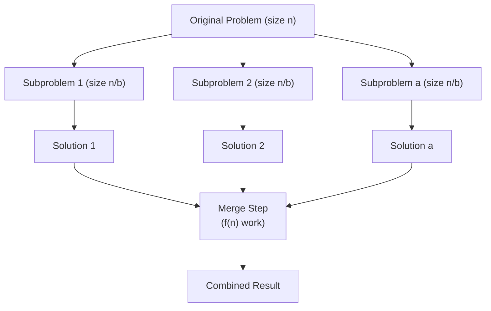

# Divide & Conquer

**Level**: 🟡 Intermediate

## 🗺️ Quick Overview



*Split the problem into a independent subproblems of size n/b each. Solve them independently — no coordination needed. Merge results. The merge step is where the real engineering lives.*

> Divide and conquer is why sorting 1 billion records is feasible, why MapReduce can process petabytes, and why FFT can multiply two polynomials in O(N log N) instead of O(N²). The pattern that scales.

## The Pattern

### The D&C Mental Model

Every divide and conquer algorithm has exactly three parts:

1. **Divide**: split the problem into smaller subproblems (typically halves)
2. **Conquer**: solve each subproblem independently (recursively until a base case)
3. **Merge**: combine the subproblem solutions into the overall solution

The critical insight: **subproblems must be independent** — the solution to subproblem 1 cannot depend on the solution to subproblem 2. This is the distinction from dynamic programming (where subproblems overlap and share results).

**Design order**: design the merge step first. The split is almost always "cut in half at midpoint." The merge step is where the algorithm's correctness and complexity live.

### Master Theorem — practical intuition

For D&C recurrences of the form `T(n) = aT(n/b) + f(n)`:

- `a` = number of subproblems
- `n/b` = size of each subproblem
- `f(n)` = cost of split + merge step

Three cases (compare `f(n)` against `n^(log_b a)`):

| Case | Condition | Result | Example |
|------|-----------|--------|---------|
| 1 — subproblems dominate | `f(n) = O(n^(log_b a - ε))` | `T(n) = Θ(n^(log_b a))` | Binary search T(n)=T(n/2)+O(1) → O(log n) |
| 2 — balanced | `f(n) = Θ(n^(log_b a) log^k n)` | `T(n) = Θ(n^(log_b a) log^(k+1) n)` | Merge sort T(n)=2T(n/2)+O(n) → O(n log n) |
| 3 — merge dominates | `f(n) = Ω(n^(log_b a + ε))` | `T(n) = Θ(f(n))` | Rare in practice |

**Practical shortcut for interviews**: if you split into 2 halves and merge in O(N), it is O(N log N). This covers merge sort, count inversions, closest pair of points, and more.

### Recognition signals

1. **"Find kth largest/smallest"** — quickselect (D&C without full sort)
2. **"Sort this"** — merge sort is D&C
3. **"Count pairs/inversions"** — modified merge sort
4. **"Maximum subarray"** — split at midpoint, merge across boundary
5. **"Build balanced BST from sorted array"** — split at midpoint recursively
6. **"Matrix multiplication"** — Strassen (D&C to reduce multiplications)
7. **"The input has a natural midpoint and the answer spans or is in one half"**

### D&C vs DP — the decisive question

| | Divide & Conquer | Dynamic Programming |
|-|-----------------|---------------------|
| Subproblem relationship | **Independent** — no shared state | **Overlapping** — same subproblem computed repeatedly |
| Caching needed | No — subproblems never repeat | Yes — memoize or tabulate |
| Typical structure | Recursive halving | Linear or 2D table fill |
| Complexity | O(N log N) typical | O(N²) typical |
| Real example | Merge sort | Edit distance |

Merge sort: left half and right half are independent. Once sorted, merge them.
Longest common subsequence: `lcs(i, j)` depends on `lcs(i-1, j-1)`, `lcs(i-1, j)`, `lcs(i, j-1)` — overlapping, use DP.

## Real-World at Scale

### MapReduce — D&C at Petabyte Scale

Google's original MapReduce (2004) is divide and conquer distributed across thousands of machines:

1. **Divide**: split input data into M splits (e.g., 64MB HDFS blocks). Each worker handles one split independently.
2. **Conquer (Map phase)**: each mapper processes its split, emitting key-value pairs. Workers are fully independent — no communication.
3. **Merge (Reduce phase)**: shuffle routes all values for the same key to one reducer. Each reducer merges its values independently.

The intermediate shuffle+sort is the "merge step" of the D&C — and it is where most of the engineering complexity lives (network bandwidth, sort order, combiner optimization).

Google's 2004 paper reported processing 1TB in 150 seconds on 1000 machines. Today, Google processes petabytes daily using Flume (MapReduce successor). The core insight — subproblems (file splits) are independent — is pure D&C.

Apache Spark improves on MapReduce by keeping intermediate data in memory, reducing the disk I/O overhead of the merge step.

### Merge Sort in Databases — Sorting Larger-Than-RAM Datasets

PostgreSQL and MySQL both use external merge sort for sort operations that exceed working memory (controlled by `work_mem` in PostgreSQL).

**Phase 1 (Divide)**: scan the table in chunks that fit in RAM. Sort each chunk in memory (using quicksort). Write each sorted chunk (called a "run") to disk.

**Phase 2 (Merge)**: merge all runs using a multi-way merge (a min-heap of size = number of runs). Read one page from each run at a time, always merging from the smallest value.

For a 100GB table with 64MB work_mem: ~1600 runs in phase 1, then merged in phase 2. Total I/O: 2 passes over the data. This is D&C: split into independent sorted runs, merge them.

PostgreSQL's sort node appears in execution plans for ORDER BY, GROUP BY, CREATE INDEX, and merge joins. At scale, this runs millions of times per day across all PostgreSQL instances globally.

### Quickselect — Finding P99 Latency at Scale

Finding the 99th percentile latency from a billion data points cannot sort all points (O(N log N) and space-intensive). Quickselect finds the kth element in **O(N) average** time using D&C:

1. Pick a pivot.
2. Partition: elements < pivot go left, elements > pivot go right.
3. The pivot is now at its final sorted position `p`.
4. If `p == k`, return pivot. If `p > k`, recurse left. If `p < k`, recurse right.

Only one half is recursed into — unlike quicksort which recurses both. Expected recurrence: T(n) = T(n/2) + O(N) = O(N) by Master Theorem case 3.

Netflix's Atlas metrics system, Google's Monarch monitoring, and Prometheus all need to compute percentile latencies across billions of time-series data points. Libraries like HdrHistogram and t-digest use D&C-inspired algorithms for streaming percentile approximation.

### Bigtable Compaction — Distributed Merge Sort

Google's Bigtable (and open-source Apache HBase, Apache Cassandra) use a Log-Structured Merge-tree (LSM-tree). Data is written to in-memory buffers, then flushed to immutable sorted files (SSTables) on disk.

As SSTables accumulate, Bigtable runs **compaction**: merge multiple sorted SSTable files into one larger sorted file. This is merge sort's merge step — the same algorithm merge sort uses to merge two sorted halves.

Minor compaction: merge 2-4 small SSTables. Major compaction: merge all SSTables. Each compaction is an independent merge sort over sorted runs. This is the D&C merge step running continuously at Google's scale across thousands of tablet servers.

Cassandra performs similar compaction with configurable strategies (Size-Tiered, Leveled) — all fundamentally merge sort over sorted SSTable runs.

## Core Problems

### 1. Merge Sort — the D&C archetype

**Thought process**: To sort an array, sort the left half, sort the right half, then merge the two sorted halves in O(N). The key invariant: two sorted arrays can be merged in O(N) time using two pointers.

```
function merge_sort(arr):
  if len(arr) <= 1: return arr

  mid = len(arr) // 2
  left  = merge_sort(arr[:mid])   // sort left half independently
  right = merge_sort(arr[mid:])   // sort right half independently
  return merge(left, right)       // merge step: O(N)

function merge(left, right):
  result = []
  i = j = 0
  while i < len(left) and j < len(right):
    if left[i] <= right[j]:
      result.append(left[i]); i += 1
    else:
      result.append(right[j]); j += 1
  result.extend(left[i:])
  result.extend(right[j:])
  return result

// T(n) = 2T(n/2) + O(n) → O(n log n) by Master Theorem case 2
```

Merge sort is **stable** (equal elements maintain original order) and **optimal** for comparison-based sorting — O(N log N) is the lower bound for any comparison sort. Used in Java's Arrays.sort for objects, Python's Timsort, and database sort nodes.

### 2. Find Kth Largest — Quickselect

**Thought process**: Sorting to find the kth element wastes work — you only need the kth position, not full order. Quickselect uses the partition step of quicksort but only recurses into the relevant half.

```
function find_kth_largest(nums, k):
  // kth largest = (n-k)th smallest, 0-indexed
  return quickselect(nums, 0, len(nums)-1, len(nums)-k)

function quickselect(nums, left, right, k_index):
  if left == right: return nums[left]

  pivot_index = partition(nums, left, right)

  if pivot_index == k_index:
    return nums[pivot_index]
  elif pivot_index < k_index:
    return quickselect(nums, pivot_index+1, right, k_index)
  else:
    return quickselect(nums, left, pivot_index-1, k_index)

function partition(nums, left, right):
  pivot = nums[right]
  store = left
  for i in range(left, right):
    if nums[i] < pivot:
      swap(nums[store], nums[i])
      store += 1
  swap(nums[store], nums[right])
  return store

// Average: O(N). Worst case: O(N²) with bad pivot choices.
// Use median-of-3 pivot or random pivot to avoid worst case.
```

Median-of-medians gives O(N) worst case but is slower in practice. For production use (Nth percentile computation), randomized quickselect with good pivot selection is standard.

### 3. Count Inversions — modified merge sort

**Problem**: Count pairs (i, j) where i < j but arr[i] > arr[j]. An inversion measures how "unsorted" an array is.

**Thought process**: Brute force O(N²). Insight: during merge sort's merge step, when we pick an element from the right array, every remaining element in the left array forms an inversion with it. Count them during the merge.

```
function count_inversions(arr):
  if len(arr) <= 1: return arr, 0

  mid = len(arr) // 2
  left,  left_inv  = count_inversions(arr[:mid])
  right, right_inv = count_inversions(arr[mid:])
  merged, split_inv = merge_count(left, right)

  return merged, left_inv + right_inv + split_inv

function merge_count(left, right):
  result = []
  inversions = 0
  i = j = 0

  while i < len(left) and j < len(right):
    if left[i] <= right[j]:
      result.append(left[i]); i += 1
    else:
      // left[i] > right[j]: left[i..end] all form inversions with right[j]
      inversions += len(left) - i
      result.append(right[j]); j += 1

  result.extend(left[i:])
  result.extend(right[j:])
  return result, inversions

// O(N log N) — same as merge sort, just counting during the merge step
```

Real-world: measuring list similarity (collaborative filtering — how similar are two users' ranking lists?), detecting nearly-sorted sequences for Timsort optimization.

### 4. Maximum Subarray — divide at midpoint

**Problem**: Find the contiguous subarray with maximum sum (Kadane's is O(N) linear, but the D&C approach illustrates the pattern and gives the same O(N log N) complexity).

**Thought process**: The maximum subarray either lies entirely in the left half, entirely in the right half, or crosses the midpoint. The crossing case must include the midpoint, so compute the maximum suffix of the left half and maximum prefix of the right half.

```
function max_subarray_dc(arr, left, right):
  if left == right: return arr[left]

  mid = (left + right) // 2

  left_max  = max_subarray_dc(arr, left, mid)
  right_max = max_subarray_dc(arr, mid+1, right)
  cross_max = max_crossing_sum(arr, left, mid, right)

  return max(left_max, right_max, cross_max)

function max_crossing_sum(arr, left, mid, right):
  // Maximum sum going left from mid
  left_sum = 0; best_left = -infinity
  for i in range(mid, left-1, -1):
    left_sum += arr[i]
    best_left = max(best_left, left_sum)

  // Maximum sum going right from mid+1
  right_sum = 0; best_right = -infinity
  for i in range(mid+1, right+1):
    right_sum += arr[i]
    best_right = max(best_right, right_sum)

  return best_left + best_right

// T(n) = 2T(n/2) + O(n) → O(n log n)
// Note: Kadane's algorithm solves this in O(n) — D&C is not optimal here
// But the pattern (left / right / cross) appears in many other problems
```

The "left / right / crossing midpoint" decomposition generalizes to segment trees (range minimum/maximum queries), which power range query systems in competitive programming and database analytics.

### 5. Build Balanced BST from Sorted Array

**Problem**: Given a sorted array, construct a height-balanced binary search tree.

**Thought process**: The root should be the midpoint (balances left/right subtrees). Left subtree = left half recursively. Right subtree = right half recursively. Pure D&C.

```
function sorted_array_to_bst(nums):
  if not nums: return None
  mid = len(nums) // 2
  node = TreeNode(nums[mid])
  node.left  = sorted_array_to_bst(nums[:mid])      // left subproblem
  node.right = sorted_array_to_bst(nums[mid+1:])    // right subproblem
  return node

// T(n) = 2T(n/2) + O(1) → O(n) total nodes created
// Height: O(log n) — perfectly balanced

// Related: building a balanced BST from a sorted linked list
// (same D&C structure, but finding the midpoint requires the slow-fast pointer trick)
function sorted_list_to_bst(head):
  if not head: return None
  if not head.next: return TreeNode(head.val)

  // Find midpoint using slow/fast pointers
  prev = None; slow = head; fast = head
  while fast and fast.next:
    prev = slow; slow = slow.next; fast = fast.next.next

  prev.next = None  // split list at midpoint
  node = TreeNode(slow.val)
  node.left  = sorted_list_to_bst(head)       // left half
  node.right = sorted_list_to_bst(slow.next)  // right half
  return node
```

This exact D&C structure is used when building B-tree indexes from a sorted file (bulk loading). PostgreSQL's `CREATE INDEX` on a large table uses a D&C bulk loading approach to build the B-tree in O(N log N) rather than N individual insertions.

## Complexity

| Problem | Recurrence | Time | Space |
|---------|-----------|------|-------|
| Merge sort | 2T(n/2) + O(n) | O(n log n) | O(n) auxiliary |
| Quicksort | 2T(n/2) + O(n) avg | O(n log n) avg, O(n²) worst | O(log n) stack |
| Quickselect | T(n/2) + O(n) avg | O(n) avg | O(log n) stack |
| Count inversions | 2T(n/2) + O(n) | O(n log n) | O(n) auxiliary |
| Max subarray (D&C) | 2T(n/2) + O(n) | O(n log n) | O(log n) stack |
| Build balanced BST | 2T(n/2) + O(1) | O(n) | O(log n) stack |
| Binary search | T(n/2) + O(1) | O(log n) | O(1) iterative |
| Strassen matrix multiply | 7T(n/2) + O(n²) | O(n^2.81) | O(n²) |

**Master Theorem quick check**:
- 2T(n/2) + O(n): log₂2 = 1, f(n) = n^1 → Case 2 → O(n log n)
- T(n/2) + O(1): log₂1 = 0, f(n) = O(n^0) = O(1) → Case 2 → O(log n)
- T(n/2) + O(n): log₂1 = 0, f(n) = n^1 dominates → Case 3 → O(n)

## Key Takeaways

- D&C = divide into **independent** subproblems + solve recursively + merge. The merge step is where the work and design live.
- Master Theorem: if you split into 2 halves and merge in O(N), complexity is O(N log N). Internalize this.
- D&C vs DP: independent subproblems → D&C. Overlapping subproblems → DP. Ask: "would I recompute the same subproblem twice?"
- Quickselect finds kth element in O(N) average — use it for percentile computation instead of full sort
- Modified merge sort counts inversions, finds closest pair of points, builds segment trees — all by adding work to the merge step
- MapReduce is D&C at distributed scale: Map = independent subproblems, Reduce = merge step. Bigtable/Cassandra compaction is merge sort on SSTable files
- Interview tell: "find kth" → quickselect. "count pairs" → merge sort. "build balanced tree from sorted" → midpoint recursion. Recurrence O(N log N) = sign that D&C is the intended approach.
