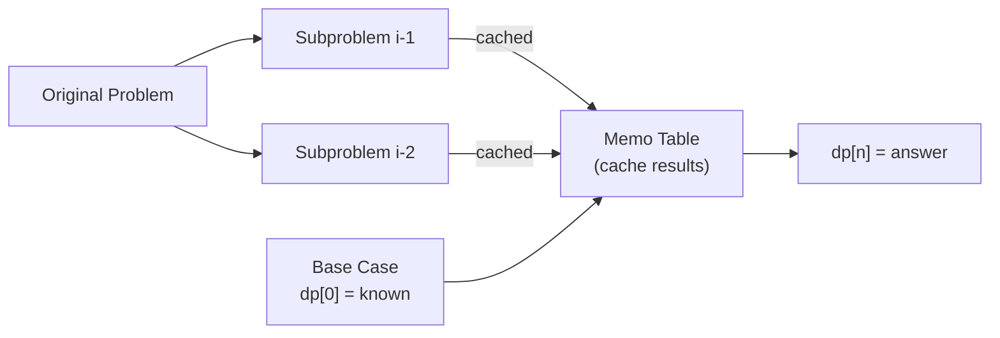

# Dynamic Programming Patterns

**Level**: 🔴 Advanced

## 🗺️ Quick Overview



*Build the solution bottom-up: each cell in the DP table is computed once from previously solved sub-problems, eliminating redundant recursion.*

> Dynamic programming = "remember the answers to subproblems to avoid recomputing them." It turns exponential brute force into polynomial time — and it shows up in spell checkers, DNA alignment, resource optimization, and more.

## The Pattern

DP applies when a problem has:
1. **Optimal substructure**: the optimal solution is built from optimal solutions to subproblems
2. **Overlapping subproblems**: the same subproblems are solved multiple times in brute force

**Two implementation styles:**
- **Memoization (top-down)**: recursive, cache results as you go
- **Tabulation (bottom-up)**: iterative, fill a table from base cases up

**Recognition signals:**
- "How many ways to..."
- "Minimum/maximum cost to..."
- "Can you achieve X?"
- The brute force involves recursion with repeated sub-calls
- Asking about strings: edit distance, longest common subsequence
- Resource allocation: knapsack, coin change

## Core Patterns

### 1D DP — Linear Problems

```
// Fibonacci (canonical DP intro)
function fibonacci(n):
  dp = [0] * (n + 1)
  dp[1] = 1
  for i in range(2, n + 1):
    dp[i] = dp[i-1] + dp[i-2]
  return dp[n]

// Coin change — minimum coins to make amount
function min_coins(coins, amount):
  dp = [infinity] * (amount + 1)
  dp[0] = 0   // 0 coins needed to make amount 0

  for amt in range(1, amount + 1):
    for coin in coins:
      if coin <= amt:
        dp[amt] = min(dp[amt], 1 + dp[amt - coin])

  return dp[amount] if dp[amount] != infinity else -1
```

### 2D DP — String/Grid Problems

```
// Longest Common Subsequence (LCS)
// dp[i][j] = LCS length of s1[0..i-1] and s2[0..j-1]
function lcs(s1, s2):
  m, n = len(s1), len(s2)
  dp = 2d_array(m + 1, n + 1, default=0)

  for i in range(1, m + 1):
    for j in range(1, n + 1):
      if s1[i-1] == s2[j-1]:
        dp[i][j] = dp[i-1][j-1] + 1
      else:
        dp[i][j] = max(dp[i-1][j], dp[i][j-1])

  return dp[m][n]

// Edit Distance (Levenshtein distance)
// dp[i][j] = min operations to convert s1[0..i-1] to s2[0..j-1]
function edit_distance(s1, s2):
  m, n = len(s1), len(s2)
  dp = 2d_array(m + 1, n + 1)

  // Base cases: converting to/from empty string
  for i in range(m + 1): dp[i][0] = i   // i deletions
  for j in range(n + 1): dp[0][j] = j   // j insertions

  for i in range(1, m + 1):
    for j in range(1, n + 1):
      if s1[i-1] == s2[j-1]:
        dp[i][j] = dp[i-1][j-1]   // characters match, no operation needed
      else:
        dp[i][j] = 1 + min(
          dp[i-1][j],     // delete from s1
          dp[i][j-1],     // insert into s1
          dp[i-1][j-1]    // replace in s1
        )

  return dp[m][n]
```

### Knapsack — Resource Allocation

```
// 0/1 Knapsack: given items with weight and value, maximize value within capacity
// dp[i][w] = max value using first i items with capacity w
function knapsack(weights, values, capacity):
  n = len(weights)
  dp = 2d_array(n + 1, capacity + 1, default=0)

  for i in range(1, n + 1):
    for w in range(capacity + 1):
      // Option 1: skip item i
      dp[i][w] = dp[i-1][w]
      // Option 2: take item i (if it fits)
      if weights[i-1] <= w:
        dp[i][w] = max(dp[i][w], values[i-1] + dp[i-1][w - weights[i-1]])

  return dp[n][capacity]
```

## Used In Real Systems

**Edit distance (Levenshtein distance)**:
- **Spell checkers** (Aspell, Hunspell): find dictionary words with minimum edit distance to the misspelled word
- **Git diff**: the diff algorithm uses LCS to find the longest common subsequence of lines between two file versions. Changed lines are those not in the LCS.
- **DNA sequence alignment** (BLAST, Smith-Waterman): find similarity between DNA/protein sequences using DP alignment

**Knapsack variants**:
- **Cloud resource packing**: given VMs with CPU/memory requirements, which can fit on a physical host? This is a multi-dimensional knapsack.
- **Kubernetes pod scheduling**: the scheduler packs pods onto nodes considering CPU, memory, and affinity constraints — relaxed knapsack.
- **Ad auction bidding**: selecting the optimal combination of bids to maximize revenue within budget

**Longest Increasing Subsequence (LIS)**:
- **Version ordering**: given a set of version strings, find the longest valid upgrade path
- **Schema migration ordering**: find the longest chain of compatible migrations

**Interval DP** (merging optimal subproblems over intervals):
- **Matrix chain multiplication**: database query optimizers choose join order using interval DP to minimize intermediate result sizes
- **Optimal binary search tree**: used in database index construction to minimize expected search cost given access frequencies

## Memoization vs Tabulation

```
// Memoization (top-down): recursive with cache
function fib_memo(n, cache={}):
  if n in cache: return cache[n]
  if n <= 1: return n
  cache[n] = fib_memo(n-1, cache) + fib_memo(n-2, cache)
  return cache[n]
// Pros: only computes needed subproblems, natural recursion structure
// Cons: function call overhead, risk of stack overflow for large n

// Tabulation (bottom-up): iterative
function fib_tab(n):
  if n <= 1: return n
  prev2, prev1 = 0, 1
  for i in range(2, n+1):
    curr = prev1 + prev2
    prev2, prev1 = prev1, curr
  return prev1
// Pros: no recursion overhead, better cache performance, O(1) space possible
// Cons: must compute all subproblems (even unused ones)
```

## Complexity

| Problem | Time | Space |
|---------|------|-------|
| Fibonacci | O(N) | O(1) tabulated |
| Coin change | O(N × amount) | O(amount) |
| Edit distance | O(M × N) | O(M × N) or O(min(M,N)) |
| LCS | O(M × N) | O(M × N) or O(min(M,N)) |
| 0/1 Knapsack | O(N × W) | O(N × W) or O(W) |

**Space optimization**: 2D DP tables often only need the current and previous row → reduce to O(min(M,N)) space.

## Key Takeaways

- DP = optimal substructure + overlapping subproblems → cache and reuse answers
- Identify state: what information uniquely describes a subproblem?
- Identify transition: how does dp[i] depend on dp[i-1], dp[i-2], etc.?
- 1D DP: linear sequences (coin change, max subarray)
- 2D DP: two strings or a grid (LCS, edit distance, shortest path)
- Real impact: git diff (LCS), spell check (edit distance), Kubernetes scheduler (knapsack), query optimizer (interval DP)
