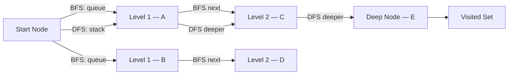

# Graph BFS & DFS Pattern

**Level**: 🟡 Intermediate

## 🗺️ Quick Overview



*BFS fans out level by level (shortest path); DFS dives deep first (components, cycles) — choose by what the problem asks for.*

> Two fundamental ways to explore a graph: BFS finds the shortest path in unweighted graphs, DFS finds connected components and detects cycles. Together they solve the vast majority of graph problems.

## The Pattern

**BFS (Breadth-First Search)**: Explore level-by-level using a queue. All nodes at distance 1 before distance 2. Guarantees shortest path in unweighted graphs.

**DFS (Depth-First Search)**: Explore as deep as possible using a stack (or recursion). Backtracks when a dead end is reached. Better for connected components, cycle detection, and topological sort.

**Recognition signals — use BFS when:**
- "Shortest path" or "minimum steps"
- "Minimum number of operations to transform X to Y"
- "Nearest node with property X"

**Recognition signals — use DFS when:**
- "Connected components" / "islands"
- "Is there a path from A to B?"
- "Cycle detection"
- "All paths" / "backtracking"

## Template Pseudocode

```
// BFS — shortest path in unweighted graph
function bfs(graph, start, target):
  visited = {start}
  queue = Queue()
  queue.enqueue((start, 0))   // (node, distance)

  while not queue.empty():
    node, distance = queue.dequeue()

    if node == target:
      return distance   // shortest distance to target

    for neighbor in graph.neighbors(node):
      if neighbor not in visited:
        visited.add(neighbor)
        queue.enqueue((neighbor, distance + 1))

  return -1   // target not reachable

// DFS — iterative (avoid recursion stack overflow for large graphs)
function dfs_iterative(graph, start):
  visited = set()
  stack = [start]

  while stack:
    node = stack.pop()
    if node in visited:
      continue
    visited.add(node)
    process(node)   // do whatever you need with this node

    for neighbor in graph.neighbors(node):
      if neighbor not in visited:
        stack.append(neighbor)

  return visited   // all nodes reachable from start

// DFS — recursive (cleaner, but watch recursion depth)
function dfs_recursive(graph, node, visited):
  visited.add(node)
  process(node)

  for neighbor in graph.neighbors(node):
    if neighbor not in visited:
      dfs_recursive(graph, neighbor, visited)
```

## 3 Example Problems

### Problem 1: Number of Islands (DFS — Connected Components)

```
function num_islands(grid):
  rows = len(grid)
  cols = len(grid[0])
  visited = set()
  count = 0

  function dfs(r, c):
    if (r, c) in visited: return
    if r < 0 or r >= rows or c < 0 or c >= cols: return
    if grid[r][c] == '0': return   // water

    visited.add((r, c))
    dfs(r+1, c)
    dfs(r-1, c)
    dfs(r, c+1)
    dfs(r, c-1)

  for r in range(rows):
    for c in range(cols):
      if grid[r][c] == '1' and (r, c) not in visited:
        dfs(r, c)   // explore entire island
        count += 1

  return count
// Time: O(R × C), Space: O(R × C)
```

### Problem 2: Word Ladder — Minimum Transformations (BFS)

Find minimum transformations from `begin_word` to `end_word`, changing one letter at a time (each intermediate word must be in the word list).

```
function word_ladder(begin_word, end_word, word_list):
  word_set = set(word_list)
  if end_word not in word_set:
    return 0

  queue = Queue()
  queue.enqueue((begin_word, 1))   // (word, steps)
  visited = {begin_word}

  while not queue.empty():
    word, steps = queue.dequeue()

    for i in range(len(word)):
      for ch in 'abcdefghijklmnopqrstuvwxyz':
        next_word = word[:i] + ch + word[i+1:]
        if next_word == end_word:
          return steps + 1
        if next_word in word_set and next_word not in visited:
          visited.add(next_word)
          queue.enqueue((next_word, steps + 1))

  return 0   // no path found
// Time: O(N × L × 26) where N=word count, L=word length
```

### Problem 3: Course Schedule — Cycle Detection (DFS)

```
function can_finish_courses(num_courses, prerequisites):
  // prerequisites[i] = [course, prerequisite]
  // → can finish all courses only if no circular dependency

  adjacency = {i: [] for i in range(num_courses)}
  for course, prereq in prerequisites:
    adjacency[prereq].append(course)

  // States: 0=unvisited, 1=in-progress, 2=done
  state = [0] * num_courses

  function has_cycle(node):
    if state[node] == 1: return true    // back edge → cycle!
    if state[node] == 2: return false   // already fully explored

    state[node] = 1   // mark as in-progress
    for neighbor in adjacency[node]:
      if has_cycle(neighbor):
        return true
    state[node] = 2   // fully explored, no cycle found
    return false

  for i in range(num_courses):
    if has_cycle(i):
      return false   // circular dependency detected

  return true
```

## In Real Systems

**BFS — Social network "degrees of separation"**: LinkedIn's "2nd degree connections" feature uses BFS from a user node, stopping at depth 2. BFS guarantees the shortest path between two people.

**BFS — Shortest network routing**: Dijkstra's algorithm (weighted BFS with priority queue) powers OSPF and BGP routing protocols. Routers compute shortest paths to all destinations in the network graph.

**DFS — Dependency resolution**: When a build system (Make, Gradle) processes a target, it does DFS over the dependency graph to find all transitive dependencies. DFS post-order gives the build order.

**BFS — Kafka consumer group rebalancing**: When a consumer joins or leaves a Kafka consumer group, the coordinator needs to reassign partitions. The partition assignment problem involves BFS over the consumer-partition bipartite graph.

**DFS — Deadlock detection in databases**: Database lock managers detect deadlocks by looking for cycles in the "waits-for" graph (transaction A waits for a lock held by B, B waits for C, ..., C waits for A). DFS with cycle detection finds the deadlock.

## Complexity

| Algorithm | Time | Space |
|-----------|------|-------|
| BFS | O(V + E) | O(V) for the queue |
| DFS (iterative) | O(V + E) | O(V) for the stack |
| DFS (recursive) | O(V + E) | O(V) for call stack |

Where V = vertices (nodes), E = edges.

## Trade-offs

| Property | BFS | DFS |
|----------|-----|-----|
| Shortest path (unweighted) | Yes, guaranteed | No |
| Memory (sparse graph) | O(width) | O(depth) |
| Memory (wide graph) | High — all nodes at current level | Low |
| Cycle detection | Yes | Yes |
| Connected components | Yes | Yes |
| Implementation | Queue | Stack or recursion |

## Key Takeaways

- BFS: level-by-level, uses queue, guarantees shortest path in unweighted graphs
- DFS: depth-first, uses stack/recursion, better for components and cycle detection
- Always track visited nodes to avoid infinite loops on graphs with cycles
- Three-state DFS (unvisited/in-progress/done) is needed for cycle detection in directed graphs
- BFS powers social network connections, routing protocols, and word-transformation problems in production
