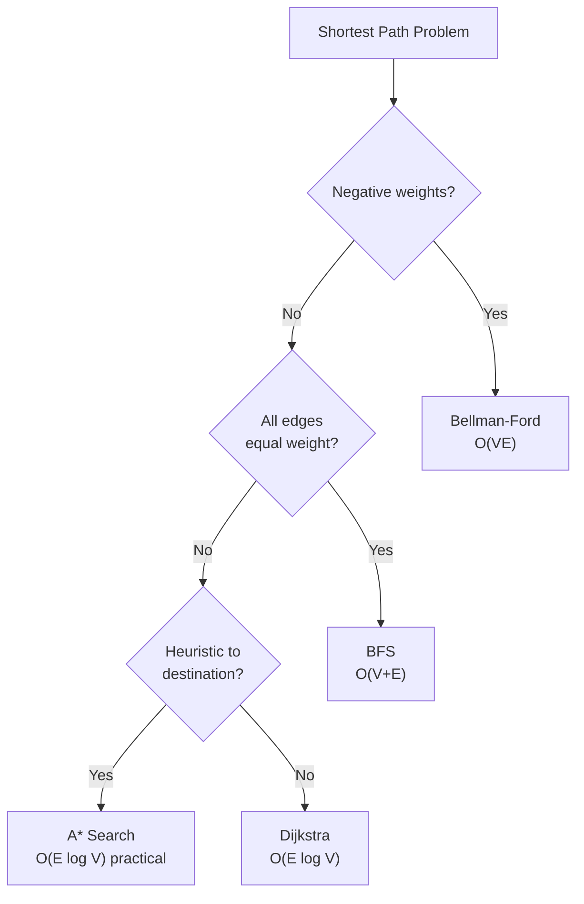

# Graph Shortest Path Patterns

**Level**: 🟡 Intermediate

## 🗺️ Quick Overview



*Choose the algorithm by the shape of your graph — not by habit. BFS for unweighted, Dijkstra for weighted non-negative, Bellman-Ford only when you must handle negatives.*

> Every navigation app, every network router, every social "degrees of separation" feature runs on shortest path algorithms. Understanding the *why* behind Dijkstra — not just the code — is what separates candidates who can adapt to modified problems from those who cannot.

## The Pattern

### Mental Model: Three Algorithms, Three Contracts

**BFS** — guarantees shortest path when all edge weights are equal (or 1). It works because it explores nodes in wave-fronts: all nodes at distance 1, then all at distance 2, etc. The first time you reach a node, you have the shortest path. No priority queue needed — a plain queue guarantees distance order.

**Dijkstra** — guarantees shortest path when all edge weights are non-negative. It is a greedy algorithm: always relax the closest unvisited node next (processed via a min-heap). The key insight: once a node is popped from the heap, its shortest distance is finalized — no future path can be shorter because all remaining paths only add more non-negative weight.

**Bellman-Ford** — handles negative weights. It cannot use the greedy insight (a negative edge might shorten a previously "finalized" path). Instead, it runs N-1 relaxation passes over all edges. Slower — O(VE) — but correct. Also detects negative cycles (if a Nth pass still improves distances, a negative cycle exists).

### Decision Flowchart

```
Is the graph unweighted (or all weights = 1)?
  → BFS.  O(V+E), optimal.

Are all weights non-negative?
  → Do you have a heuristic (admissible estimate to destination)?
    → A* search (Google Maps, game pathfinding)
  → No heuristic?
    → Dijkstra with a min-heap.  O(E log V).

Do weights include negatives?
  → No negative cycles? → Bellman-Ford. O(VE).
  → Negative cycles present? → Problem has no finite shortest path.
  → DAG (directed acyclic graph)? → Topological sort + relax. O(V+E).
```

### Why Dijkstra Works — the "why" not just the "how"

Dijkstra maintains an invariant: when a node `u` is popped from the min-heap, `dist[u]` is final.

**Proof by contradiction**: Suppose a shorter path to `u` existed. That path would have to go through some unvisited node `v` (because all previously finalized nodes are already accounted for). But `dist[v] >= dist[u]` (otherwise `v` would have been popped first). Adding any non-negative edge from `v` onward gives a path length `>= dist[u]`. Contradiction.

This is why Dijkstra breaks with negative edges: a negative edge from `v` could create a path shorter than `dist[u]` even when `dist[v] > dist[u]`.

### Dijkstra Implementation

```
function dijkstra(graph, source):
  dist = {node: infinity for node in graph}
  dist[source] = 0
  heap = min_heap([(0, source)])   // (distance, node)
  visited = set()

  while heap is not empty:
    d, u = heap.pop_min()

    if u in visited: continue     // stale entry — skip
    visited.add(u)

    for neighbor, weight in graph[u]:
      new_dist = d + weight
      if new_dist < dist[neighbor]:
        dist[neighbor] = new_dist
        heap.push((new_dist, neighbor))

  return dist

// Note: we allow duplicate entries in the heap (lazy deletion).
// When we pop a node already visited, we skip it.
// This is simpler than decrease-key and performs well in practice.
```

### BFS for Unweighted Graphs

```
function bfs_shortest_path(graph, source, target):
  dist = {source: 0}
  queue = deque([source])
  parent = {source: None}

  while queue:
    node = queue.popleft()

    if node == target:
      return reconstruct_path(parent, source, target)

    for neighbor in graph[node]:
      if neighbor not in dist:
        dist[neighbor] = dist[node] + 1
        parent[neighbor] = node
        queue.append(neighbor)

  return None  // target unreachable
```

### Bidirectional BFS

Standard BFS from source is O(b^d) where b is branching factor and d is shortest path length. Bidirectional BFS runs two simultaneous BFS waves — one from source, one from target — and terminates when they meet. This reduces complexity to O(b^(d/2)), a dramatic speedup for large sparse graphs.

```
function bidirectional_bfs(graph, source, target):
  front_visited = {source: 0}
  back_visited  = {target: 0}
  front_queue   = deque([source])
  back_queue    = deque([target])

  while front_queue or back_queue:
    // expand the smaller frontier
    if front_queue:
      node = front_queue.popleft()
      for neighbor in graph[node]:
        if neighbor not in front_visited:
          front_visited[neighbor] = front_visited[node] + 1
          front_queue.append(neighbor)
          if neighbor in back_visited:
            return front_visited[neighbor] + back_visited[neighbor]

    // mirror for back_queue...

  return -1  // no path
```

LinkedIn uses bidirectional BFS to compute degrees of separation in its 900M-node social graph. Running standard BFS from both endpoints simultaneously cuts the explored subgraph from O(millions) to O(thousands) for typical "3 degrees" queries.

## Real-World at Scale

### Google Maps — Dijkstra + A* on 250M Nodes

Google Maps' routing graph has over 250 million nodes (road intersections) and 1 billion+ edges (road segments). The system processes over 1 billion routing requests per day.

Plain Dijkstra is too slow for continent-scale routing. Google uses **A\* search** — Dijkstra augmented with a heuristic function `h(n)` that estimates the remaining distance from node `n` to the target. The heap priority becomes `f(n) = g(n) + h(n)` where `g(n)` is actual distance from source.

For road networks, a great-circle distance (straight-line distance to destination) is an admissible heuristic — it never overestimates. A\* explores far fewer nodes than Dijkstra because it prioritizes nodes geometrically closer to the destination.

Beyond A\*, Google uses **Contraction Hierarchies (CH)**: preprocess the graph to create "highway nodes" for long-distance routing. CH reduces query time from hundreds of milliseconds to under 1ms for transcontinental routes.

### Uber/Lyft — Live-Weight Dijkstra for Matching

Uber's routing system maintains a real-time weighted road graph where edge weights are travel time in seconds, updated continuously from GPS telemetry of active drivers.

When a rider requests a trip, Uber runs Dijkstra from the rider's location and from each nearby driver's location simultaneously to compute actual ETA (not crow-flies distance). The driver-rider pair with minimum combined ETA gets matched.

Uber's H3 hexagonal grid system partitions the city into hierarchical cells, allowing approximate routing with O(1) lookups for nearby cells before running exact Dijkstra within a bounded region. This caps the graph search radius and keeps latency under 100ms even at millions of concurrent users.

### OSPF Network Routing — Dijkstra in Every Router

Open Shortest Path First (OSPF) is the most widely deployed interior routing protocol in enterprise and ISP networks. Every enterprise router running OSPF executes Dijkstra's algorithm on the network topology to build its routing table.

OSPF works as follows: each router floods its link-state (neighbors + link costs) to all routers. Every router independently builds an identical topology graph and runs Dijkstra from itself as source. The resulting shortest-path tree determines the next-hop for every destination prefix.

OSPF runs Dijkstra on topology changes — link failure, link recovery, weight change. In large enterprise networks with hundreds of routers, Dijkstra on the full topology runs in milliseconds. The scale is bounded by the OSPF area (typically < 200 routers), making O(E log V) fast enough for near-instantaneous convergence.

### LinkedIn "People You May Know" — BFS in 900M-Node Graph

LinkedIn's "People You May Know" feature uses BFS in the social graph to find 2nd and 3rd degree connections. At 900M members, each with hundreds of connections, the graph has tens of billions of edges.

LinkedIn cannot run full BFS from every member. Instead:
1. **Bidirectional BFS** between two specific members computes degrees of separation in O(b^(d/2)) instead of O(b^d)
2. **Approximate graph sampling**: run BFS only within a neighborhood radius (e.g., friends-of-friends, capped at depth 2)
3. **Precomputed proximity scores** via distributed graph processing (Apache Spark GraphX) batch-compute co-occurrence features overnight

For real-time "mutual friends" display, LinkedIn uses their **TAO** distributed graph store (similar in concept to Facebook's TAO), which caches adjacency lists for hot nodes and allows BFS traversal at sub-millisecond latency per hop.

## Core Problems

### 1. Word Ladder — BFS on implicit graph

**Problem**: Transform `beginWord` to `endWord` by changing one letter at a time. Each intermediate word must be in `wordList`. Return the minimum number of transformations.

**Thought process**: This is BFS on an implicit graph. Nodes = words, edges = words differing by exactly one letter. BFS finds the shortest path (fewest transformations). Do not build the graph explicitly — generate neighbors on the fly.

```
function word_ladder(beginWord, endWord, wordList):
  word_set = set(wordList)
  if endWord not in word_set: return 0

  queue = deque([(beginWord, 1)])  // (current_word, steps)
  visited = {beginWord}

  while queue:
    word, steps = queue.popleft()
    if word == endWord: return steps

    for i in range(len(word)):
      for c in 'abcdefghijklmnopqrstuvwxyz':
        next_word = word[:i] + c + word[i+1:]
        if next_word in word_set and next_word not in visited:
          visited.add(next_word)
          queue.append((next_word, steps + 1))

  return 0

// Optimization: bidirectional BFS
// Run BFS from both beginWord and endWord simultaneously
// Meet in the middle — cuts explored space dramatically for long paths
```

Complexity: O(M² × N) where M = word length, N = wordList size. Bidirectional BFS halves the effective depth.

### 2. Cheapest Flights Within K Stops — modified Dijkstra / Bellman-Ford

**Problem**: Find the cheapest price from `src` to `dst` with at most `k` stops.

**Thought process**: Standard Dijkstra does not handle the "at most K stops" constraint — a cheaper path might require more stops. Use Bellman-Ford with exactly K+1 iterations (each iteration = one more edge/stop). Or use modified Dijkstra with state `(node, stops_remaining)`.

```
// Bellman-Ford approach — K+1 relaxation rounds
function find_cheapest_price(n, flights, src, dst, k):
  prices = [infinity] * n
  prices[src] = 0

  for i in range(k + 1):           // k stops = k+1 edges
    temp = prices.copy()            // use prices from previous round
    for from, to, price in flights:
      if prices[from] != infinity and prices[from] + price < temp[to]:
        temp[to] = prices[from] + price
    prices = temp

  return prices[dst] if prices[dst] != infinity else -1

// Modified Dijkstra — state = (cost, node, stops_used)
function find_cheapest_dijkstra(n, flights, src, dst, k):
  graph = build_adjacency_list(flights)
  heap = [(0, src, 0)]  // (cost, node, stops)
  visited = {}           // (node, stops) -> min_cost

  while heap:
    cost, node, stops = heap.pop_min()
    if node == dst: return cost
    if stops > k: continue
    if (node, stops) in visited: continue
    visited[(node, stops)] = cost

    for neighbor, price in graph[node]:
      heap.push((cost + price, neighbor, stops + 1))

  return -1
```

This is a real pattern at flight booking systems (Expedia, Kayak) and at Uber Eats / DoorDash for delivery routing with waypoint constraints.

### 3. Network Delay Time — single-source shortest path

**Problem**: Network of N nodes, directed edges with latency weights. A signal is sent from node `k`. Find the time until all nodes receive the signal (maximum of shortest paths from `k`).

**Thought process**: Classic single-source Dijkstra. The answer is the maximum distance among all reachable nodes. If any node is unreachable, return -1.

```
function network_delay_time(times, n, k):
  graph = defaultdict(list)
  for u, v, w in times:
    graph[u].append((v, w))

  dist = {i: infinity for i in range(1, n + 1)}
  dist[k] = 0
  heap = [(0, k)]

  while heap:
    d, u = heap.pop_min()
    if d > dist[u]: continue      // stale entry

    for v, w in graph[u]:
      if dist[u] + w < dist[v]:
        dist[v] = dist[u] + w
        heap.push((dist[v], v))

  max_dist = max(dist.values())
  return max_dist if max_dist != infinity else -1
```

Complexity: O(E log V). Directly models propagation latency in distributed systems — e.g., how long until a configuration change propagates to all service replicas.

### 4. Path With Minimum Effort — Dijkstra on grid

**Problem**: 2D grid of heights. Move between adjacent cells. Effort = maximum absolute difference in height along the path. Find path from top-left to bottom-right minimizing maximum effort.

**Thought process**: This is Dijkstra with a non-standard "cost" function. State = (effort_so_far, row, col). Effort to reach a neighbor = max(current_effort, |height_diff|). Min-heap orders by effort. First time we pop the destination, we have the answer.

```
function minimum_effort_path(heights):
  rows, cols = len(heights), len(heights[0])
  effort = [[infinity] * cols for _ in rows]
  effort[0][0] = 0
  heap = [(0, 0, 0)]  // (effort, row, col)

  while heap:
    e, r, c = heap.pop_min()
    if r == rows-1 and c == cols-1: return e
    if e > effort[r][c]: continue

    for dr, dc in [(0,1),(0,-1),(1,0),(-1,0)]:
      nr, nc = r + dr, c + dc
      if 0 <= nr < rows and 0 <= nc < cols:
        new_effort = max(e, abs(heights[nr][nc] - heights[r][c]))
        if new_effort < effort[nr][nc]:
          effort[nr][nc] = new_effort
          heap.push((new_effort, nr, nc))

  return effort[rows-1][cols-1]
```

Key insight: the greedy property still holds — replacing "minimum sum" with "minimum maximum" still satisfies the condition that popping the minimum-effort node finalizes it (no future path can reduce maximum effort once popped).

### 5. Swim in Rising Water — Dijkstra / binary search

**Problem**: Grid `grid[i][j]` is the elevation. At time `t`, you can swim in cells with elevation <= t. Move between adjacent cells. Find minimum time to reach bottom-right from top-left.

**Thought process**: Two approaches. (a) Binary search on answer `t`, check connectivity at each `t` using BFS/DFS. (b) Dijkstra: treat each cell's elevation as the "cost to enter" — the minimum time to reach a cell = max elevation along the path (same pattern as minimum effort).

```
// Dijkstra approach (cleaner)
function swim_in_water(grid):
  n = len(grid)
  time = [[infinity] * n for _ in n]
  time[0][0] = grid[0][0]
  heap = [(grid[0][0], 0, 0)]

  while heap:
    t, r, c = heap.pop_min()
    if r == n-1 and c == n-1: return t
    if t > time[r][c]: continue

    for dr, dc in [(0,1),(0,-1),(1,0),(-1,0)]:
      nr, nc = r + dr, c + dc
      if 0 <= nr < n and 0 <= nc < n:
        new_time = max(t, grid[nr][nc])
        if new_time < time[nr][nc]:
          time[nr][nc] = new_time
          heap.push((new_time, nr, nc))

  return time[n-1][n-1]
```

This "max along path" Dijkstra variant appears in bottleneck shortest path problems — e.g., finding the route through a network where the minimum bandwidth link is maximized (maximize the bottleneck).

## Complexity

| Algorithm | Time | Space | Constraint |
|-----------|------|-------|------------|
| BFS | O(V+E) | O(V) | Unweighted only |
| Dijkstra (binary heap) | O(E log V) | O(V+E) | Non-negative weights |
| Dijkstra (Fibonacci heap) | O(E + V log V) | O(V+E) | Dense graphs |
| A* | O(E log V) worst case, much less in practice | O(V) | Needs admissible heuristic |
| Bellman-Ford | O(VE) | O(V) | Handles negative weights |
| Bidirectional BFS | O(b^(d/2)) | O(b^(d/2)) | Unweighted, when both endpoints known |

**N vs V/E note**: In grid problems, V = rows × cols, E = 4 × rows × cols (4-directional). A 1000×1000 grid has 1M nodes and 4M edges — Dijkstra runs in O(4M × log(1M)) ≈ 80M operations, fast enough.

## Key Takeaways

- BFS = shortest path for unweighted graphs. Dijkstra = shortest path for non-negative weighted graphs. Bellman-Ford = negative weights.
- Dijkstra's greedy correctness hinges on non-negative weights: popping a node from the min-heap finalizes its distance.
- Modify Dijkstra's state to handle constraints: K stops, minimum effort, bottleneck path — change what goes in the heap and how the "cost" updates.
- Bidirectional BFS reduces O(b^d) to O(b^(d/2)) — used at LinkedIn, Facebook for degree-of-separation queries on billion-node social graphs.
- Google Maps uses A* + Contraction Hierarchies on 250M-node graphs for sub-millisecond routing. OSPF runs Dijkstra on network topology in every enterprise router.
- Interview tell: weighted graph + find shortest/cheapest path → Dijkstra. Constraints on number of steps/stops → Bellman-Ford or Dijkstra with (node, constraint) state.
