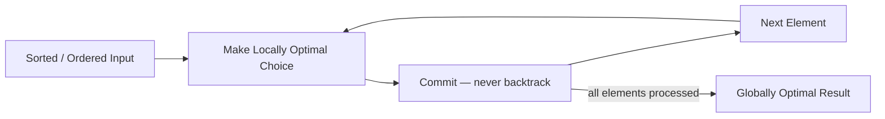

# Greedy Algorithms

**Level**: 🟡 Intermediate

## 🗺️ Quick Overview



*Sort once, sweep left-to-right, make the best local decision at each step — no revisiting, no regret.*

> Greedy algorithms are deceptively simple to code and devastatingly hard to prove correct — but once you recognize the pattern, they turn O(N²) DP into O(N log N) solutions used in every router, compressor, and task scheduler on earth.

## The Pattern

### What makes a problem "greedy-solvable"?

A greedy approach works when the problem has **greedy choice property**: making the locally optimal choice at each step does not foreclose a globally optimal solution. Formally, you can always construct an optimal solution that includes the greedy choice.

**The exchange argument** — the canonical proof technique:

Assume an optimal solution O does NOT include your greedy choice G at some step. Show that you can swap O's choice for G and the solution gets no worse (and often strictly better). If you can always make that swap, greedy is correct.

You do not need to memorize formal proofs for interviews. The intuition is: *"would delaying or reversing this decision ever help me?"* If the answer is no, greedy applies.

### Recognition signals

Ask yourself these questions:

1. **Can you sort the input and make decisions left-to-right?** (interval scheduling, activity selection)
2. **Does delaying a decision ever help?** If not, commit now.
3. **Is the problem asking for minimum/maximum count** of something? (minimum arrows, minimum platforms, minimum intervals to remove)
4. **Does the problem have a "deadline" or "expiration"?** (task scheduling, coupon expiry)
5. **Are you choosing from a set and order matters?** (Huffman coding, optimal merge)
6. **The brute force is "try all subsets"** but there is a natural ordering? Greedy collapses the search.

### Greedy vs DP — the decisive question

| | Greedy | DP |
|-|--------|----|
| Subproblem dependency | Independent — one choice, move on | Overlapping — need results from multiple prior states |
| Commitment | Commit immediately, no backtrack | Explore all options, pick best at end |
| Correctness | Must prove via exchange argument | Always correct if transitions are right |
| Typical complexity | O(N log N) — sort + linear sweep | O(N²) or O(N × K) |
| Signal | "closest deadline first", "earliest end time" | "how many ways", "minimum cost across choices" |

**Trap**: When greedy feels right but DP is needed. Example: coin change with arbitrary denominations. If coins are [1, 3, 4] and amount is 6, greedy picks 4+1+1 = 3 coins, but DP finds 3+3 = 2 coins. Greedy only works for canonical coin systems (like US coins).

### The greedy template

```
function greedy_template(items):
  // Step 1: sort by the "greedy criterion"
  items.sort(by: greedy_criterion)

  result = initial_state
  for item in items:
    if item is compatible with current result:
      commit(item, result)      // take it
    else:
      skip(item) or replace(item, result)  // skip or exchange

  return result
```

Choosing the sort key is the entire algorithm design. Get it wrong and you get wrong answers. Examples:
- Interval scheduling: sort by **end time** (not start time, not duration)
- Task scheduling with deadlines: sort by **deadline**
- Fractional knapsack: sort by **value/weight ratio**
- Huffman: always merge the **two lowest-frequency** nodes

## Real-World at Scale

### Kubernetes Scheduler — Greedy Bin-Packing

When you run `kubectl apply`, the Kubernetes scheduler must assign each pod to a node. With millions of pods across thousands of nodes in Google GKE, this is solved greedily:

1. **Filter phase**: eliminate nodes that cannot satisfy the pod's resource requests
2. **Score phase**: rank remaining nodes by a scoring function — the default `LeastAllocated` scorer greedily prefers the node with the most remaining capacity
3. **Assign**: pick the highest-scoring node, commit

This runs millions of scheduling decisions per day across Google's fleet. The greedy bin-packing approximation works because optimal bin-packing is NP-hard — greedy gets within a provable approximation factor in O(N log N) per pod.

At Amazon ECS and AWS Fargate, the same greedy spread/binpack strategies are configurable placement strategies.

### Huffman Coding — gzip, zlib, HTTP Compression

Every file you compress and every HTTP response Chrome receives over the wire uses Huffman coding — a greedy algorithm.

The algorithm: build an optimal prefix-free binary code for symbols by frequency:
1. Put all symbols in a min-heap ordered by frequency
2. Repeatedly extract the two lowest-frequency nodes, merge them into a parent with combined frequency, re-insert
3. The resulting tree assigns shortest codes to most-frequent symbols

**Why greedy works**: the exchange argument shows that the two least-frequent symbols must be deepest in any optimal tree (if not, swap them down — cost only decreases). This anchors the greedy induction.

Chrome uses zlib's Huffman-based DEFLATE for compressing HTTP responses. Google serves 8.5 billion searches/day — every compressed response uses this greedy tree construction. RFC 7541 (HTTP/2 HPACK) uses a static Huffman table pre-built from web traffic frequency analysis.

### Netflix CDN — Greedy Cache Eviction

Netflix's Open Connect CDN serves over 500 Gbps of video traffic. Each edge appliance must decide which titles to evict when storage fills up.

LRU (Least Recently Used) is a greedy policy: evict the item not used for the longest time. LFU (Least Frequently Used) evicts the item with the fewest access counts. Both are greedy: they commit to one eviction choice locally without global planning.

Netflix's actual policy is more sophisticated (popularity + file-size-weighted), but the core is still greedy: sort by "value density" (expected future views per GB), evict the lowest, repeat. This runs continuously on thousands of appliances worldwide.

### Stripe / Task Queue Systems — Deadline Scheduling

Stripe's payment processing and Lyft's background job infrastructure face a classic problem: you have N tasks, each with a deadline and processing time. Maximize the number of tasks completed before their deadlines.

The greedy solution: sort by deadline, process in deadline order. If adding the next task would miss its deadline, skip it (or in EDF — Earliest Deadline First — preempt the longest-running current task).

EDF scheduling is provably optimal for single-processor deadline scheduling. Linux's SCHED_DEADLINE scheduler implements EDF for real-time tasks. Financial systems (high-frequency trading settlement, ACH batch processing) use deadline-ordered queues for exactly this reason.

## Core Problems

### 1. Jump Game — can you reach the end?

**Problem**: Array `nums` where `nums[i]` is the max jump length from index `i`. Can you reach the last index?

**Thought process**: At each index, you have a "reach" — the farthest position you can get to from all positions seen so far. Greedy insight: always track the maximum reach. If you're at a position beyond the current max reach, you're stuck.

```
function can_jump(nums):
  max_reach = 0

  for i in range(len(nums)):
    if i > max_reach:
      return False       // can't reach this position
    max_reach = max(max_reach, i + nums[i])

  return True

// Jump Game II — minimum jumps to reach end
function min_jumps(nums):
  jumps = 0
  current_end = 0    // end of current jump's range
  farthest = 0       // farthest reachable from current range

  for i in range(len(nums) - 1):
    farthest = max(farthest, i + nums[i])
    if i == current_end:     // exhausted current jump range
      jumps += 1
      current_end = farthest

  return jumps
```

Complexity: O(N) time, O(1) space. The greedy insight: at each "level" (like BFS), greedily take the jump that extends your reach the farthest.

### 2. Meeting Rooms II — minimum conference rooms

**Problem**: Given meeting intervals `[start, end]`, find the minimum number of conference rooms required.

**Thought process**: This is a resource allocation problem. Greedy: sort by start time, use a min-heap of current end times. For each new meeting, if the earliest-ending room is free (end <= current start), reuse it. Otherwise, open a new room.

```
function min_meeting_rooms(intervals):
  intervals.sort(by: start_time)
  heap = min_heap()  // tracks end times of ongoing meetings

  for start, end in intervals:
    if heap is not empty and heap.min() <= start:
      heap.pop()     // reuse the room that freed up earliest
    heap.push(end)   // assign this meeting to a room

  return heap.size()
```

Complexity: O(N log N) for sort + heap. This exact pattern appears in resource scheduling at AWS (EC2 reservation packing), capacity planning, and interview scheduling systems.

### 3. Task Scheduler — CPU idle time

**Problem**: Given tasks with cooldown n (same task type cannot repeat within n steps), find minimum time to finish all tasks.

**Thought process**: The bottleneck is the most frequent task. Greedy: always schedule the most frequent remaining task. Use a max-heap.

```
function task_scheduler(tasks, n):
  freq = frequency_map(tasks)
  max_heap = max_heap(freq.values())
  time = 0

  while max_heap is not empty:
    cycle = []
    for _ in range(n + 1):     // fill one cooldown window
      if max_heap is not empty:
        cycle.append(max_heap.pop())

    for count in cycle:
      if count - 1 > 0:
        max_heap.push(count - 1)

    time += (n + 1) if max_heap is not empty else len(cycle)

  return time

// Mathematical shortcut:
// max_time = max((max_freq - 1) * (n + 1) + count_of_max_freq, len(tasks))
```

The mathematical shortcut is a greedy observation: the most frequent task determines the minimum frame structure. Real-world use: Kubernetes job controller uses similar logic to spread pod restarts with backoff intervals.

### 4. Minimum Number of Arrows to Burst Balloons

**Problem**: Balloons are represented as `[x_start, x_end]` on a horizontal axis. One arrow shot at x bursts all balloons containing x. Find minimum arrows.

**Thought process**: This is interval covering. Greedy: sort by end coordinate. Shoot an arrow at the earliest end point of the current balloon. This arrow bursts all overlapping balloons. Move to the next un-burst balloon.

```
function find_min_arrows(points):
  points.sort(by: end_coordinate)
  arrows = 1
  arrow_pos = points[0][1]  // shoot at end of first balloon

  for start, end in points[1:]:
    if start > arrow_pos:   // this balloon is not hit
      arrows += 1
      arrow_pos = end       // shoot at end of this balloon

  return arrows
```

Complexity: O(N log N). This is structurally identical to "minimum number of intervals to remove to make non-overlapping" — same sort key, same sweep.

### 5. Gas Station — circular route feasibility

**Problem**: N gas stations in a circle. `gas[i]` is fuel available, `cost[i]` is fuel to travel to next station. Find starting station to complete the circuit, or -1 if impossible.

**Thought process**: Two greedy observations:
1. If total gas >= total cost, a solution exists.
2. If starting at station s you run out at station t, no station between s and t can be the start (all would fail earlier). So jump start to t+1.

```
function can_complete_circuit(gas, cost):
  total_tank = 0
  current_tank = 0
  start = 0

  for i in range(len(gas)):
    gain = gas[i] - cost[i]
    total_tank += gain
    current_tank += gain

    if current_tank < 0:
      start = i + 1       // greedy: skip everything up to here
      current_tank = 0

  return start if total_tank >= 0 else -1
```

Complexity: O(N) — single pass. Real-world analog: route planning with constrained fuel (Uber's fuel-constrained routing, drone delivery path planning).

## Complexity

| Problem | Time | Space | Greedy Key |
|---------|------|-------|------------|
| Jump Game | O(N) | O(1) | Track max reach |
| Meeting Rooms II | O(N log N) | O(N) | Sort by start, heap of ends |
| Task Scheduler | O(N log N) | O(N) | Always schedule most frequent |
| Min Arrows | O(N log N) | O(1) | Sort by end, shoot at end |
| Gas Station | O(N) | O(1) | Skip failed segments |
| Interval Scheduling (max non-overlapping) | O(N log N) | O(1) | Sort by end time |
| Fractional Knapsack | O(N log N) | O(1) | Sort by value/weight ratio |
| Huffman Coding | O(N log N) | O(N) | Merge two lowest freq nodes |

## Key Takeaways

- Greedy works when the **exchange argument** holds: you can always swap in the greedy choice without making the solution worse
- The **sort key is the algorithm**: end time for interval scheduling, deadline for task scheduling, value/weight for knapsack
- If greedy gives wrong answers on small examples (like coin change with non-canonical coins), switch to DP
- Greedy is usually O(N log N) — sort + linear sweep. DP is O(N²) or more. When both work, greedy is strongly preferred at scale
- Real systems that use greedy: Kubernetes scheduler (bin-packing), gzip/zlib (Huffman), Linux EDF scheduler (deadlines), Netflix CDN (LRU/LFU eviction), OSPF routing (Dijkstra is greedy)
- Interview tell: if the problem says "minimum number of X" or "maximum number of non-overlapping Y" and involves intervals or deadlines — reach for greedy first
