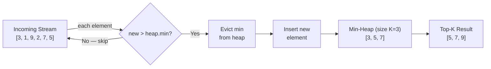

# Heap / Top-K Pattern

**Level**: 🟡 Intermediate

## 🗺️ Quick Overview



*A min-heap of size K evicts the smallest candidate whenever a larger element arrives — O(N log K) vs O(N log N) for a full sort.*

> Use a min-heap of size K to maintain the top-K largest elements seen so far. Each insertion is O(log K) — far better than sorting all N elements just to get the top K.

## The Pattern

When you need the K largest (or smallest) elements from N items, the naive approach sorts everything: O(N log N). The heap approach maintains a size-K heap: O(N log K). For K << N, this is dramatically faster.

**The trick for "top-K largest"**: use a **min-heap** of size K. The minimum of the heap is the smallest of your top-K candidates. When you see a new element larger than the heap minimum, swap it in (remove min, add new element).

**Recognition signals:**
- "K largest/smallest elements"
- "K most frequent elements"
- "Merge K sorted arrays/lists"
- "Find the Kth largest element in a stream"
- "Sliding window maximum" (use monotonic deque instead, but heap works too)

## Template Pseudocode

```
// Top-K largest elements from a stream
function top_k_largest(stream, k):
  min_heap = MinHeap()   // size ≤ K, contains K largest seen so far

  for element in stream:
    if min_heap.size() < k:
      min_heap.push(element)
    elif element > min_heap.peek():   // element is larger than smallest top-K
      min_heap.pop()
      min_heap.push(element)
    // else: element is smaller than all top-K → ignore it

  return min_heap.to_list()   // these are the top-K elements

// Top-K most frequent elements
function top_k_frequent(arr, k):
  // Step 1: count frequencies
  freq = count_occurrences(arr)   // {element: count}

  // Step 2: use min-heap on frequency
  min_heap = MinHeap(key=lambda x: x.count)

  for element, count in freq.items():
    min_heap.push({element: element, count: count})
    if min_heap.size() > k:
      min_heap.pop()   // remove least frequent of the top-K candidates

  return [item.element for item in min_heap.to_list()]

// Merge K sorted arrays
function merge_k_sorted(arrays):
  // Initialize heap with first element from each array
  min_heap = MinHeap(key=lambda x: x.value)
  result = []

  for i, arr in enumerate(arrays):
    if arr:
      min_heap.push({value: arr[0], array_index: i, element_index: 0})

  while min_heap is not empty:
    item = min_heap.pop_min()
    result.append(item.value)

    // Add next element from the same array
    next_idx = item.element_index + 1
    if next_idx < len(arrays[item.array_index]):
      min_heap.push({
        value: arrays[item.array_index][next_idx],
        array_index: item.array_index,
        element_index: next_idx
      })

  return result
```

## 3 Example Problems

### Problem 1: Kth Largest Element in a Stream

Design a class that finds the Kth largest element in a stream. Each `add(val)` call returns the Kth largest.

```
class KthLargest:
  function init(k, initial_elements):
    self.k = k
    self.heap = MinHeap()
    for el in initial_elements:
      self.add(el)

  function add(val):
    self.heap.push(val)
    if self.heap.size() > self.k:
      self.heap.pop()    // remove smallest — we only keep top K
    return self.heap.peek()   // Kth largest = minimum of top-K heap
// Each add: O(log K)
```

### Problem 2: K Closest Points to Origin

```
function k_closest_points(points, k):
  function distance_sq(p):
    return p.x * p.x + p.y * p.y   // no need for sqrt

  // Use MAX-heap of size K (keep K closest = K smallest distances)
  // Max-heap: if new point is closer than the farthest in heap, swap
  max_heap = MaxHeap(key=distance_sq)

  for point in points:
    max_heap.push(point)
    if max_heap.size() > k:
      max_heap.pop()   // remove the farthest point

  return max_heap.to_list()
// Time: O(N log K)
```

### Problem 3: Merge K Sorted Arrays (from problem template above)

```
// Using the merge_k_sorted function from template
// Example: K=4 sorted arrays each of length N/K
// Total N elements, K arrays
// Each element: pushed once and popped once from heap of size K
// Time: O(N log K)
// vs concatenate + sort: O(N log N)
// For K=4, log K = 2, log N = 20 → 10x faster
```

## In Real Systems

**Twitter trending hashtags** — The top-10 trending topics in each geographic region are maintained using a min-heap of size 10. Events from billions of tweets are processed as a stream; only O(log 10) work per tweet to update the leaderboard.

**Database monitoring** — MySQL's "slow query log" and `INFORMATION_SCHEMA.PROCESSLIST` use similar top-K heap logic to surface the K slowest queries without storing all query execution data.

**Prometheus / monitoring systems** — `topk(10, rate(http_requests_total[5m]))` PromQL function uses heap-based selection to find top-K time series by value.

**Log aggregation (Elasticsearch)** — "Show me the top 100 error messages by frequency" uses a priority queue internally to aggregate across shards and return the top K across the distributed result.

**Leaderboards in gaming** — A Redis sorted set is essentially a heap-like structure. Getting the top 10 players is O(log N + K) using ZREVRANGE.

## Complexity

| Operation | Time | Space |
|-----------|------|-------|
| Build top-K from N elements | O(N log K) | O(K) |
| Insert into heap | O(log K) | — |
| Get current top-K | O(K) | — |
| Merge K sorted arrays, N total elements | O(N log K) | O(K) |
| Full sort (comparison) | O(N log N) | O(1)–O(N) |

## Key Takeaways

- Min-heap of size K maintains the K largest elements seen — the heap minimum is the Kth largest
- For "top-K largest": use min-heap. For "top-K smallest": use max-heap.
- Each element is processed in O(log K) — total O(N log K) vs O(N log N) for full sort
- Merge K sorted arrays is a classic application: heap has K elements, one per array
- Twitter trending, database slow query logs, monitoring top-K metrics all use this pattern
