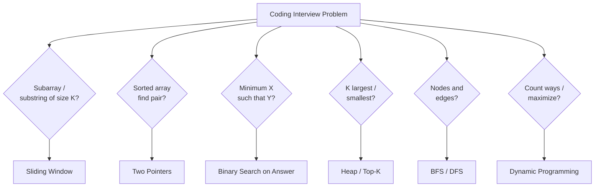

# Algorithmic Interview Patterns

**Level**: 🟢 Beginner to 🔴 Advanced

> Most coding interview problems are variations of ~10 fundamental patterns. Learn the pattern, recognize it in new problems, apply the template — and you'll handle 80% of what interviewers throw at you.



## Why Patterns Beat Problem Memorization

There are thousands of coding problems. Memorizing solutions doesn't scale. But these 10 patterns cover the vast majority of array, string, graph, and DP problems you'll encounter at FAANG and equivalent companies.

The goal isn't to memorize — it's to develop pattern recognition: "this problem asks for the optimal subarray → sliding window."

## Pattern Catalog

| Pattern | Difficulty | Typical Signal in Problem |
|---------|-----------|--------------------------|
| [Sliding Window](./sliding-window-pattern) | 🟡 | "subarray/substring of size K", "stream analytics" |
| [Two Pointers](./two-pointers-pattern) | 🟢 | "sorted array", "find pair", "remove duplicates" |
| [Binary Search on Answer](./binary-search-on-answer) | 🟡 | "minimum X that satisfies Y", monotonic feasibility |
| [Monotonic Stack](./monotonic-stack-pattern) | 🟡 | "next greater/smaller element", histogram |
| [Prefix Sum](./prefix-sum-pattern) | 🟢 | "range sum query", "subarray with target sum" |
| [Heap / Top-K](./heap-top-k-pattern) | 🟡 | "K largest/smallest", "merge K sorted" |
| [Graph BFS/DFS](./graph-bfs-dfs-pattern) | 🟡 | "shortest path", "connected components", "reachability" |
| [Dynamic Programming](./dynamic-programming-patterns) | 🔴 | "count ways", "maximize/minimize", "optimal substructure" |
| [Union-Find](./union-find-pattern) | 🟡 | "connected components", "grouping", "cycle in undirected graph" |
| [Interval Scheduling](./interval-scheduling-pattern) | 🟡 | "overlapping intervals", "meeting rooms", "merge ranges" |

## How to Use This Section

Each article follows this structure:
1. **The Pattern** — what it is and how to recognize it
2. **Template Pseudocode** — the reusable skeleton
3. **3 Example Problems** — applying the template to real problems
4. **In Real Systems** — where this pattern appears in production code

## Recognition Heuristics

When you see a problem, ask:

```
Does it involve a contiguous subarray/substring?   → Sliding Window
Does it have a sorted array with a pair/target?    → Two Pointers
Does it ask "minimum X such that"?                 → Binary Search on Answer
Does it ask "next greater/smaller"?                → Monotonic Stack
Does it ask for many range sum queries?            → Prefix Sum
Does it ask for K largest/smallest/frequent?       → Heap
Does it have nodes and edges?                      → BFS (shortest) or DFS (components)
Does it count/optimize with overlapping subproblems?  → Dynamic Programming
Does it group things together?                     → Union-Find
Does it involve overlapping time ranges?           → Interval Scheduling
```

## Beyond Interviews: These Patterns in Production

These patterns aren't just interview tricks — they appear directly in production systems:
- **Sliding window** → rate limiting, time-series analytics
- **Heap/Top-K** → leaderboards, trending hashtags, slow query logs
- **BFS** → social network degrees of separation, network routing
- **DP** → spell checking, sequence alignment, resource optimization
- **Topological Sort** → build systems, dependency resolution (covered in distributed section)
