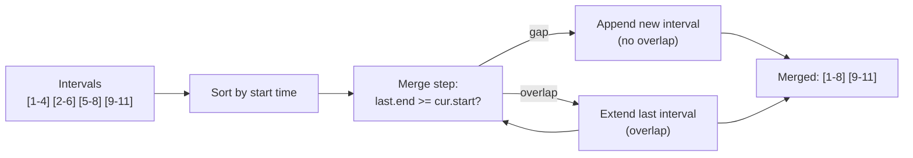

# Interval Scheduling Pattern

**Level**: 🟡 Intermediate

## 🗺️ Quick Overview



*Sort by start time once, then a single linear pass merges or counts overlaps — the sort is the key that makes greedy strategies work.*

> Most interval problems reduce to three patterns: merge overlapping intervals, find minimum resources for concurrent intervals, or schedule the maximum number of non-overlapping intervals. Sort first, then apply the right greedy strategy.

## The Pattern

Interval problems involve ranges `[start, end]` that may overlap. The key operation: **sort by start time** (or by end time for greedy scheduling), then process sequentially using a stack, heap, or counter.

**Recognition signals:**
- "Merge overlapping intervals"
- "Find minimum number of conference rooms / servers / platforms"
- "Maximum number of non-overlapping meetings"
- "Insert a new interval into a sorted list"
- "Find free time slots"

## Template Pseudocode

```
// Pattern 1: Merge overlapping intervals
function merge_intervals(intervals):
  if not intervals: return []

  intervals.sort(key=lambda x: x.start)
  merged = [intervals[0]]

  for i in range(1, len(intervals)):
    current = intervals[i]
    last_merged = merged[-1]

    if current.start <= last_merged.end:
      // Overlapping → extend the last merged interval
      last_merged.end = max(last_merged.end, current.end)
    else:
      // Non-overlapping → start a new interval
      merged.append(current)

  return merged

// Pattern 2: Minimum rooms/servers for concurrent intervals
function min_rooms(intervals):
  // Sort start times and end times separately
  // Use two pointers to simulate: count how many are open at any moment
  starts = sorted(interval.start for interval in intervals)
  ends = sorted(interval.end for interval in intervals)

  rooms = 0
  max_rooms = 0
  s, e = 0, 0

  while s < len(starts):
    if starts[s] < ends[e]:
      rooms += 1        // new meeting started
      s += 1
    else:
      rooms -= 1        // a meeting ended
      e += 1
    max_rooms = max(max_rooms, rooms)

  return max_rooms

// Pattern 3: Maximum non-overlapping intervals (Activity Selection)
function max_non_overlapping(intervals):
  // Sort by END time — greedy: finish earliest first to leave room for more
  intervals.sort(key=lambda x: x.end)
  count = 0
  last_end = -infinity

  for interval in intervals:
    if interval.start >= last_end:
      count += 1            // this interval doesn't overlap with last selected
      last_end = interval.end

  return count
```

## 3 Example Problems

### Problem 1: Meeting Rooms — Can One Person Attend All?

```
function can_attend_all_meetings(intervals):
  intervals.sort(key=lambda x: x.start)

  for i in range(1, len(intervals)):
    if intervals[i].start < intervals[i-1].end:
      return false   // overlap found

  return true
// Time: O(N log N) for sort
```

### Problem 2: Minimum Servers to Handle Overlapping Requests

Using the min_rooms pattern from the template — identical problem to conference rooms.

```
function min_servers(requests):
  // Each request is an interval [arrival_time, completion_time]
  // Minimum servers = maximum number of concurrent requests
  return min_rooms(requests)
// Time: O(N log N) for sort
// This is the fundamental resource sizing problem
```

### Problem 3: Insert New Interval into Sorted List

```
function insert_interval(intervals, new_interval):
  result = []
  i = 0
  n = len(intervals)

  // Add all intervals that end before new_interval starts
  while i < n and intervals[i].end < new_interval.start:
    result.append(intervals[i])
    i += 1

  // Merge all overlapping intervals with new_interval
  while i < n and intervals[i].start <= new_interval.end:
    new_interval.start = min(new_interval.start, intervals[i].start)
    new_interval.end = max(new_interval.end, intervals[i].end)
    i += 1

  result.append(new_interval)

  // Add remaining intervals
  while i < n:
    result.append(intervals[i])
    i += 1

  return result
// Time: O(N)
```

## In Real Systems

**Calendar systems — conflict detection**: Google Calendar and Outlook check if a new meeting overlaps with existing ones. This is the "can attend all meetings" check on sorted intervals. Calendar APIs return free/busy slots using merge_intervals.

**Database lock management**: A database transaction acquires row-level locks for a duration. Detecting deadlock potential involves checking if lock intervals overlap for the same resource. The "minimum lock servers" pattern tells you the maximum lock contention.

**Video streaming — buffer segment merging**: A video player downloads chunks that may arrive out of order. The downloaded segments are stored as intervals (start_byte, end_byte). `merge_intervals` computes what's been received; gaps show what still needs to be fetched.

**Cloud scheduler — minimize resource fragmentation**: Given N jobs with [start_time, end_time] and resource requirements, how many machines do you need? This is min_rooms applied to cloud VM scheduling. Tools like Kubernetes' scheduler solve a more complex variant.

**Load balancer capacity planning**: Given historical request traces (each as a duration interval), use min_rooms to find the peak concurrent requests — this determines how many backend instances you need.

## Complexity

| Pattern | Time | Space |
|---------|------|-------|
| Merge intervals | O(N log N) | O(N) for output |
| Minimum rooms | O(N log N) | O(N) for separate sorted arrays |
| Max non-overlapping (activity selection) | O(N log N) | O(1) |
| Insert interval (sorted input) | O(N) | O(N) for output |

## Key Takeaways

- Sort by start time first — this is the foundation of almost all interval problems
- Merge overlapping intervals: extend the last merged interval if there's overlap
- Minimum rooms: sort starts and ends separately; two-pointer sweep counts concurrent intervals
- Activity selection (max non-overlapping): sort by end time, greedily pick earliest-finishing
- These patterns power calendar conflict detection, cloud scheduling, and buffer management in production
