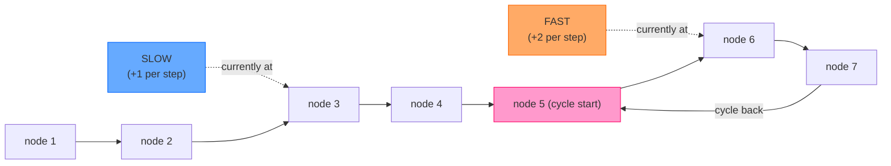

# Linked List Patterns

**Level**: 🟢 Beginner-Intermediate

## 🗺️ Quick Overview



*Slow moves one step; fast moves two. In a cycle, fast gains one lap on slow per traversal — they MUST eventually occupy the same node. This is Floyd's cycle detection algorithm.*

> Linked list problems are solved by a small set of pointer manipulation tricks. Master fast/slow pointers, reversal, and the dummy-head pattern and you can solve 90% of linked list interview questions.

## The Pattern

### Recognition Signals

| Signal in problem | Technique |
|-------------------|-----------|
| "Detect a cycle" | Fast/slow pointers (Floyd's algorithm) |
| "Find the middle without knowing length" | Fast/slow pointers — slow is at middle when fast hits end |
| "Find Nth node from the end" | Two pointers N apart |
| "Reverse the list" (or part of it) | Iterative three-pointer reversal |
| "Merge two sorted lists" | Merge with dummy head |
| "Detect cycle AND find where it starts" | Floyd's + second phase |
| "Reorder list", "rotate list" | Find middle → reverse second half → merge |

### The Dummy Head Trick

The most common source of off-by-one bugs in linked list code is handling the head as a special case. The dummy head eliminates this:

```
// Without dummy head: messy head handling
function reverse_without_dummy(head):
  if head is null or head.next is null: return head
  prev = null
  curr = head
  // ... special handling needed when curr reaches null

// With dummy head: uniform code for all nodes
function merge_sorted_lists(l1, l2):
  dummy = ListNode(0)    // dummy.next will be our real head
  curr = dummy

  while l1 is not null and l2 is not null:
    if l1.val <= l2.val:
      curr.next = l1
      l1 = l1.next
    else:
      curr.next = l2
      l2 = l2.next
    curr = curr.next

  curr.next = l1 if l1 is not null else l2   // attach remaining
  return dummy.next   // skip the dummy
// The dummy lets curr.next always be a valid operation — no null checks for "first element"
```

## Core Problems

### Problem 1: Detect a Cycle (Floyd's Algorithm)

**Thought process**: "If the list has a cycle, will we ever reach null? No — we loop forever." The insight: use two pointers moving at different speeds. In a cycle, the fast pointer laps the slow pointer — they are guaranteed to meet.

**Why they must meet**: In a cycle of length C, the fast pointer gains exactly 1 node on the slow pointer per step. Starting from any offset, they will meet in at most C steps.

```
function has_cycle(head):
  slow = head
  fast = head

  while fast is not null and fast.next is not null:
    slow = slow.next         // move 1 step
    fast = fast.next.next    // move 2 steps

    if slow == fast:
      return true   // pointers met — cycle detected

  return false   // fast reached end — no cycle
// Time: O(N), Space: O(1)
// Key insight: O(1) space vs the naive O(N) visited-set approach
```

### Problem 2: Find Cycle Entry Point (Floyd's Phase 2)

**Thought process**: "We know there's a cycle, but where does it start?" Floyd's algorithm has a beautiful mathematical property: once slow and fast meet, the distance from the meeting point to the cycle entry equals the distance from the head to the cycle entry. Reset one pointer to head and advance both one step at a time — they meet at the cycle entry.

```
function cycle_entry(head):
  slow = head
  fast = head

  // Phase 1: detect meeting point
  while fast is not null and fast.next is not null:
    slow = slow.next
    fast = fast.next.next
    if slow == fast: break

  if fast is null or fast.next is null: return null   // no cycle

  // Phase 2: find entry point
  // Mathematical proof: distance(head → entry) == distance(meeting_point → entry)
  fast = head   // reset fast to head
  while slow != fast:
    slow = slow.next
    fast = fast.next   // both move 1 step now

  return slow   // cycle entry point
// Time: O(N), Space: O(1)
```

### Problem 3: Reverse a Linked List

**Thought process**: "I need to flip all the next pointers." Three pointers: `prev` (node before current), `curr` (node being processed), `next_node` (saved to avoid losing the chain). Process one node per iteration.

```
// Iterative reversal — preferred in production (no stack overflow risk)
function reverse_list(head):
  prev = null
  curr = head

  while curr is not null:
    next_node = curr.next   // SAVE: before we overwrite curr.next

    curr.next = prev        // REVERSE: point curr back to previous node

    prev = curr             // ADVANCE prev: it's now the new "previous"
    curr = next_node        // ADVANCE curr: move to saved next node

  return prev   // prev is now the new head (the old tail)
// Time: O(N), Space: O(1)

// Recursive reversal — elegant but O(N) stack space
function reverse_list_recursive(head):
  if head is null or head.next is null:
    return head   // base case: single node or empty

  new_head = reverse_list_recursive(head.next)   // reverse the tail
  head.next.next = head   // make the next node point BACK to head
  head.next = null        // sever head's forward link

  return new_head
// Time: O(N), Space: O(N) — call stack depth equals list length
```

**Why reversals matter**: reverse is not just a standalone problem. It is a building block for "reorder list" (reverse second half), "palindrome linked list" (reverse second half, compare), and "rotate list" (find new tail, sever, reconnect).

### Problem 4: Find the Middle of a Linked List

**Thought process**: "I need the middle node but I don't know the length." Fast/slow pointers again: when fast reaches the end, slow is exactly at the middle.

```
function find_middle(head):
  slow = head
  fast = head

  // When fast reaches end (null or last node), slow is at middle
  while fast is not null and fast.next is not null:
    slow = slow.next
    fast = fast.next.next

  return slow   // middle node (for even length, this returns the second middle)
// Time: O(N), Space: O(1)

// Application: reverse the second half and check palindrome
function is_palindrome(head):
  middle = find_middle(head)
  second_half = reverse_list(middle)   // reverse from middle to end

  p1 = head
  p2 = second_half
  while p2 is not null:
    if p1.val != p2.val: return false
    p1 = p1.next
    p2 = p2.next

  return true
```

### Problem 5: Remove Nth Node from End of List

**Thought process**: "I need to remove the Nth node from the end, but I don't know the length." Use two pointers N apart: advance the leading pointer N steps, then move both at the same speed. When the leader hits null, the trailer is at the Nth-from-last node.

```
function remove_nth_from_end(head, n):
  dummy = ListNode(0)
  dummy.next = head
  leader = dummy
  trailer = dummy

  // Advance leader by N+1 steps (N+1 so trailer stops at NODE BEFORE the target)
  for _ in range(n + 1):
    leader = leader.next

  // Move both until leader falls off the end
  while leader is not null:
    leader  = leader.next
    trailer = trailer.next

  // trailer.next is the node to remove
  trailer.next = trailer.next.next

  return dummy.next
// Time: O(N), Space: O(1)
// The dummy head handles the edge case of removing the head node cleanly
```

## LRU Cache — The Real-World Linked List

The most important production application of doubly-linked lists is the **LRU (Least Recently Used) cache** — used in browser caches, CDN edge nodes, Redis's memory eviction, and CPU L2/L3 cache controllers.

```
// LRU Cache: O(1) get and put
// Data structure: HashMap (key → node) + Doubly Linked List (order of use)

class LRUCache:
  function __init__(capacity):
    this.capacity = capacity
    this.cache = {}   // key → ListNode

    // Dummy head and tail: no null checks needed
    this.head = ListNode(0, 0)   // most recently used end
    this.tail = ListNode(0, 0)   // least recently used end
    this.head.next = this.tail
    this.tail.prev = this.head

  function get(key):
    if key not in this.cache: return -1
    node = this.cache[key]
    this._move_to_front(node)   // mark as most recently used
    return node.val

  function put(key, value):
    if key in this.cache:
      node = this.cache[key]
      node.val = value
      this._move_to_front(node)
    else:
      node = ListNode(key, value)
      this.cache[key] = node
      this._add_to_front(node)

      if len(this.cache) > this.capacity:
        // Evict least recently used (node before tail)
        lru = this.tail.prev
        this._remove(lru)
        del this.cache[lru.key]

  function _remove(node):
    node.prev.next = node.next
    node.next.prev = node.prev

  function _add_to_front(node):
    node.prev = this.head
    node.next = this.head.next
    this.head.next.prev = node
    this.head.next = node

  function _move_to_front(node):
    this._remove(node)
    this._add_to_front(node)
// get: O(1), put: O(1)
// HashMap for O(1) lookup, doubly linked list for O(1) remove + reinsert
```

The doubly-linked list is essential here: to remove a node in O(1), you need `node.prev` (singly-linked lists can only remove in O(N) without knowing the predecessor).

## Real-World at Scale

### OS Memory Allocators — jemalloc and tcmalloc

jemalloc (used by Firefox, Redis, and many others) and tcmalloc (used by Google's C++ services) maintain **free lists** as singly-linked lists of available memory blocks per size class. When you call `malloc(256)`, the allocator pops the head of the 256-byte free list — O(1). When you call `free(ptr)`, it pushes onto the free list — O(1). The structure enables fast allocation without any system call for cached sizes. tcmalloc handles billions of allocations per second in Google's production servers using this pattern.

### LRU Cache — Every CDN and Browser

Cloudflare's edge nodes use LRU eviction to keep the hot 10% of content that satisfies 90% of traffic in their 250 PoPs. Nginx's `proxy_cache` uses an LRU doubly-linked list. Chrome's HTTP disk cache uses a variant of LRU. Redis's `maxmemory-policy allkeys-lru` is backed by a pool-based approximate LRU. The core data structure in all of these: HashMap + doubly-linked list.

### Undo / Redo in Text Editors and Photoshop

VS Code, Vim, and Photoshop implement undo/redo as a **doubly-linked list of change records** (called a "command stack" in the Command pattern). Each edit is a node. Ctrl+Z moves `current_node` backward (traverse `prev`); Ctrl+Y moves it forward (traverse `next`). When you make a new edit after undoing, the redo branch is truncated (detach `current_node.next` and attach the new node). Photoshop's History panel showing 50 undo states is a doubly-linked list with capacity 50.

### Kafka In-Memory Message Buffer

Kafka brokers maintain an in-memory buffer (the `MemoryRecords` structure) as a linked sequence of byte buffers. When producers send messages faster than they can be flushed to disk, Kafka uses a linked list of `ByteBuffer` segments rather than a single large array, because linked lists allow O(1) allocation and deallocation of segments without copying. This is why Kafka can sustain millions of messages/second without garbage collection pressure.

### Blockchain

Bitcoin and Ethereum's blockchains are fundamentally linked lists where each block contains the cryptographic hash of its predecessor. Finding a block's ancestor is O(N) traversal. Block explorers cache this chain as an indexed linked list for O(1) block lookup by height. The "longest chain" rule (the valid chain is the one with most proof-of-work) is evaluated by comparing chain lengths — which requires O(1) access to the tail.

## Floyd's Proof Intuition

```
// Why do slow and fast ALWAYS meet in a cycle?
//
// Let:
//   F = distance from head to cycle entry
//   C = cycle length
//   k = distance from cycle entry to meeting point
//
// When slow enters the cycle, fast is already F steps ahead (inside the cycle).
// Fast is at position F mod C within the cycle.
//
// Each step: slow moves +1, fast moves +2 → fast gains 1 position per step.
// To catch up, fast needs to gain (C - F mod C) steps.
// This will happen in exactly (C - F mod C) steps — always finite.
//
// Meeting point is at distance k from cycle entry where:
//   k = (C - F mod C) steps after slow enters cycle
//
// Phase 2 proof: from meeting point, (C - k) steps reach the cycle entry.
// From head, F steps reach the cycle entry.
// It can be shown that F ≡ C - k (mod C), so resetting one pointer to head
// and advancing both by 1 step brings them to the cycle entry simultaneously.
```

## Complexity

| Operation | Time | Space |
|-----------|------|-------|
| Cycle detection (Floyd's) | O(N) | O(1) |
| Find cycle entry | O(N) | O(1) |
| Reverse list (iterative) | O(N) | O(1) |
| Reverse list (recursive) | O(N) | O(N) stack |
| Find middle | O(N) | O(1) |
| Remove Nth from end | O(N) | O(1) |
| Merge two sorted lists | O(M + N) | O(1) |
| LRU Cache get/put | O(1) | O(capacity) |

## Key Takeaways

- Fast/slow pointers solve cycle detection, middle finding, and Nth-from-end in O(N) time and O(1) space — the key advantage over maintaining a visited set
- Dummy head eliminates all null-check edge cases for head insertion/removal — always use it for merge and delete problems
- Iterative reversal is preferred over recursive in production (no stack overflow risk for long lists)
- Reversal is a building block: palindrome check, reorder list, reverse K-group all compose reversal + middle finding
- LRU cache = HashMap + doubly-linked list: this combination gives O(1) get and put, and is used in browsers, CDNs, Redis, and OS kernels
- Floyd's algorithm is O(1) space cycle detection — memorize the two-phase approach (detect, then find entry) as a unit
- Linked lists dominate memory allocators and undo systems because O(1) arbitrary insertion/deletion is impossible with arrays
