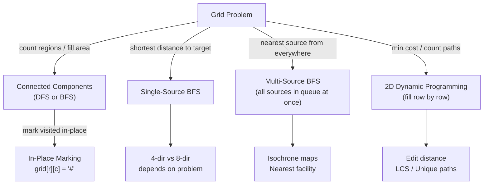

# Matrix & Grid Patterns

**Level**: 🟡 Intermediate

## 🗺️ Quick Overview



*Grids are just graphs where each cell is a node and edges go to adjacent cells — BFS for distance, DFS for components, DP for optimization.*

> Every grid problem reduces to one of four templates: DFS for flood-fill/components, BFS for shortest distance, multi-source BFS when there are many starting points, or 2D DP for optimal substructure problems.

## The Pattern

### Recognition Signals

**Use DFS / flood-fill when:**
- "Count the number of islands / regions / components"
- "Mark all connected cells with a given property"
- "Check if cell A can reach cell B through connected cells"

**Use BFS (single-source) when:**
- "Shortest path / minimum steps from one cell to another"
- "Minimum time to reach an exit"
- "Spread from one starting cell (fire, zombie, rot)"

**Use Multi-Source BFS when:**
- "Distance of each cell to its nearest source"
- "Find all cells reachable within K steps from *any* of many starting points"
- Multiple sources are given and you need shortest distance from the nearest one

**Use 2D DP when:**
- "Number of ways to reach bottom-right"
- "Minimum cost path"
- Recurrence depends only on cells above and to the left (or similar bounded dependency)

---

### Direction Vectors

```
// 4-directional (up, down, left, right) — standard grid movement
DIRS_4 = [(-1,0), (1,0), (0,-1), (0,1)]

// 8-directional (includes diagonals) — chess, pixel neighbors
DIRS_8 = [(-1,-1),(-1,0),(-1,1),
           (0,-1),        (0,1),
           (1,-1), (1,0), (1,1)]

function in_bounds(r, c, rows, cols):
  return 0 <= r < rows and 0 <= c < cols
```

---

### Template 1: DFS Flood-Fill (In-Place Marking)

```
// Mark visited by mutating the grid — no extra visited set needed
// WARNING: only use when mutation is acceptable (ask interviewer!)
function flood_fill(grid, r, c, old_color, new_color):
  if not in_bounds(r, c, rows, cols): return
  if grid[r][c] != old_color: return
  if grid[r][c] == new_color: return   // already filled (avoid infinite loop)

  grid[r][c] = new_color   // mark in-place instead of a visited set

  for dr, dc in DIRS_4:
    flood_fill(grid, r + dr, c + dc, old_color, new_color)
```

The in-place trick eliminates O(R×C) extra memory for a visited set. The key insight: changing the value IS the visited marker.

---

### Template 2: BFS for Shortest Distance on Grid

```
function bfs_shortest(grid, start_r, start_c, target_r, target_c):
  if grid[start_r][start_c] is blocked: return -1

  visited = set()
  queue = deque()
  queue.append((start_r, start_c, 0))   // (row, col, steps)
  visited.add((start_r, start_c))

  while queue:
    r, c, steps = queue.popleft()

    if r == target_r and c == target_c:
      return steps

    for dr, dc in DIRS_4:
      nr, nc = r + dr, c + dc
      if in_bounds(nr, nc) and (nr, nc) not in visited and not blocked(grid, nr, nc):
        visited.add((nr, nc))
        queue.append((nr, nc, steps + 1))

  return -1   // unreachable
// Time: O(R × C),  Space: O(R × C)
```

---

### Template 3: Multi-Source BFS

```
// "Find distance of each cell to its nearest '1' (source)"
// — rather than running BFS from each source separately (O(sources × R × C)),
//   enqueue ALL sources at step 0 and let BFS expand outward simultaneously.

function multi_source_bfs(grid):
  rows, cols = len(grid), len(grid[0])
  dist = [[INF] * cols for _ in range(rows)]
  queue = deque()

  // Seed ALL sources at once
  for r in range(rows):
    for c in range(cols):
      if grid[r][c] == SOURCE:
        dist[r][c] = 0
        queue.append((r, c))

  while queue:
    r, c = queue.popleft()

    for dr, dc in DIRS_4:
      nr, nc = r + dr, c + dc
      if in_bounds(nr, nc) and dist[nr][nc] == INF:
        dist[nr][nc] = dist[r][c] + 1
        queue.append((nr, nc))

  return dist
// Time: O(R × C) — each cell visited exactly once across ALL sources combined
```

Why this works: BFS processes cells in non-decreasing distance order. By seeding all sources at distance 0, the first time BFS reaches any cell it's guaranteed to be via the nearest source.

---

### Template 4: 2D Dynamic Programming

```
// Unique paths — number of ways to reach (R-1, C-1) from (0,0)
// moving only right or down
function unique_paths(rows, cols):
  dp = [[1] * cols for _ in range(rows)]   // first row and col = 1

  for r in range(1, rows):
    for c in range(1, cols):
      dp[r][c] = dp[r-1][c] + dp[r][c-1]   // from above + from left

  return dp[rows-1][cols-1]
// Time: O(R × C),  Space: O(R × C) — can be optimized to O(C) with rolling array

// Minimum path sum — cheapest path from top-left to bottom-right
function min_path_sum(grid):
  rows, cols = len(grid), len(grid[0])
  dp = [[0] * cols for _ in range(rows)]
  dp[0][0] = grid[0][0]

  // Fill first row (can only come from left)
  for c in range(1, cols):
    dp[0][c] = dp[0][c-1] + grid[0][c]

  // Fill first column (can only come from above)
  for r in range(1, rows):
    dp[r][0] = dp[r-1][0] + grid[r][0]

  // Fill rest: cheapest of coming from above vs from left
  for r in range(1, rows):
    for c in range(1, cols):
      dp[r][c] = grid[r][c] + min(dp[r-1][c], dp[r][c-1])

  return dp[rows-1][cols-1]
```

---

## Real-World at Scale

### Google Maps — Isochrone Routing with Multi-Source BFS

Google Maps' "show me everything within 30 minutes of my location" feature (isochrone maps) is multi-source BFS at continental scale. The road network is a weighted graph where each intersection is a node. When computing reachability for transit planning, Dijkstra (weighted BFS) from a single source expands outward by travel time, marking cells with their earliest arrival time. For transit authority reports, planners run multi-source BFS from every transit stop simultaneously to compute the "coverage area" of the entire network — **O(V + E)** instead of **O(stops × (V + E))**.

- Road network for the contiguous US: ~45 million nodes, ~120 million edges
- Google processes ~1 billion routing requests per day
- A* with landmark heuristics cuts BFS expansion by 70%+ on road networks

### Instagram / Snapchat — Image Segmentation at 100M+ Images/Day

Background removal (used in Instagram Stories, Snapchat lenses) is flood-fill at scale. The ML model outputs a segmentation mask — a binary grid — and flood-fill separates foreground from background connected components. Face segmentation uses 8-directional connected components to isolate face regions.

- Instagram processes 100+ million photos/day
- Flood-fill on a 1080×1920 image (2M pixels) runs in ~2ms on a single core
- Connected components identify which "blobs" correspond to faces vs background noise

### Amazon Fulfillment Centers — Robot Grid Pathfinding

Amazon's **Kiva/Proteus robots** navigate warehouse floors that are modeled as weighted grids. Each cell is a floor tile; robots are the BFS "agents." Collision avoidance requires multi-agent pathfinding on a shared grid.

- 750,000+ robots across Amazon's fulfillment network as of 2023
- Warehouse grid: ~100,000 cells per facility
- Path planning uses A* (BFS + admissible heuristic) recomputed every 100ms per robot
- Amazon's infrastructure runs millions of grid pathfinding queries per second

### Game Pathfinding — A* on Grid (500M+ Players)

Every mobile game with map movement (Pokémon GO, Clash of Clans, Age of Empires) uses grid BFS or A* for NPC and player pathfinding. A* is BFS with a heuristic `f(n) = g(n) + h(n)` where `g` = cost so far and `h` = estimated distance to goal (Manhattan distance for 4-dir grids).

- Pokémon GO: 80–100 million monthly active users navigating a real-world map grid
- Clash of Clans: AI troops use A* pathfinding on a grid — runs millions of path queries per second
- A* processes a 128×128 game grid in under 1ms

### Netflix — Matrix DP in Recommendation (Matrix Factorization)

Netflix's collaborative filtering decomposes the user-item rating matrix `R ≈ U × V^T` using gradient descent — a form of 2D DP where each row in `U` (user embedding) and `V` (item embedding) is updated based on reconstruction error. The "grid" here is the user-item matrix.

- Netflix rating matrix: ~200 million users × ~15,000 titles
- Matrix factorization fills in the "missing" cells (unseen movies) — the same way DP fills unknown subproblems

### Bioinformatics — Needleman-Wunsch Sequence Alignment

DNA/protein sequence alignment is exact 2D DP on a grid where `dp[i][j]` stores the alignment score of the first `i` characters of sequence A and first `j` characters of sequence B. This is structurally identical to edit distance.

- Human genome: ~3 billion base pairs
- 23andMe, Illumina, and NCBI run Needleman-Wunsch on thousands of sequence pairs simultaneously
- GPU-accelerated grid DP: NVIDIA's cuDNA library parallelizes the anti-diagonal wavefront of the DP grid

---

## Core Problems

### Problem 1: Number of Islands — DFS with In-Place Marking

**Thought process**: "Count regions of connected '1's in a binary grid."
- Each unvisited '1' = start of a new island → DFS to mark all connected land
- In-place: change '1' → '0' as we visit (no separate visited set)

```
function num_islands(grid):
  rows, cols = len(grid), len(grid[0])
  count = 0

  function dfs(r, c):
    if r < 0 or r >= rows or c < 0 or c >= cols: return
    if grid[r][c] != '1': return

    grid[r][c] = '0'   // mark visited in-place
    dfs(r+1, c); dfs(r-1, c)
    dfs(r, c+1); dfs(r, c-1)

  for r in range(rows):
    for c in range(cols):
      if grid[r][c] == '1':
        dfs(r, c)
        count += 1

  return count
// Time: O(R × C),  Space: O(R × C) recursion stack (worst case: grid is all '1')
```

**Interview insight**: If you can't mutate the grid, use a `visited` set of `(r, c)` tuples.

---

### Problem 2: Word Search — DFS with Backtracking

**Thought process**: "Can I trace the word through adjacent cells without reusing a cell?"
- At each cell, try to match the next character
- Mark current cell as visited BEFORE recursing, unmark AFTER (backtracking)

```
function word_search(board, word):
  rows, cols = len(board), len(board[0])

  function dfs(r, c, idx):
    if idx == len(word): return true         // matched all characters
    if not in_bounds(r, c): return false
    if board[r][c] != word[idx]: return false

    temp = board[r][c]
    board[r][c] = '#'   // mark visited

    found = (dfs(r+1,c,idx+1) or dfs(r-1,c,idx+1) or
             dfs(r,c+1,idx+1) or dfs(r,c-1,idx+1))

    board[r][c] = temp  // RESTORE (backtrack)
    return found

  for r in range(rows):
    for c in range(cols):
      if dfs(r, c, 0):
        return true
  return false
// Time: O(R × C × 4^L) where L = word length
// Space: O(L) recursion depth
```

---

### Problem 3: Minimum Path Sum — 2D DP

**Thought process**: "What's the cheapest route from top-left to bottom-right moving only right/down?"
- Subproblem: cheapest cost to reach `(r, c)` = `grid[r][c] + min(cost from above, cost from left)`
- Base cases: first row (only left-to-right) and first column (only top-to-bottom)

```
function min_path_sum(grid):
  rows, cols = len(grid), len(grid[0])
  // Modify grid in-place as DP table (or copy if you can't mutate)

  for c in range(1, cols):
    grid[0][c] += grid[0][c-1]

  for r in range(1, rows):
    grid[r][0] += grid[r-1][0]

  for r in range(1, rows):
    for c in range(1, cols):
      grid[r][c] += min(grid[r-1][c], grid[r][c-1])

  return grid[rows-1][cols-1]
// Time: O(R × C),  Space: O(1) using in-place (or O(R × C) with separate dp table)
```

---

### Problem 4: Maximal Rectangle — Stack + DP

**Thought process**: "Largest rectangle of all 1's in a binary matrix."
- Build a heights array: `heights[c]` = number of consecutive 1's in column `c` up to current row
- For each row, run "Largest Rectangle in Histogram" (monotonic stack) on `heights`

```
function maximal_rectangle(matrix):
  if not matrix: return 0
  rows, cols = len(matrix), len(matrix[0])
  heights = [0] * cols
  max_area = 0

  for r in range(rows):
    // Update heights: extend column upward if cell is '1', reset to 0 if '0'
    for c in range(cols):
      heights[c] = heights[c] + 1 if matrix[r][c] == '1' else 0

    // Largest rectangle in histogram using monotonic stack
    max_area = max(max_area, largest_rect_in_histogram(heights))

  return max_area

function largest_rect_in_histogram(heights):
  stack = []   // monotonic increasing stack of indices
  max_area = 0
  heights = heights + [0]   // sentinel to flush stack at end

  for i, h in enumerate(heights):
    while stack and heights[stack[-1]] > h:
      height = heights[stack.pop()]
      width = i if not stack else i - stack[-1] - 1
      max_area = max(max_area, height * width)
    stack.append(i)

  return max_area
// Time: O(R × C),  Space: O(C)
```

**Interview insight**: This is a two-pattern combination. Recognizing that each row creates a histogram is the key insight — then you apply a known pattern (monotonic stack) to each histogram.

---

### Problem 5: Pacific Atlantic Water Flow — Multi-Source BFS (Reverse Direction)

**Thought process**: "Find cells that can flow to BOTH Pacific and Atlantic oceans."
- Direct approach: from each cell, DFS/BFS to check if both oceans reachable → O(R²C²), too slow
- Reverse trick: water flows downhill, so work backwards — from each ocean boundary, run BFS inward. A cell is "reachable from Pacific" if BFS going uphill from Pacific boundary can reach it.

```
function pacific_atlantic(heights):
  rows, cols = len(heights), len(heights[0])

  function bfs_from_border(starts):
    reachable = set(starts)
    queue = deque(starts)
    while queue:
      r, c = queue.popleft()
      for dr, dc in DIRS_4:
        nr, nc = r + dr, c + dc
        if (nr, nc) not in reachable and in_bounds(nr, nc):
          // Water flows FROM (nr,nc) TO (r,c) if heights[nr][nc] >= heights[r][c]
          // Reversed: BFS can "climb uphill" to find all cells that drain here
          if heights[nr][nc] >= heights[r][c]:
            reachable.add((nr, nc))
            queue.append((nr, nc))
    return reachable

  pacific_border = [(0, c) for c in range(cols)] + [(r, 0) for r in range(rows)]
  atlantic_border = [(rows-1, c) for c in range(cols)] + [(r, cols-1) for r in range(rows)]

  pacific_reach = bfs_from_border(pacific_border)
  atlantic_reach = bfs_from_border(atlantic_border)

  return list(pacific_reach & atlantic_reach)
// Time: O(R × C),  Space: O(R × C)
```

**Interview insight**: The "reverse direction" trick appears in many grid/graph problems. When the forward pass is expensive, work backwards from the destination.

---

## Complexity

| Pattern | Time | Space | Notes |
|---------|------|-------|-------|
| DFS flood-fill (in-place) | O(R × C) | O(R × C) stack | Stack depth = island size |
| BFS shortest path | O(R × C) | O(R × C) | Queue holds at most one full "wavefront" |
| Multi-source BFS | O(R × C) | O(R × C) | All sources combined — NOT per source |
| 2D DP (path problems) | O(R × C) | O(R × C) → O(C) | Rolling array reduces space |
| Maximal rectangle | O(R × C) | O(C) | Histogram scan per row |

---

## Key Takeaways

- A grid is a graph — rows/columns are implicit edges. Every graph algorithm (BFS, DFS) applies directly.
- Use DFS + in-place marking for flood-fill and connected components. Change the cell value to mark it visited — no extra set needed.
- Multi-source BFS is O(R × C) total, not O(sources × R × C). Seed all sources at step 0.
- 2D DP problems fill a table row-by-row; the recurrence usually depends only on the cell above and the cell to the left — rolling array reduces space to O(C).
- The reverse-direction trick: when "can A reach B?" is expensive, run BFS/DFS backwards from B to find all cells that can reach it.
- Maximal rectangle = prefix heights per column + largest rectangle in histogram (monotonic stack) per row.
- In interviews: always state your grid dimensions (R × C), confirm 4-dir vs 8-dir, and clarify whether you can mutate the input.
