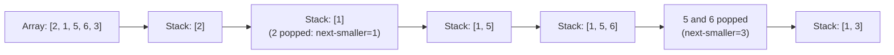

# Monotonic Stack Pattern

**Level**: 🟡 Intermediate

## 🗺️ Quick Overview



*Each element is pushed and popped at most once — when an element is popped, the popping element IS its answer, giving O(N) total work.*

> A stack where elements are always kept in sorted (monotonic) order. When a new element violates the order, pop until the invariant holds — and each pop is the answer to a "next greater/smaller" query.

## The Pattern

A monotonic stack efficiently answers questions like "for each element, what is the next greater element to its right?" The naive approach is O(N²) — for each element, scan right. The monotonic stack does it in O(N) amortized — each element is pushed and popped exactly once.

**The key insight**: When you push a new element and it's larger than the top, the top has found its "next greater element" — the new element. Pop it, record the answer.

**Two flavors:**
- **Monotonically increasing stack**: elements increase from bottom to top. Pop when new element is smaller → finds "next smaller element."
- **Monotonically decreasing stack**: elements decrease from bottom to top. Pop when new element is larger → finds "next greater element."

**Recognition signals:**
- "Next greater element" / "previous smaller element"
- "Stock span problem"
- "Largest rectangle in histogram"
- "Daily temperatures — how many days until warmer?"
- Processing elements where you need to know what came before that's still "relevant"

## Template Pseudocode

```
// Monotonically decreasing stack: find next greater element for each position
function next_greater_element(arr):
  n = len(arr)
  result = [-1] * n   // -1 means no greater element to the right
  stack = []          // stack of indices (not values)

  for i in range(n):
    // While stack is not empty AND current element is greater than stack top's value
    while stack is not empty and arr[i] > arr[stack.top()]:
      idx = stack.pop()
      result[idx] = arr[i]   // arr[i] is the next greater element for arr[idx]
    stack.push(i)

  // Elements remaining in stack have no greater element to their right (result stays -1)
  return result

// Monotonically increasing stack: find previous smaller element for each position
function previous_smaller_element(arr):
  n = len(arr)
  result = [-1] * n
  stack = []   // indices

  for i in range(n):
    while stack is not empty and arr[stack.top()] >= arr[i]:
      stack.pop()   // these elements are larger than arr[i] — not previous smaller

    if stack is not empty:
      result[i] = arr[stack.top()]   // top is the previous smaller element
    stack.push(i)

  return result
```

## 3 Example Problems

### Problem 1: Daily Temperatures (Days Until Warmer)

```
function daily_temperatures(temperatures):
  n = len(temperatures)
  result = [0] * n
  stack = []   // indices

  for i in range(n):
    while stack and temperatures[i] > temperatures[stack.top()]:
      idx = stack.pop()
      result[idx] = i - idx   // days to wait = current index - old index
    stack.push(i)

  return result
// Time: O(N), Space: O(N)
// Each index is pushed once and popped once → O(N) total
```

### Problem 2: Largest Rectangle in Histogram

```
function largest_rectangle(heights):
  stack = []   // monotonically increasing stack of indices
  max_area = 0
  heights.append(0)   // sentinel: force all bars to be popped at the end

  for i in range(len(heights)):
    while stack and heights[i] < heights[stack.top()]:
      height = heights[stack.pop()]
      // Width: from current position to the new top of stack
      width = i if not stack else i - stack.top() - 1
      max_area = max(max_area, height * width)
    stack.push(i)

  return max_area
// Time: O(N), Space: O(N)
// Used in: text layout, image processing, max rectangle in binary matrix
```

### Problem 3: Stock Span (Days Since Last Higher Price)

```
function stock_span(prices):
  span = []
  stack = []   // stack of (price, span_so_far)

  for price in prices:
    current_span = 1
    while stack and stack.top().price <= price:
      current_span += stack.pop().span   // absorb the span of lower-priced days
    span.append(current_span)
    stack.push((price, current_span))

  return span
// Time: O(N) amortized, Space: O(N)
```

## In Real Systems

**Query planners** — Database query optimizers use monotonic stack-like structures to determine the order of operations. Determining which index to use involves reasoning about selectivity, which has a "next smaller selectivity" structure.

**Event stream processing** — In stream processing systems (Flink, Kafka Streams), "sliding maximum" queries over event streams use a monotonic deque (double-ended queue variant). For example, finding the maximum latency in the last 1000 requests efficiently.

**Compiler optimization** — Certain expression folding and constant propagation passes in compilers maintain stack-based monotonic structures when processing expression trees.

**Network monitoring** — Finding the longest consecutive period where network utilization was above a threshold (essentially "spans" of high utilization) uses the stock-span pattern.

## Complexity

| Operation | Time | Space |
|-----------|------|-------|
| Next greater element | O(N) amortized | O(N) |
| Each element pushed | Exactly once | — |
| Each element popped | At most once | — |
| Total pushes + pops | O(N) total | — |

The amortized O(N) is the key — though the inner `while` loop looks like it could be O(N) per iteration, each element can be popped at most once, so the total work is O(N).

## Key Takeaways

- Monotonic stack maintains sorted order; popping on violation yields "next greater/smaller" relationships
- Monotonically decreasing: pop when new element is larger → records next greater element
- Monotonically increasing: pop when new element is smaller → records next smaller element
- Each element is pushed and popped exactly once → O(N) total amortized
- Largest rectangle in histogram is the canonical hard problem; daily temperatures is the canonical easy one
