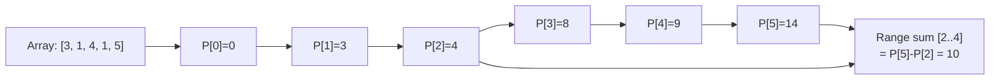

# Prefix Sum Pattern

**Level**: 🟢 Beginner

## 🗺️ Quick Overview



*Build the prefix array once in O(N), then answer any range-sum query in O(1) with a single subtraction.*

> Precompute cumulative sums so that any range sum query is answered in O(1) instead of O(N). The simplest optimization technique with surprisingly broad applicability.

## The Pattern

A prefix sum array `P` where `P[i] = arr[0] + arr[1] + ... + arr[i]`. Once built, the sum of any range `[L, R]` is just `P[R] - P[L-1]`.

**Recognition signals:**
- "Sum of elements in range [L, R]" — asked many times
- "Subarray with sum equal to K"
- "Count subarrays whose sum is divisible by K"
- "2D matrix range sum query"
- "Time-series rollup" in analytics systems

## Template Pseudocode

```
// 1D Prefix Sum
function build_prefix_sum(arr):
  n = len(arr)
  prefix = [0] * (n + 1)   // prefix[0] = 0 (empty prefix)
  for i in range(n):
    prefix[i + 1] = prefix[i] + arr[i]
  return prefix

// O(1) range sum query: sum of arr[left..right] (inclusive)
function range_sum(prefix, left, right):
  return prefix[right + 1] - prefix[left]
  // Intuition: total sum up to right, minus total sum before left

// 2D Prefix Sum
function build_2d_prefix(matrix):
  rows = len(matrix)
  cols = len(matrix[0])
  prefix = 2d_array(rows + 1, cols + 1, default=0)

  for r in range(1, rows + 1):
    for c in range(1, cols + 1):
      prefix[r][c] = (matrix[r-1][c-1]
                      + prefix[r-1][c]       // row above
                      + prefix[r][c-1]       // column left
                      - prefix[r-1][c-1])    // subtracted twice, add back once

  return prefix

// O(1) 2D range sum: sum of rectangle from (r1,c1) to (r2,c2)
function rect_sum(prefix, r1, c1, r2, c2):
  return (prefix[r2+1][c2+1]
          - prefix[r1][c2+1]     // remove rows above
          - prefix[r2+1][c1]     // remove columns left
          + prefix[r1][c1])      // add back doubly-subtracted corner
```

## 3 Example Problems

### Problem 1: Subarray Sum Equals K

Count the number of subarrays whose elements sum to K.

```
function count_subarray_sum(arr, k):
  // sum[i..j] = prefix[j+1] - prefix[i]
  // We want prefix[j+1] - prefix[i] == k
  // → we want prefix[i] == prefix[j+1] - k
  // For each j, count how many previous prefix values equal (current_prefix - k)

  count = 0
  current_prefix = 0
  seen_prefix_counts = {0: 1}   // empty prefix has sum 0, seen once

  for val in arr:
    current_prefix += val
    target = current_prefix - k
    count += seen_prefix_counts.get(target, 0)
    seen_prefix_counts[current_prefix] = seen_prefix_counts.get(current_prefix, 0) + 1

  return count
// Time: O(N), Space: O(N)
```

### Problem 2: Range Sum Query (Static Array)

```
class RangeSumQuery:
  function init(arr):
    self.prefix = build_prefix_sum(arr)

  function sum_range(left, right):
    return range_sum(self.prefix, left, right)

// Preprocessing: O(N)
// Each query: O(1)
// vs naive: O(N) per query
```

### Problem 3: Count Subarrays with Sum Divisible by K

```
function count_divisible_subarrays(arr, k):
  // sum[i..j] divisible by k
  // ↔ (prefix[j+1] - prefix[i]) % k == 0
  // ↔ prefix[j+1] % k == prefix[i] % k
  // Count pairs with equal prefix mod k

  mod_counts = {0: 1}   // prefix mod 0 (empty prefix) seen once
  current_prefix = 0
  count = 0

  for val in arr:
    current_prefix += val
    mod = ((current_prefix % k) + k) % k   // handle negative values
    count += mod_counts.get(mod, 0)
    mod_counts[mod] = mod_counts.get(mod, 0) + 1

  return count
```

## In Real Systems

**Time-series rollup queries** — Analytics systems (Grafana, Datadog, InfluxDB) store precomputed prefix sums at multiple granularities. A "total events in the last hour" query becomes O(1) against hourly buckets.

**Analytics dashboards** — "Total revenue from day 5 to day 30 of the month" queries on precomputed daily prefix sums. This is how OLAP databases achieve fast aggregation queries without scanning raw rows.

**Redis BITCOUNT** — Redis's BITCOUNT command counts set bits in a bit array, optionally over a byte range. Internally uses precomputed population count tables — a form of prefix sum on bit populations.

**Cumulative distribution functions (CDFs)** — Any histogram-based CDF (used in percentile computation, database statistics) is a prefix sum over the frequency distribution. "What fraction of queries took less than 100ms?" is a prefix sum lookup.

**Image processing** — 2D prefix sums (integral images) are used in the Viola-Jones face detection algorithm. Computing the sum of pixel intensities in any rectangle is O(1) after building the integral image.

## Complexity

| Operation | Time | Space |
|-----------|------|-------|
| Build prefix sum | O(N) | O(N) |
| Range sum query | O(1) | — |
| Build 2D prefix sum | O(R × C) | O(R × C) |
| 2D range sum query | O(1) | — |
| Naive range sum | O(N) per query | O(1) |

## Key Takeaways

- Prefix sum trades O(N) preprocessing for O(1) range sum queries — ideal when queries are frequent
- `sum(L, R) = prefix[R+1] - prefix[L]` — the single most important formula
- Subarray-sum problems often reduce to "find two prefix sums with target difference" → use a hashmap
- 2D prefix sums enable O(1) rectangle sum queries: used in image processing and spatial analytics
- Real systems use this as a fundamental building block for time-series aggregation
