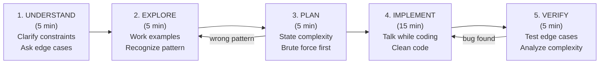

# How to Approach Any Algorithm Problem (FAANG Framework)

**Level**: 🟢 Beginner

## 🗺️ Quick Overview



*The 5-phase loop. Skipping Understand and Explore — the two most skipped phases — accounts for the majority of failed FAANG interviews.*

> Most candidates fail algorithm interviews not because they don't know the algorithm, but because they jump to code before understanding the problem. This framework is the meta-skill that multiplies every other skill you have.

## Why This Framework Matters

Two candidates walk into an interview. Both know Dijkstra's algorithm cold.

Candidate A hears "shortest path" and immediately starts coding Dijkstra. Fifteen minutes later they realize the graph has negative weights and their solution is wrong. They never recover.

Candidate B spends 5 minutes asking questions. They discover the graph has negative weights, switch to Bellman-Ford, and code a clean correct solution with 10 minutes to spare for follow-up questions.

Same knowledge. Completely different outcome.

The framework below is what Candidate B does — and it is a repeatable, learnable process.

---

## Phase 1: Understand (5 minutes)

**Goal**: Make sure you are solving the right problem.

Never write a single line of code in this phase. Use it to ask questions that prevent 20 minutes of wasted implementation.

### Questions to always ask

```
Input:
  - What is the input size? (N = 10? 10^5? 10^9?) → determines required complexity
  - What are the value ranges? (negative numbers? floating point? overflow risk?)
  - Is the input sorted? (changes O(N log N) problems to O(N) or O(log N))
  - Can there be duplicates? (affects counting, indexing, uniqueness assumptions)
  - Is it mutable or read-only? (affects whether prefix sum is enough)

Edge cases:
  - What if the input is empty? (always ask)
  - What if it has one element?
  - Can the answer be negative? Zero? Very large?

Output:
  - Should I return the value, the index, or the actual subarray/path?
  - If multiple valid answers exist, which one? (any? all? lexicographically smallest?)
```

### Red flags that you are missing something

- The problem feels "too easy" for a FAANG interview → you are probably missing a constraint
- You think O(N²) is fast enough but N = 10^5 → it is not, re-read the constraints
- You cannot think of any edge cases → you have not thought about it enough

### What to say out loud

> "I want to make sure I understand the problem. The input is an array of integers that can be negative, with up to 10^5 elements, and I need to return the maximum subarray sum. Is the array guaranteed non-empty? Can all elements be negative, and if so do I return the single largest element or zero?"

Interviewers hear this and immediately upgrade their mental grade: this candidate does not guess, they verify.

---

## Phase 2: Explore (5 minutes)

**Goal**: Work through 2–3 small examples by hand. This is where pattern recognition happens — not in your head, but on paper/whiteboard.

Choose examples that are:
1. A simple, typical case (3–5 elements)
2. An edge case (empty, single element, all same)
3. A tricky case (the one that breaks naive solutions)

### Pattern Recognition Cheat Sheet

Work through the examples and ask: what does this problem look like?

| Input / Output Characteristics | Pattern to Consider |
|--------------------------------|---------------------|
| Contiguous subarray / substring | Sliding window, prefix sum |
| All elements, no contiguity required | Two pointers, sort + scan |
| Ordered sequence, find a threshold | Binary search on answer |
| Tree or graph traversal | BFS (shortest path, level), DFS (all paths, connected) |
| "Find all combinations" / "is it possible" | Backtracking, DP |
| Optimize (minimize / maximize) something | Greedy (if locally optimal = globally optimal), else DP |
| Monotonically increasing/decreasing subsequence | Monotonic stack / deque |
| Top-K elements / streaming median | Heap |
| Repeated lookup / deduplication | Hash map / hash set |
| Intervals with overlap / merge | Sort by start, sweep line |
| "Are these nodes connected?" | Union-Find |
| Mutable array with range queries | Segment tree / Fenwick tree |
| Prefix matching / autocomplete | Trie |
| String pattern matching | KMP, Rabin-Karp, or Z-algorithm |

### What to say out loud

Do not go silent. Walk through the example step by step:

> "Let me trace through [1, -2, 3, 4, -1] by hand. If I track the current running sum, starting at 1: add -2 → -1, that is less than starting fresh at 3, so I reset. Then 3 → 7 → 6. So the maximum is 7. I see — the key decision is whether to extend the current subarray or start fresh. That feels like Kadane's algorithm, which is actually a simple DP recurrence."

Even if you misidentify the pattern at first, verbalizing it gives the interviewer a chance to nudge you before you implement the wrong thing.

---

## Phase 3: Plan (5 minutes)

**Goal**: State your complexity target before writing code. Then describe brute force before describing optimization.

### The Complexity Target Table

This table is one of the most important things to memorize:

| Input Size N | Required Time Complexity | Why |
|-------------|--------------------------|-----|
| N ≤ 20 | O(2^N) or O(N!) | Backtracking, permutations acceptable |
| N ≤ 100 | O(N³) | Three nested loops acceptable |
| N ≤ 1,000 | O(N²) | Two nested loops acceptable |
| N ≤ 10^5 | O(N log N) | Sort, heap, segment tree |
| N ≤ 10^6 | O(N) | Linear scan, hash map, two pointers |
| N ≤ 10^8 | O(N) barely, or O(log N) | Binary search, math |
| N ≥ 10^9 | O(log N) or O(1) | Math, precomputation |

If N = 10^5 and you are considering O(N²), stop immediately. That is 10^10 operations — it will time out.

### The Brute Force → Optimization Ladder

Always describe brute force first, even if it is obviously too slow. This shows you understand the problem, and it is a starting point to optimize from.

```
// Pattern: "What would brute force be? How can I do better?"

Brute force: try every possible [l, r] pair for subarray → O(N²)

Observation: when I extend right by one element, I do not need to
             recompute the sum from scratch. I only need to decide:
             continue the current subarray, or start a new one.

Optimization: track current_sum and max_sum in a single pass → O(N)
```

### What to say out loud

> "Given N up to 10^5, I need O(N log N) or better. My brute force would check every pair of indices, which is O(N²) — too slow. The key observation is that each element's decision only depends on the previous element's subarray sum. That is optimal substructure, so this is a DP problem with O(N) state. Let me implement that."

---

## Phase 4: Implement (15 minutes)

**Goal**: Write clean, correct code while communicating what you are doing.

### The "Think Out Loud" Technique

Interviewers are not just evaluating correctness. They are evaluating whether they would want to debug code with you at 2am during an incident. Talk through what you are building.

```
// Good narration while coding:
"I'll use a hash map to track the last index where each character appeared.
Left pointer starts at 0. As I move right, if I see a character that's already
in the window, I move left to just past its last occurrence — not just +1,
because we might skip over a valid position."
```

This narration lets the interviewer catch conceptual errors before you implement them.

### Clean Code Patterns That Signal Seniority

**Dummy head node** — avoids special-casing head of linked list:
```
dummy = ListNode(0)
dummy.next = head
prev = dummy
// ... manipulate prev.next freely
return dummy.next
```

**Sentinel values** — simplify boundary conditions:
```
// Instead of checking "is the stack empty before comparing":
stack = [-infinity]   // sentinel: any element is >= -infinity
```

**Two-pointer template**:
```
left = 0
for right in range(len(arr)):
  // expand window: process arr[right]
  while violation():
    // shrink window: undo arr[left]
    left += 1
  // window [left..right] is valid — record result
```

**Avoid over-engineering** — write flat, readable code first. Interviewers prefer a clean 25-line solution over a "clever" 15-line one that is hard to trace.

### Common Bugs to Check Before You Claim You're Done

- Off-by-one: `<` vs `<=`, `range(n)` vs `range(n+1)`
- Integer overflow: in Java/C++, use `long` for sums; in Python, integers are arbitrary precision
- Empty input: does your loop handle an empty array without crashing?
- Index out of bounds: when accessing `arr[i-1]` or `arr[i+1]`, is `i` in a valid range?
- Modifying input unintentionally: sorting a passed-in array when the caller doesn't expect it

---

## Phase 5: Verify (5 minutes)

**Goal**: Test your code against examples, including edge cases. Then state the complexity clearly.

### The 3-Test Ritual

Always run through three tests mentally after writing code:

1. **Your traced example from Phase 2**: step through the code exactly as written, not as intended
2. **Edge case — empty input**: does `len(arr) == 0` return the right thing?
3. **Edge case — single element**: often exposes off-by-one errors

```
// Worked verification trace for max subarray:
arr = [1, -2, 3, 4, -1]

i=0: curr=1, max_sum=1
i=1: curr=max(1+(-2), -2)=max(-1,-2)=-1. max_sum stays 1
i=2: curr=max(-1+3, 3)=max(2,3)=3. max_sum=3
i=3: curr=max(3+4, 4)=max(7,4)=7. max_sum=7
i=4: curr=max(7+(-1),-1)=max(6,-1)=6. max_sum stays 7
Result: 7 ✓
```

### State Complexity Explicitly

Even if the interviewer does not ask:

> "This runs in O(N) time — single pass, each element visited once. Space is O(1) — I only store two integers, current sum and max sum, regardless of input size."

This shows you know *why* your solution is efficient, not just that it is.

---

## Worked Example: Meeting Rooms II (LeetCode 253)

**Problem**: Given an array of meeting time intervals `[start, end]`, find the minimum number of conference rooms required.

### Phase 1 — Understand
- Intervals can overlap
- Start < End always (valid intervals)
- Can intervals have the same start time? Yes
- Is the array sorted? No
- What if empty? Return 0

### Phase 2 — Explore

```
Input: [[0,30],[5,10],[15,20]]

Timeline:
  0  5  10  15  20  25  30
  [=========meeting1========]
     [m2]
              [m3]

At t=5: 2 meetings overlap → need 2 rooms
At t=15: meeting 1 still running, meeting 3 starts → 2 rooms
At t=20: meeting 3 ends → 1 room
At t=30: meeting 1 ends → 0 rooms

Answer: 2
```

Pattern recognition: I need to track how many intervals are "active" at any moment. This looks like a sweep line — process events (starts and ends) in time order.

### Phase 3 — Plan

N ≤ 10^4 in LeetCode, but I'll aim for O(N log N) since sorting is natural.

Brute force: for each meeting, count how many other meetings overlap with it — O(N²). Too slow.

Optimization: separate start times and end times into two sorted arrays. Use two pointers to simulate "open a room" on each start, "close a room" on each end.

> Key insight: we do not care *which* room is freed, only *whether* a room is available. If the earliest-ending meeting ends before the next meeting starts, reuse that room.

### Phase 4 — Implement

```python
def minMeetingRooms(intervals):
    if not intervals:
        return 0

    starts = sorted(i[0] for i in intervals)
    ends   = sorted(i[1] for i in intervals)

    rooms = 0
    max_rooms = 0
    s = e = 0

    while s < len(starts):
        if starts[s] < ends[e]:
            rooms += 1       # new meeting starts before any room frees up
            s += 1
        else:
            rooms -= 1       # a room freed up before this meeting starts
            e += 1
            # Note: s is NOT incremented — we re-evaluate this start event
        max_rooms = max(max_rooms, rooms)

    return max_rooms
```

### Phase 5 — Verify

```
starts = [0, 5, 15]   ends = [10, 20, 30]
s=0,e=0: starts[0]=0 < ends[0]=10 → rooms=1, s=1
s=1,e=0: starts[1]=5 < ends[0]=10 → rooms=2, s=2  (max=2)
s=2,e=0: starts[2]=15 >= ends[0]=10 → rooms=1, e=1
s=2,e=1: starts[2]=15 < ends[1]=20 → rooms=2, s=3
Loop ends (s=3=len(starts))
Return max_rooms = 2 ✓

Edge: [] → return 0 ✓
Edge: [[1,2]] → starts=[1], ends=[2], rooms goes to 1, returns 1 ✓
```

Complexity: O(N log N) time (sorting dominates), O(N) space (two sorted arrays).

---

## How FAANG Actually Evaluates

### The Signal They Are Looking For

FAANG interviews use a "strong hire / hire / no hire / strong no hire" rubric. Here is what actually separates them:

| Signal | Strong Hire | Hire | No Hire |
|--------|------------|------|---------|
| Problem-solving | Finds optimal independently, explains why | Finds optimal with hints | Only finds brute force |
| Communication | Narrates thought process continuously | Explains key decisions | Goes silent, codes in isolation |
| Correctness | Handles all edge cases without prompting | Handles common cases, misses 1-2 edge cases | Incorrect for basic cases |
| Code quality | Clean, readable, well-named variables | Functional, minor style issues | Hard to follow, unclear naming |
| Complexity | States and justifies time + space | States correctly when asked | Cannot analyze complexity |
| Recovery | Finds and fixes bugs quickly during verification | Finds bugs with prompting | Cannot identify bugs |

### Why Communication Matters as Much as Correctness

A "strong hire" on an easy problem beats a "no hire" on a hard problem.

An interviewer would rather work with someone who solved an easy problem transparently — showing their thinking, handling edge cases, explaining tradeoffs — than someone who solved a hard problem in complete silence and produced correct but unreadable code.

**The interviewer cannot evaluate what they cannot see.** If your thinking is correct but silent, it is invisible.

### Asking for Hints Strategically

Being stuck is fine. Being silently stuck for 5 minutes is not. The correct move:

> "I've considered sliding window and prefix sum, but neither handles the mutability constraint well. Am I on the right track thinking about a tree-based structure?"

This is not asking for the answer — it is demonstrating your reasoning and inviting calibration. Interviewers are trained to give hints when asked well.

---

## Pattern Recognition Quick Reference

Memorize this table. In the first 2 minutes of Explore, run through it mentally.

| Pattern | Recognition Signal | Key Complexity |
|---------|-------------------|----------------|
| Sliding window | Contiguous subarray/substring, one constraint | O(N) |
| Two pointers | Sorted array, pair sum, remove duplicates | O(N) |
| Prefix sum | Range sum queries, static array | O(1) query / O(N) build |
| Binary search on answer | "Minimum maximum" / "Maximum minimum", monotone feasibility | O(N log N) |
| Heap / top-K | K largest, K closest, streaming median | O(N log K) |
| BFS | Shortest path (unweighted), level-order, nearest X | O(V + E) |
| DFS | All paths, cycle detection, topological sort | O(V + E) |
| Backtracking | All combinations/permutations/subsets, constraint satisfaction | O(2^N) or O(N!) |
| Dynamic programming | Overlapping subproblems + optimal substructure | Varies |
| Greedy | Locally optimal = globally optimal (prove it!) | Usually O(N log N) |
| Union-Find | Connected components, cycle in undirected graph | O(α(N)) ≈ O(1) |
| Segment tree | Mutable array + range queries | O(log N) |
| Monotonic stack | Next greater/smaller element, histogram areas | O(N) |
| Trie | Prefix search, word existence, autocomplete | O(L) per operation |

---

## Common Mistakes That Cost Offers

**Jumping to code** — the single most common failure mode. If you start coding in the first 2 minutes without asking any clarifying questions, interviewers at Google, Meta, and Amazon will mark you down even if your solution is correct. Spend 5 minutes understanding first.

**Not handling empty / null input** — every production function handles `if not arr: return 0`. Missing this in an interview signals you do not write production code.

**Silent debugging** — when your solution is wrong and you go quiet for 3 minutes staring at the code, the interview is over. Think out loud: "My output is 6 but expected 7. Let me trace the loop from the beginning... at i=3 I have 4 not 7, which means I am not accumulating correctly. Let me check my update condition."

**Off-by-one in sliding window** — window size is `right - left + 1`, not `right - left`. Check this by tracing with a 1-element array.

**Off-by-one in binary search** — use the template `lo=0, hi=N-1, while lo<=hi, mid=(lo+hi)//2`. Avoid custom variations until you have the template memorized cold.

**Not explaining your complexity** — always state it unprompted. "This is O(N log N) because I sort once and each heap operation is O(log K)."

**Solving the wrong problem** — skipping Phase 1. Solve the problem that was asked, not the one you assumed was asked.

---

## Key Takeaways

- The framework: Understand → Explore → Plan → Implement → Verify. Each phase has a specific goal. Skipping any one costs more time than it saves.
- The complexity table is mandatory knowledge: N=10^5 means O(N log N) is your ceiling.
- Always describe brute force first — it shows you understand the problem and gives you a base to optimize from.
- Communication is evaluated as heavily as correctness. The interviewer needs to see your thinking, not just your output.
- The pattern recognition cheat sheet converts "I have no idea" into "let me check if this matches sliding window, two pointers, BFS..." — a concrete process instead of hoping for inspiration.
- Asking for hints strategically is a skill, not a failure. Frame hints as "am I on the right track with X?" not "I give up, tell me the answer."
