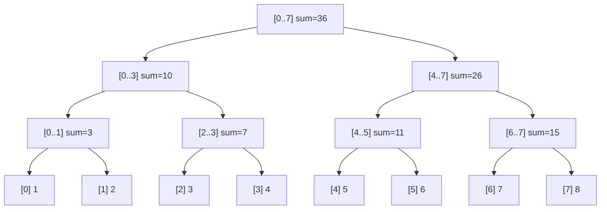

# Segment Tree & Fenwick Tree (Range Query Patterns)

**Level**: 🔴 Advanced

## 🗺️ Quick Overview



*Each node stores the aggregate (sum, min, max) of its range. A point update touches O(log N) nodes from leaf to root; a range query merges O(log N) nodes.*

> Prefix sum handles static range queries in O(1). The moment your array mutates, you need a structure that achieves O(log N) for both update and query — that is the Segment Tree.

## The Problem It Solves

Consider this scenario: you have an array of stock prices and you need to answer "what is the sum of prices between index L and R?" thousands of times per second — and the prices update constantly.

| Approach | Update | Query |
|----------|--------|-------|
| Brute force (re-scan) | O(1) | O(N) |
| Prefix sum array | O(N) rebuild | O(1) |
| Segment Tree | **O(log N)** | **O(log N)** |
| Fenwick Tree (BIT) | **O(log N)** | **O(log N)** |

Neither extreme is acceptable at scale. Segment Tree and Fenwick Tree sit in the sweet spot.

## Segment Tree Structure

A segment tree is a **complete binary tree** where:
- Each **leaf** represents a single element `arr[i]`
- Each **internal node** represents an aggregate over its children's ranges
- The **root** covers the entire array `[0, N-1]`

Build once in O(N). Thereafter: point update in O(log N), range query in O(log N).

### Build

```
// Segment tree stored as 1-indexed array of size 4*N
// Node 1 = root, node i's children = 2i (left) and 2i+1 (right)

function build(arr, node, start, end):
  if start == end:
    tree[node] = arr[start]   // leaf node
  else:
    mid = (start + end) / 2
    build(arr, 2*node,   start, mid)
    build(arr, 2*node+1, mid+1, end)
    tree[node] = tree[2*node] + tree[2*node+1]   // merge children

// Call: build(arr, 1, 0, N-1)
// Time: O(N),  Space: O(4N)
```

### Point Update

```
function update(node, start, end, idx, delta):
  if start == end:
    tree[node] += delta   // update leaf
  else:
    mid = (start + end) / 2
    if idx <= mid:
      update(2*node,   start, mid,   idx, delta)
    else:
      update(2*node+1, mid+1, end, idx, delta)
    tree[node] = tree[2*node] + tree[2*node+1]   // pull up

// Call: update(1, 0, N-1, idx, delta)
// Time: O(log N)
```

### Range Query

```
function query(node, start, end, l, r):
  if r < start or end < l:
    return 0                   // out of range: identity element
  if l <= start and end <= r:
    return tree[node]          // fully covered: use cached value
  mid = (start + end) / 2
  left_sum  = query(2*node,   start, mid,   l, r)
  right_sum = query(2*node+1, mid+1, end, l, r)
  return left_sum + right_sum

// Call: query(1, 0, N-1, l, r)
// Time: O(log N) — visits at most 4*log(N) nodes
```

## Fenwick Tree (Binary Indexed Tree)

The Fenwick Tree achieves the same O(log N) update + O(log N) query with **much simpler code** and **half the memory**. The tradeoff: it only supports prefix queries (sum from index 0 to i), not arbitrary range queries — though range [l, r] = prefix(r) - prefix(l-1).

**When to use Fenwick vs Segment Tree:**

| Criterion | Fenwick Tree | Segment Tree |
|-----------|-------------|--------------|
| Code complexity | Simple (10 lines) | Moderate (30+ lines) |
| Memory | O(N) | O(4N) |
| Range update + range query | Needs 2 BITs | Built-in with lazy |
| Range min/max query | Not supported | Supported |
| Interview pressure | Faster to write | More flexible |

### Fenwick Tree Implementation

```
// 1-indexed BIT. tree[i] stores sum for a specific range determined by the lowest set bit.

function update(tree, i, delta, n):
  while i <= n:
    tree[i] += delta
    i += i & (-i)    // add lowest set bit — moves to parent

function prefix_sum(tree, i):
  total = 0
  while i > 0:
    total += tree[i]
    i -= i & (-i)    // remove lowest set bit — moves to predecessor
  return total

function range_sum(tree, l, r):
  return prefix_sum(tree, r) - prefix_sum(tree, l - 1)

// Time: O(log N) for both update and query
// Space: O(N)
```

The magic: `i & (-i)` extracts the lowest set bit. Advancing by it traces a path up a virtual tree defined by the binary representation of the index.

## Lazy Propagation (Range Update)

Without lazy propagation, updating all elements in range [l, r] takes O(N log N). Lazy propagation defers the work: instead of pushing updates down immediately, we **tag internal nodes with pending work** and apply it only when we need to visit the children.

```
// Each node has: tree[node] (aggregate) and lazy[node] (pending delta)

function push_down(node, start, end):
  if lazy[node] != 0:
    mid = (start + end) / 2
    // Apply pending update to children
    tree[2*node]   += lazy[node] * (mid - start + 1)
    tree[2*node+1] += lazy[node] * (end - mid)
    lazy[2*node]   += lazy[node]
    lazy[2*node+1] += lazy[node]
    lazy[node] = 0   // clear this node's pending work

function range_update(node, start, end, l, r, delta):
  if r < start or end < l:
    return
  if l <= start and end <= r:
    // Entire segment covered — tag it, do not recurse yet
    tree[node] += delta * (end - start + 1)
    lazy[node] += delta
    return
  push_down(node, start, end)   // flush before descending
  mid = (start + end) / 2
  range_update(2*node,   start, mid,   l, r, delta)
  range_update(2*node+1, mid+1, end, l, r, delta)
  tree[node] = tree[2*node] + tree[2*node+1]

// Time: O(log N) for range update when lazy is used
```

## 5 Canonical Problems

### 1. Range Sum Query — Mutable (LeetCode 307)

Classic segment tree. Build on the array, handle point updates, answer range sums.

```
class NumArray:
  def __init__(self, nums):
    self.n = len(nums)
    self.tree = [0] * (4 * self.n)
    self.build(nums, 1, 0, self.n - 1)

  def build(self, nums, node, start, end):
    if start == end:
      self.tree[node] = nums[start]
    else:
      mid = (start + end) // 2
      self.build(nums, 2*node, start, mid)
      self.build(nums, 2*node+1, mid+1, end)
      self.tree[node] = self.tree[2*node] + self.tree[2*node+1]

  def update(self, idx, val):
    self._update(1, 0, self.n-1, idx, val)

  def _update(self, node, start, end, idx, val):
    if start == end:
      self.tree[node] = val
    else:
      mid = (start + end) // 2
      if idx <= mid: self._update(2*node, start, mid, idx, val)
      else:          self._update(2*node+1, mid+1, end, idx, val)
      self.tree[node] = self.tree[2*node] + self.tree[2*node+1]

  def sumRange(self, l, r):
    return self._query(1, 0, self.n-1, l, r)

  def _query(self, node, start, end, l, r):
    if r < start or end < l: return 0
    if l <= start and end <= r: return self.tree[node]
    mid = (start + end) // 2
    return self._query(2*node, start, mid, l, r) + \
           self._query(2*node+1, mid+1, end, l, r)
```

### 2. Range Minimum Query (RMQ)

Replace the merge from `+` to `min`. Used to answer "what is the minimum stock price between day L and day R?"

```
function build_min(arr, node, start, end):
  if start == end:
    tree[node] = arr[start]
  else:
    mid = (start + end) / 2
    build_min(arr, 2*node, start, mid)
    build_min(arr, 2*node+1, mid+1, end)
    tree[node] = min(tree[2*node], tree[2*node+1])   // only this line changes

function query_min(node, start, end, l, r):
  if r < start or end < l: return INFINITY
  if l <= start and end <= r: return tree[node]
  mid = (start + end) / 2
  return min(query_min(2*node, start, mid, l, r),
             query_min(2*node+1, mid+1, end, l, r))
```

### 3. Count of Smaller Numbers After Self (LeetCode 315)

Use a Fenwick tree on coordinate-compressed values. Process from right to left; for each element, query prefix_sum(val - 1) to count how many smaller elements have already been inserted.

```
function countSmaller(nums):
  // Coordinate compress nums to range [1..N]
  sorted_unique = sorted(set(nums))
  rank = {v: i+1 for i, v in enumerate(sorted_unique)}
  n = len(sorted_unique)
  tree = [0] * (n + 1)
  result = []

  for num in reversed(nums):
    r = rank[num]
    // Count elements smaller than num already seen (to the right)
    result.append(prefix_sum(tree, r - 1))
    update(tree, r, 1, n)   // mark this element as seen

  return list(reversed(result))
// Time: O(N log N), Space: O(N)
```

### 4. My Calendar (Interval Overlap Check — LeetCode 729)

Use a segment tree with lazy propagation to track booked ranges. A booking is valid only if the entire interval [start, end] has zero existing bookings.

```
class MyCalendar:
  def __init__(self):
    self.tree = {}   // sparse segment tree (dict-based, no size limit needed)

  def query(self, node, start, end, l, r):
    if r < start or end < l: return 0
    if self.tree.get(node, 0) > 0: return 1   // already booked
    if l <= start and end <= r: return self.tree.get(node, 0)
    mid = (start + end) // 2
    return self.query(2*node, start, mid, l, r) + \
           self.query(2*node+1, mid+1, end, l, r)

  def update(self, node, start, end, l, r):
    if r < start or end < l: return
    if l <= start and end <= r:
      self.tree[node] = self.tree.get(node, 0) + 1
      return
    mid = (start + end) // 2
    self.update(2*node, start, mid, l, r)
    self.update(2*node+1, mid+1, end, l, r)

  def book(self, start, end):
    if self.query(1, 0, 10**9, start, end - 1) > 0:
      return False
    self.update(1, 0, 10**9, start, end - 1)
    return True
```

### 5. Falling Squares (LeetCode 699)

Each dropped square lands on the tallest previous square it overlaps with. Use a segment tree with lazy propagation for range max queries and range assignment updates.

```
function fallingSquares(positions):
  result = []
  global_max = 0
  // Coordinate compress x-positions
  coords = sorted(set(x for x, s in positions) | set(x+s for x, s in positions))
  rank = {v: i for i, v in enumerate(coords)}
  N = len(coords)
  tree = [0] * (4 * N)   // range max tree

  for left, size in positions:
    right = left + size - 1
    l, r = rank[left], rank[right]
    // Find max height in landing zone
    current_max = query_max(1, 0, N-1, l, r)
    new_height = current_max + size
    // Update landing zone to new height
    update_range(1, 0, N-1, l, r, new_height)
    global_max = max(global_max, new_height)
    result.append(global_max)

  return result
```

## Real-World Impact at Scale

### Stock Trading Systems — Bloomberg Terminal

"What was the minimum closing price of AAPL between Jan 5 and Mar 20?" — this is a range minimum query over a time series.

Bloomberg Terminal processes **billions of range queries per day** across price history, volume data, and derived metrics. The underlying data structures are B-trees and segment-tree-like hierarchical aggregations:
- Prices are stored in sorted order (like leaves)
- Pre-aggregated daily, weekly, monthly min/max/sum are stored at internal nodes
- A range query walks only the nodes needed — O(log N) not O(N)

**Scale**: 325,000+ Bloomberg terminal users, each running dozens of queries per second against decades of price history per ticker. O(N) queries would be catastrophically slow.

### Gaming Leaderboards — League of Legends

"Show me the rank of player X" and "what is the total score of players ranked 100–200?" — these are classic BIT rank and range-sum queries.

A Fenwick tree on coordinate-compressed scores answers both questions:
- `update(score, +1)` when a player's score changes
- `prefix_sum(score)` gives the rank (how many players have score ≤ X)
- `range_sum(rank_l, rank_r)` gives aggregate stats for a rank band

**Scale**: League of Legends has 150M+ registered accounts and processes score updates continuously. Recomputing ranks naively (O(N) sort per update) would require petaflops. BIT-backed rank computation runs in microseconds.

### Database Query Execution — B-Trees as Segment Trees

B-trees, the index structure in PostgreSQL, MySQL, and every major RDBMS, are essentially balanced segment trees for sorted keys:
- Internal nodes store key range boundaries
- Leaf nodes store actual rows
- Range scan `WHERE price BETWEEN 100 AND 200` walks O(log N) internal nodes to find the start, then scans linearly

The conceptual overlap is exact: a B-tree is a disk-optimized, disk-resident segment tree. Understanding segment trees makes B-tree internals intuitive.

### Time-Series Databases — InfluxDB, Prometheus

"What is the max CPU usage in the last 15 minutes?" — a range max query over a time-sorted series.

Prometheus stores samples in compressed time blocks. Each block maintains a pre-computed index of min/max/sum per time range. Queries over a 15-minute window avoid reading all samples — they walk the index hierarchy (like segment tree internal nodes) to retrieve pre-aggregated data.

**Scale**: A single Prometheus instance handles millions of time series. Without range aggregation structures, computing a 30-day P99 latency query would read terabytes of raw samples.

### Ad Serving — Click Counting in Sliding Windows

"How many times has this ad been clicked in the last 60 minutes?" — an online range sum over a time-bucketed BIT.

Ad servers like Google Display Ads maintain per-campaign click counts in 1-minute buckets. A Fenwick tree over 60-minute buckets answers "total clicks in last N minutes" in O(log 60) = ~6 operations, and updates on each click in the same time.

**Scale**: Google processes ~8.5 billion searches/day and hundreds of billions of ad impressions. Even O(N) counting per click would be untenable.

## Complexity Summary

| Operation | Segment Tree | Fenwick Tree |
|-----------|-------------|-------------|
| Build | O(N) | O(N log N) |
| Point update | O(log N) | O(log N) |
| Range query | O(log N) | O(log N) |
| Range update (lazy) | O(log N) | O(log N) with 2 BITs |
| Range min/max query | O(log N) | Not supported |
| Memory | O(4N) | O(N) |
| Code size | ~30–60 lines | ~10 lines |

## Recognition Signals

Reach for Segment Tree / Fenwick Tree when you see:
- "Mutable array with range queries" — static prefix sum won't work
- "Range sum / min / max after updates"
- "Count of elements in a value range" — coordinate-compress + BIT
- "Rank queries" — "how many elements less than X"
- "Interval overlap counting" — segment tree with range update
- "Falling squares / sky line" — segment tree range max

## Key Takeaways

- Prefix sum is O(1) query / O(N) update. Segment Tree is O(log N) for both — the right tool when arrays mutate.
- Fenwick Tree has identical complexity with far simpler code; prefer it unless you need range min/max or range assignment.
- Lazy propagation unlocks O(log N) range updates — defer work until needed, push it down on access.
- The `i & (-i)` trick in Fenwick trees is the lowest set bit — it defines the implicit tree structure via binary arithmetic.
- At scale (Bloomberg, gaming leaderboards, Prometheus), the difference between O(N) and O(log N) is the difference between working and not working — segment-tree-like hierarchical aggregation is everywhere in production systems.
