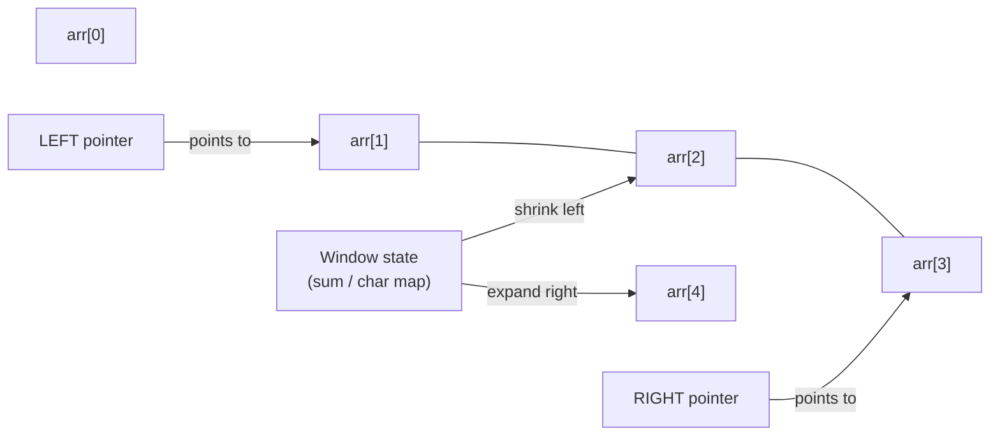

# Sliding Window Pattern

**Level**: 🟡 Intermediate

## 🗺️ Quick Overview



*Right pointer expands the window one element at a time; left pointer catches up only when the constraint is violated — each element is touched at most twice.*

> Maintain a window over a sequence, expanding from the right and shrinking from the left when a constraint is violated. Turns O(N²) brute force into O(N).

## The Pattern

When a problem asks about a **contiguous subarray or substring** that satisfies some constraint, a sliding window eliminates the need to check every possible subarray.

**Recognition signals:**
- "Find the longest/shortest subarray that..."
- "Find the maximum sum of a subarray of size K"
- "Find all substrings without repeating characters"
- "Rate limiting over a rolling time window"

The key insight: when you advance the right pointer by one, you only need to undo the leftmost element (not recompute everything from scratch).

## Template Pseudocode

```
// Fixed-size window: sum of every window of size K
function fixed_window(arr, k):
  window_sum = sum(arr[0:k])   // initial window
  max_sum = window_sum

  for right in range(k, len(arr)):
    window_sum += arr[right]          // add new right element
    window_sum -= arr[right - k]      // remove element that fell off left
    max_sum = max(max_sum, window_sum)

  return max_sum

// Variable-size window: longest subarray satisfying constraint
function variable_window(arr, constraint):
  left = 0
  window_state = initial_state()   // depends on problem (e.g., char count map)
  best = 0

  for right in range(len(arr)):
    // Expand: include arr[right] in window
    window_state.add(arr[right])

    // Shrink: while constraint violated, move left pointer right
    while constraint_violated(window_state):
      window_state.remove(arr[left])
      left += 1

    // Window [left..right] is now valid
    current_size = right - left + 1
    best = max(best, current_size)

  return best
```

## 3 Example Problems

### Problem 1: Maximum Sum Subarray of Size K

```
function max_sum_subarray(arr, k):
  window_sum = sum(arr[0:k])
  max_sum = window_sum

  for i in range(k, len(arr)):
    window_sum += arr[i] - arr[i - k]
    max_sum = max(max_sum, window_sum)

  return max_sum
// Time: O(N), Space: O(1)
```

### Problem 2: Longest Substring Without Repeating Characters

```
function longest_no_repeat(s):
  char_count = {}   // character → count in current window
  left = 0
  max_length = 0

  for right in range(len(s)):
    char = s[right]
    char_count[char] = char_count.get(char, 0) + 1

    // Shrink if duplicate exists
    while char_count[char] > 1:
      char_count[s[left]] -= 1
      if char_count[s[left]] == 0:
        del char_count[s[left]]
      left += 1

    max_length = max(max_length, right - left + 1)

  return max_length
// Time: O(N), Space: O(alphabet size)
```

### Problem 3: Rate Limiting — Count Requests in Rolling Window

```
function rate_limiter_sliding_window(request_timestamps, window_seconds, limit):
  // request_timestamps: sorted list of timestamps when requests arrived
  left = 0
  denied_count = 0

  for right in range(len(request_timestamps)):
    // Remove timestamps outside the window
    while request_timestamps[right] - request_timestamps[left] > window_seconds:
      left += 1

    // Count requests in window [left..right]
    requests_in_window = right - left + 1
    if requests_in_window > limit:
      denied_count += 1   // or: deny this request

  return denied_count
```

## In Real Systems

**Stream analytics** — 5-minute moving average of request latency, or rolling count of errors in the last 60 seconds. The sliding window maintains a deque or ring buffer of recent values.

**Network packet buffering** — TCP receive window is literally a sliding window: the receiver advertises how many bytes it can accept, and the sender tracks the window of unacknowledged bytes.

**Rate limiting** — The "sliding window counter" algorithm (used by Redis-based rate limiters) tracks request counts over a rolling time window. More accurate than fixed window counting because it prevents burst exploitation at window boundaries.

**Apache Flink / Spark Streaming** — Window operations (`.window(SlidingEventTimeWindows.of(5 minutes, 1 minute))`) are implemented using sliding window logic. Aggregate functions like sum/count/max run incrementally as elements enter and leave the window.

## Complexity

| Approach | Time | Space |
|----------|------|-------|
| Fixed-size window | O(N) | O(1) |
| Variable-size window | O(N) amortized (each element added/removed once) | O(window size) |
| Brute force (baseline) | O(N²) to O(N³) | O(1) |

## Key Takeaways

- Sliding window converts "check all subarrays" (O(N²)) to a single linear pass (O(N))
- Two variants: fixed-size (K elements, slide by 1) and variable-size (expand right, shrink left on violation)
- The critical insight: when the right pointer advances, you only need to update state incrementally
- Pattern recognition: "longest/shortest subarray satisfying X" → variable window; "max sum/average of K elements" → fixed window
- Rate limiting, stream analytics, TCP flow control all use this pattern in production
