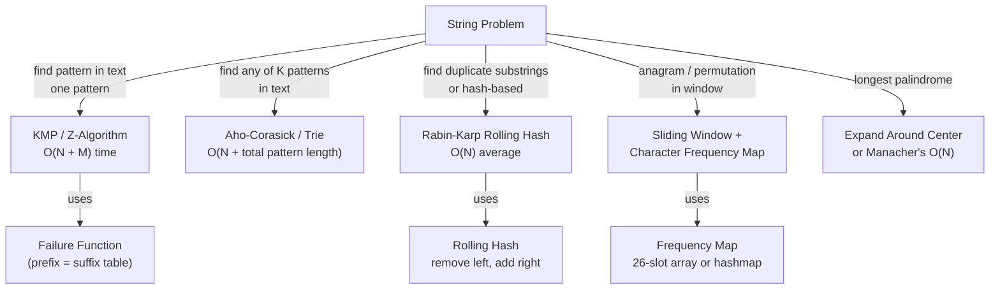

# String Search & Matching Algorithms

**Level**: 🔴 Advanced

## 🗺️ Quick Overview



*Brute-force substring search is O(N × M) — every pattern-matching algorithm listed here beats it by exploiting structure in the pattern or using hashing.*

> String matching is never about memorizing algorithms — it's about recognizing that O(N × M) brute force will TLE on large inputs, and choosing the technique that matches the problem's constraint.

## The Pattern

### Why Brute Force Fails

Naive substring search: for each of N positions in text, compare up to M characters of pattern.
- Worst case: `text = "aaaaaab"`, `pattern = "aaab"` → backtrack on nearly every character
- Time: O(N × M) — for a 400 TB codebase and a 20-char pattern, this is unusable

Every efficient string algorithm avoids redundant re-examination by either:
1. **Pre-processing the pattern** (KMP, Z-algorithm): encode where partial matches can resume
2. **Hashing** (Rabin-Karp): compare fingerprints instead of characters, slide the window in O(1)
3. **Pre-processing multiple patterns** (Trie, Aho-Corasick): build a search automaton once, scan text once

---

### Recognition Signals

**Use KMP when:**
- Single pattern substring search, online stream of text
- "Does text contain pattern?" or "Find all occurrences"
- You need guaranteed O(N + M) worst case (no hash collisions)

**Use Rabin-Karp when:**
- "Find any of K short patterns in text" (extend to set of hashes)
- "Find duplicate substrings of length L" — hash all windows, look for repeats
- Approximate/fuzzy matching is acceptable (handle collisions)

**Use Sliding Window + Frequency Map when:**
- "Find all anagrams / permutations of pattern in text"
- "Minimum window containing all characters of pattern"
- Character set is bounded (lowercase letters → 26-element array, not a hashmap)

**Use Trie / Aho-Corasick when:**
- Search for any of K patterns simultaneously in a single pass over text
- Autocomplete / prefix lookup (Trie alone)
- Spam filtering, intrusion detection (many patterns, one text scan)

**Use Expand-Around-Center / Manacher's when:**
- "Longest palindromic substring"
- "Count palindromic substrings"

---

### KMP — The Failure Function

The key insight: when a mismatch occurs at position `j` in the pattern, we know the last `failure[j-1]` characters of the text already match the beginning of the pattern. We can skip re-examining them.

```
// Step 1: Build failure function (also called LPS — Longest Proper Prefix = Suffix)
// failure[i] = length of longest proper prefix of pattern[0..i] that is also a suffix
function build_failure(pattern):
  m = len(pattern)
  failure = [0] * m
  j = 0   // length of current matching prefix

  for i in range(1, m):
    while j > 0 and pattern[i] != pattern[j]:
      j = failure[j - 1]   // fall back — don't restart from 0
    if pattern[i] == pattern[j]:
      j += 1
    failure[i] = j

  return failure
// Time: O(M),  Space: O(M)

// Step 2: Use failure function to search text
function kmp_search(text, pattern):
  n, m = len(text), len(pattern)
  failure = build_failure(pattern)
  j = 0   // number of characters matched so far
  matches = []

  for i in range(n):
    while j > 0 and text[i] != pattern[j]:
      j = failure[j - 1]   // backtrack using failure table, NOT to 0

    if text[i] == pattern[j]:
      j += 1

    if j == m:
      matches.append(i - m + 1)   // found match ending at i
      j = failure[j - 1]          // look for overlapping matches

  return matches
// Time: O(N + M),  Space: O(M) for failure table
```

**Why O(N + M)?** The index `i` in the text never goes backwards. The total number of times `j` can increase across the entire scan is bounded by N (it increments at most once per character). The `failure` fallback can only decrease `j`, and it can decrease at most as many times as it has increased — so the total work for all fallbacks is also O(N). Result: O(N) for the search, O(M) for building the table.

---

### Rabin-Karp — Rolling Hash

```
// Rolling hash over a window of size M
// Key: when window slides right by 1:
//   new_hash = (old_hash - text[i] * BASE^(M-1)) * BASE + text[i+M]
// This "removes" the leftmost character and "adds" the new rightmost character

function rabin_karp(text, pattern):
  n, m = len(text), len(pattern)
  BASE = 31          // prime close to alphabet size
  MOD = 10**9 + 7   // large prime to reduce collisions

  // Precompute BASE^(M-1) % MOD
  power = 1
  for _ in range(m - 1):
    power = (power * BASE) % MOD

  // Hash the pattern and the first window
  pattern_hash = 0
  window_hash = 0
  for i in range(m):
    pattern_hash = (pattern_hash * BASE + ord(pattern[i])) % MOD
    window_hash  = (window_hash  * BASE + ord(text[i]))    % MOD

  matches = []
  for i in range(n - m + 1):
    if window_hash == pattern_hash:
      if text[i:i+m] == pattern:   // verify to handle hash collisions
        matches.append(i)

    if i < n - m:
      // Roll the window: remove text[i], add text[i+m]
      window_hash = (window_hash - ord(text[i]) * power) % MOD
      window_hash = (window_hash * BASE + ord(text[i + m])) % MOD
      window_hash = (window_hash + MOD) % MOD   // keep positive

  return matches
// Time: O(N + M) average,  O(N × M) worst case (many collisions — rare with good MOD)
// Space: O(1) extra (beyond output)
```

**Extension — duplicate substring detection**: store all window hashes in a set. If a hash repeats, check for actual equality. Used in "Longest Duplicate Substring" problems.

---

### Sliding Window — Anagram / Permutation Search

```
// "Find all start indices where pattern's permutation appears in text"
function find_anagrams(text, pattern):
  if len(pattern) > len(text): return []

  n, m = len(text), len(pattern)
  pattern_count = [0] * 26
  window_count  = [0] * 26

  for ch in pattern:
    pattern_count[ord(ch) - ord('a')] += 1

  for i in range(m):
    window_count[ord(text[i]) - ord('a')] += 1

  matches = []
  if window_count == pattern_count:
    matches.append(0)

  for i in range(m, n):
    // Add right character
    window_count[ord(text[i]) - ord('a')] += 1
    // Remove left character (window slides right)
    window_count[ord(text[i - m]) - ord('a')] -= 1

    if window_count == pattern_count:
      matches.append(i - m + 1)

  return matches
// Time: O(N),  Space: O(1) — fixed 26-slot array, not O(N)
```

**Key insight**: Comparing two 26-element arrays is O(26) = O(1). Avoid a hashmap here — arrays over fixed alphabet are faster and avoid hash overhead.

---

### Palindrome — Expand Around Center

```
// Every palindrome has a center: a single character (odd length) or
// a gap between two characters (even length).
// Try all 2N-1 centers and expand outward while characters match.

function longest_palindrome(s):
  n = len(s)
  start, max_len = 0, 1

  function expand(l, r):   // returns (start, length) of longest palindrome from this center
    while l >= 0 and r < n and s[l] == s[r]:
      l -= 1
      r += 1
    // After loop: s[l+1..r-1] is the palindrome
    length = r - l - 1
    return l + 1, length

  for i in range(n):
    // Odd-length palindromes (center at i)
    s1, len1 = expand(i, i)
    // Even-length palindromes (center between i and i+1)
    s2, len2 = expand(i, i + 1)

    if len1 > max_len:
      start, max_len = s1, len1
    if len2 > max_len:
      start, max_len = s2, len2

  return s[start : start + max_len]
// Time: O(N²) worst case (e.g., "aaaaaaa"),  Space: O(1)
// Manacher's algorithm achieves O(N) — overkill for most interviews
```

---

### Minimum Window Substring — Sliding Window with Constraints

```
// "Find shortest substring of text containing all characters in pattern"
function min_window(text, pattern):
  need = {}   // characters we still need
  for ch in pattern:
    need[ch] = need.get(ch, 0) + 1

  have, required = 0, len(need)
  window = {}
  result = ""
  min_len = INF
  l = 0

  for r in range(len(text)):
    ch = text[r]
    window[ch] = window.get(ch, 0) + 1

    // Did we just satisfy the requirement for character ch?
    if ch in need and window[ch] == need[ch]:
      have += 1

    // Shrink window from left as long as all requirements are satisfied
    while have == required:
      if r - l + 1 < min_len:
        min_len = r - l + 1
        result = text[l : r + 1]
      // Remove leftmost character
      left_ch = text[l]
      window[left_ch] -= 1
      if left_ch in need and window[left_ch] < need[left_ch]:
        have -= 1
      l += 1

  return result
// Time: O(N),  Space: O(|pattern alphabet|)
```

---

## Real-World at Scale

### grep / ripgrep — Searching 400 TB of Code at GitHub

GitHub Code Search indexes 400 TB of source code across 200+ million repositories. The underlying engine uses Boyer-Moore (skips characters from the right) and BM-Horspool (simplified but equally fast in practice) for single-pattern search, falling back to trigram indexes for large-scale search.

`ripgrep`, the fastest grep implementation:
- Uses Aho-Corasick for multi-pattern search and SIMD intrinsics for byte-level scanning
- Searches 100 GB of text per second on modern hardware
- Uses a finite automaton (DFA) built from the regex — structurally equivalent to KMP for literal patterns

The critical production constraint: zero tolerance for false negatives. Boyer-Moore can be O(N × M) in adversarial inputs — for security tools (searching for exact malware signatures), KMP's guaranteed O(N + M) is preferred.

### Google Search — Rabin-Karp for Duplicate Content Detection

Google's crawling infrastructure uses rolling hash fingerprinting (SimHash and MinHash — variants of Rabin-Karp) to detect near-duplicate web pages across 100 billion+ indexed pages. Instead of comparing full page text, a 64-bit hash fingerprint is computed for every sliding K-gram (window of K words) across the page.

- Near-duplicate threshold: pages with >80% overlapping K-gram hashes are considered duplicate
- Canopy clustering of SimHash values: grouping pages by Hamming distance on 64-bit fingerprints
- Without hashing: naive string comparison across 100B pages is computationally infeasible
- With rolling hash: O(N) per page, O(1) per window slide — the entire index is processed in hours

### Turnitin / Moss Plagiarism Detection — Document Shingles

Turnitin processes 1 million+ document submissions per day and compares each against a database of 1 billion+ previously submitted documents. The Winnowing algorithm (used by Moss) applies rolling hash to "shingles" (overlapping N-gram windows of K words):

1. Compute Rabin-Karp rolling hash for every K-word window in the document
2. Select a representative fingerprint from each "window of windows" (Winnowing)
3. Store fingerprint set in a database; compare new submissions by set intersection

Result: each document is reduced to ~200 fingerprints regardless of document length, making comparison O(200 × 200) = O(1) per pair.

### Gmail Anti-Spam — Aho-Corasick Multi-Pattern Matching

Gmail's spam filters maintain a blocklist of ~50,000 known spam phrases (product names, scam phrases, malicious URLs). Scanning each email against 50,000 patterns with KMP would be O(50,000 × email_length) per email — ~50 billion operations per day just for spam.

Aho-Corasick builds a finite automaton from all 50,000 patterns in one preprocessing step (O(total pattern length)), then scans the email text once — O(email_length + matches). A single pass detects all matching patterns simultaneously.

- Gmail processes ~1.5 billion spam emails per day, blocking 99.9% of spam
- Single Aho-Corasick scan per email vs 50,000 KMP scans = ~50,000× speedup

### Google Autocomplete — Trie Prefix Matching

Google serves 8.5 billion search queries per day. Autocomplete suggestions are served in under 100ms. The suggestion backend uses a **compressed trie** (radix tree) over the ~1 billion unique queries in Google's query log. Each node stores the top-K most frequent queries with that prefix.

- Query lookup: O(L) where L = length of prefix typed — independent of total queries stored
- In-memory trie for top-10 million queries: ~200MB with prefix compression
- Real-time update: new trending queries are inserted into the trie as they arrive

### DNA Sequencing — String Matching at Genomic Scale

DNA sequence alignment (BLAST algorithm) uses a seed-and-extend approach:
1. Find exact k-mer matches (short exact substrings) using a hash table — Rabin-Karp variant
2. Extend from seeds using Smith-Waterman (2D DP similar to edit distance) for approximate alignment

- Human genome: 3 billion base pairs — a 3 GB string
- NCBI's BLAST database: 240 billion nucleotides, searched millions of times per day
- K-mer hash tables reduce search space by 99%+ before expensive DP alignment begins

---

## Core Problems

### Problem 1: Implement strStr — KMP

**Thought process**: Brute force is O(N × M). The interviewer expects O(N + M). Build the failure function, then scan text using it.

```
// LeetCode 28: Find the index of the first occurrence of needle in haystack
function str_str(haystack, needle):
  if not needle: return 0
  n, m = len(haystack), len(needle)

  // Build failure table for needle
  failure = [0] * m
  j = 0
  for i in range(1, m):
    while j > 0 and needle[i] != needle[j]:
      j = failure[j - 1]
    if needle[i] == needle[j]:
      j += 1
    failure[i] = j

  // KMP search
  j = 0
  for i in range(n):
    while j > 0 and haystack[i] != needle[j]:
      j = failure[j - 1]
    if haystack[i] == needle[j]:
      j += 1
    if j == m:
      return i - m + 1   // first match

  return -1
// Time: O(N + M),  Space: O(M)
```

---

### Problem 2: Longest Palindromic Substring — Expand Around Center

**Thought process**: Check every possible center (2N-1 centers), expand while characters match. O(N²) — acceptable for interview unless N > 10^5 (then mention Manacher's O(N)).

See the expand-around-center template in the Pattern section above.

```
// For interview: mention you know Manacher's O(N) exists but expand-around-center
// is O(N²)/O(1) space and sufficient for N ≤ 10^4
function count_palindromic_substrings(s):
  count = 0
  n = len(s)

  for center in range(2 * n - 1):
    l = center // 2
    r = l + (center % 2)   // even centers: l == r; odd centers: r = l+1
    while l >= 0 and r < n and s[l] == s[r]:
      count += 1
      l -= 1
      r += 1

  return count
// Time: O(N²),  Space: O(1)
```

---

### Problem 3: Minimum Window Substring — Sliding Window

See the full template in the Pattern section above.

**Key decisions at interview time:**
1. Use a `need` dict (not a set) — we care about character counts, not just presence
2. Track `have` counter to avoid re-scanning the window on every step
3. Shrink from left ONLY when `have == required` to keep window minimal

```
// Time: O(N + M),  Space: O(|M alphabet|)
// Interviewer follow-up: "What if characters are Unicode?"
// → Use a hashmap instead of a 26-slot array — same algorithm, broader key space
```

---

### Problem 4: Group Anagrams — Sorted Key

**Thought process**: Two strings are anagrams iff their sorted forms are equal. Use sorted string as hashmap key to group.

```
function group_anagrams(strs):
  groups = {}
  for s in strs:
    key = ''.join(sorted(s))   // canonical form: sorted characters
    groups.setdefault(key, []).append(s)
  return list(groups.values())
// Time: O(N × K log K) where K = max string length
// Space: O(N × K)

// Optimization: use character count tuple as key instead of sorted string
// → O(N × K) time (26-slot count array, O(26) to build = O(1) per char)
function group_anagrams_fast(strs):
  groups = {}
  for s in strs:
    count = [0] * 26
    for ch in s:
      count[ord(ch) - ord('a')] += 1
    key = tuple(count)   // hashable
    groups.setdefault(key, []).append(s)
  return list(groups.values())
// Time: O(N × K),  Space: O(N × K)
```

---

### Problem 5: Repeated DNA Sequences — Rolling Hash + Set

**Thought process**: Find all 10-character substrings that appear more than once. Brute force: O(N × 10) per window = O(N). But string comparison for set lookups is O(10) — fine. More interesting: use rolling hash to make it truly O(1) per window.

```
function find_repeated_dna(s):
  if len(s) <= 10: return []

  seen = set()
  repeated = set()

  for i in range(len(s) - 9):
    window = s[i : i + 10]
    if window in seen:
      repeated.add(window)
    seen.add(window)

  return list(repeated)
// Time: O(N × 10) = O(N),  Space: O(N × 10) for stored strings
// With rolling hash: reduce to O(N) time AND O(N) space using 2-bit encoding per base
// A=00, C=01, G=10, T=11 → 10 chars = 20 bits → store as integer, not string

function find_repeated_dna_hash(s):
  base_map = {'A': 0, 'C': 1, 'G': 2, 'T': 3}
  n = len(s)
  if n <= 10: return []

  // Encode first 10 chars as 20-bit integer
  curr = 0
  for i in range(10):
    curr = (curr << 2) | base_map[s[i]]

  seen = {curr}
  repeated = set()
  mask = (1 << 20) - 1   // keep only last 20 bits

  for i in range(10, n):
    curr = ((curr << 2) | base_map[s[i]]) & mask   // add right, implicit remove left
    if curr in seen:
      repeated.add(s[i-9 : i+1])
    seen.add(curr)

  return list(repeated)
// Time: O(N),  Space: O(N) integers (4× smaller than string storage)
```

---

## Complexity

| Algorithm | Preprocessing | Search | Space | Notes |
|-----------|--------------|--------|-------|-------|
| Brute Force | O(1) | O(N × M) | O(1) | Unacceptable for large N, M |
| KMP | O(M) | O(N) | O(M) | Guaranteed — no worst case |
| Rabin-Karp | O(M) | O(N) avg | O(1) | O(N×M) worst case (collisions) |
| Z-Algorithm | O(M) | O(N) | O(N+M) | Simpler to implement than KMP |
| Aho-Corasick | O(Σ patterns) | O(N + matches) | O(Σ patterns × alphabet) | K patterns in one scan |
| Trie prefix search | O(Σ patterns) | O(L) per query | O(Σ patterns) | L = query length |
| Sliding Window (anagram) | O(M) | O(N) | O(1) | Fixed 26-char alphabet |
| Expand-center palindrome | O(1) | O(N²) | O(1) | Manacher's gives O(N) |

---

## Key Takeaways

- O(N × M) brute force hits TLE at scale. The signal to optimize: N > 10^4 and M > 10^2.
- KMP's failure function encodes "where can we resume after a mismatch?" — never re-examine a character. Build it on the pattern alone in O(M), then scan text in O(N).
- Rabin-Karp uses O(1) window updates via rolling hash — perfect for duplicate substring problems and multi-pattern matching with a hash set.
- Sliding window + 26-slot array (not hashmap) solves all anagram/permutation-in-string problems in O(N) time, O(1) space.
- Minimum window substring: track `have / required` counts rather than rescanning the window — the key to keeping it O(N).
- Aho-Corasick is KMP generalized to K patterns: build one automaton from all patterns, scan text once — O(N + total pattern length + matches).
- In interviews: always state whether the alphabet is bounded (lowercase letters → arrays) or unbounded (Unicode → hashmaps).
