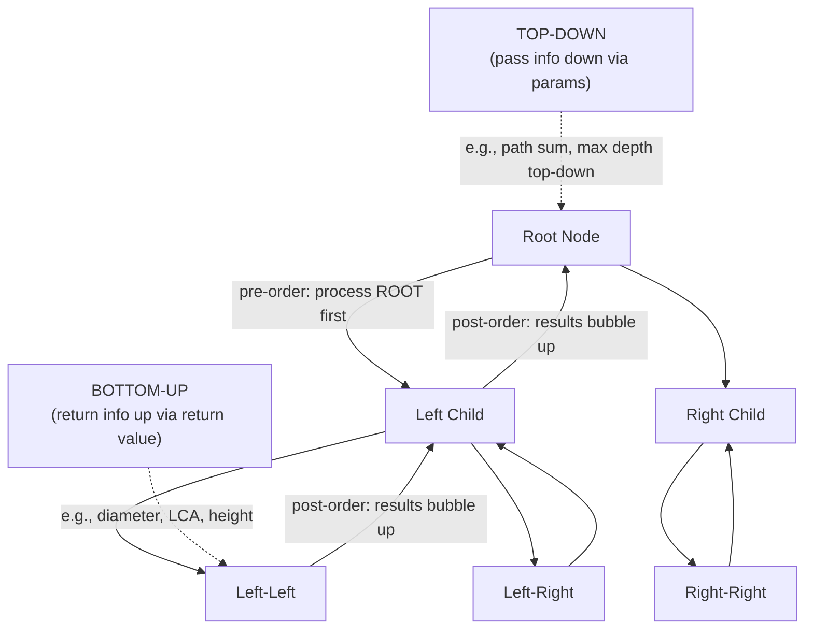

# Tree & Binary Tree Patterns

**Level**: 🟡 Intermediate

## 🗺️ Quick Overview



*Top-down: carry state from parent to children via parameters. Bottom-up: children return values to parent, parent computes from them. Most tree problems map to one of these two mental models.*

> Trees are the data structure underlying file systems, compilers, databases, and the DOM. The key insight is not memorizing traversal orders — it is knowing when to pass information **down** versus when to bubble information **up**.

## The Pattern

### Traversal Types — When Each Is Useful

| Traversal | Order | Use When |
|-----------|-------|----------|
| Pre-order | Root → Left → Right | Serialize a tree; copy a tree; build a prefix expression |
| In-order | Left → Root → Right | BST sorted output; validate BST; kth smallest in BST |
| Post-order | Left → Right → Root | Compute subtree properties (height, size, diameter); delete a tree |
| Level-order (BFS) | Level by level | Shortest path in unweighted tree; level-by-level output; zigzag traversal |

**The rule of thumb**: if you need the **parent** before you process children, use pre-order (top-down). If you need **children's results** before computing the parent's result, use post-order (bottom-up).

### The Two Mental Models

**Top-down recursion** — pass a parameter from parent to child:
```
// Example: max depth, path sum existence
function top_down(node, param_from_parent):
  if node is null: return base_case

  new_param = compute(param_from_parent, node.val)

  left_result  = top_down(node.left,  new_param)
  right_result = top_down(node.right, new_param)

  return combine(left_result, right_result)
```

**Bottom-up recursion** — children return values up to the parent:
```
// Example: diameter, height, LCA
function bottom_up(node):
  if node is null: return base_case

  left_info  = bottom_up(node.left)   // children compute first
  right_info = bottom_up(node.right)

  return compute(node, left_info, right_info)   // parent uses children's results
```

The "diameter of binary tree" problem is a classic case where beginners mistakenly try top-down and get confused — it requires bottom-up because the diameter through a node equals `left_height + right_height`, and you need both children's heights before you can compute the diameter at the current node.

### Universal Template

```
// Template: most tree problems fit one of these two shells
// Shell A — top-down (parameter threading)
function solve_top_down(node, accumulated_state):
  if node is null:
    return check_or_record(accumulated_state)

  // Update state with current node
  new_state = update(accumulated_state, node.val)

  return solve_top_down(node.left, new_state) or
         solve_top_down(node.right, new_state)

// Shell B — bottom-up (return aggregate)
function solve_bottom_up(node):
  if node is null: return null_sentinel   // e.g., 0 for height, null for LCA

  left  = solve_bottom_up(node.left)
  right = solve_bottom_up(node.right)

  // Compute current node's answer using children's answers
  return combine(node, left, right)
```

## Core Problems

### Problem 1: Maximum Depth of a Binary Tree

**Thought process**: "How deep is the tree?" Each node's depth = 1 + max(left_depth, right_depth). Children compute their depths first, then parent takes the max → **bottom-up**.

```
function max_depth(node):
  if node is null: return 0

  left_depth  = max_depth(node.left)
  right_depth = max_depth(node.right)

  return 1 + max(left_depth, right_depth)
// Time: O(N), Space: O(H) where H = tree height (O(log N) balanced, O(N) skewed)
```

### Problem 2: Diameter of a Binary Tree

**Thought process**: "The longest path between any two nodes." The path may or may not pass through the root — it passes through SOME node as the "turning point." At each node, the longest path through it is `left_height + right_height`. Use a global variable to track the maximum seen so far. This is **bottom-up** (need heights of both children before computing diameter at current node).

```
function diameter_of_tree(root):
  max_diameter = [0]   // use array to allow mutation in nested function

  function height(node):
    if node is null: return 0

    left_h  = height(node.left)
    right_h = height(node.right)

    // Update global diameter at this node
    max_diameter[0] = max(max_diameter[0], left_h + right_h)

    return 1 + max(left_h, right_h)   // return height for parent to use

  height(root)
  return max_diameter[0]
// Time: O(N), Space: O(H)
// Key insight: the diameter and height computations are done in the SAME traversal
```

### Problem 3: Lowest Common Ancestor (LCA)

**Thought process**: "Find the deepest node that is an ancestor of both p and q." The classic approach uses the following observation: if the current node is p or q, it could BE the LCA. Otherwise, check left and right subtrees — if both return non-null, the current node is the split point (LCA).

```
function lca(root, p, q):
  if root is null: return null
  if root == p or root == q: return root   // found one of the targets

  left_result  = lca(root.left,  p, q)
  right_result = lca(root.right, p, q)

  // If both subtrees returned something, current node is the split (LCA)
  if left_result is not null and right_result is not null:
    return root

  // Otherwise, the LCA is in whichever subtree returned a result
  return left_result if left_result is not null else right_result
// Time: O(N), Space: O(H)
// This is bottom-up: we need children's results before we can decide at the current node
```

**Production use**: LinkedIn's org chart feature uses this exact algorithm. When you click "Find common manager" for two employees, the org tree is traversed with LCA — the result is their closest shared manager.

### Problem 4: Serialize and Deserialize a Binary Tree

**Thought process**: "Convert a tree to a string and back." Pre-order traversal naturally records the tree structure because the root always comes first. Use a special marker for null nodes to preserve shape.

```
function serialize(root):
  // Pre-order: root, left, right — encode nulls as "#"
  if root is null: return "#"
  return str(root.val) + "," + serialize(root.left) + "," + serialize(root.right)

function deserialize(data):
  values = data.split(",")
  index = [0]   // mutable index shared across recursive calls

  function build():
    val = values[index[0]]
    index[0] += 1

    if val == "#": return null

    node = TreeNode(int(val))
    node.left  = build()   // left subtree is encoded immediately after root
    node.right = build()
    return node

  return build()
// Time: O(N), Space: O(N)
// Why pre-order works: when deserializing, you always know the root value first,
// then recursively reconstruct left subtree, then right subtree.
```

### Problem 5: Validate a Binary Search Tree

**Thought process**: "Is every node in its valid range?" The common mistake is checking only `node.val > node.left.val` — this misses the case where a node in the right subtree is less than an ancestor. The correct approach passes a `(min, max)` range down via parameters → **top-down**.

```
function is_valid_bst(node, min_val=-infinity, max_val=+infinity):
  if node is null: return true   // empty tree is valid

  if node.val <= min_val or node.val >= max_val:
    return false   // PRUNE: current node violates its valid range

  // Left subtree: all values must be < node.val (update max_val)
  // Right subtree: all values must be > node.val (update min_val)
  return (is_valid_bst(node.left,  min_val,   node.val) and
          is_valid_bst(node.right, node.val, max_val))
// Time: O(N), Space: O(H)
// Why top-down: we need to PASS the valid range constraint from parent to child
```

## Level-Order (BFS on Trees)

Level-order traversal deserves special attention because it reveals information that DFS cannot easily access — which nodes are at the same depth.

```
function level_order(root):
  if root is null: return []

  result = []
  queue = Queue()
  queue.enqueue(root)

  while not queue.empty():
    level_size = queue.size()     // number of nodes at current level
    current_level = []

    for _ in range(level_size):  // process exactly one level at a time
      node = queue.dequeue()
      current_level.append(node.val)

      if node.left:  queue.enqueue(node.left)
      if node.right: queue.enqueue(node.right)

    result.append(current_level)

  return result
// Time: O(N), Space: O(W) where W = max width of tree
// The level_size trick is the key: it lets you group nodes by level
```

Use level-order when the problem mentions: "level by level", "right side view", "minimum depth", "zigzag traversal", or anything requiring knowing which level a node is on.

## Real-World at Scale

### Linux Filesystem — `du` and `find`

The Linux Virtual Filesystem (VFS) represents mounted filesystems as a tree of `dentry` (directory entry) objects. When you run `du -sh /var`, the kernel traverses this tree in **post-order**: it must compute the size of all subdirectories before it can sum them into the parent. For `find /usr -name "*.log"`, the kernel uses **pre-order DFS** — process the directory node first (apply the name filter), then recurse into subdirectories. On large filesystems with millions of inodes, this traversal is the bottleneck and tools like `ncdu` parallelize it across I/O threads.

### PostgreSQL Query Planner — Post-Order Tree Evaluation

PostgreSQL's EXPLAIN output is a literal tree. When the query planner executes a query like `SELECT * FROM orders JOIN users ON ... WHERE ...`, it builds a plan tree where each node is an operation (SeqScan, HashJoin, Sort). Execution proceeds **bottom-up (post-order)**: leaf nodes (table scans) produce tuples first, intermediate nodes consume and transform them, and the root node delivers the final result set. The EXPLAIN ANALYZE output shows each node's actual vs. estimated row counts — the planner uses these to build cost estimates with **bottom-up DP**, computing each subtree's cost before the parent's.

### Git Commit Graph — `git log --graph`

Git's commit history is a Directed Acyclic Graph (DAG) where each commit points to its parent(s). `git log --graph` performs a **reverse BFS** from HEAD, visiting commits in topological order. `git merge-base A B` (which finds the best common ancestor of two branches) is equivalent to finding the LCA in a DAG — Git implements it using a bitset-based ancestor reachability algorithm that is conceptually LCA on a graph.

### React Reconciler — Virtual DOM Diffing

React's reconciler (Fiber) performs tree diffing between the old virtual DOM tree and the new one. It uses a **depth-first post-order traversal**: process children before parents. This is because React must complete child component reconciliation before a parent's `useEffect` cleanup runs. The Fiber architecture converts the recursion to an iterative linked-list walk (to allow pausing and resuming), but the logical traversal is still bottom-up tree traversal. React processes ~10M DOM reconciliations per second in production at Meta, and the traversal efficiency directly impacts frame rate.

### LinkedIn Org Chart — LCA for "Find Common Manager"

LinkedIn's people graph contains the org hierarchy of every company. The "Find Common Manager" feature on company org pages runs LCA against a cached tree representation of the org chart. For large companies (Amazon has 1.5M employees), the tree height is ~12 levels, so LCA runs in O(12) = O(log N) time with proper ancestor preprocessing (binary lifting).

## Complexity

| Problem | Time | Space |
|---------|------|-------|
| Any traversal (pre/in/post/level) | O(N) | O(H) stack or O(W) queue |
| Max depth | O(N) | O(H) |
| Diameter | O(N) | O(H) |
| LCA | O(N) | O(H) |
| Serialize / Deserialize | O(N) | O(N) |
| Validate BST | O(N) | O(H) |
| Level-order | O(N) | O(W) max width |

Where H = tree height (O(log N) balanced, O(N) worst case skewed), W = max width (O(N/2) at bottom level of complete binary tree).

## Common Mistakes

- **LCA**: checking only `node.left.val` and `node.right.val` instead of passing valid ranges — misses cross-level violations
- **Diameter**: computing height separately in each recursive call → O(N²). Fix: compute height and update diameter in the same post-order pass
- **Serialize**: forgetting null markers → deserialization becomes ambiguous. A tree of `[1, null, 2]` and `[1, 2]` look identical without null markers
- **BST validation**: the common wrong solution checks only immediate parent-child — always use the `(min, max)` range parameter approach
- **Level-order**: forgetting the `level_size` snapshot — if you use `while queue:` with a single loop, you lose level grouping because new nodes are added during iteration

## Key Takeaways

- Two mental models cover almost every tree problem: **top-down** (pass state down as parameters) and **bottom-up** (return aggregate up to parent)
- Use pre-order when you need parent before children (serialization, BST validation, path problems). Use post-order when children must finish before parent (height, diameter, LCA, size)
- Level-order (BFS) is the right tool whenever the problem mentions levels, minimum depth, or nearest-neighbor in the tree
- LCA is used in production for org charts (LinkedIn), file system ancestor checks, and compiler dominance analysis
- Serialize/deserialize using pre-order + null markers — pre-order is the only traversal that unambiguously reconstructs a tree
- React, PostgreSQL, Git, and Linux all use tree traversal at their core — the pattern is ubiquitous in production systems
