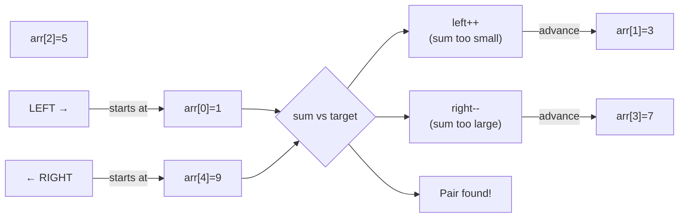

# Two Pointers Pattern

**Level**: 🟢 Beginner

## 🗺️ Quick Overview



*Two pointers converge from opposite ends — sorted order guarantees moving the smaller pointer increases the sum and moving the larger decreases it.*

> Use two indices moving through an array — either toward each other or at different speeds — to solve problems that would otherwise require nested loops.

## The Pattern

Two pointers eliminate the O(N²) nested loop by using structure (sorted order or sequence properties) to move intelligently. Instead of comparing every pair, you move pointers based on what you discover at each step.

**Two variants:**
- **Opposite-direction**: Start from both ends, move toward the center. Good for sorted arrays.
- **Same-direction (slow/fast)**: Both start at the beginning, move at different speeds. Good for detecting cycles, removing duplicates, finding midpoints.

**Recognition signals:**
- "Find a pair with target sum in a sorted array"
- "Remove duplicates in-place"
- "Detect a cycle in a linked list"
- "Find the middle of a linked list"
- "Merge two sorted arrays"

## Template Pseudocode

```
// Opposite-direction: two pointers from both ends
function two_pointers_opposite(arr, target):
  left = 0
  right = len(arr) - 1

  while left < right:
    current = evaluate(arr[left], arr[right])

    if current == target:
      return (left, right)   // found
    elif current < target:
      left += 1   // increase the value (array is sorted ascending)
    else:
      right -= 1  // decrease the value

  return null   // not found

// Same-direction: slow/fast pointers
function two_pointers_same_direction(arr):
  slow = 0
  fast = 0

  while fast < len(arr):
    if condition(arr[slow], arr[fast]):
      // slow pointer advances only when we find something valid
      arr[slow] = arr[fast]
      slow += 1
    fast += 1   // fast always advances

  return slow   // slow is the new length of valid elements
```

## 3 Example Problems

### Problem 1: Find Pair with Target Sum (Sorted Array)

```
function two_sum_sorted(arr, target):
  left = 0
  right = len(arr) - 1

  while left < right:
    sum = arr[left] + arr[right]
    if sum == target:
      return (left, right)
    elif sum < target:
      left += 1    // need larger sum, increase left
    else:
      right -= 1   // need smaller sum, decrease right

  return null
// Time: O(N), Space: O(1)
// Brute force: O(N²)
```

### Problem 2: Remove Duplicates from Sorted Array In-Place

```
function remove_duplicates(arr):
  if len(arr) == 0: return 0

  slow = 0   // slow points to last valid (unique) element

  for fast in range(1, len(arr)):
    if arr[fast] != arr[slow]:   // new unique element found
      slow += 1
      arr[slow] = arr[fast]     // place it after the last unique

  return slow + 1   // length of deduplicated array
// Time: O(N), Space: O(1)
```

### Problem 3: Detect Cycle in Linked List (Floyd's Algorithm)

```
function has_cycle(head):
  slow = head
  fast = head

  while fast is not null and fast.next is not null:
    slow = slow.next        // moves 1 step
    fast = fast.next.next   // moves 2 steps

    if slow == fast:
      return true   // they met → cycle exists

  return false   // fast reached end → no cycle
// Time: O(N), Space: O(1)
// Intuition: if there's a cycle, fast laps slow at 1 step per iteration
```

## In Real Systems

**External merge sort** — Merging two sorted arrays uses opposite-direction-style two pointers. Each pointer advances through its array; the smaller element gets written to the output. This is the merge step in merge sort, and also in SQL sort-merge joins.

**Finding duplicates in sorted log files** — Given a sorted log file, identify duplicate request IDs or session tokens. Same-direction two pointers remove duplicates in a single pass.

**TCP sliding window** — The TCP receive buffer uses two pointers to track the start of unread data and the end of received data. The gap between them is the "window."

**Database index scans** — When doing a range scan on a sorted B-tree index, two pointers efficiently scan ranges (e.g., find all entries between 2023-01-01 and 2023-12-31) without materializing the full result set.

## Complexity

| Variant | Time | Space |
|---------|------|-------|
| Opposite-direction | O(N) | O(1) |
| Same-direction (slow/fast) | O(N) | O(1) |
| Brute force (nested loops) | O(N²) | O(1) |

## Key Takeaways

- Two pointers trade structure (sorted order, linked list properties) for efficiency
- Opposite-direction: start from both ends, close in based on comparison to target
- Same-direction: slow tracks valid elements, fast scans ahead
- Floyd's cycle detection (fast/slow) works on linked lists — O(N) time, O(1) space
- The pattern appears in merge sort's merge step, database range scans, and TCP flow control
