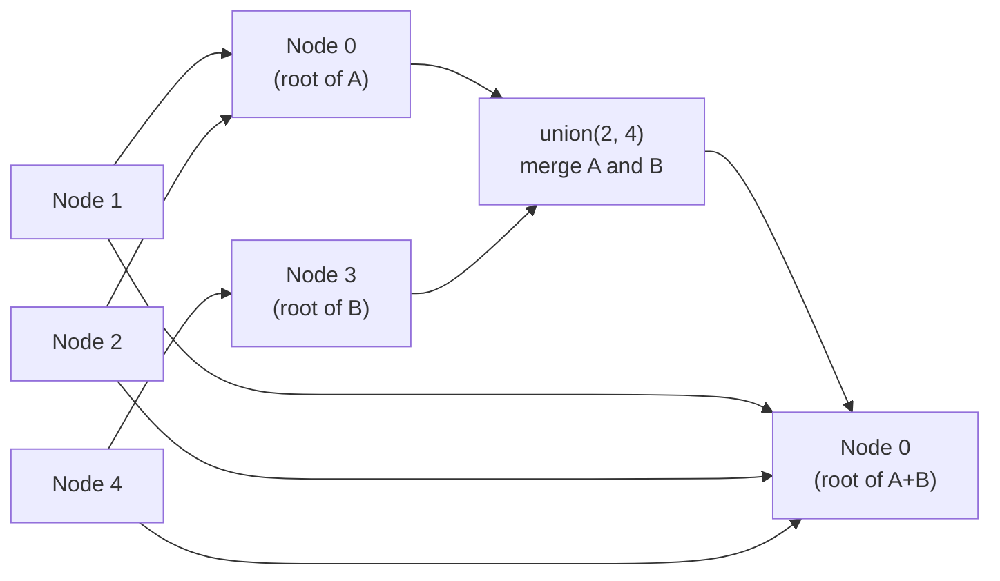

# Union-Find (Disjoint Set Union) Pattern

**Level**: 🟡 Intermediate

## 🗺️ Quick Overview



*Path compression flattens every traversed node directly to the root — subsequent find() calls skip intermediate nodes entirely, approaching O(1).*

> When you need to track which things are in the same group, and merge groups together, Union-Find does both in near-constant time — faster than any graph traversal.

## The Pattern

Union-Find (also called Disjoint Set Union or DSU) maintains a collection of disjoint sets and supports two operations:
- **find(x)**: which group does x belong to? (returns the group's representative)
- **union(x, y)**: merge the groups containing x and y

With path compression and union by rank, both operations run in O(α(N)) amortized — where α is the inverse Ackermann function, effectively constant for all practical N.

**Recognition signals:**
- "Number of connected components in a graph"
- "Are these two nodes in the same component?"
- "Merge groups together incrementally"
- "Find a cycle in an undirected graph"
- "Minimum spanning tree (Kruskal's algorithm)"
- "Network connectivity — can A reach B?"

## Template Pseudocode

```
// Union-Find with path compression and union by rank
type UnionFind:
  parent: array of ints   // parent[i] = parent of element i
  rank: array of ints     // rank[i] = approximate height of tree rooted at i
  component_count: int

function init_union_find(n):
  uf = UnionFind{
    parent: [i for i in range(n)],   // each element is its own parent
    rank: [0] * n,
    component_count: n
  }
  return uf

// Find with path compression
// Path compression: make every node on the path point directly to root
function find(uf, x):
  if uf.parent[x] != x:
    uf.parent[x] = find(uf, uf.parent[x])   // recursive path compression
  return uf.parent[x]

// Union with rank (union by rank)
// Always attach smaller tree under root of larger tree
function union(uf, x, y):
  root_x = find(uf, x)
  root_y = find(uf, y)

  if root_x == root_y:
    return false   // already in the same component

  // Attach smaller rank tree under larger rank tree
  if uf.rank[root_x] < uf.rank[root_y]:
    uf.parent[root_x] = root_y
  elif uf.rank[root_x] > uf.rank[root_y]:
    uf.parent[root_y] = root_x
  else:
    uf.parent[root_y] = root_x
    uf.rank[root_x] += 1   // ranks equal → new root gets rank + 1

  uf.component_count -= 1
  return true   // merged two different components

function connected(uf, x, y):
  return find(uf, x) == find(uf, y)
```

## 3 Example Problems

### Problem 1: Number of Connected Components

```
function count_components(n, edges):
  uf = init_union_find(n)

  for (u, v) in edges:
    union(uf, u, v)

  return uf.component_count
// Time: O(E × α(N)) ≈ O(E)
```

### Problem 2: Detect Cycle in Undirected Graph

```
function has_cycle_undirected(n, edges):
  uf = init_union_find(n)

  for (u, v) in edges:
    if not union(uf, u, v):
      // union returned false → u and v were already connected
      // adding this edge creates a cycle!
      return true

  return false
// Time: O(E × α(N)) ≈ O(E)
// Note: this only works for undirected graphs
// Use DFS with three states for directed graph cycle detection
```

### Problem 3: Accounts Merge

Given a list of accounts (each account has an email list), merge accounts that share at least one email.

```
function accounts_merge(accounts):
  // Map each email to a unique node ID
  email_to_id = {}
  node_id = 0

  for account in accounts:
    for email in account.emails:
      if email not in email_to_id:
        email_to_id[email] = node_id
        node_id += 1

  uf = init_union_find(node_id)

  // Union all emails in the same account
  for account in accounts:
    first_email_id = email_to_id[account.emails[0]]
    for email in account.emails[1:]:
      union(uf, first_email_id, email_to_id[email])

  // Group emails by their root representative
  root_to_emails = {}
  for email, eid in email_to_id.items():
    root = find(uf, eid)
    if root not in root_to_emails:
      root_to_emails[root] = []
    root_to_emails[root].append(email)

  return [sorted(emails) for emails in root_to_emails.values()]
```

## In Real Systems

**Kruskal's Minimum Spanning Tree** — Builds the MST by sorting all edges by weight and adding them one by one, skipping edges that would form a cycle. "Would this edge form a cycle?" is answered by Union-Find: if both endpoints have the same root, skip it. Used for minimum cost network design (data center interconnects, cable laying).

**Network partition detection** — In distributed systems monitoring, Union-Find tracks which nodes can reach each other. When a network partition occurs, previously connected components split. Re-merge when connectivity is restored.

**Social graph connected components** — "How many separate friend networks exist?" If a graph has 1 billion users, Union-Find efficiently counts connected components and identifies isolated communities.

**Image processing — connected region labeling** — Segment an image into connected regions of similar color. Union-Find merges adjacent pixels with similar values, labeling connected blobs. Used in OCR, medical imaging, object detection.

**Percolation theory** (physics simulation) — Used to model whether a fluid can flow through a material. Each cell is a node; open cells are unioned. System "percolates" when top and bottom rows are connected. Union-Find determines this efficiently.

## Complexity

| Operation | Naive | With path compression + union by rank |
|-----------|-------|---------------------------------------|
| find | O(N) | O(α(N)) ≈ O(1) |
| union | O(N) | O(α(N)) ≈ O(1) |
| N operations total | O(N²) | O(N × α(N)) ≈ O(N) |

α(N) = inverse Ackermann function. For N = 10^80 (more than atoms in the universe), α(N) ≤ 5. Effectively constant.

## Key Takeaways

- Union-Find maintains disjoint sets and supports find and union in near-O(1) amortized time
- Path compression: during find, make all nodes on the path point directly to the root
- Union by rank: always attach the smaller tree under the larger tree
- Both optimizations together give O(α(N)) ≈ O(1) amortized per operation
- Classic uses: connected components, cycle detection, Kruskal's MST, social graph clustering
