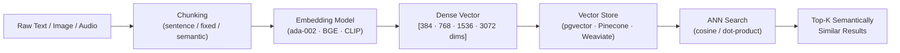
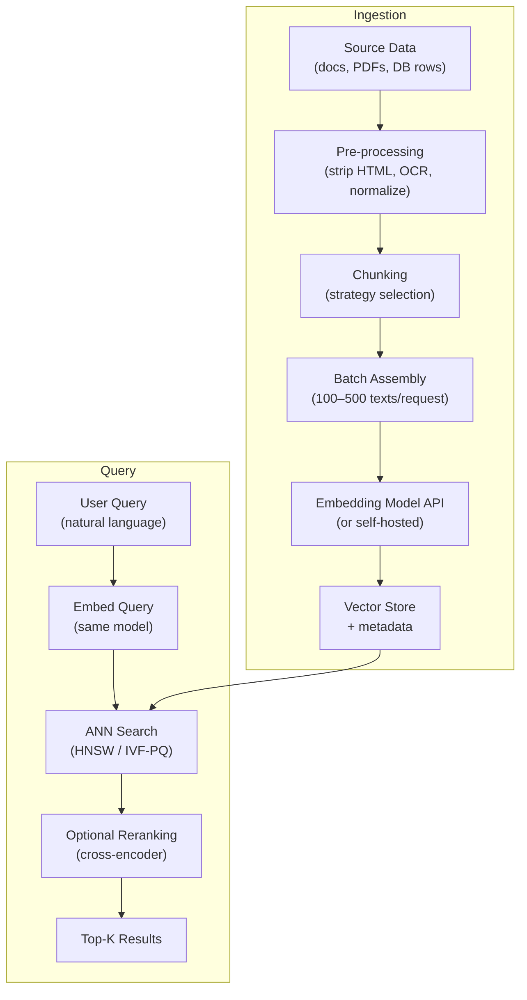
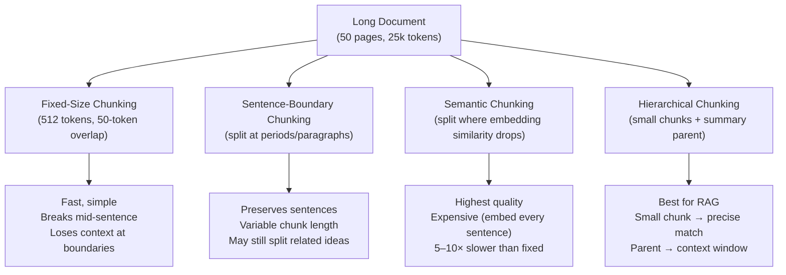
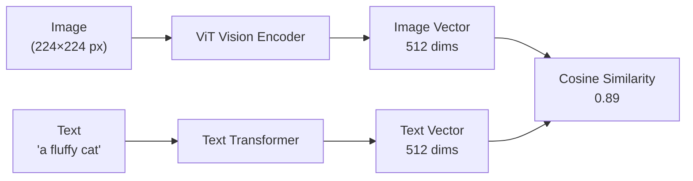

# Embeddings — Turning Text into Vectors

**Level**: 🟡 Intermediate
**Reading Time**: 15 minutes

---

## Level 1 — Surface (2-minute read)

An **embedding** is a fixed-length array of floats that encodes the *meaning* of a piece of data. Semantically similar inputs produce vectors that are geometrically close in high-dimensional space — even if they share zero vocabulary.

**When you need this**: Your search returns irrelevant results because users' words don't match document words. At >10k documents, keyword search recall drops below 60%; embedding-based retrieval typically recovers 80–95%.

**Core concept:**

- Text → transformer encoder → fixed-length float vector (e.g. 1536 dims)
- Distance in vector space = semantic similarity (cosine similarity range: -1 to 1)
- Same model must be used for both indexing and querying — mixing models produces garbage
- Longer documents must be split (chunked) before embedding; most models truncate silently at their context limit
- Cost: OpenAI ada-002 costs $0.10/1M tokens; BGE/E5 models are free and self-hosted



**Quick decision table**

| Scenario | Recommended approach |
|----------|---------------------|
| Cost-sensitive, < 50M tokens/month | BGE-large or E5-large (self-hosted, free) |
| Fast iteration, managed infra | OpenAI text-embedding-3-small ($0.02/1M) |
| Highest quality, English retrieval | OpenAI text-embedding-3-large (3072 dims) |
| Multilingual documents | BGE-M3 (8192 token context, 100+ languages) |
| Images + text together | CLIP (OpenAI, multimodal) |
| Sub-100ms latency SLA | MiniLM-L6-v2 (384 dims, 14 ms/query on CPU) |

---

## Level 2 — Deep Dive

### Problem Statement

A legal-tech startup builds full-text search over 2M contracts using PostgreSQL `LIKE` queries. A partner searches "termination for convenience" — but half the relevant contracts say "exit clause" or "unilateral withdrawal." Recall is ~35%. They add BM25 (TF-IDF). Recall rises to ~52%. Still unusable.

The failure is fundamental: **keyword search maps words to results; semantic search maps meaning to results.** Once the document corpus crosses ~50k items and user queries are natural language, you need embeddings.

At 2M contracts, the requirements become:
- Embed 2M documents × average 800 tokens = ~1.6B tokens at ingestion
- Serve <100ms p99 query latency
- Keep embedding pipeline cost under $500/month

The embedding model choice, chunking strategy, and batch size each affect throughput by 10–100×.

---

### What Embeddings Are and Why They Work

An embedding is a point in ℝ^d (d-dimensional Euclidean space). The claim that "geometric proximity = semantic similarity" sounds like magic. Here's why it holds.

Embedding models are trained with **contrastive learning** on hundreds of millions of (anchor, positive, negative) triplets:

```
anchor:   "The cat sat on the mat"
positive: "A feline rested on the rug"     ← semantically equivalent
negative: "PostgreSQL database replication" ← semantically unrelated
```

The loss function (typically InfoNCE or MultipleNegativesRankingLoss) pushes the anchor vector toward the positive and away from the negative. After training on enough triplets, the model learns a consistent geometry:

- Synonyms → nearby vectors
- Antonyms → opposite directions
- Topics → clusters
- Relationships → directions (vec("king") - vec("man") + vec("woman") ≈ vec("queen"))

The geometry generalizes because the model cannot memorize 2B training pairs — it must learn underlying semantic structure to minimize loss.

**Key invariant**: The model is the geometry. Switching models means switching coordinate systems. Vectors from different models are not comparable.

---

### Embedding Pipeline Architecture



---

### Embedding Model Selection: MTEB Benchmark

**MTEB** (Massive Text Embedding Benchmark) is the industry standard for comparing embedding models. It covers 56 tasks across 8 categories: retrieval, clustering, classification, reranking, STS, summarization, bitext mining, pair classification.

For production system selection, focus on the **retrieval** category (BEIR benchmark subset) — that's what RAG and semantic search care about.

```
MTEB Retrieval Leaderboard (BEIR, nDCG@10, May 2025 snapshot)
─────────────────────────────────────────────────────────────
Model                         Score   Dims   Context   Cost
─────────────────────────────────────────────────────────────
text-embedding-3-large        64.6    3072   8191t     $0.13/1M
UAE-Large-V1                  64.3    1024   512t      free
gte-Qwen2-7B-instruct         66.1    3584   32768t    free (7B params)
bge-large-en-v1.5             63.6    1024   512t      free
E5-large-v2                   62.3    1024   512t      free
text-embedding-3-small        62.3    1536   8191t     $0.02/1M
bge-m3                        60.2    1024   8192t     free (multilingual)
text-embedding-ada-002        61.0    1536   8191t     $0.10/1M
all-MiniLM-L6-v2              56.3    384    512t      free
─────────────────────────────────────────────────────────────
```

**OpenAI ada-002 vs BGE-large vs E5-large**

| Dimension | ada-002 | BGE-large-en-v1.5 | E5-large-v2 |
|-----------|---------|-------------------|-------------|
| MTEB Retrieval | 61.0 | 63.6 | 62.3 |
| Dimensions | 1536 | 1024 | 1024 |
| Context | 8191 tokens | 512 tokens | 512 tokens |
| Cost/1M tokens | $0.10 | Free | Free |
| Latency (A10G) | ~10 ms | ~8 ms | ~8 ms |
| Self-hostable | No | Yes | Yes |
| Multilingual | Partial | English | English |

**Decision rules**:
- Use **BGE-large** when: you need free, production-quality English retrieval, can handle 512-token limit
- Use **E5-large** when: you want a slight quality edge on out-of-domain tasks over BGE
- Use **ada-002** when: you want managed infra with long context support and don't mind $0.10/1M
- Use **text-embedding-3-large** when: quality is paramount and you need 3072 dims for fine-grained distinctions
- Use **BGE-M3** when: multilingual corpus or long documents (8192-token context, 100+ languages)

---

### Dimension Trade-offs

Every embedding has a fixed output size in floats. More dimensions = more expressive = more expensive.

| Model / Approach | Dims | Memory/vector | 1M vectors | Typical use case |
|-----------------|------|---------------|------------|-----------------|
| MiniLM-L6-v2 | 384 | 1.5 KB | ~1.5 GB | Mobile, edge, real-time |
| BERT-base / all-mpnet | 768 | 3 KB | ~3 GB | General retrieval |
| BGE-large, E5-large | 1024 | 4 KB | ~4 GB | Production retrieval |
| ada-002, text-embedding-3-small | 1536 | 6 KB | ~6 GB | Managed, long context |
| text-embedding-3-large | 3072 | 12 KB | ~12 GB | High-precision ranking |

**Matryoshka Representation Learning (MRL)**: OpenAI's text-embedding-3 models support dimension truncation. You can use the first 256 dims for fast candidate retrieval and the full 3072 dims for reranking — no quality loss proportional to standard PCA. BGE-M3 also supports this.

**Memory formula**:
```
Storage (GB) = num_vectors × dims × 4 bytes / 1e9
Example: 10M vectors × 1536 dims × 4 = 61.4 GB
```

At 61 GB, you need dedicated GPU RAM or a quantized index. For 100M+ documents, dimension reduction or PQ compression is mandatory.

---

### Chunking Strategies

Most documents exceed the model's context window. A 50-page contract has ~25,000 tokens; ada-002 accepts 8191. You must split before embedding.

**The chunking strategy determines retrieval quality more than the embedding model choice.**



**Approach A: Fixed-size chunking**
```python
def fixed_size_chunks(text: str, size: int = 512, overlap: int = 50) -> list[str]:
    tokens = tokenizer.encode(text)
    chunks = []
    for i in range(0, len(tokens), size - overlap):
        chunk_tokens = tokens[i:i + size]
        chunks.append(tokenizer.decode(chunk_tokens))
    return chunks
```

- Pros: O(n) time, zero dependencies, predictable memory
- Cons: splits mid-sentence; the overlap parameter is a hack, not a fix
- When to use: prototype, when you need throughput > quality

**Approach B: Sentence-boundary chunking**
```python
import nltk

def sentence_chunks(text: str, max_tokens: int = 512) -> list[str]:
    sentences = nltk.sent_tokenize(text)
    chunks, current, count = [], [], 0
    for sent in sentences:
        n = len(tokenizer.encode(sent))
        if count + n > max_tokens and current:
            chunks.append(" ".join(current))
            current, count = [], 0
        current.append(sent)
        count += n
    if current:
        chunks.append(" ".join(current))
    return chunks
```

- Pros: preserves sentence integrity; cleaner than fixed-size
- Cons: chunks can vary 10× in length; very short sentences create noise chunks
- When to use: prose documents (articles, emails, support tickets)

**Approach C: Semantic chunking**

Split where the cosine similarity between consecutive sentence embeddings drops sharply — a "semantic seam."

```python
def semantic_chunks(sentences: list[str], threshold: float = 0.5) -> list[str]:
    embeddings = embed_batch(sentences)  # embed all sentences
    chunks, current = [], [sentences[0]]
    for i in range(1, len(sentences)):
        sim = cosine_similarity(embeddings[i-1], embeddings[i])
        if sim < threshold:          # topic shift detected
            chunks.append(" ".join(current))
            current = []
        current.append(sentences[i])
    if current:
        chunks.append(" ".join(current))
    return chunks
```

- Pros: chunks align with natural topic boundaries; highest retrieval precision
- Cons: requires embedding every sentence first (5–10× ingestion cost); slow
- When to use: knowledge bases, documentation, legal/medical text where topic shifts matter

**Approach D: Hierarchical chunking (best for RAG)**

Store small, precise chunks for matching; store larger parent chunks for context window injection.

```
Parent chunk: full section (1000 tokens) → stored in metadata
Child chunks: sentences/paragraphs (150 tokens each) → indexed in vector store
Query → matches child → retrieves parent for LLM context
```

This solves the "found the right passage but lost the surrounding context" problem. Used in LlamaIndex as `ParentDocumentRetriever`.

**Chunking comparison**

| Strategy | Ingestion cost | Retrieval precision | Context preservation | Best for |
|----------|---------------|--------------------|--------------------|---------|
| Fixed-size | Low | Medium | Poor at boundaries | Prototypes |
| Sentence-boundary | Low | Good | Good | General docs |
| Semantic | High | Best | Very good | Legal, medical |
| Hierarchical | Medium | Best | Excellent | Production RAG |

---

### Embedding Costs and Batch Processing

**Cost benchmarks (2025)**

| Model | Cost/1M tokens | 100M tokens | 1B tokens |
|-------|---------------|-------------|-----------|
| OpenAI ada-002 | $0.10 | $10 | $100 |
| text-embedding-3-small | $0.02 | $2 | $20 |
| text-embedding-3-large | $0.13 | $13 | $130 |
| BGE-large (self-hosted, A10G) | ~$0.005 | $0.50 | $5 |
| E5-large (self-hosted, A10G) | ~$0.005 | $0.50 | $5 |

**BGE self-hosted on A10G spot**: ~$0.40/hr instance, ~1M tokens/hr throughput → ~$0.0004/1K tokens ≈ $0.40/1M tokens when amortized at light load. At full utilization: ~$0.005/1M tokens.

**Batch embedding: the 100× throughput multiplier**

```python
import openai

client = openai.OpenAI()

# BAD: 1 text per request — ~100 ms/request × 100k texts = 10,000 seconds
for text in texts:
    response = client.embeddings.create(model="text-embedding-3-small", input=text)
    vectors.append(response.data[0].embedding)

# GOOD: 500 texts per request — ~150 ms/request × 200 batches = 30 seconds
BATCH_SIZE = 500

def embed_batch(texts: list[str]) -> list[list[float]]:
    all_embeddings = []
    for i in range(0, len(texts), BATCH_SIZE):
        batch = texts[i:i + BATCH_SIZE]
        response = client.embeddings.create(
            model="text-embedding-3-small",
            input=batch
        )
        # OpenAI guarantees order matches input order
        all_embeddings.extend([d.embedding for d in response.data])
    return all_embeddings
```

- Network overhead dominates at small batch sizes (100 ms per round-trip)
- Optimal batch: 100–500 texts; beyond 500, you hit per-request token limits
- Self-hosted models: batch 64–256 (GPU memory bound); larger batches OOM
- Async/concurrent batching: run 10 concurrent batch requests → ~10× further throughput

**Full pipeline with async batching**:
```python
import asyncio
import openai

async def embed_async(client, texts: list[str]) -> list[list[float]]:
    tasks = []
    for i in range(0, len(texts), 500):
        batch = texts[i:i + 500]
        tasks.append(client.embeddings.create(
            model="text-embedding-3-small", input=batch
        ))
    responses = await asyncio.gather(*tasks)
    return [emb.embedding for r in responses for emb in r.data]
```

---

### Multimodal Embeddings

Not all data is text. Two critical multimodal models:

**CLIP (Contrastive Language-Image Pretraining) — OpenAI**

CLIP encodes both images and text into the *same* vector space. An image of a cat and the text "a fluffy cat" land near each other.



- Use case: product image search (text query → finds matching product images), content moderation, image captioning retrieval
- Models: `openai/clip-vit-base-patch32` (Hugging Face), `openai/clip-vit-large-patch14`
- Dimensions: 512–768; both modalities in the same space

```python
from transformers import CLIPProcessor, CLIPModel
import torch
from PIL import Image

model = CLIPModel.from_pretrained("openai/clip-vit-base-patch32")
processor = CLIPProcessor.from_pretrained("openai/clip-vit-base-patch32")

# Embed text
text_inputs = processor(text=["a photo of a cat"], return_tensors="pt", padding=True)
text_features = model.get_text_features(**text_inputs)
text_features = text_features / text_features.norm(dim=-1, keepdim=True)  # L2-normalize

# Embed image
image = Image.open("cat.jpg")
image_inputs = processor(images=image, return_tensors="pt")
image_features = model.get_image_features(**image_inputs)
image_features = image_features / image_features.norm(dim=-1, keepdim=True)

# Cross-modal similarity
similarity = (text_features @ image_features.T).item()  # ~0.87 for matching pair
```

**Whisper + Text Embeddings (Audio)**

Whisper (OpenAI) transcribes audio to text. Combine with a text embedding model for semantic audio search:

```
Audio file → Whisper transcription → text embedding model → searchable vector
```

No specialized audio embedding model needed for speech. For music embeddings (rhythm, timbre, melody), Spotify's research uses custom transformer models trained on audio spectrograms.

---

### Real Company Examples

**Notion AI — 100M+ documents**

Notion uses embeddings to power its "Ask AI" feature across 100M+ user notes and documents. Key engineering decisions:
- Chunked documents into paragraphs (~200-300 tokens); hierarchical retrieval for context
- Pre-computed embeddings stored alongside document records; updated on edit via CDC pipeline
- Used OpenAI ada-002 at launch; migrated to text-embedding-3-small for 5× cost reduction
- Embedding pipeline runs async from document saves; tolerate up to 30-second staleness
- Source: Notion engineering blog, 2023

**Spotify — Music Recommendation via Embeddings**

Spotify trains custom audio embeddings for its 100M+ track catalog to power "Discover Weekly" and radio features. Key facts:
- Audio spectrogram → custom transformer → 128-dim embedding per track
- Collaborative filtering embeddings (user × track interaction matrix, matrix factorization) run in parallel
- Two-tower model: user embedding + track embedding → dot product = relevance score
- 456M users × daily recommendation → retrieves top-50 candidates in <20ms via ANN (approximate nearest neighbor)
- Source: Spotify Research, "Towards Deep Learning Models for Audio-Based Music Recommendation"

**GitHub Copilot — Code Search**

GitHub embeds code using a model fine-tuned on CodeSearchNet (code + docstring pairs). The system retrieves relevant code snippets from the repo to inject into Copilot's context window before generation. Key details:
- Uses a bi-encoder fine-tuned for code-to-code and natural-language-to-code retrieval
- Embeddings scoped per repository; updated incrementally on git push
- 15M+ active repositories indexed; retrieval happens in <50ms p99
- Source: GitHub Next research blog

---

### Common Mistakes

**Mistake 1: Not chunking before embedding**

Root cause: developer embeds full document (e.g., 10,000 tokens) without chunking; model silently truncates at context limit.

Result: The last 80% of the document is never indexed. Queries about content from the second half return nothing.

Fix:
```python
# Always check: if token count > model limit, chunk first
token_count = len(tokenizer.encode(text))
if token_count > MODEL_CONTEXT_LIMIT:
    chunks = sentence_chunks(text, max_tokens=MODEL_CONTEXT_LIMIT - 50)
else:
    chunks = [text]
```

**Mistake 2: Mixing embedding models between index and query**

Root cause: team indexes with ada-002, then switches to a cheaper model for query embedding to cut costs. The two models produce vectors in different coordinate systems.

Result: Top-K search returns random, irrelevant results. Cosine similarities cluster around 0.3–0.5 regardless of actual semantic match.

Fix: Store the model ID alongside each vector. Enforce at query time:
```python
assert index.embedding_model == query_embedding_model, (
    f"Model mismatch: index={index.embedding_model}, "
    f"query={query_embedding_model}"
)
```

**Mistake 3: Embedding one-word queries**

Root cause: user types "cat" → gets embedded as a single token → context-free vector → poor retrieval.

Result: Single-token embeddings have high variance; results are inconsistent.

Fix: Instruct users or pre-process to phrase queries as sentences:
```python
def normalize_query(query: str) -> str:
    if len(query.split()) <= 2:
        return f"What is {query}? Tell me about {query}."
    return query
```

**Mistake 4: Forgetting L2-normalization for dot product indexes**

Root cause: some vector stores default to inner product (dot product) distance, not cosine similarity.

Result: High-magnitude vectors always appear in top-K regardless of semantic match. Long documents (which tend to produce higher-magnitude vectors) dominate results.

Fix: L2-normalize before inserting if using dot product:
```python
import numpy as np

def l2_normalize(v: list[float]) -> list[float]:
    arr = np.array(v)
    return (arr / np.linalg.norm(arr)).tolist()
```

**Mistake 5: Ignoring MTEB when selecting a model**

Root cause: engineers pick ada-002 by default because it's familiar, not because it's best for their task.

Result: Overpaying by 5–10× and sometimes getting lower retrieval quality than free alternatives.

Fix: Run your domain's documents through MTEB's retrieval benchmark (or use a quick sanity eval: embed 100 query-doc pairs you've labeled, measure nDCG@10). BGE-large or E5-large typically match or beat ada-002 at zero cost.

---

### Production Numbers to Memorize

| Fact | Value |
|------|-------|
| ada-002 dimensions | 1536 |
| text-embedding-3-large dimensions | 3072 |
| MiniLM-L6-v2 dimensions | 384 |
| BGE-M3 context window | 8192 tokens |
| ada-002 cost | $0.10/1M tokens |
| text-embedding-3-small cost | $0.02/1M tokens |
| Cosine similarity range | -1.0 to 1.0 |
| Good semantic match threshold | > 0.7 |
| Memory per 1M ada-002 vectors | ~6 GB (float32) |
| Batch size sweet spot (OpenAI) | 100–500 texts/request |
| Throughput gain from batching | ~100× vs. one-at-a-time |
| CLIP output dimensions | 512–768 (both modalities) |

---

## Key Takeaways

- An embedding is a dense float vector encoding semantic meaning — similar inputs land geometrically close even with zero shared vocabulary
- **Model selection**: Use MTEB retrieval scores to compare; BGE-large/E5-large match ada-002 quality at zero cost; text-embedding-3-large leads for highest precision
- **Dimensions**: 384 (fast/edge) → 768 (BERT-base) → 1024 (BGE/E5) → 1536 (ada-002) → 3072 (3-large); each doubling roughly doubles memory and index build time
- **Chunking matters more than model choice**: semantic or hierarchical chunking improves retrieval precision 15–30% over fixed-size on production corpora
- **Batch at 100–500 texts per API call** — single-text requests are 100× slower; async concurrent batching adds another 10× multiplier
- **Never mix models**: index and query must use identical model + version; store the model ID with every vector
- **Multimodal**: CLIP unifies text and image in one vector space; Whisper → text → embedding handles speech search

---

## References

- 📖 [MTEB Leaderboard — Hugging Face](https://huggingface.co/spaces/mteb/leaderboard) — canonical model comparison for retrieval tasks
- 📖 [OpenAI Embeddings Documentation](https://platform.openai.com/docs/guides/embeddings) — ada-002, text-embedding-3 models, batching, costs
- 📚 [BEIR: A Heterogeneous Benchmark for Zero-shot Evaluation of IR Models (Thakur et al., 2021)](https://arxiv.org/abs/2104.08663) — foundation of MTEB retrieval category
- 📺 [CLIP: Connecting Text and Images (OpenAI Blog)](https://openai.com/research/clip) — CLIP multimodal embeddings explained
- 📖 [BGE-M3: Multi-Functionality, Multi-Linguality, and Multi-Granularity (FlagAI)](https://github.com/FlagOpen/FlagEmbedding/tree/master/FlagEmbedding/BGE_M3) — BGE-M3 model card and technical report
- 📖 [Matryoshka Representation Learning (Kusupati et al., 2022)](https://arxiv.org/abs/2205.13147) — flexible-dimension embeddings used in text-embedding-3
- 📖 [Spotify Research: Music Recommendation with Audio Embeddings](https://research.atspotify.com/2022/09/the-magic-that-makes-spotifys-discover-weekly-so-good/) — Spotify's production recommendation system
- 📖 [Chunking Strategies for LLM Applications (Pinecone)](https://www.pinecone.io/learn/chunking-strategies/) — practical guide to chunking approaches
