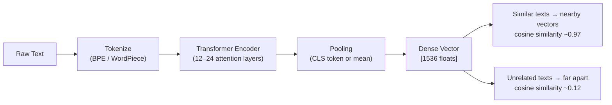
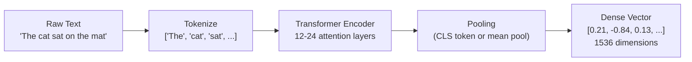

# Embeddings — Turning Text into Vectors

**Level**: 🟢 Beginner
**Reading Time**: 10 minutes

## 🗺️ Quick Overview



*An embedding model converts raw text into a fixed-length float vector; semantically similar texts land geometrically close in the high-dimensional space regardless of shared vocabulary.*

> An embedding is a dense float vector that captures the meaning of a piece of data. Two semantically similar inputs produce vectors that are close together in high-dimensional space — even if they share no words.

## The Problem

Computers are good at exact matches. A database can tell you whether "cat" equals "cat" in microseconds. But it cannot tell you that "feline" and "cat" are nearly synonymous, or that "the animal sat on the mat" and "a creature rested on the rug" convey the same meaning.

Keyword search (like SQL `LIKE` or BM25) fails when the user's words don't match the document's words — which is most of the time in natural language. What we need is a way to represent meaning numerically so that similarity becomes a geometric operation.

That representation is an **embedding**.

## What Is an Embedding?

An embedding is a fixed-length array of floating-point numbers — a coordinate in a high-dimensional space. Every piece of text (sentence, paragraph, document) maps to one point in that space.

```
"The cat sat on the mat"         → [0.21, -0.84,  0.13, ...,  0.67]  # 1536 floats
"A feline rested on the rug"     → [0.19, -0.81,  0.15, ...,  0.65]  # 1536 floats
"PostgreSQL database replication" → [-0.55, 0.23, -0.41, ..., -0.12]  # 1536 floats
```

The first two vectors are very close (cosine similarity ~0.97). The third is far from both (~0.12). No shared words needed — the model learned that "cat" and "feline" live in the same neighborhood.

## How Embedding Models Work



### Step 1: Tokenize

The text is split into tokens — subword units, not necessarily full words. "embedding" might become ["em", "bed", "ding"]. Tokenizers like BPE (byte-pair encoding) or WordPiece handle this. Most modern models have a vocabulary of ~50,000 tokens.

### Step 2: Transformer Encoder

Each token flows through a stack of self-attention layers. The key property of self-attention is that every token can "look at" every other token in the sequence. After 12-24 layers, each token's representation is deeply contextualized — it encodes not just "cat" but "cat in the context of sitting on something."

### Step 3: Pooling

We have one vector per token, but we need one vector for the whole input. Two approaches:

- **CLS token pooling**: The `[CLS]` special token is prepended; its final hidden state represents the whole sequence. Used by BERT-style models.
- **Mean pooling**: Average all token vectors. Used by sentence-transformers and most modern embedding models.

The result is a single dense vector: the embedding.

### How Models Learn This Representation

Embedding models are trained with **contrastive learning**: given a pair of semantically similar texts (a question and its answer, two paraphrases), the model is trained to produce vectors with high cosine similarity. Given dissimilar pairs, it produces vectors far apart. After training on billions of pairs, the model generalizes to any unseen text.

## The "King - Man + Woman = Queen" Intuition

One of the most cited demonstrations of embedding geometry is word analogy arithmetic from Word2Vec (2013):

```
vec("king") - vec("man") + vec("woman") ≈ vec("queen")
```

This works because embeddings encode relationships as directions in space. "Royalty" is encoded in a consistent direction relative to "king" and "queen." "Gender" is encoded in another direction. Subtracting the "male" direction and adding the "female" direction navigates from king to queen.

Modern sentence embeddings encode much richer relationships: document topic, sentiment, entity types, linguistic style — all as positions in high-dimensional space.

## Key Embedding Models

| Model | Dimensions | Context Window | Notes |
|-------|-----------|----------------|-------|
| text-embedding-3-small | 1536 | 8191 tokens | OpenAI, fast, cheap, good for most use cases |
| text-embedding-3-large | 3072 | 8191 tokens | OpenAI, higher quality, 2× cost |
| text-embedding-ada-002 | 1536 | 8191 tokens | OpenAI legacy, widely deployed |
| nomic-embed-text | 768 | 8192 tokens | Open-source, Apache 2.0, 8k context |
| sentence-transformers/all-MiniLM-L6-v2 | 384 | 512 tokens | Self-hosted, fast, lower quality |
| sentence-transformers/all-mpnet-base-v2 | 768 | 512 tokens | Self-hosted, good quality |
| cohere-embed-english-v3 | 1024 | 512 tokens | Cohere, strong on retrieval tasks |
| UAE-Large-V1 | 1024 | 512 tokens | MTEB top performer, self-hosted |

### Dimensions vs Quality Trade-off

More dimensions generally means higher quality embeddings that capture finer semantic distinctions — but also:
- More memory per vector (1536 floats × 4 bytes = 6 KB per embedding)
- Slower index build and search
- Higher storage cost at scale (1M vectors × 6 KB = ~6 GB just for vectors)

For 1M vectors and below: use whatever quality you need. For 100M+ vectors: dimension reduction (via PCA or model's built-in Matryoshka training) becomes important.

## Cosine Similarity

Given two vectors A and B, cosine similarity measures the angle between them:

```
cosine_similarity(A, B) = (A · B) / (|A| × |B|)
```

Range: -1 (opposite direction) to 1 (same direction). For semantic similarity, you want values above 0.7.

```python
# Python: cosine similarity from scratch
import math

def cosine_similarity(a, b):
    dot_product = sum(x * y for x, y in zip(a, b))
    magnitude_a = math.sqrt(sum(x**2 for x in a))
    magnitude_b = math.sqrt(sum(x**2 for x in b))
    return dot_product / (magnitude_a * magnitude_b)

# Example (using tiny 3D vectors for illustration)
vec_cat = [0.8, 0.3, 0.1]
vec_feline = [0.75, 0.35, 0.12]
vec_database = [-0.2, 0.9, -0.5]

print(cosine_similarity(vec_cat, vec_feline))   # ~0.998 — very similar
print(cosine_similarity(vec_cat, vec_database)) # ~-0.1  — unrelated
```

## Use Cases

| Use Case | Input | Query | What You're Finding |
|----------|-------|-------|---------------------|
| Semantic search | Documents | User question | Documents with similar meaning to the question |
| Clustering | Items | Centroid | Groups of items with similar meaning |
| Recommendation | Item embeddings | User's purchased items (avg) | Items close to user's taste vector |
| Anomaly detection | Log lines | Recent log | Log lines far from normal cluster |
| Duplicate detection | Article embeddings | New article | Near-duplicate articles |
| Code search | Function docstrings | Natural language query | Functions that do what you described |

## Common Pitfalls

1. **Mixing embedding models**: You must use the same model for ingestion and query. If you index with text-embedding-3-small and query with text-embedding-3-large, the vectors are in different spaces — results will be garbage.
2. **Exceeding context window**: Most models have a 512-8191 token limit. Text beyond the limit is silently truncated. Chunk your documents before embedding.
3. **Embedding single tokens**: Embedding a one-word query like "cat" often gives poor results. Rephrase as a sentence: "What is a cat?" or "information about cats."
4. **Not normalizing for cosine search**: If your vector DB uses dot product instead of cosine similarity, you must L2-normalize your vectors first — otherwise magnitude affects the score, not just direction.
5. **Forgetting the embedding model is the retrieval bottleneck**: You can tune your vector index all day, but if the embedding model gives poor representations, search quality is capped. Evaluate the embedding model first.

## Key Takeaways

- An embedding is a dense float vector encoding semantic meaning — similar inputs produce nearby vectors
- Transformer encoders + contrastive training produce embeddings that generalize across unseen text
- Dimensions trade quality for memory and speed — 768-1536d covers most production needs
- Cosine similarity measures the angle between vectors: range -1 to 1, aim for >0.7 for good matches
- Always use the same embedding model for ingestion and query — mixing models produces meaningless results
- Context window limits require chunking; most models truncate silently at their limit
